## C++学习笔记

### 1 从C到C++（18）

```
最开始通过Cfront预处理程序翻译成c语言。
支持面向过程编程、面向对象编程（OOP）和泛型编程。
C/C++编译器：windows(cl.exe)-linux(GCC)-mac(clang)
```

```
GCC
最初只支持c，后面逐渐支持C++、Objective-C、Fortran、Java。一种通用编译器，默认c语言。
gcc main.c module.c
gcc main.cpp module.cpp -lstdc++
```

```
g++
GCC针对不同的语言推出编译器。比如：C++(G++),java(gcj),go(gccgo)
g++ main.cpp module.cpp
g++ main.cpp -o demo
```

```
命名空间
用域解析操作符::表示。
using Li::fp;
using namespace Li;
namingspace std为了新旧版本STL共存，确保兼容性。
文件也做了调整：iostream.h->iostream，stdio.h->cstdio,后者定义在std中
#include <cstdio>
std::printf
printf
以上两种都能编译通过：大部分编译器在实现时并没有严格遵循C++标准
可以定义在函数内部（项目开发推荐）
```

```
cin和cout
cerr表示错误
内置对象（ostream istream类），不是关键字
cin>>x>>y;
cout<<"The int number is x= "<<x<<endl;
```

```
新增bool类型
bool,true,false都是关键字
```

```
const int m = 10;
int n = m;
C语言编译：从m地址读取，写入n
C++：直接将10写入n
类似#define ，不过#define在预处理阶段

const int n = 10;
int *p = (int*)&n;  //必须强制类型转换
*p = 99;  //修改const变量的值
printf("%d\n", n);
C语言：结果99
C++：结果10

C语言：const 变量和普通变量一样，在其他源文件中也是可见的。用extern声明。
C++： const 变量的作用域仍然是当前文件，但是它在其他文件中是不可见的。
GCC编译器可以通过extern const int n = 10;增大作用域。
```

```
int *p = new int;  //分配1个int型的内存空间
delete p;  //释放内存

int *p = new int[10];  //分配10个int型的内存空间
delete[] p;
在堆上分配内存
```

```
内联函数
编译的时候用函数体替换，减少函数调用机制下不同函数之间的切换
定义处添加inline，声明处无效，一般只有定义，没有声明
一般是短小，频繁调用的函数
inline为建议，编译器决定是否inline

inline可以代替有参数的宏
#define SQ(y) ( (y)*(y) )

非内联函数是禁止定义在头文件中
内联函数可以定义在头文件中（不用加 static 关键字）

函数体在编译之后就不存在了。

定义和声明在不同文件，链接时会导致无法找到。
```

```
void func(int n, float b=1.2, char c='@')//默认参数
float d = 10.8;
void func(int n, float b=d+2.9, char c='@')//表达式指定默认参数
默认参数必须在形参列表最后
减少方法重载
可以在声明或定义中设置默认参数，作用域中只能指定一次默认参数。
void func(int a, int b, int c = 36);
void func(int a, int b = 5, int c);//合法
在给定的作用域中一个形参只能被赋予一次默认参数。
四种作用域：原型作用域、局部作用域（函数作用域）、块作用域、文件作用域（全局作用域）
```

```
重载
参数列表不同。函数返回值也不能作为重载的依据。
参数列表又叫参数签名，包括参数的类型、参数的个数和参数的顺序，只要有一个不同就叫做参数列表不同。
编译时通过重命名实现重载。（重载决议）

形参类型转换优先级相同，导致函数重载过程中的二义性错误。
多参数的二义性：
    该函数对每个实参的匹配都不劣于其他函数；
    至少有一个实参的匹配优于其他函数。
参数类型过少或者过多都容易引起二义性错误
```

| 优先级                 | 包含的内容                                                   | 举例说明                                                     |
| ---------------------- | ------------------------------------------------------------ | ------------------------------------------------------------ |
| 精确匹配               | 不做类型转换，直接匹配                                       | （暂无说明）                                                 |
| 只是做微不足道的转换   | 从数组名到数组指针、从函数名到指向函数的指针、从非 const 类型到 const 类型。 |                                                              |
| 类型提升后匹配         | 整型提升                                                     | 从 bool、char、short 提升为 int，或者从 char16_t、char32_t、wchar_t 提升为 int、long、long long。 |
| 小数提升               | 从 float 提升为 double。                                     |                                                              |
| 使用自动类型转换后匹配 | 整型转换                                                     | 从 char 到 long、short 到 long、int 到 short、long 到 char。 |
| 小数转换               | 从 double 到 float。                                         |                                                              |
| 整数和小数转换         | 从 int 到 double、short 到 float、float 到 int、double 到 long。 |                                                              |
| 指针转换               | 从 int *到 void*。                                         |                                                              |

```c++
C和C++混合编程
C和C++编译方式不同导致链接时找不到函数名。
extern "C"//C++关键字，以编译C语言方式处理一行（段）代码
#ifdef __cplusplus
extern "C" {
#endif

void display();

#ifdef __cplusplus
}
#endif
```

### 2 类和对象（21）

#### 2.1 类的定义&对象创建

```
类是创建对象的模板。编译后不占用内存，不能对成员变量初始化。
classs Student{};
class Student LiLei; 
Student LiLei;//栈
Student *pLiLei = &LiLei;
Student *pStu = new Student;//堆
```

#### 2.2 成员变量&成员函数

```
成员变量不能初始化
成员函数作用域由类决定
void Student::say(){}//类体外定义成员函数需要域解析符::,并在类中声明（建议）
类体内定义的成员函数，会被编译成inline
```

#### 2.3 访问权限&类的封装

```
成员访问限定符：pubic protected private
成员变量以"m_"开头
protected成员在派生类内部可以访问
隐藏内部实现，体现了封装性。
```

#### 2.4 类内存模型

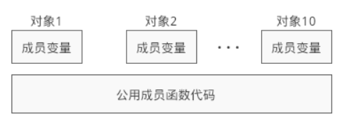

```
成员变量在堆区或栈区分配内存，成员函数在代码区分配内存。
sizeof计算成员变量大小
```

#### 2.5 函数编译原理&成员函数实现

```
C++会进行名字编码。以"?"开始，区别于C语言中的"_"
成员函数编译成与对象无关的全局函数。所以会将对象指针this当作形参。
```

#### 2.6 构造函数

```
栈：Student stu("小明", 15, 92.5f);
堆：new Student("李华", 16, 96);
没有返回值类型
没有return
完成初始化工作
Student(){}//默认构造函数，编译器完成初始化工作
有自定义构造函数，编译器不再自动生成默认构造函数
Student stu();Student stu;//等价
Student *pstu = new Student();Student *pstu = new Student;//等价
```

#### 2.7 初始化列表

```
函数头部后面":"添加初始化列表
初始化顺序与初始化列表顺序无关，与类中声明顺序有关。
初始化const变量
```

#### 2.8 析构函数

```
~classA(){}
命名中不允许用"~"
```

#### 2.9 对象数组

```
初始化
CTest array2[3] = { CTest(2,3), CTest(1,2), 1};
```

#### 2.10 成员对象&封闭类

```
封闭类：包含成员对象的类。
成员对象初始化用初始化列表
先析构封闭类对象，在析构其成员对象
```

#### 2.11 this指针

```
this关键字，也是一个const指针
编译时，给成员函数添加的一个形参
用在形参和成员变量重名的情况
只能在成员函数内部使用
对象创建之后this才有意义，不能再static成员函数中使用
```

#### 2.12 static静态成员变量

```
属于类，不属于具体对象，用于多个对象共享数据
类外部初始化
int Student::m_total = 0;//可以赋值，也可以不赋值
可以通过类或者对象访问。
不占用对象内存，内存在全局数据区。
全局数据区有初始值0，动态数据区（堆，栈）存在垃圾值。
```

#### 2.13  static静态成员函数

```
可以通过类或者对象调用，主要用来访问静态变量
没有this指针，所以只能访问静态成员，静态成员函数。
声明加static，定义不用
```

#### 2.14 const成员变量&成员函数

```
const成员变量只能通过构造函数初始化列表
(const)常成员函数可以访问所有成员变量
声明和定义时，在头部后添加const
```

#### 2.15 (const)常对象

```
只能调用const成员
const  class  object(params);
class const object(params);
const class *p = new class(params);
class const *p = new class(params);
```

#### 2.16 友元函数&友元类

```
使其他类中成员函数或全局函数访问private成员
在一个类中声明全局函数或者其他类的成员函数，用friend
friend函数没有this指针，不能直接访问成员，要借助对象
友元类中的所有成员函数都是另外一个类的友元函数。
非双向，非传递
```

#### 2.17 类是一种作用域

```
class A{
public:
    typedef char* PCHAR;
public:
    void show(PCHAR str);
private:
    int n;
};
A::PCHAR A::show(PCHAR str){}//第一个PCHAR在A作用域外，第二个在内
```

#### 2.18 class&struct

```
class:成员默认private struct:public
class:默认private继承 struct:public
class:使用模板   struct:不能
```

#### 2.19 string使用

```
初始化：
string s1;
string s2 = "c plus plus";//与c不同，结尾没有'\0'
string s3 = s2;
string s4 (5, 's');//5个s
int len = s.length();//没有'\0'，真实长度
C风格：
string path = "D:\\demo.txt";
FILE *fp = fopen(path.c_str(), "rt");//c_str转换为C风格的字符串，返回const char*指针
重载"<<"">>"：
cin>>s;  //输入字符串，空格为结束
cout<<s<<endl;  //输出字符串
访问：
s[5] = '5';
拼接：
+和+=运算符，不需要strcat，strcpy等接口
增删改查：
s1.insert(5, s3);
s2.erase(5);//删除pos=5后面所有
s3.erase(5, 3);//删除后面3个，pos没有越界检查，lengh有
s2 = s1.substr(6, 6);
s1.find(s2,5);//
int index = s1.rfind(s2,6);//从开始往后查，找不到index=4294967295（无穷大）
int index = s1.find_first_of(s2);
```

#### 2.20 string内部

```
C++ string 隐藏了它所包含的字符序列的物理表示。程序设计人员不必关心数组的维数或\0方面的问题。
```

#### 2.21 总结

```
一个类不一定会有默认构造函数，但一定会有复制构造函数。
```

### 3 C++引用（5）

```
定义同时初始化，引用的变量不能变更。
int &plus10(int &r)//返回值，不能返回局部引用

对指针进行封装，编译器进行隐式转换，&r不是引用地址，而是引用变量地址。
发明人说为了让代码书写更漂亮
int & const r = a;//不合法，引用不能用const修饰
++运算处理变量

表达式，函数返回值，临时数据可能在内存或寄存器中，若存在寄存器中，不能用&取址
基本类型中的“小”数据可能会放在寄存器中，不能寻址。
常量表达式和值在虚拟地址中的代码区，在内存中，但不能寻址。
一些参数会用表达式或临时变量的函数形参，用值传递，或(const)常引用，而不是引用。
int &r1 = m + n;//不可
const int &r1 = m + n;//可，编译器会在内存中创建一个无名的临时变量

int n = 100;
float &r2 = n;  //不可
const float &r2 = n;  //可，编译器会在内存中创建一个无名的临时变量

函数形参，不改变值情况下，尽量用常引用。
```

### 4 继承和派生（15）

#### 4.1 介绍

```

```

#### 4.2 三种继承方式

| 继承方式/基类成员 | public成员 | protected成员 | private成员 |
| ----------------- | ---------- | ------------- | ----------- |
| public继承        | public     | protected     | 不可见      |
| protected继承     | protected  | protected     | 不可见      |
| private继承       | private    | private       | 不可见      |

```
默认private继承。

public:
    using People::m_name; //改protected为public，private不能改
```

#### 4.3 继承时名字遮蔽

```
当基类和派生类成员重名时，使用派生类新增成员，不构成重载。
```

#### 4.4 类继承时作用域嵌套

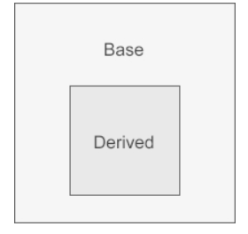

```
作用域能够彼此包含，被包含（或者说被嵌套）的作用域称为内层作用域（inner scope），包含着别的作用域的作用域称为外层作用域（outer scope）。一旦在外层作用域中声明（或者定义）了某个名字，那么它所嵌套着的所有内层作用域中都能访问这个名字。同时，允许在内层作用域中重新定义外层作用域中已有的名字。
名字查找：在作用域链中寻找最匹配的声明或定义的过程。

统同一作用域下才可以构成重载关系，继承时名字遮蔽不在同一作用域。
```

#### 4.5 继承时对象内存模型

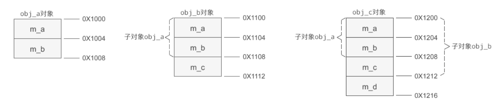

```
新增成员变量始终在最后。
有名字遮蔽时，保留基类成员变量。
```

#### 4.6 基类&派生类构造函数

```
构造函数不能被继承
派生类构造函数，在初始化列表前或者后，调用基类构造函数，比初始化列表优先执行
不能调用间接基类的构造函数
派生类指明构造函数时，必须调用基类构造函数
```

#### 4.7 基类&派生类析构函数

```
析构函数不能被继承
每个类只有一个析构函数，不用指明
构造：基类->派生类
析构：派生类->基类
```

#### 4.8 多重继承

```
多个基类。
逻辑变复杂，Java、C#、PHP取消了多继承
class D: public A, private B, protected C{}
构造顺序与声明有关，按C,B,A顺序构造
基类成员重名，通过::区分
```

#### 4.9 多继承时内存模型

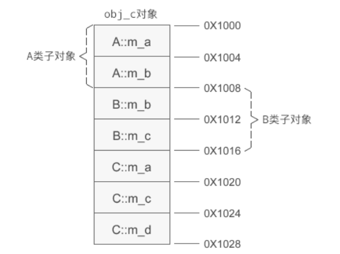

```
基类对象的排列顺序和继承时声明的顺序相同。
```

#### 4.10 通过指针访问private，protected成员

```
指针+偏移地址
A obj(10, 20, 30);
int a1 = *(int*)&obj;//获取对象地址
int b = *(int*)( (int)&obj + sizeof(int) );//获取成员地址
```

#### 4.11 虚继承&虚基类

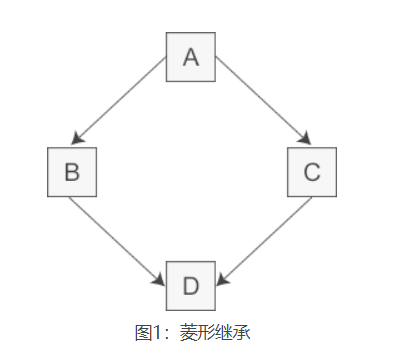

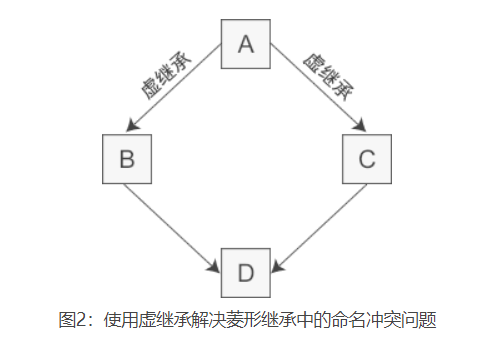

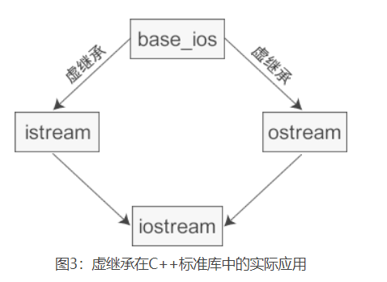

```
二义性问题：D可以从B或者C继承A类成员
图1
通过::指明
B::m_a = a; 
图2
class A//虚基类
class B: virtual public A
class C: virtual public A//虚继承
class D: public B, public C//D中只保留一份间接基类A的成员
```

#### 4.12 虚继承时的构造函数

```
构造派生类D时，需要构造虚基类A，构造基类B后者C无效。
虚基类A构造函数优先于其他构造函数
```

#### 4.13 虚继承的内存模型

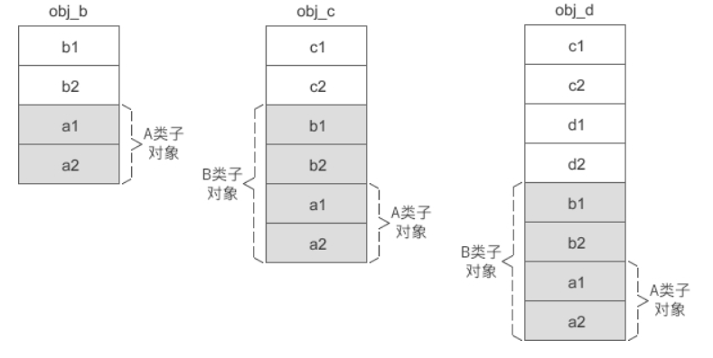

```
可以理解为普通继承内存模型自上而下，虚继承自下而上。
分为固定部分和共享部分。
不同的编译器设计了不同的方案来计算共享部分的偏移。
```

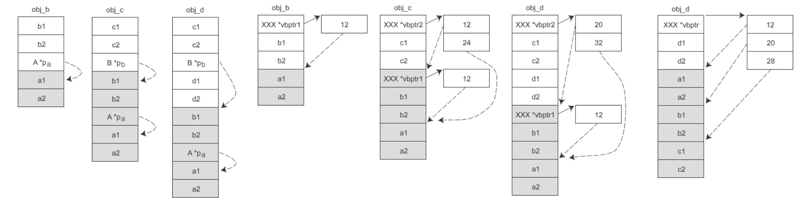

```
早期Cfront实现：插入虚基类指针
VC实现：维护虚基类表
另一种实现
```

#### 4.14 向上转型

```
将派生类对象赋值给基类对象、将派生类指针赋值给基类指针、将派生类引用赋值给基类引用，这在 C++ 中称为向上转型（Upcasting）。相应地，将基类赋值给派生类称为向下转型（Downcasting）。（java，C#中也有）
向上安全，向下需要手动干预。

对象：
舍弃派生类新增的成员。
指针：
编译器通过指针来访问成员变量，指针指向哪个对象就使用哪个对象的数据；编译器通过指针的类型来访问成员函数，指针属于哪个类的类型就使用哪个类的函数。
引用：同指针
向上转型后通过基类的对象、指针、引用只能访问从基类继承过去的成员，不能访问派生类新增的成员。
```

#### 4.15 派生类指针赋值给基类指针详解

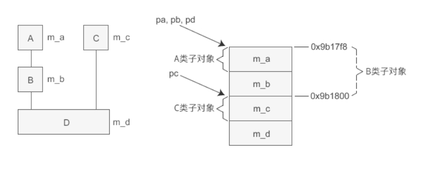

```
根据内存模型分析。
pc = pd;
pc = (C*)( (int)pd + sizeof(B) );//编译后
```

### 5 C++多态与虚函数（9）

编译和运行时的多态。

编译：函数（运算符重载），重载函数调用

运行：继承，虚函数相关

#### 5.1 多态&虚函数

```
基类指针只能访问派生类的成员变量，但是不能访问派生类的成员函数。
使用虚函数，基类指针可以访问派生类的成员。
这种基类指针也可以当作派生类指针的形态，叫多态。
虚函数唯一用处就是构成多态。
多态目的：通过基类指针访问（直接或间接）派生类访问。
引用也可以实现多态，但不能更改绑定的变量，所以指针更加方便。
```

#### 5.2 虚函数注意&多态条件

```
只需声明处virtual
派生类中，与基类中的虚函数有名字遮蔽关系的函数自动成为虚函数。
派生类中没有定义基类中虚函数，使用基类虚函数。
派生类中定义基类虚函数，才构成多态。
构造函数不能时虚函数，析构可，甚至有时必须。
多态条件：
 继承关系
 虚函数覆盖
 指针调用
```

#### 5.3 析构函数必要性

```
构造函数不能为虚函数，因为没有虚函数表。
析构可，甚至有时必须。
派生类会隐式调用基类的析构。
基类指针只能调用基类虚构函数，导致指向派生类对象时不能正确销毁对象。
大部分基类析构应该是虚函数。
```

#### 5.4 纯虚函数&抽象类

```
virtual float area() = 0;//纯虚函数，无函数体
抽象类：包含纯虚函数的类。
抽象类有未实现的成员函数，不能实例化。
抽象类可以约束派生类。
通过抽象类指针访问派生类成员，实现多态。
顶层函数和普通成员函数不能声明位纯虚函数，只有函数可。
```

#### 5.5 虚函数表&多态机制

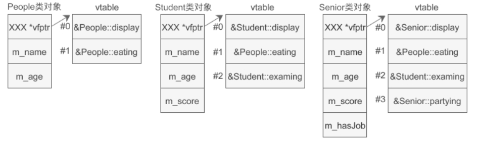

```
虚函数表。（类似虚继承中的虚基类表）
基类虚函数始终在表上放，派生类新增虚函数在下方。
```

#### 5.6 typeid运算符

```
class type_info {
public:
    virtual ~type_info();
    int operator==(const type_info& rhs) const;
    int operator!=(const type_info& rhs) const;
    int before(const type_info& rhs) const;
    const char* name() const;//类型名
    const char* raw_name() const;//名字编码,VC/VS下
private:
    void *_m_data;
    char _m_d_name[1];
    type_info(const type_info& rhs);//编译器通过友元构造
    type_info& operator=(const type_info& rhs);
};
const type_info &nInfo = typeid(obj);//获取类型信息，obj可以是变量，类，表达式，字面量等
编译器会为使用过typeid类型和带虚函数的类创建typeinfo对象。
```

#### 5.7 运行时类型识别机制(RTTI)

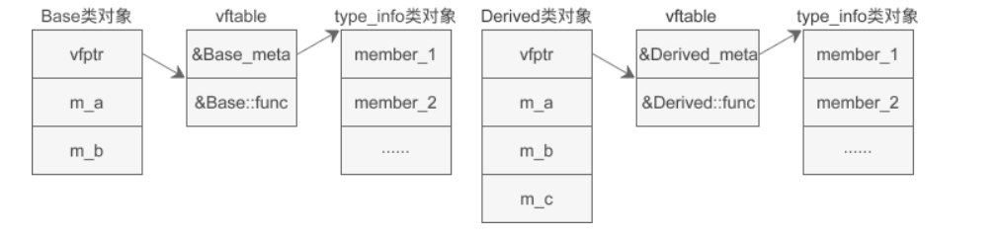

```
类包含虚函数，虚函数表上方还有type_info对象信息。
只有包含虚函数的类才会启动RTTI
支持多态的代价也是很大的，有些信息在编译阶段无法确定下来，必须提前做好充足的准备，让程序运行后再执行一段代码获取，这会消耗更多的内存和 CPU 资源。
```

#### 5.8 静态绑定&动态绑定

```
变量名和函数名统称为符号(symbol)，符号对应的地址的过程叫做符号绑定。
静态：编译时绑定。
动态：运行时绑定。
C++为静态性语言，尽量在编译过程中绑定。
if(n > 100){
    p = new Student("王刚", 16, 84.5);
}else{
    p = new Senior("李智", 22, 92.0, true);
}
上面的情况没办法确定符号，就用一个表达式表示，运行时进行动态绑定。
```

#### 5.9 RTTI机制下对象内存模型

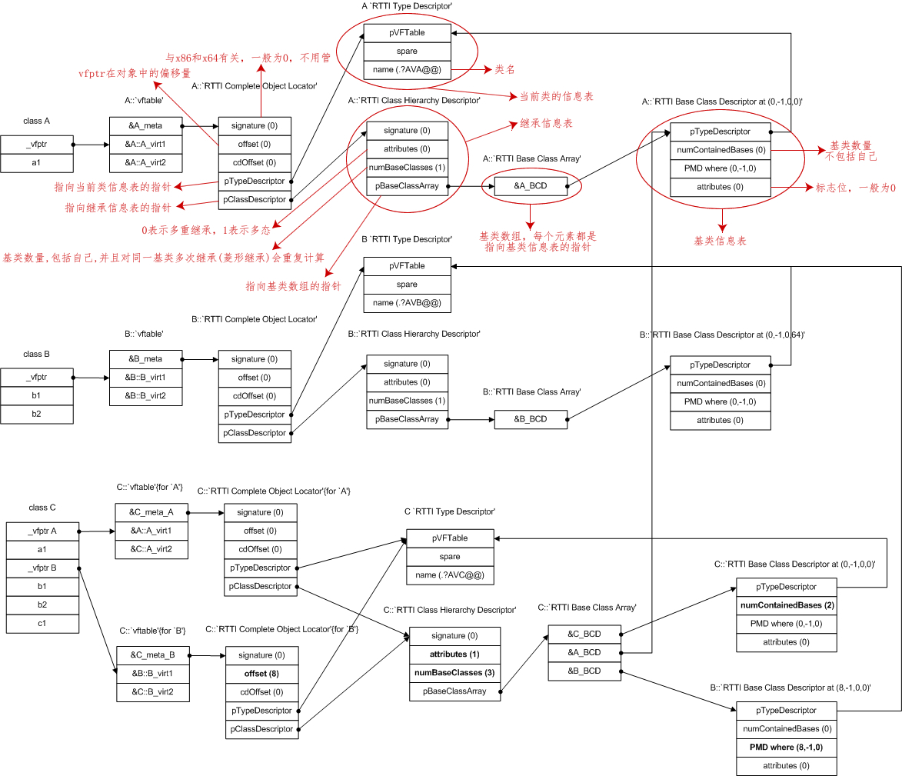

```
除了 typeid 运算符，dynamic_cast 运算符和异常处理也依赖于 RTTI 机制。
```

如果你希望深入了解上图的结构，请查看下面几篇文章：

- [VC++逆向：类、方法和 RTTI](http://www.openrce.org/articles/full_view/23)
- [RTTI结构详细分析(VC++)](http://bbs.pediy.com/showthread.php?t=196996)
- [C++中RTTI机制剖析](http://blog.csdn.net/pi9nc/article/details/21742355)
- [C++ dynamic_cast实现原理](http://blog.csdn.net/passion_wu128/article/details/38511957)
- [dynamic_cast, RTTI， 整理](http://www.cnblogs.com/dirichlet/p/3221066.html)

### 6 运算符重载（10）

#### 6.1 基础

```
运算符重载本质时函数重载。
c3 = c1 + c2;
c3 = c1.operator+(c2);//等效
可以声明为全局函数。
```

#### 6.2 运算符重载规则

```
1 可以重载的运算符+  -  *  /  %  ^  &  |  ~  !  =  <  >  +=  -=  *=  /=  %=  ^=  &=  |=  <<  >>  <<=  >>=  ==  !=  <=  >=  &&  ||  ++  --  ,  ->*  ->  ()  []  new  new[]  delete  delete[]
长度运算符sizeof、条件运算符: ?、成员选择符.和域解析运算符::不能被重载。
2 重载不能改变运算符的优先级和结合性
3 重载不会改变运算符的用法，比如~右边只有一个操作数，+在两个操作数之间
4 运算符重载函数不能有默认的参数
5 运算符重载函数既可以作为类的成员函数，也可以作为全局函数。
 成员函数：多一个当前类的隐含参数。
 全局函数：有一个参数必须是对象。防止修改内置类型运算符性质。一般为类的友元。
6 箭头运算符->、下标运算符[ ]、函数调用运算符( )、赋值运算符=只能以成员函数的形式重载。
```

#### 6.3 重载数学运算符

```
四则运算符（+、-、*、/、+=、-=、*=、/=）和关系运算符（>、<、<=、>=、==、!=）
全局函数的形式重载了 +、-、*、/、==、!=，以成员函数的形式重载了 +=、-=、*=、/=
```

#### 6.4 成员函数or全局函数

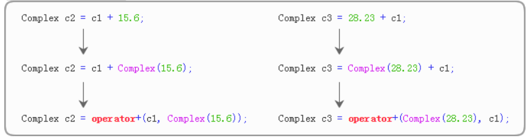

```
转换构造函数用来将其它类型转换为当前类类型。
operator+重载为全局函数，确保操作数能够被对称的处理。
operator+=重载为成员函数，确保在调用时对第一个（最左的）运算对象不出现类型转换。
```

#### 6.5 重载<<和>>

```
friend istream & operator>>(istream & in , complex &a);
istream & operator>>(istream &in, complex &A){
    in >> A.m_real >> A.m_imag;
    return in;//连续读取
}

friend ostream & operator<<(ostream &out, complex &A);
ostream & operator<<(ostream &out, complex &A){
    out << A.m_real <<" + "<< A.m_imag <<" i ";
    return out;
}
```

#### 6.6 重载下标运算符[]

```
只能是成员函数
int & operator[](int i);
const int & operator[](int i) const;//两种都要，const对象只能使用其const成员
```

#### 6.7 重载++和--

```
operator++();  //++i，前置形式
operator++(int);  //i++，后置形式，int与前置区分，没有意义。
```

#### 6.8 重载new和delete

```
void * className::operator new( size_t size )//new成员函数
void * operator new( size_t size )//new全局函数

void className::operator delete( void *ptr)//delete成员函数
void operator delete( void *ptr)//delete全局函数
第一个参数必须有，可以增加其他参数。
```

#### 6.9 重载强制转换运算符()

```
类型的名字本身也是一种运算符，即类型强制转换运算符。
类型强制转换运算符是单目运算符，只能重载为成员函数
operator double() { return real; }//无需指定返回类型
Complex c(1.2, 3.4);
cout << (double)c << endl; //等价于c.operator double()，强制转换double
```

#### 6.10 汇总

```
必要时需要重载赋值运算符=，以避免两个对象内部的指针指向同一片存储空间。//没看懂
```

### 7 模板（13）

```
STL中广泛应用。
老司机都会考虑现有的类和函数写成模板，达到复用的效果。
```

#### 7.1 函数模板

```
将类型当作参数传递
template<typename T> 
void Swap(T *a, T *b)//template<typename T>模板头，typename可以用class替代
声明和定义都要有模板头
```

#### 7.2 类模板

```
template<typename T1, typename T2>  
class Point{}//类模板

template<typename T1, typename T2>
T1 Point<T1, T2>::getX() const//成员函数前面也要有模板头，类后面也要带上类型参数

Point<int, int> p1(10, 20);//创建对象，类后面要有类型参数
```

#### 7.3 模板编程的来龙去脉

```
强类型语言 弱类型语言
编译型语言 解释型语言 
```

#### 7.4 函数模板的重载

```
template<typename T> void Swap(T a[], T b[], int len);//重载swap，交换两个数组
```

#### 7.5 函数模板的实参推断

```
实参推断：通过函数实参推断模板实参的过程。
普通函数的实参推断：
    算数转换：例如 int 转换为 float，char 转换为 int，double 转换为 int 等。
    派生类向基类的转换：也就是向上转型，请猛击《C++向上转型（将派生类赋值给基类）》了解详情。
    const 转换：也即将非 const 类型转换为 const 类型，例如将 char * 转换为 const char *。
    数组或函数指针转换：如果函数形参不是引用类型，那么数组名会转换为数组指针，函数名也会转换为函数指针。
    用户自定的类型转换。
函数模板的实参推断：
 const 转换 
 数组或函数指针转换
 
func<int, int>(10);//为函数显示指明实参

显示指明实参后可以应用正常的类型转换：
func(10, 23.5);  //Error
func<float>(20, 93.7);  //Correct
```

#### 7.6 模板的显示具体化

```
函数模板和类模板都可以显示具体化

//函数模板
template<class T> const T& Max(const T& a, const T& b);
//函数模板的显示具体化（针对STU类型的显示具体化）
template<> const STU& Max<STU>(const STU& a, const STU& b);//对STU类型单独处理，template<>为空
template<> const STU& Max(const STU& a, const STU& b);//简化后
调用顺序：非模板函数>显示具体化模板函数>常规模板函数

//类模板同理

//部分显示具体化，指定一部分模板类型
只能用于类模板
```

#### 7.7 模板中的非类型参数

```
限制：只能是整数或对象(函数)的指针(引用) 
 整数：实参不能有变量
 指针：绑定到该指针的实参必须具有静态的生存期；换句话说，实参必须存储在虚拟地址空间中的静态数据区。局部变量位于栈区，动态创建的对象位于堆区，它们都不能用作实参。

//函数模板
template<typename T, unsigned N> void Swap(T (&a)[N], T (&b)[N])
int a[5] = { 1, 2, 3, 4, 5 };
int b[5] = { 10, 20, 30, 40, 50 };
Swap(a, b);//引用a的数据类型为a[5]

//类模板，实现一个动态数组
#include <iostream>
#include <cstring>
#include <cstdlib>
using namespace std;

template<typename T, int N>
class Array{
public:
    Array();
    ~Array();
public:
    T & operator[](int i);  //重载下标运算符[]
    int length() const { return m_length; }  //获取数组长度
    bool capacity(int n);  //改变数组容量
private:
    int m_length;  //数组的当前长度
    int m_capacity;  //当前内存的容量（能容乃的元素的个数）
    T *m_p;  //指向数组内存的指针
};

template<typename T, int N>
Array<T, N>::Array(){
    m_p = new T[N];
    m_capacity = m_length = N;
}

template<typename T, int N>
Array<T, N>::~Array(){
    delete[] m_p;
}

template<typename T, int N>
T & Array<T, N>::operator[](int i){
    if(i<0 || i>=m_length){
        cout<<"Exception: Array index out of bounds!"<<endl;
    }
    return m_p[i];
}

template<typename T, int N>
bool Array<T, N>::capacity(int n){
    if(n > 0){  //增大数组
        int len = m_length + n;  //增大后的数组长度
        if(len <= m_capacity){  //现有内存足以容纳增大后的数组
            m_length = len;
            return true;
        }else{  //现有内存不能容纳增大后的数组
            T *pTemp = new T[m_length + 2 * n * sizeof(T)];  //增加的内存足以容纳 2*n 个元素
            if(pTemp == NULL){  //内存分配失败
                cout<<"Exception: Failed to allocate memory!"<<endl;
                return false;
            }else{  //内存分配成功
                memcpy( pTemp, m_p, m_length*sizeof(T) );
                delete[] m_p;
                m_p = pTemp;
                m_capacity = m_length = len;
            }
        }
    }else{  //收缩数组
        int len = m_length - abs(n);  //收缩后的数组长度
        if(len < 0){
            cout<<"Exception: Array length is too small!"<<endl;
            return false;
        }else{
            m_length = len;
            return true;
        }
    }
}


int main(){
    Array<int, 5> arr;

    //为数组元素赋值
    for(int i=0, len=arr.length(); i<len; i++){
        arr[i] = 2*i;
    }
   
    //第一次打印数组
    for(int i=0, len=arr.length(); i<len; i++){
        cout<<arr[i]<<" ";
    }
    cout<<endl;
   

    //扩大容量并为增加的元素赋值
    arr.capacity(8);
    for(int i=5, len=arr.length(); i<len; i++){
        arr[i] = 2*i;
    }

    //第二次打印数组
    for(int i=0, len=arr.length(); i<len; i++){
        cout<<arr[i]<<" ";
    }
    cout<<endl;

    //收缩容量
    arr.capacity(-4);

    //第三次打印数组
    for(int i=0, len=arr.length(); i<len; i++){
        cout<<arr[i]<<" ";
    }
    cout<<endl;

    return 0;
}
```

#### 7.8 模板的实例化

```
模板不占用内存。
模板的实例化，模板的实例。
编译器会根据实参生成一个函数或类，实例化的过程。
类模板不会实例化所有成员函数，调用时才实例化。
模板Point的两个实例Point<int, int>，Point<char*, char*>是独立的。
```

#### 7.9 模板的多文件编程

```
程序员惯用的做法是将模板的声明和定义都放到头文件中。
模板的实例化是由编译器完成的，而不是由链接器完成的，这可能会导致在链接期间找不到对应的实例。
```

#### 7.10 模板的显示实例化

```
//模板函数
template void Swap(double &a, double &b);//放在定义文件中

//模板类
template class Point<char*, char*>;//class不可省略
显式实例化一个类模板时，会一次性实例化该类的所有成员，包括成员变量和成员函数。

```

#### 7.11 类模板&继承

```
类模板和类模板之间、类模板和类之间可以互相继承。
1. 类模板从类模板派生
template <class T1, class T2>
class A
{
    Tl v1; T2 v2;
};
template <class T1, class T2>
class B : public A <T2, T1>
{
    T1 v3; T2 v4;
};
template <class T>
class C : public B <T, T>
{
    T v5;
};
int main()
{
    B<int, double> obj1;
    C<int> obj2;
    return 0;
}
2. 类模板从模板类派生，模板类是类模板的一个实例
template<class T1, class T2>
class A{ T1 v1; T2 v2; };
template <class T>
class B: public A <int, double>{T v;};
int main() { B <char> obj1; return 0; }
3. 类模板从普通类派生
class A{ int v1; };
template<class T>
class B: public A{ T v; };
int main (){ B <char> obj1; return 0; }
4. 普通类从模板类派生
template <class T>
class A{ T v1; int n; };
class B: public A <int> { double v; };
int main() { B obj1; return 0; }
```

#### 7.12 类模板&友元

```
1. 函数、类、类的成员函数作为类模板的友元
void Func1() {  }
class A {  };
class B
{
public:
    void Func() { }
};
template <class T>
class Tmpl
{
    friend void Func1();
    friend class A;
    friend void B::Func();
};
int main()
{
    Tmpl<int> i;
    Tmpl<double> f;
    return 0;
}
2. 函数模板作为类模板的友元
#include <iostream>
#include <string>
using namespace std;
template <class T1, class T2>
class Pair
{
private:
    T1 key;  //关键字
    T2 value;  //值
public:
    Pair(T1 k, T2 v) : key(k), value(v) { };
    bool operator < (const Pair<T1, T2> & p) const;
    template <class T3, class T4>
    friend ostream & operator << (ostream & o, const Pair<T3, T4> & p);
};
template <class T1, class T2>
bool Pair <T1, T2>::operator< (const Pair<T1, T2> & p) const
{  //“小”的意思就是关键字小
    return key < p.key;
}
template <class Tl, class T2>
ostream & operator << (ostream & o, const Pair<T1, T2> & p)
{
    o << "(" << p.key << "," << p.value << ")";
    return o;
}
int main()
{
    Pair<string, int> student("Tom", 29);
    Pair<int, double> obj(12, 3.14);
    cout << student << " " << obj;
    return 0;
}
3. 函数模板作为类的友元
#include <iostream>
using namespace std;
class A
{
    int v;
public:
    A(int n) :v(n) { }
    template <class T>
    friend void Print(const T & p);
};
template <class T>
void Print(const T & p)
{
    cout << p.v;
}
int main()
{
    A a(4);
    Print(a);
    return 0;
}
4. 类模板作为类模板的友元
#include <iostream>
using namespace std;
template<class T>
class A
{
public:
    void Func(const T & p)
    {
        cout << p.v;
    }
};
template <class T>
class B
{
private:
    T v;
public:
    B(T n) : v(n) { }
    template <class T2>
    friend class A;  //把类模板A声明为友元
};
int main()
{
    B<int> b(5);
    A< B<int> > a;  //用B<int>替换A模板中的 T
    a.Func(b);
    return 0;
}
```

#### 7.12 类模板&静态成员

```
类模板中可以定义静态成员，从该类模板实例化得到的所有类都包含同样的静态成员。
template<> int A<int>::count = 0;
template<> int A<double>::count = 0;//对于不同的模板类，需要显示初始化
```

### 8 C++异常（4）

```
C++ 异常处理机制就可以让我们捕获并处理这些错误，然后我们可以让程序沿着一条不会出错的路径继续执行，或者不得不结束程序，但在结束前可以做一些必要的工作，例如将内存中的数据写入文件、关闭打开的文件、释放分配的内存等。
```

#### 8.1 try catch

```
抛出（Throw）--> 检测（Try） --> 捕获（Catch）
string str = "http://c.biancheng.net";
try{
    char ch1 = str[100];//没有抛出异常，catch没检测到
    cout<<ch1<<endl;
}catch(exception e){
 cout<<"[1]out of bound!"<<endl;
}

try{
    char ch2 = str.at(100);//抛出异常，被catch检测到，后面不再执行
    cout<<ch2<<endl;
}catch(exception &e){  //exception类位于<exception>头文件中
 cout<<"[2]out of bound!"<<endl;
}

try{
    throw "Unknown Exception";  //抛出异常
    cout<<"This statement will not be executed."<<endl;
}catch(const char* &e){
 cout<<e<<endl;
}
发生异常后，程序的执行流会沿着函数的调用链往前回退，直到遇见 try 才停止。
```

#### 8.2 异常类型&多级catch匹配

```c++
try{
    throw Derived();  //抛出自己的异常类型，实际上是创建一个Derived类型的匿名对象
    cout<<"This statement will not be executed."<<endl;
}catch(int){//只检测异常类型 
    cout<<"Exception type: int"<<endl;
}catch(char *){
    cout<<"Exception type: cahr *"<<endl;
}catch(Base){  //匹配成功（向上转型）
    cout<<"Exception type: Base"<<endl;
}catch(Derived){
    cout<<"Exception type: Derived"<<endl;
}
类型转换：
    向上转型
    const 转换
    数组或函数指针转换
```

#### 8.3 throw

```
异常规范：C++11抛弃掉
```

#### 8.4 标准异常基类（exception）

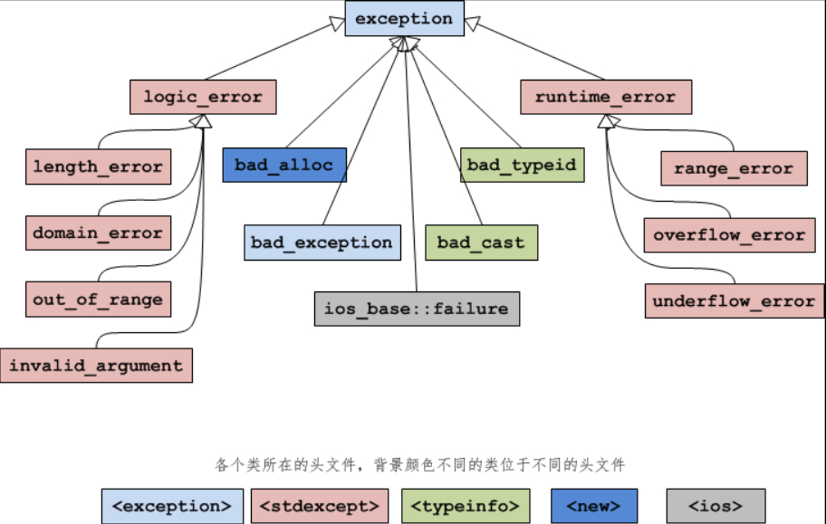

| 异常名称          | 说  明                                                       |
| ----------------- | ------------------------------------------------------------ |
| logic_error       | 逻辑错误。                                                   |
| runtime_error     | 运行时错误。                                                 |
| bad_alloc         | 使用 new 或 new[ ] 分配内存失败时抛出的异常。                |
| bad_typeid        | 使用 typeid 操作一个 NULL 指针，而且该指针是带有虚函数的类，这时抛出 bad_typeid 异常。 |
| bad_cast          | 使用 dynamic_cast 转换失败时抛出的异常。                     |
| ios_base::failure | io 过程中出现的异常。                                        |
| bad_exception     | 这是个特殊的异常，如果函数的异常列表里声明了 bad_exception 异常，当函数内部抛出了异常列表中没有的异常时，如果调用的 unexpected() 函数中抛出了异常，不论什么类型，都会被替换为 bad_exception 类型。 |

| 异常名称         | 说  明                                                       |
| ---------------- | ------------------------------------------------------------ |
| length_error     | 试图生成一个超出该类型最大长度的对象时抛出该异常，例如 vector 的 resize 操作。 |
| domain_error     | 参数的值域错误，主要用在数学函数中，例如使用一个负值调用只能操作非负数的函数。 |
| out_of_range     | 超出有效范围。                                               |
| invalid_argument | 参数不合适。在标准库中，当利用string对象构造 bitset 时，而 string 中的字符不是 0 或1 的时候，抛出该异常。 |

| 异常名称        | 说  明                           |
| --------------- | -------------------------------- |
| range_error     | 计算结果超出了有意义的值域范围。 |
| overflow_error  | 算术计算上溢。                   |
| underflow_error | 算术计算下溢。                   |

### 9 面向对象进阶（10）

#### 9.1 拷贝构造函数

```
Student(const Student &stu);
1 引用，防止进入拷贝构造循环
2 const，防止修改，可以传入const和非const

默认拷贝构造函数
```

#### 9.2 什么时候会调用拷贝构造

```
Student stu1("小明", 16, 90.5);  //普通初始化
Student stu2(stu1);  //以拷贝的方式初始化
Student stu2 = stu1;  //以拷贝的方式初始化
func(stu);  //以拷贝的方式初始化
Student stu = func();//拷贝
```

#### 9.3 深拷贝&浅拷贝

```
浅拷贝：默认拷贝构造，类似memcpy
深拷贝：显式定义，涉及指针，申请动态内存，预处理的情况
```

#### 9.4 重载赋值运算符(=)

```
编译器会默认重载=运算符
显式定义：涉及指针，申请动态内存，预处理的情况
```

#### 9.5 拷贝控制操作（三/五法则）

```
拷贝控制操作：拷贝构造函数、赋值运算符和析构函数。C++11中加入移动构造函数和移动赋值运算符。统称三/五法则
显式定义：涉及指针，申请动态内存，预处理的情况
需要显示定义析构函数的，一般也需要显示定义拷贝构造和赋值。
一个类需要一个拷贝构造函数，一般也需要一个赋值运算符，反之亦然
```

#### 9.6 转换构造函数

```
构造函数的一种，将其他类型数据转换成当前类形式。
Complex(double real): m_real(real), m_imag(0.0){ }  //转换构造函数，将double转换为complex形式

精简后：
Complex(double real = 0.0, double imag = 0.0): m_real(real), m_imag(imag){ }
Complex a(10.0, 20.0);  //向构造函数传递 2 个实参，不使用默认参数
Complex b(89.5);  //向构造函数传递 1 个实参，使用 1 个默认参数
Complex c;  //不向构造函数传递实参，使用全部默认参数
a = 25.5;  //调用转换构造函数（向构造函数传递 1 个实参，使用 1 个默认参数）
```

#### 9.7 类型转换函数

```
类型转换函数也叫类型转换运算符
无返回值类型。
无返回值。
只能是成员函数
operator double() const { return m_real; }  //类型转换函数
Complex c1(24.6, 100);
double f = c1;  //相当于 double f = Complex::operator double(&c1);
int n = Complex(43.2, 9.3);  //先转换为 double，再转换为 int

可以被继承，可以是虚函数。
多个类型转换函数可能导致二义性问题。
```

#### 9.8 转换构造函数&类型转换函数

```
要么只使用转换构造函数（更多），要么只使用类型转换函数。
```

#### 9.9 类型转换本质

```
隐式类型转换除了会重新解释数据的二进制位，还会利用已知的转换规则对数据进行恰当地调整；而显式类型转换只能简单粗暴地重新解释二进制位，不能对数据进行任何调整。
```

#### 9.10 static_cast、dynamic_cast、const_cast和reinterpret_cast（类型转换运算符）

| 关键字           | 说明                                                         |
| ---------------- | ------------------------------------------------------------ |
| static_cast      | 用于良性转换，一般不会导致意外发生，风险很低。               |
| const_cast       | 用于 const 与非 const、volatile 与非 volatile 之间的转换。（volatile 可能被外部改变的变量） |
| reinterpret_cast | 高度危险的转换，这种转换仅仅是对二进制位的重新解释，不会借助已有的转换规则对数据进行调整，但是可以实现最灵活的 C++ 类型转换。 |
| dynamic_cast     | 借助 RTTI，用于类型安全的向下转型（Downcasting）。           |

```
static_cast：
int n = static_cast<int>(scores);
不能去掉const和volatile

const_cast：
int *p = const_cast<int*>(&n);
可以去掉const和volatile

reinterpret_cast：
int *p = reinterpret_cast<int*>(100);
对二进制位的重新解释

dynamic_cast：
运行时借助RTTI转换。static_cast编译期间。
允许向上转型（Upcasting），向下转型（Downcasting）
向下必须是安全的，要借助 RTTI 进行检测。
指针转换失败返回 NULL；引用转换失败抛出std::bad_cast异常。
向上转型：
 存在继承关系，安全。与static_cast等效
向下转型：
 会在程序运行过程中向上遍历继承链，指向的对象不同继承链起点不同。
```

### 10 输入输出流（13）

#### 10.1 基础

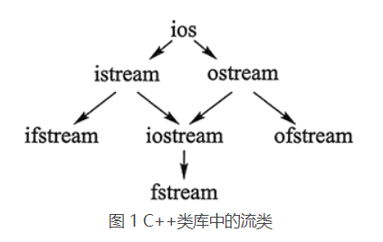

| 成员方法名        | 功能（cin）                                                  |
| ----------------- | ------------------------------------------------------------ |
| getline(str,n,ch) | 从输入流中接收 n-1 个字符给 str 变量，当遇到指定 ch 字符时会停止读取，默认情况下 ch 为 '\0'。 |
| get()             | 从输入流中读取一个字符，同时该字符会从输入流中消失。         |
| gcount()          | 返回上次从输入流提取出的字符个数，该函数常和 get()、getline()、ignore()、peek()、read()、readsome()、putback() 和 unget() 联用。 |
| peek()            | 返回输入流中的第一个字符，但并不是提取该字符。               |
| putback(c)        | 将字符 c 置入输入流（缓冲区）。                              |
| ignore(n,ch)      | 从输入流中逐个提取字符，但提取出的字符被忽略，不被使用，直至提取出 n 个字符，或者当前读取的字符为 ch。 |
| operator>>        | 重载 >> 运算符，用于读取指定类型的数据，并返回输入流对象本身。 |

| 成员方法名 | 功能（cout,cerr,clog）                           |
| ---------- | ------------------------------------------------ |
| put()      | 输出单个字符。                                   |
| write()    | 输出指定的字符串。                               |
| tellp()    | 用于获取当前输出流指针的位置。                   |
| seekp()    | 设置输出流指针的位置。                           |
| flush()    | 刷新输出流缓冲区。                               |
| operator<< | 重载 << 运算符，使其用于输出其后指定类型的数据。 |

```
istream：常用于接收从键盘输入的数据；(cin)
ostream：常用于将数据输出到屏幕上；(cout,cerr,clog)
ifstream：用于读取文件中的数据；
ofstream：用于向文件中写入数据；
iostream：继承自 istream 和 ostream 类，因为该类的功能兼两者于一身，既能用于输入，也能用于输出；
fstream：兼 ifstream 和 ofstream 类功能于一身，既能读取文件中的数据，又能向文件中写入数据。

cout可以通过重定向输出到文件，cerr和clog不可
cout和clog有缓冲区，cerr没有。
```

#### 10.2 输出单个字符（cout.put）

```
ostream＆put(char c);//原型
cout.put(c1).put(c2).put(c3);
cout.put(71).put(79).put(79). put(68).put('\n');//ASCII码
```

#### 10.3 输出字符串（cout.write）

```
ostream＆write（const char * s，streamsize n）;//原型
cout.write(c1, 1).write(c2, 2).write(c3, 3);
```

#### 10.4  cout.tellp&cout.seekp

| 模式标志(文件定位标志) | 描 述                    |
| ---------------------- | ------------------------ |
| ios::beg               | 从文件头开始计算偏移量   |
| ios::end               | 从文件末尾开始计算偏移量 |
| ios::cur               | 从当前位置开始计算偏移量 |

```
//tellp获取当前输出流缓冲区中最后一个字符所在的位置
streampos tellp();//原型
long pos = outfile.tellp(); //获取当前输出流

//seekp指定下一个进入输出缓冲区的字符所在的位置。
ostream& seekp (streampos pos);//指定下一个字符存储的位置
ostream& seekp (streamoff off, ios_base::seekdir way);//通过偏移量间接指定下一个字符的存储位置 
cout.seekp(23) << "当前位置为：" << cout.tellp();
```

#### 10.5 cout格式化输出

```
<iomanip>格式控制符，也叫流操纵算子

```

| 成员函数（ostream） | 说明                                                         |
| ------------------- | ------------------------------------------------------------ |
| flags(fmtfl)        | 当前格式状态全部替换为 fmtfl。注意，fmtfl 可以表示一种格式，也可以表示多种格式。 |
| precision(n)        | 设置输出浮点数的精度为 n。                                   |
| width(w)            | 指定输出宽度为 w 个字符。                                    |
| fill(c)             | 在指定输出宽度的情况下，输出的宽度不足时用字符 c 填充（默认情况是用空格填充）。 |
| setf(fmtfl, mask)   | 在当前格式的基础上，追加 fmtfl 格式，并删除 mask 格式。其中，mask 参数可以省略。 |
| unsetf(mask)        | 在当前格式的基础上，删除 mask 格式。                         |

| 标 志（fmtfl 和 mask 参数可选值） | 作 用                                                        |
| --------------------------------- | ------------------------------------------------------------ |
| ios::boolapha                     | 把 true 和 false 输出为字符串                                |
| ios::left                         | 输出数据在本域宽范围内向左对齐                               |
| ios::right                        | 输出数据在本域宽范围内向右对齐                               |
| ios::internal                     | 数值的符号位在域宽内左对齐，数值右对齐，中间由填充字符填充   |
| ios::dec                          | 设置整数的基数为 10                                          |
| ios::oct                          | 设置整数的基数为 8                                           |
| ios::hex                          | 设置整数的基数为 16                                          |
| ios::showbase                     | 强制输出整数的基数（八进制数以 0 开头，十六进制数以 0x 打头） |
| ios::showpoint                    | 强制输出浮点数的小点和尾数 0                                 |
| ios::uppercase                    | 在以科学记数法格式 E 和以十六进制输出字母时以大写表示        |
| ios::showpos                      | 对正数显示“+”号                                              |
| ios::scientific                   | 浮点数以科学记数法格式输出                                   |
| ios::fixed                        | 浮点数以定点格式（小数形式）输出                             |
| ios::unitbuf                      | 每次输出之后刷新所有的流                                     |

| 流操纵算子（*默认使用） | 作  用                                                       |        |
| ----------------------- | ------------------------------------------------------------ | ------ |
| *dec                    | 以十进制形式输出整数                                         | 常用   |
| hex                     | 以十六进制形式输出整数                                       |        |
| oct                     | 以八进制形式输出整数                                         |        |
| fixed                   | 以普通小数形式输出浮点数                                     |        |
| scientific              | 以科学计数法形式输出浮点数                                   |        |
| left                    | 左对齐，即在宽度不足时将填充字符添加到右边                   |        |
| *right                  | 右对齐，即在宽度不足时将填充字符添加到左边                   |        |
| setbase(b)              | 设置输出整数时的进制，b=8、10 或 16                          |        |
| setw(w)                 | 指定输出宽度为 w 个字符，或输入字符串时读入 w 个字符。注意，该函数所起的作用是一次性的，即只影响下一次 cout 输出。 |        |
| setfill(c)              | 在指定输出宽度的情况下，输出的宽度不足时用字符 c 填充（默认情况是用空格填充） |        |
| setprecision(n)         | 设置输出浮点数的精度为 n。  在使用非 fixed 且非 scientific 方式输出的情况下，n 即为有效数字最多的位数，如果有效数字位数超过 n，则小数部分四舍五人，或自动变为科学计 数法输出并保留一共 n 位有效数字。  在使用 fixed 方式和 scientific 方式输出的情况下，n 是小数点后面应保留的位数。 |        |
| setiosflags(mask)       | 在当前格式状态下，追加 mask 格式，mask 参数可选择表 2 中的所有值。 |        |
| resetiosflags(mask)     | 在当前格式状态下，删除 mask 格式，mask 参数可选择表 2 中的所有值。 |        |
| boolapha                | 把 true 和 false 输出为字符串                                | 不常用 |
| *noboolalpha            | 把 true 和 false 输出为 0、1                                 |        |
| showbase                | 输出表示数值的进制的前缀                                     |        |
| *noshowbase             | 不输出表示数值的进制.的前缀                                  |        |
| showpoint               | 总是输出小数点                                               |        |
| *noshowpoint            | 只有当小数部分存在时才显示小数点                             |        |
| showpos                 | 在非负数值中显示 +                                           |        |
| *noshowpos              | 在非负数值中不显示 +                                         |        |
| uppercase               | 十六进制数中使用 A~E。若输出前缀，则前缀输出 0X，科学计数法中输出 E |        |
| *nouppercase            | 十六进制数中使用 a~e。若输出前缀，则前缀输出 0x，科学计数法中输出 e。 |        |
| internal                | 数值的符号（正负号）在指定宽度内左对齐，数值右对 齐，中间由填充字符填充。 |        |

#### 10.6 输入输出重定向

```
freopen<stdio.h>：
string name, url;
freopen("in.txt", "r", stdin);//将标准输入流重定向到 in.txt 文件
cin >> name >> url;
freopen("out.txt", "w", stdout); //将标准输出重定向到 out.txt文件
cout << name << "\n" << url;

rdbuf<ios>：
streambuf * rdbuf() const;//返回当前缓冲区
streambuf * rdbuf(streambuf * sb);//重定向缓冲区，返回旧缓冲区

控制台：
D:\demo.exe <in.txt >out.txt//将demo程序中的cin和cout重定向到in.txt,out.txt（win，linux，unix，dos都可）
```

#### 10.7 管理输出缓冲区

```
刷新输出缓冲区：
endl换行并刷新
flush 刷新缓冲区，但不输出任何额外的字符；cout.flush()
ends向缓冲区插入一个空字符，然后刷新缓冲区。

unitbuf 操作符：
cout << unitbuf;  //所有输出操作后都会立即刷新缓冲区
//任何输出都立即刷新，无缓冲
cout << nounitbuf;  //回到正常的缓冲方式

关联输入和输出流：
标准库将 cout 和 cin 关联在一起
ostream* tie ( ) const;  //返回指向绑定的输出流的指针。
ostream* tie ( ostream* os );  //将 os 指向的输出流绑定的该对象上，并返回上一个绑定的输出流指针。
ostream *old_tie = cin.tie(nullptr);  // cin 不再与其他流关联
```

#### 10.8 读取单个字符cin.get

```
int c;//不能时char
freopen("test.txt", "r", stdin);  //将标准输入重定向为 test.txt
while ((c = cin.get()) != EOF)
 cout.put(c);
```

#### 10.9 读取一行字符cin.getline

```
istream & getline(char* buf, int bufSize);//遇到\n为止，结尾添加\0。
istream & getline(char* buf, int bufSize, char delim);//delim为止，bufSize越界会出错
cin.clear(); //clear能够清除cin内部的错误标记，使之恢复正常
```

#### 10.10 跳过指定字符

```
istream & ignore(int n =1, int delim = EOF);
cin.ignore(5, 'A');//跳过5个字符或A前面所有字符
```

#### 10.11 查看输入流中的下一个字符

```
int peek();//用来判断数据格式
```

#### 10.12 判断输入结束（读取结束）

```
在 Windows 系统中，通过键盘输入时，按 Ctrl+Z 组合键后再按回车键，就代表输入结束。
在 UNIX/Linux/Mac OS 系统中，Ctrl+D 代表输入结束。
istream 类对强制类型转换运算符 bool 进行了重载，可以将返回的istream类强制转换成bool
```

#### 10.13 处理输入输出错误

| 流状态标志位 | 意义                                                         |
| ------------ | ------------------------------------------------------------ |
| badbit       | 发生了（或许是物理上的）致命性错误，流将不能继续使用。       |
| eofbit       | 输入结束（文件流的物理结束或用户结束了控制台流输入，例如用户按下了 Ctrl+Z 或 Ctrl+D 组合键。 |
| failbit      | I/O 操作失败，主要原因是非法数据（例如，试图读取数字时遇到字母）。流可以继续使用，但会设置 failbit 标志。 |
| goodbit      | 一切止常，没有错误发生，也没有输入结束。                     |

| 检测函数 | 对应的标志位 | 说明                                                         |
| -------- | ------------ | ------------------------------------------------------------ |
| good()   | goodbit      | 操作成功，没有发生任何错误。                                 |
| eof()    | eofbit       | 到达输入末尾或文件尾。                                       |
| fail()   | failbit      | 发生某些意外情况（例如，我们要读入一个数字，却读入了字符 'x'）。 |
| bad()    | badbit       | 发生严重的意外（如磁盘读故障）。                             |

```
ios::failbit 代替 ios_base::failbit

//从ist中读入整数到v中，直到遇到eof()或终结符
void fill_vector(istream& ist, vector<int>& v, char terminator){
    ist.exceptions(ist.exceptions() | ios_base:: badbit);
    for (int i; ist>>i; ) v.push_back(i);
    if (ist.eof()) return;  //发现到了文件尾
    //不是good()，不是bad()，不是eof()，ist的状态一定是fail()
    ist.clear();  //清除流状态
    char c;
    ist>>c;    //读入一个符号，希望是终结符
    if (c != terminator) { //不是终结符号，一定是失败了
        ist.unget();    //也许程序调用者可以使用这个符号
        ist.clear(ios_base::failbit); //将流状态设置为 fail()
    }
}

输出错误较少
```

### 11 文件操作（11）

#### 11.1 计算机文件

```

```

#### 11.2 文件类（文件流类）

| 成员方法名        | 适用类对象                                                   | 功  能                                     |
| ----------------- | ------------------------------------------------------------ | ------------------------------------------ |
| open()            | fstream ifstream ofstream                                    | 打开指定文件，使其与文件流对象相关联。     |
| is_open()         | 检查指定文件是否已打开。                                     |                                            |
| close()           | 关闭文件，切断和文件流对象的关联。                           |                                            |
| swap()            | 交换 2 个文件流对象。                                        |                                            |
| operator>>        | fstream ifstream                                             | 重载 >> 运算符，用于从指定文件中读取数据。 |
| gcount()          | 返回上次从文件流提取出的字符个数。该函数常和 get()、getline()、ignore()、peek()、read()、readsome()、putback() 和 unget() 联用。 |                                            |
| get()             | 从文件流中读取一个字符，同时该字符会从输入流中消失。         |                                            |
| getline(str,n,ch) | 从文件流中接收 n-1 个字符给 str 变量，当遇到指定 ch 字符时会停止读取，默认情况下 ch 为 '\0'。 |                                            |
| ignore(n,ch)      | 从文件流中逐个提取字符，但提取出的字符被忽略，不被使用，直至提取出 n 个字符，或者当前读取的字符为 ch。 |                                            |
| peek()            | 返回文件流中的第一个字符，但并不是提取该字符。               |                                            |
| putback(c)        | 将字符 c 置入文件流（缓冲区）。                              |                                            |
| operator<<        | fstream ofstream                                             | 重载 << 运算符，用于向文件中写入指定数据。 |
| put()             | 向指定文件流中写入单个字符。                                 |                                            |
| write()           | 向指定文件中写入字符串。                                     |                                            |
| tellp()           | 用于获取当前文件输出流指针的位置。                           |                                            |
| seekp()           | 设置输出文件输出流指针的位置。                               |                                            |
| flush()           | 刷新文件输出流缓冲区。                                       |                                            |
| good()            | fstream ofstream ifstream                                    | 操作成功，没有发生任何错误。               |
| eof()             | 到达输入末尾或文件尾。                                       |                                            |

```
fstream fs;
fs.open("test.txt", ios::out);//打开
fs.write(url, 30);//写入
fs.close();//关闭
```

#### 11.3 open 打开文件

| 模式标记                          | 适用对象                  | 作用                                                         |
| --------------------------------- | ------------------------- | ------------------------------------------------------------ |
| ios::in                           | ifstream fstream          | 打开文件用于读取数据。如果文件不存在，则打开出错。           |
| ios::out                          | ofstream fstream          | 打开文件用于写入数据。如果文件不存在，则新建该文件；如果文件原来就存在，则打开时清除原来的内容。 |
| ios::app                          | ofstream fstream          | 打开文件，用于在其尾部添加数据。如果文件不存在，则新建该文件。 |
| ios::ate                          | ifstream                  | 打开一个已有的文件，并将文件读指针指向文件末尾（读写指 的概念后面解释）。如果文件不存在，则打开出错。 |
| ios:: trunc                       | ofstream                  | 打开文件时会清空内部存储的所有数据，单独使用时与 ios::out 相同。 |
| ios::binary                       | ifstream ofstream fstream | 以二进制方式打开文件。若不指定此模式，则以文本模式打开。     |
| ios::in \| ios::out               | fstream                   | 打开已存在的文件，既可读取其内容，也可向其写入数据。文件刚打开时，原有内容保持不变。如果文件不存在，则打开出错。 |
| ios::in \| ios::out               | ofstream                  | 打开已存在的文件，可以向其写入数据。文件刚打开时，原有内容保持不变。如果文件不存在，则打开出错。 |
| ios::in \| ios::out \| ios::trunc | fstream                   | 打开文件，既可读取其内容，也可向其写入数据。如果文件本来就存在，则打开时清除原来的内容；如果文件不存在，则新建该文件。 |

```
ifstream inFile;
inFile.open("c:\\tmp\\test.txt", ios::in);
inFile.close();

ifstream inFile("c:\\tmp\\test.txt", ios::in);//构造函数
inFile.close();
```

#### 11.4 文本和二进制打开方式区别

```
UNIX/Linux:用文本方式或二进制方式打开文件没有任何区别，因为文本文件以 \n（ASCII 码为 0x0a）作为换行符号。

Windows：文本文件以连在一起的 \r\n 作为换行符号。如果以文本方式打开文件，当读取文件时，程序会将文件中所有的 \r\n 转换成一个字符 \n。也就是说，如果文本文件中有连续的两个字符是 \r\n，则程序会丢弃前面的 \r，只读入 \n。
同样当写入文件时，程序会将 \n 转换成 \r\n 写入。也就是说，如果要写入的内容中有字符 \n，则在写入该字符前，程序会自动先写入一个 \r。
```

#### 11.5 close关闭文件

```
ofstream outFile;
outFile.close();
if (outFile.fail()) {
 cout << "文件操作过程发生了错误！";
}
```

#### 11.6 操作结束后记得close

```
文件操作在缓冲区进行的。
用close或者flush之后才真正被放进文件。
```

#### 11.7 >> 和 <<

```
>> 和 << ：文本形式读写文件；
read() 和 write() ：二进制形式读写文件

int main()
{
    int x,sum=0;
    ifstream srcFile("in.txt", ios::in); //以文本模式打开in.txt备读
    if (!srcFile) { //打开失败
        cout << "error opening source file." << endl;
        return 0;
    }
    ofstream destFile("out.txt", ios::out); //以文本模式打开out.txt备写
    if (!destFile) {
        srcFile.close(); //程序结束前不能忘记关闭以前打开过的文件
        cout << "error opening destination file." << endl;
        return 0;
    }
    //可以像用cin那样用ifstream对象
    while (srcFile >> x) {
        sum += x;
        //可以像 cout 那样使用 ofstream 对象
        destFile << x << " ";
    }
    cout << "sum：" << sum << endl;
    destFile.close();
    srcFile.close();
    return 0;
}
```

#### 11.8 read()和write()

```
class CStudent
{
public:
    char szName[20];
    int age;
};
int main()
{
    CStudent s;
    ofstream outFile("students.dat", ios::out | ios::binary);
    while (cin >> s.szName >> s.age)
        outFile.write((char*)&s, sizeof(s));
    outFile.close();
    return 0;
}
int main()
{
    CStudent s;       
    ifstream inFile("students.dat",ios::in|ios::binary); //二进制读方式打开
    if(!inFile) {
        cout << "error" <<endl;
        return 0;
    }
    while(inFile.read((char *)&s, sizeof(s))) { //一直读到文件结束
        cout << s.szName << " " << s.age << endl;   
    }
    inFile.close();
    return 0;
}

gcount()//获取最近一次read的字节
```

#### 11.9 get()和put()

```
int main()
{
    char c;
    //以二进制形式打开文件
    ofstream outFile("out.txt", ios::out | ios::binary);
    if (!outFile) {
        cout << "error" << endl;
        return 0;
    }
    while (cin >> c) {
        //将字符 c 写入 out.txt 文件
        outFile.put(c);
    }
    outFile.close();
    return 0;
}

int main()
{
    char c;
    //以二进制形式打开文件
    ifstream inFile("out.txt", ios::out | ios::binary);
    if (!inFile) {
        cout << "error" << endl;
        return 0;
    }
    while ( (c=inFile.get())&&c!=EOF )   //或者 while(inFile.get(c))，对应第二种语法格式
    {
        cout << c ;
    }
    inFile.close();
    return 0;
}
```

#### 11.10 getline()

```
int main()
{
    char c[40];
    //以二进制模式打开 in.txt 文件
    ifstream inFile("in.txt", ios::in | ios::binary);
    //判断文件是否正常打开
    if (!inFile) {
        cout << "error" << endl;
        return 0;
    }
    //从 in.txt 文件中读取一行字符串，最多不超过 39 个
    inFile.getline(c, 40);
    cout << c ;
    inFile.close();
    return 0;
}

int main()
{
    char c[40];
    ifstream inFile("in.txt", ios::in | ios::binary);
    if (!inFile) {
        cout << "error" << endl;
        return 0;
    }
    //连续以行为单位，读取 in.txt 文件中的数据
    while (inFile.getline(c, 40)) {
        cout << c << endl;
    }
    inFile.close();
    return 0;
}
```

#### 11.11 移动和获取文件读写指针（seekp、seekg、tellg、tellp）

```
ifstream 类和 fstream 类有 seekg 成员函数，可以设置文件读指针的位置；
ofstream 类和 fstream 类有 seekp 成员函数，可以设置文件写指针的位置。

ios::beg：让文件读指针（或写指针）指向从文件开始向后的 offset 字节处。offset 等于 0 即代表文件开头。在此情况下，offset 只能是非负数。
ios::cur：在此情况下，offset 为负数则表示将读指针（或写指针）从当前位置朝文件开头方向移动 offset 字节，为正数则表示将读指针（或写指针）从当前位置朝文件尾部移动 offset字节，为 0 则不移动。
ios::end：让文件读指针（或写指针）指向从文件结尾往前的 |offset|（offset 的绝对值）字节处。在此情况下，offset 只能是 0 或者负数。

ifstream 类和 fstream 类还有 tellg 成员函数，能够返回文件读指针的位置；
ofstream 类和 fstream 类还有 tellp 成员函数，能够返回文件写指针的位置。

#include <iostream>
#include <fstream>
#include <cstring>
using namespace std;
class CStudent
{
    public:
        char szName[20];
        int age;
};
int main()
{
    CStudent s;       
    fstream ioFile("students.dat", ios::in|ios::out);//用既读又写的方式打开
    if(!ioFile) {
        cout << "error" ;
        return 0;
    }
    ioFile.seekg(0,ios::end); //定位读指针到文件尾部，
                              //以便用以后tellg 获取文件长度
    int L = 0,R; // L是折半查找范围内第一个记录的序号
                  // R是折半查找范围内最后一个记录的序号
    R = ioFile.tellg() / sizeof(CStudent) - 1;
    //首次查找范围的最后一个记录的序号就是: 记录总数- 1
    do {
        int mid = (L + R)/2; //要用查找范围正中的记录和待查找的名字比对
        ioFile.seekg(mid *sizeof(CStudent),ios::beg); //定位到正中的记录
        ioFile.read((char *)&s, sizeof(s));
        int tmp = strcmp( s.szName,"Jack");
        if(tmp == 0) { //找到了
            s.age = 20;
            ioFile.seekp(mid*sizeof(CStudent),ios::beg);
            ioFile.write((char*)&s, sizeof(s));
            break;
        }
        else if (tmp > 0) //继续到前一半查找
            R = mid - 1 ;
        else  //继续到后一半查找
            L = mid + 1;
    }while(L <= R);
    ioFile.close();
    return 0;
}
```

### 12 C++多文件编程（6）

#### 12.1 基础

```

```

#### 12.2 防止头文件重复引入

```
1) 使用宏定义避免重复引入
#ifndef _NAME_H
#define _NAME_H
//头文件内容
#endif
2) 使用#pragma once避免重复引入
#pragma once
class Student {
    //......
};
3) 使用_Pragma操作符
_Pragma("once")
4)结合使用：
#pragma once
#ifndef _STUDENT_H
#define _STUDENT_H
class Student {
    //......
};
#endif
```

#### 12.3 命名空间

```
不同头文件中也可以使用名称相同的命名空间，但前提是位于该命名空间中的成员必须保证互不相同。
//demo1.h
#ifndef _DEMO1_H
#define _DEMO1_H
#include<iostream>
namespace demo {
    void display() {
        std::cout << "demo1::display" << std::endl;
    }
    int num=20;
}
#endif
//demo2.h
#ifndef _DEMO2_H
#define _DEMO2_H
#include <iostream>
namespace demo {
    void display(int a) {
        std::cout << "demo2::display" << std::endl;
    }
    //int num; 因为 demo1.h 中已经声明有同名的变量，取消注释会造成重定义错误
}
#endif
```

#### 12.4 const常量

```
可见范围限制为当前文件。
在多文件中使用方法：
1) 将const常量定义在.h头文件中（推荐）
2) 借助extern先声明再定义const常量
//demo.h
#ifndef _DEMO_H
#define _DEMO_H
extern const int num;  //声明 const 常量
#endif
//demo.cpp
#include "demo.h"   //一定要引入该头文件
const int num =10;  //定义 .h 文件中声明的 num 常量
3) 借助extern直接定义const常量
//demo.cpp
extern const int num =10;
//main.cpp
#include <iostream>
extern const int num;
int main() {
    std::cout << num << std::endl;
    return 0;
}
```

#### 12.5 g++命令

```
which g++//检查
yum install gcc-c++//安装

//student.h
class Student {
public:
    const char *name;
    int age;
    float score;
    void say();
};
//student.cpp
#include <iostream>   //std::cout、std::endl
#include "student.h"  //Student
void Student::say() {
    std::cout << name << "的年龄是" << age << "，成绩是" << score << std::endl;
}
//main.cpp
#include "student.h"  //Student
int main() {
    Student *pStu = new Student;
    pStu->name = "小明";
    pStu->age = 15;
    pStu->score = 92.5f;
    pStu->say();
    delete pStu;  //删除对象
    return 0;
}

g++ -E main.cpp -o main.i
g++ -E student.cpp -o student.i//1 预处理，cat student.i查看内容

g++ -S main.i -o main.s
g++ -S student.i -o student.s//2 编译

g++ -c main.s -o main.o
g++ -c student.s -o student.o//3 汇编

g++ main.o student.o -o student.exe//4 链接

g++ main.cpp student.cpp -o student.exe//合并

```

#### 12.6 多文件编程

```
“声明”的作用仅是告诉编译器该符号的存在。
头文件不用被编译。

1) 头文件中可以定义 const(static)对象
2) 头文件中可以定义内联函数
3) 头文件中可以定义类
 如果把成员函数的定义写在定义类的头文件中，而没有写进类内部，这是不合法的。这种情况下，此成员函数不是内联函数，一旦头文件被两个或两个以上的 .cpp 文件包含，就可能会出现重定义的错误。
 
头文件只有声明的话，可以重复引入。
如果定义了上述三种情况，需要避免重复引入。
```

### 13 右值引用

```
将其他对象（通常是临时对象）拥有的内存资源“移为已用”。
并将指向内存的指针置NULL。防止内存泄露。
```

### [函数调用惯例](http://c.biancheng.net/view/vip_2102.html)

[整数](http://c.biancheng.net/view/vip_1761.html)&[小数](http://c.biancheng.net/view/vip_1764.html)在内存的存储

### [那些被编译器隐藏了的过程](http://c.biancheng.net/view/vip_2111.html)
