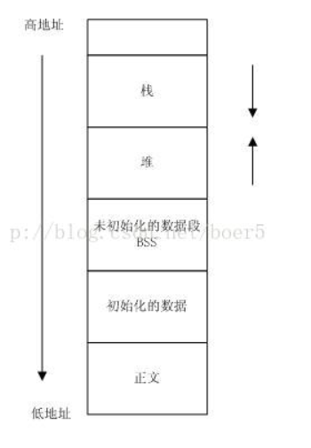

## C++面试题集锦学习笔记

### C++问题（162）

#### 1 引用和指针区别

1. 引用底层是指针!
2. ~~引用不需要分配内存~~
3. 引用需初始化，不可改
4. 引用不能多级
5. 引用的自增运算，sizeof
6. 引用是直接访问变量
7. 动态内存需要用指针，引用可能内存泄露?
8. 使用指针前要类型检查
9. 作为参数，指针-指针地址的值，引用-变量的地址

#### 2 从汇编解释引用

变量地址放在寄存器，寄存器值放入引用。

引用中存放的时变量地址。

#### 3 指针&引用作为参数

总的来说：引用会自动使用间接寻址，表现为直接寻址。

1. 指针：栈，临时变量，传递的是地址值，指针的操作不会影响相应的变量，除非用间接寻址符号*
2. 引用：栈，临时变量，传递的是地址值，操作都会被处理成间接寻址，会影响变量的值
3. 编译后：将指针&引用添加到符号表，指针符号表（指针变量+指针变量地址），引用（引用变量+引用对象地址值）

#### 4 形参&实参

1. 形参：栈，作用域
2. 实参：可以是常量，变量，函数，表达式，必须具有确定的值
3. 形&实参，类型和数量上要严格一致
4. 单向传递
5. 非指针情况，形参操作不影响实参

1. 值传递，数据拷贝
2. 指针传递，地址拷贝，效率高
3. 引用传递，符号拷贝?，使用方便

#### 5 static用法&作用

1. 隐藏函数&变量，作用域为当前文件
2. 记忆功能&全局生存期：与全局变量一样，在静态数据区，只有一次初始化
3. 默认值为0
4. static类成员

1. static变量：函数体内作用域为函数体，只分配一次，维持上次的值。函数体外为当前文件
2. static函数：作用域为当前文件
3. 类的static变量：所有对象共享，类外初始化
4. 类的static函数：无this，只能访问static成员，不能被virtual修饰，虚函数，普通成员函数访问都需要this指针

#### 6 static初始化

1. 静态数据区，一次初始化，多次赋值，编译过程分配内存
2. C语言：编译阶段，不能用变量初始化。
3. C++：运行时（首次使用）初始化，可以使用变量初始化。

#### 7 const

1. 阻止修改，定义时初始化
2. const指针：可以修饰指针，可以修饰指针指向的数据
3. const形参：内部不可以更改
4. const成员函数：可以访问的所有成员，不能修改成员变量，const对象只能访问const成员
5. const返回值：避免返回值为”左值“（用完即毁）
6. const_cast
7. const成员变量：初始化列表初始化
8. const修饰指针&引用形参，保护变量不被修改，是否const修饰指针&引用形参的函数构成重载，const修饰其他类型不能构成

1. 顶层const：指针不可改
2. 底层const：指向的对象不可改

#### 8 const与函数

① const Stock & Stock::topval (②const Stock & s) ③const

1. 返回值：不可修改
2. 形参：不可修改
3. 函数：不可修改调用它的对象

#### 9 const与指针

1. 顶层const：指针不可改，`int *const p2；`修饰指针变量p2，指针变量可改，指向的变量值可以改
2. 底层const：指针指向的值不可改，`const int *p2；int const *p2；`修饰变量*p2，指针变量可改，指向的变量值不可改

#### 10 mutable 

1. const成员函数可以修改mutable成员变量
2. const_cast功能类似

#### 11 extern

1. 在需要使用的地方，extern修饰变量或者函数
2. 指明编译C/C++编译规范

#### 12 int&字符转换

1. strcat,strcpy,strncpy,memset,memcpy实现
2. to_string（转字符）
3. stoi/stol/stoll（转int）

#### 13 深拷贝&浅拷贝

浅拷贝：拷贝基本类型数据，指针&引用没变

深拷贝：指针&引用也进行拷贝

#### 14 模板实现

1. 对模板的实现编译一次，调用的地方参数替换后编译第二次

#### 15 C/C++Struct区别

1. C：用户自定义数据类型（UDT）	C++：抽象数据类型（ADT）
2. C：没有权限，只有变量
3. C++：默认public，有成员函数

#### 16 虚函数可以声明inline?

1. 虚函数：动态绑定，运行时的多态
2. inline：编译期间替换

#### 17 成员初始化方式，构造顺序，初始化列表更快

1. 赋值：函数体内（分配内存，赋值分开）	初始化列表：函数体外（分配内存，赋值同时）
2. 构造顺序：
   1. 虚基类构造函数
   2. 基类构造函数
   3. 类成员构造函数
   4. 自身构造函数
3. 赋值产生临时变量

#### 18 成员列表初始化

1. 必须用列表：
   1. 引用
   2. 常成员
   3. 基类构造函数有参数
   4. 类成员构造函数有参数
2. 编译期间，将列表安插到构造函数体之前
3. 初始化顺序取决于声明顺序，与列表顺序无关

#### 19 构造不能为虚函数，析构要虚函数

构造：

1. 构造之前对象还没实例化，没有vtable（虚函数表）
2. 不会与派生类形成重载（不重名），没必要

析构：

1. 析构顺序：派生类->类成员->基类
2. 非虚析构：防止内存泄露。父类指针指向派生类时，析构会根据指针类型调用父类的析构。
3. 虚析构：基类虚析构，派生类自动虚析构，忽略指针类型，调用派生类析构。

#### 20 构造析构作用

1. 构造：初始化，可以传参
2. 析构：销毁对象，无参，无返回值，public

#### 21 构造析构可以调用虚函数么？

1. 不可以，不能实现动态绑定，一般通过init和uninit两个函数调用
2. 构造基类时，会调用用派生类的虚函数
3. 析构基类时，会调用派生类的虚函数，但派生类已经析构完毕

#### 22 析构&构造顺序

- 构造
  1. 基类构造，取决于派生表顺序
  2. 成员类对象构造（初始化列表），取决于声明顺序
  3. 派生类构造
- 析构
  1. 派生类析构
  2. 成员类对象析构
  3. 基类析构

#### 23 虚析构函数作用，Q19

#### 24 构造和析构可以调用虚函数么，Q21

#### 25 析构和构造可以抛出异常么

1. 构造抛出异常：
   1. 对象不能被析构，内存泄露
   2. 用auto_ptr可以不用在析构中手动释放资源
2. 析构抛出异常：
   1. 异常后面如果又释放资源的操作，会导致资源泄露
   2. 其他异常导致析构，析构又抛出一个异常，导致程序崩溃

#### 26 实现只能静态&动态创建对象

1. 静态：new和delete重载为private
2. 动态：将构造和析构设置为protect，用子类动态创建（或者声明一个create成员），静态创建时因为无法访问析构函数拒绝申请内存

#### 27 如果想将某个类用作基类，为什么该类必须定义而非声明？

1. 派生类中包含并且可以使用它从基类继承而来的成员，为了使用这些成员，派生类必须知道他们是什么。

#### 28 自动生成默认构造函数的情况

编译器只在它需要的时候才会合成一个默认构造函数

1. 成员类对象含有默认构造函数
2. 基类含有默认构造函数
3. 有虚函数，初始化虚函数表指针
4. 有虚基类，初始化虚基类表指针

#### 29 类的继承？

1. 类与类之间的关系
   1. has-A 包含关系，用以描述一个类由多个部件类构成，实现 has-A 关系用类的成员属性 表示，即一个类的成员属性是另一个已经定义好的类； 
   2. use-A，一个类使用另一个类，通过类之间的成员函数相互联系，定义友元或者通过传 递参数的方式来实现； 
   3. is-A，继承关系，关系具有传递性；
2. 继承的相关概念：所谓的继承就是一个类继承了另一个类的属性和方法，这个新的类包含了上一个类的 属性和方法，被称为子类或者派生类，被继承的类称为父类或者基类；
3. 继承的特点：子类拥有父类的所有属性和方法，子类可以拥有父类没有的属性和方法，子类对象可以当做父类对象使用（兼容性原则）；
4. 继承中的访问控制：public、protected、private
5. 继承中的构造和析构函数

#### 30 组合?

含有其他类成员对象的类。初始化和析构顺序。

#### 31 抽象类为什么不能实例化

抽象类含有纯虚函数，没有被实现。

1. 编译时多态性：通过重载函数实现
2. 运行时多态性：通过虚函数实现。

#### 32 什么时候会析构？

1. 栈：对象声明周期结束，被销毁
2. 堆：delete对象指针时，或delete指向基类，且基类析构函数为虚
3. 类成员对象：所在类对象被析构

#### 33 为什么友元函数必须在类内部声明？

1. 友元函数可以访问类的私有成员，类需要只有哪个函数可以访问自己的私有成员。

#### 34 介绍C++里面的多态？

1. 静态多态（重载，模板）：编译的时候，就确定调用函数的类型。
2. 动态多态（覆盖，虚函数实现）：运行的时候，才确定调用的是哪个函数，动态绑定。运行基类指针指向派生类的对象，并调用派生类的函数。

#### 35 C实现C++继承

```c++
#include <iostream>
using namespace std;
//C++中的继承与多态
struct A
{
    virtual void fun() //C++中的多态:通过虚函数实现
    {
        cout<<"A:fun()"<<endl;
    }
    int a;
};
struct B:public A //C++中的继承:B 类公有继承 A 类
{
    virtual void fun() //C++中的多态:通过虚函数实现（子类的关键字 virtual
        可加可不加）
    {
        cout<<"B:fun()"<<endl;
    }
    int b;
};
//C 语言模拟 C++的继承与多态
typedef void (*FUN)(); //定义一个函数指针来实现对成员函数的继承
struct _A //父类
{
    FUN _fun; //由于 C 语言中结构体不能包含函数，故只能用函数指针在外面实现
    int _a;
};
struct _B //子类
{
    _A _a_; //在子类中定义一个基类的对象即可实现对父类的继承
    int _b;
};
void _fA() //父类的同名函数
{
    printf("_A:_fun()\n");
}
void _fB() //子类的同名函数
{
    printf("_B:_fun()\n");
}
void Test()
{
    //测试 C++中的继承与多态
    A a; //定义一个父类对象 a
    B b; //定义一个子类对象 b
    A* p1 = &a; //定义一个父类指针指向父类的对象
    p1->fun(); //调用父类的同名函数
    p1 = &b; //让父类指针指向子类的对象
    p1->fun(); //调用子类的同名函数
    //C 语言模拟继承与多态的测试
    _A _a; //定义一个父类对象_a
    _B _b; //定义一个子类对象_b
    _a._fun = _fA; //父类的对象调用父类的同名函数
    _b._a_._fun = _fB; //子类的对象调用子类的同名函数
    _A* p2 = &_a; //定义一个父类指针指向父类的对象
    p2->_fun(); //调用父类的同名函数
    p2 = (_A*)&_b; //让父类指针指向子类的对象,由于类型不匹配所以要进行强转
    p2->_fun(); //调用子类的同名函数
}
```

#### 36 继承机制中对象转换？

1. 向上类型转换：将派生类指针或引用转换为基类的指针或引用被称为向上类型转换，自动进行，而且是安全的。
2. 向下类型转换：将基类指针或引用转换为派生类指针或引用被称为向下类型转换，不会自动进行，因为一个基类对应几个派生类，所以向下类型转换时不知道对应哪个派生类，所以在向下类型转换时必须加动态类型识别技术。RTTI 技术，用 dynamic_cast 进行向下类型转换。

#### 37 组合与继承优缺点？

继承：

1. is-a关系
2. 基类内部细节对派生类可见
3. 继承的方法在编译时确定，不能动态绑定
4. 基类更改了，派生类要做相应调整，高耦合

组合：

1. 只能通过被包含对象使用所属类成员，成员内部细节不可见
2. 被包含对象所属类修改，当前类代码，低耦合。
3. 利用set方法赋值，可以动态绑定对象。
4. 容易产生过多对象
5. 组合多个对象时，需要仔细定义接口

#### 38 左值右值

1. 左值右值：在 C++11 中所有的值必属于左值、右值两者之一，右值又可以细分为纯右值、将亡值。在 C++11 中可以取地址的、有名字的就是左值，反之，不能取地址的、没有名字的就是右值（将亡值或纯右值）。举个例子，int a = b+c, a 就是左值，其有变量名为 a，通过&a 可以获取该变量的地址；表达式 b+c、函数 int func()的返回值是右值，在其被赋值给某一变量前，我们不能通过变量名找到它，＆(b+c)这样的操作则不会通过编译。
2. C++11纯右值和将亡值：纯右值的概念等同于我们在 C++ 98 标准中右值的概念，指的是临时变量和不跟对象关联的字面量值；将亡值则是 C++11 新增的跟右值引用相关的表达式，这样表达式通常是将要被移动的对象（移为他用）， 比如返回右值引用 T&&的函数返回值、std::move 的返回值，或者转换为 T&&的类型转换函数的返回值。将亡值可以理解为通过“盗取”其他变量内存空间的方式获取到的值。 在确保其他变量不再被使用、或即将被销毁时，通过“盗取”的方式可以避免内存空间的释放和分配，能够延长变量值的生命期。 
3. 左值引用：对一个左值进行引用的类型。右值引用就是对一个右值进行引用的类型， 事实上，由于右值通常不具有名字，我们也只能通过引用的方式找到它的存在。右值引用和左值引用都是属于引用类型。无论是声明一个左值引用还是右值引用，都必须立即进行初始化。而其原因可以理解为是引用类型本身自己并不拥有所绑定对象的内存，只是该对象的一个别名。左值引用是具名变量值的别名，而右值引用则是不具名（匿名） 变量的别名。左值引用通常也不能绑定到右值，但常量左值引用是个“万能”的引用类型。它可以接受非常量左值、常量左值、右值对其进行初始化。不过常量左值所引用的右值在它的“余生”中只能是只读的。相对地，非常量左值只能接受非常量左值对其进行初始化。 
4. 右值值引用：通常不能绑定到任何的左值，要想绑定一个左值到右值引用，通常需要 st d::move()将左值强制转换为右值。

#### 39 移动构造函数

1. 将其他对象（通常是临时对象）拥有的内存资源“移为已用”。并将指向内存的指针置NULL。防止内存泄露。
2. 拷贝构造深拷贝，移动构造浅拷贝
3. 参数为右值，使用std::move()可以将左值转为右值

#### 40 C编译链接过程

源代码－－>预处理－－>编译－－>优化－－>汇编－－>链接-->可执行文件

1. 预处理：读取 c 源程序，对其中的伪指令（以#开头的指令）和特殊符号进行处理。包括宏 定义替换、条件编译指令、头文件包含指令、特殊符号。 预编译程序所完成的基 本上是对源程序的“替代”工作。经过此种替代，生成一个没有宏定义、没有条件 编译指令、没有特殊符号的输出文件。.i 预处理后的 c 文件，.ii 预处理后的 C++ 文件。
2. 编译：编译程序所要作得工作就是通过词法分析和语法分析，在确认所有的指令都符合 语法规则之后，将其翻译成等价的中间代码表示或汇编代码。.s 文件
3. 汇编：汇编过程实际上指把汇编语言代码翻译成目标机器指令的过程。对于被翻译系统 处理的每一个 C 语言源程序，都将最终经过这一处理而得到相应的目标文件。目标文件中所存放的也就是与源程序等效的目标的机器语言代码。.o 目标文件
4. 链接：将有关的目标文件彼此相连接，也即将在一个文件中引 用的符号同该符号在另外一个文件中的定义连接起来，使得所有的这些目标文件 成为一个能够诶操作系统装入执行的统一整体。

#### 41 vector和list

vector

1. 连续内存，其实地址不变，动态扩容
2. 随机存取高效，尾部插入删除高效，中间插入删除低效

list

1. 双向链表，内存不连续
2. 随机存取低效，插入删除高效

#### 42 vector容量与大小，扩容，释放

1. 空的 vector 对象，size()和 capacity()都为 0 
2. 当空间大小不足时，新分配的空间大小为原空间大小的 2 倍。 
3. 使用 reserve()预先分配一块内存后，在空间未满的情况下，不会引起重新分 配，从而提升了效率。 
4. 当 reserve()分配的空间比原空间小时，是不会引起重新分配的。 
5. resize()函数只改变容器的元素数目，未改变容器大小。 
6. 用 reserve(size_type)只是扩大 capacity 值，这些内存空间可能还是“野” 的，如果此时使用“[ ]”来访问，则可能会越界。而 resize(size_type new_size) 会真正使容器具有 new_size 个对象。

扩容

1. 不同的编译器，vector 有不同的扩容大小。在 vs 下是 1.5 倍，在 GCC 下是 2 倍； 
2. 空间和时间的权衡。空间分配的多，平摊时间复杂度低，但浪费空间也多。 可以保证push_back为常数的时间复杂度。
3. 但是使用 k=2 增长因子的问题在于，每次扩展的新尺寸必然刚好大于之前分配的总和，也就是说，之前分配的内存空间不可能被使用。这样对内存不友好。最好把增长因子设为(1,2)。等比数列。

释放

1. 果需要空间动态缩小，可以考虑使用 deque
2. 如果 vector
   1. vector(Vec).swap(Vec);//清除内存空洞
   2. vector().swap(Vec);//清空内存

#### 43 删除容器元素

1. 顺序容器：it = c.erase(it);
2. 关联容器：c.erase(it++)

#### 44 STL迭代器

1. 不了解容器内部情况下遍历。使容器与算法独立开来。
2. 通过重载*，->,++,--运算符，提供遍历元素的接口，保存容器关联的指针
3. reverse_iterator，insert_iterator，i(o)stream_iterator ，i(o)streambuf_iterator，move_iterator

#### 45 set与unordered_set区别

1. set 底层是以 RB-Tree 实现，unordered_set（hash_set） 底层是以 hash_table 实现的；
2.  RB-Tree 有自动排序功能，而 hash_table 不具有自动排序功能；
3.  set 和 unordered_set（hash_set）元素的键值就是实值； 
4.  unordered_set（hash_set）有一些无法处理的型别（比如NULL）；

#### 46 . unordered_map与 map 的区别

同上

#### 47 map、set 是怎么实现的，内部如何区分两种容器，为什么用红黑树

1. 他们的底层都是以红黑树的结构实现，因此插入删除等操作都在 O(logn)时间内完 成，因此可以完成高效的插入删除；
2. 根据模版参数，如果是 key 那么它就是 set，如果它是pair，那 么它就是 map；底层是红黑树，实现 map 的红黑树的节点数据类型是 key+value，而 实现 set 的节点数据类型是 value
3. 因为 map 和 set 要求是自动排序的，红黑树能够实现这一功能，而且时间复杂度比较低。

#### 48 共享内存上使用stl

1. 优点：优化的数据结构，设计好的内存管理，高效的读写
2. 难点：申请内存是在堆上
3. 解决：自定义allocator类
4. 进程通信：基地址+偏移地址，维护一个map，里面存变量和地址

#### 49 map插入元素方式

1. mapStudent.insert(pair<int, string>(1, "student_one"));  //插入pair
2. mapStudent.insert(map<int, string>::value_type (1, "student_one ")); //插入value_type数据
3. mapStudent.insert(make_pair(1, "student_one"));//make_pair函数
4. mapStudent[1] = "student_one";//[]运算符

#### 50 unordered_map如何扩容和解决冲突

1. 扩容：元素个数>数组长度*加载因子
2. 冲突：开链法，也叫链地址法：将冲突的关键字的数据存储在同一个线性链表中。

#### 51 vector越界访问，map越界访问，vector删除元素是否释放空间

1. vector：不会抛出异常，返回地址中的值，可以使用at成员
2. map：将越界的key和val放入map
3. erase，clear都不影响capicity，如果希望动态capicity，可以用deque

#### 52 map中[]成员与find成员区别

1. []：没有元素，将key和val放入map
2. find：没有元素，返回end()

#### 53 list和deque区别

list

1. 不能随机访问，deque可以
2. 不存在扩容，插入和合并操作不影响原有的迭代器，deque会
3. SGI list是一个环，内部只维护一个指针

deque

1. 双向开口的分段连续空间，维护一个map，每个元素是一段内存，头尾插入删除高效
2. 没有capicity概念，动态分段内存

#### 54 allocator,deallocator

SGI STL默认内存分配器分了两层机制

- 第一层，分配128Bytes以上的，采用的是malloc和free来分配内存

- 第二层，分配8-128Bytes的，采用的是memory pool的概念

- 程序再使用二层的时候，直接向16个free_list申请内存，如果free_list（LRU）不足，它再向memory pool申请

- memory pool是一段很大的连续内存，而memory pool不足的情况下，再向heap malloc内存。

allocator：区块大于128Bytes，第一层，小于128，free-list->memery pool->heap 

deallocator：大于128，第一层，小于128，更新free-list，释放

#### 55 STL 中 hash_map 扩容发生什么？

“直接定址”与“解决冲突”是哈希表的两大特点。hash_map，首先分配一大片内存，形成许多桶（vector）。是利用hash函数，对key进行映射到不同区域（桶）进行保存。

扩容：负载因子=容器存储的总键值对 / 桶数，超过1.0，增加桶的数量（翻倍，默认8个）

#### 56 STL容器特点总结

1. vector 底层数据结构为数组 ，支持快速随机访问 
2. list 底层数据结构为双向链表，支持快速增删 
3. deque 底层数据结构为一个中央控制器和多个缓冲区
4. .stack 底层一般用 list 或 deque 实现，封闭头部即可，不用 vector 的原因应该 是容量大小有限制，扩容耗时 
5. queue 底层一般用 list 或 deque 实现，封闭头部即可，不用 vector 的原因应该是 容量大小有限制，扩容耗时（stack 和 queue 其实是适配器,而不叫容器，因为是对容 器的再封装） 
6. priority_queue 的底层数据结构一般为 vector 为底层容器，堆 heap 为处理规则来 管理底层容器实现 
7. set 底层数据结构为红黑树，有序，不重复 
8. multiset 底层数据结构为红黑树，有序，可重复 
9. map 底层数据结构为红黑树，有序，不重复
10. multimap 底层数据结构为红黑树，有序，可重复 
11. hash_set 底层数据结构为 hash 表，无序，不重复 
12. hash_multiset 底层数据结构为 hash 表，无序，可重复 
13. hash_map 底层数据结构为 hash 表，无序，不重复 
14. hash_multimap 底层数据结构为 hash 表，无序，可重复

#### 57 同42

#### 58 函数指针

1. 定义：指向函数代码内存块地址
2. 声明：int (*pf)(const int&, const int&);//返回值，形参
3. 一个函数名就是一个函数指针
4. 赋值：
   1. 指针名 = 函数名; 
   2. 指针名 = &函数名;
5. 用处：
   1. 当作参数，传入不同的函数指针，比较函数等。
   2. 引用不在代码段中的函数：此功能在嵌入式系统中经常使用。我们知道，我们写的用户程序的code是存放在代码段中的，在嵌入式系统中，一般情况下是存放在flash中的。什么叫不在代码段中的函数？很多微控制器在出厂前会将一些功能函数（系统函数）固化在rom中（类似于PC机中的BIOS），如Flash擦写功能，Flash Copy功能。而我们写的代码是不认识这些函数的，不能直接使用函数名调用。

#### 59 C和C++区别

1. 面向对象/过程
2. C++面向对象：继承、多态、封装
3. 内存管理：C只有malloc，C++new
4. Struct
5. 引用
6. 编译后函数名不同
7. C++全部变量的默认链接属性是外链接，而 C 是内连接；
8. 局部变量声明规则
9. cout cin
10. const变量，C编译时初始化，不能用变量初始化，C++首次运行时初始化，可以

#### 60 栈、堆、静态存储区

1. 栈区（stack）— 由编译器自动分配释放，存放函数的参数值，局部变量的值等 其操作方式类似于数据结构中的栈。 
2. 堆区（heap） — 一般由程序员分配释放，若程序员不释放，程序结束时可能由 OS（操作系统）回收。注意它与数据结构中的堆是两回事，分配方式倒是类似于链表。 
3. 全局区（静态区）（static）—，全局变量和静态变量的存储是放在一块的，初始化的全局变量和静态变量在一块区域，未初始化的全局变量和未初始化的静态变量在相邻的另一块区域。程序结束后由系统释放。 
4. 文字常量区 —常量字符串就是放在这里的。程序结束后由系统释放。 
5. 程序代码区 —存放函数体的二进制代码。

#### 61 堆与栈的区别？

1. 管理方式：堆：程序员控制申请释放，栈：编译器自动管理
2. 空间大小：堆：4G，栈：1M
3. 内存碎片：堆：可能会有，栈：不存在这个问题
4. 生长方向：堆：向上，地址增加，栈：向下，地址减小
5. 分配效率：堆：机制复杂，效率低，栈：计算机底层提供支持，有专门的寄存器，效率高

#### 62 野指针&内存泄露

野指针：指向被释放掉的内存或者无访问权限的内存的指针

成因：

1. 指针声明未初始化（NULL或者合法地址）
2. 指针被free或delete之后未设置NULL
3. 越界

预防：

1. 声明，初始化
   1. char * p = NULL;
   2. char * p = (char * )malloc(sizeof(char));
   3. char num[ 30] = {0}; char *p = num;
2. 释放，设置NULL

#### 63 悬空指针&野指针

1. 野指针：见62

2. 悬空指针：指向的对象被删除的指针。

   ```
   #include <stdlib.h>
   int main(int argc, char *argv[])
   {
       int *p1 = (int *)malloc(sizeof (int));
       int *p2 = p1;        /* p2 and p1 are pointing to the same memory */
       free(p1);            /* p1 is       a dangling pointer, so is p2  */
       p1 = NULL;           /* p1 is not   a dangling pointer any more   */
       return (*p2 & 0x7f); /* p2 is still a dangling pointer            */
   }
   ```

#### 64 内存泄露

1. 定义：未能释放掉不再使用的内存，程序失去该内存的控制。
2. 后果：性能下降，内存耗尽，拖垮程序
3. 排除：BoundsChecker，CRT，堆栈信息，打印
4. 解决方法：智能指针
5. 检查定位：

```
检查方法：
在 main 函数最后面一行，加上一句_CrtDumpMemoryLeaks()。调试程序，自然关闭程序让其退出，查看输出：
输出这样的格式{453}normal block at 0x02432CA8,868 bytes long被{}包围的 453 就是我们需要的内存泄漏定位值，868 bytes long 就是说这个地方有 868 比特内存没有释放。
定位代码位置：
在 main 函数第一行加上_CrtSetBreakAlloc(453);意思就是在申请 453 这块内存的位置中断。然后调试程序，程序中断了，查看调用堆栈。加上头文件#include <crtdbg.h>
```

#### 65 new&malloc区别

1. 支持：new/delete：关键字，编译器支持 malloc/free：库函数，头文件支持
2. 使用：new：无需指定大小，编译器根据类型自动计算 malloc：显示指定大小
3. 返回值：new：对象类型指针，malloc：void *指针
4. 失败：new：抛出bad_alloc异常，malloc：NULL
5. 操作：new：申请内存+构造，malloc：没有构造

#### 66 delete p;与 delete[]p，allocator(动态数组)

动态数组：元素为复杂类型，普通数组：元素为基本类型

1. 动态数组[]中可以是变量，普通数组必须是常量
2. new返回元素类型指针
3. delete[] p;逆序销毁
4. allocator 申请一部分内存，不进行初始化对象，只有当需要的时候才进行初始化操作!!!

#### 67 new/delete原理

1. new：基本类型，【分配内存】（new）。复杂类型，【分配内存+构造】。
2. new[]：基本类型，【计算内存大小（new[]）+分配内存】。复杂类型，【计算内存大小+分配内存+p前四个字节写入数组大小+构造】
   1. 申请内存，调用operator new（或operator new[]）函数
   2. 构造
   3. 返回值类型指针
3. delete：基本类型，【释放内存】。复杂类型，【析构+释放内存】
4. delete[]：基本类型，【释放内存】。复杂类型，【析构+释放（p-4）地址的内存】，delete直接释放p地址内存

#### 68 malloc可以用delete释放么

不能，兼容C，不能计算大小，不能执行析构函数。

#### 69 malloc和free原理

malloc()在分配用户传入的大小的时候，还分配的一个相关的用于管理的额外内存（内存控制块），不过，用户是看不到的。图1为堆上内存结构。

进程的堆有一个记录空闲内存地址的链表，检查堆中的内存是否可用，如果可用那么大小是否能满足需求，要是都满足的话就直接用。当遍历了堆中的所有内存块时，要是没有能满足需求的块时就只能通过系统调用向操作系统申请新的内存，然后将新的内存添加到堆中。


#### 70 . malloc、realloc、calloc 

1. malloc：申请内存
2. calloc：申请内存+初始化
3. realloc：给malloc的内存扩容

#### 71 \__stdcall 和__cdecl 的区别？

1. \__stdcall：被调用者恢复堆栈，编译时规定参数个数，无法实现不定个数的参数的调用。
2. \__cdecl：调用者恢复堆栈，可以不定参数个数。可执行文件比较大。
3. \__fastcall：采用寄存器传递参数。

#### 72 智能指针，RAII

1. RAII：资源获取即初始化，将资源管理和对象的声明周期绑定。
2. 智能指针：RAII典型应用，

#### 73 智能指针实现

```
#include <iostream>
#include <memory>
 
using namespace std;
 
template <typename T>
class smartpointer{
public:
	//构造函数
	smartpointer(T* ptr = NULL) :_ptr(ptr)
	{
		if (_ptr)//如果实例化了，就建立计数器
		{
			_count = new size_t(1);
		}
		else{
			_count = new size_t(0);
		}
	}
 
	//拷贝构造函数（相同的话就不拷贝）
	smartpointer(const smartpointer& smp)
	{
		if (this == &smp)
			return;
		else{
			this->_ptr = smp._ptr;
			this->_count = smp._count;
			(*this->_count)++;
		}
	}
 
	//赋值函数(左值减少，右值增加)  //特别说明：不是构造函数
	smartpointer& operator = (const smartpointer& smp)
	{
		if (this->_ptr == smp._ptr)
		{
			return *this;
		}
		
		if (this->_ptr)
		{
			(*this->_count)--;
			if ((*this->_count) == 0)
			{
				delete this->_ptr;
				delete this->_count;
			}
		}
		
		this->_ptr = smp._ptr;
		this->_count = smp._count;
		(*this->_count)++;
		return *this;
	}
 
	//重载->和*
	T& operator -> ()
	{
		assert(this->_ptr == NULL);
		return (*this->_ptr);
	}
 
	T* operator * ()
	{
		assert(this->_ptr == NULL);
		return this->_ptr;
	}
 
	size_t use_count()
	{
		return *this->_count;
	}
 
	//析构函数
	~smartpointer()
	{
		if (*this->_count == 0)
		{
			delete this->_ptr;
			delete this->_count;
			cout << "释放" << endl;
		}
		else{
			(*this->_count)--;
			if (*this->_count == 0)
			{
				delete this->_ptr;
				delete this->_count;
				cout << "释放" << endl;
			}
		}
	}
private:
	T* _ptr;
	size_t* _count;
};
 
int main() {
		{
			//只初始化了两次
			smartpointer<int> sp(new int(10));
			smartpointer<int> sp2(sp);
			smartpointer<int> sp3(new int(20));
			sp2 = sp3;
			std::cout << sp.use_count() << std::endl;
			std::cout << sp3.use_count() << std::endl;
 
			//SmartPointer<int> sp(NULL);
			//std::cout << sp.use_count() << std::endl;
		}
 
	system("pause");
	return 0;
}
```

#### 74 内存对齐&位域


```c++
内存对齐
有效对齐值:是#pragma pack【指定值】和结构体中【最长数据类型长度】中较小的那个。有效对齐值也叫对齐单位。
1. 首地址：结构体变量的首地址是有效对齐值的的整数倍。
2. 成员首地址：结构体第一个成员的偏移量是0，以后每个成员相对于结构体首地址的偏移量都是该成员大小有效对齐值中较小那个的整数倍。
3. 大小：结构体的大小为有效对齐值的整数倍，如有需要，编译器会在最后一个成员之后填充字节。
4. 连续元素：结构体内类型相同的连续元素将在连续空间内，和数组相同。

结构体中最长的数据类型为int，4字节，vs2015默认#pragma pack(8),所以有效对齐值为4字节。
struct A
{
    int a;
    char b;
    char c;
};//8字节
struct B
{
    char b;
    int a;
    char c;
}//12字节
```

```c++
位域：
一个字节划分为不同区域。
存在内存对齐。
1) 一个位域必须存储在同一个字节中，不能跨两个字节。
2) 由于位域不允许跨两个字节，因此位域的长度不能大于一个字节的长度。
3) 位域可以无位域名，这时它只用来作填充或调整位置。无名的位域是不能使用的。
4) 一般声明位域时用==signed int==或==unsigned int==，而不用int。因为若使用的是int，则到底是解释为有符号数还是无符号数由编译器决定。
struct bs{
  unsigned a:4;
  unsigned b:5; //从下一字节存放
  unsigned c:1
  unsigned  :3; //无位域名，无法使用
};

```

#### 75 结构体变量比较是否相等

1. 重载==操作符
2. 比较元素大小
3. 指针直接比较

#### 76 位运算

若m = 2^n，则k%m=k&(m-1)

#### 77 为什么内存对齐

1. 平台
2. 性能

#### 78 函数调用栈的变化!!!

1. 调用者函数把被调函数所需要的参数按照与被调函数的形参顺序相反的顺序压入栈中, 即:从右向左依次把被调函数所需要的参数压入栈; 
2. 调用者函数使用 call 指令调用被调函数,并把 call 指令的下一条指令的地址当成返回 地址压入栈中(这个压栈操作隐含在 call 指令中); 
3. 在被调函数中,被调函数会先保存调用者函数的栈底地址(push ebp),然后再保存调 用者函数的栈顶地址,即:当前被调函数的栈底地址(mov ebp,esp); 
4. 在被调函数中,从 ebp 的位置处开始存放被调函数中的局部变量和临时变量,并且这 些变量的地址按照定义时的顺序依次减小,即:这些变量的地址是按照栈的延伸方向排列 的,先定义的变量先入栈,后定义的变量后入栈;

#### 79 判断两个浮点数相等

abs(差值)==浮点精度

#### 80 宏定义MAX

#define MAX(x,y)  ((x>y?)x:y)

#### 81 define、const、typedef、inline 使用方法

define&const

1. const有类型，define无类型
2. const编译，链接阶段，define预处理阶段
3. const有类型检查
4. const占用数据段空间，define占用代码段空间
5. const不能重定义，define可以用undef取消定义
6. define防止重复include

define&typedef

1. typedef编译阶段，有类型检查
2. typedef定义类型别名
3. typedef有作用域

define&inline

1. define定义关键字，inline定义函数
2. inline编译阶段
3. inline有函数类型检查

#### 82 printf原理

堆栈是一种先入后出的数据结构。函数参数从后向前压入堆栈。

通过字符串指针判断后面参数个数及数据类型，进而推断堆栈指针的偏移量。

#### 83 #include<>和#include""区别

#include<>：系统默认搜索

#include"''：工作目录搜索，找不到搜系统默认目录，一般用于包含当前工程的头文件

#### 84 lambda表达式

见STL学习笔记

#### 85 hello world 程序开始到打印到屏幕上的全过程

#### 86 模板类&模板函数

函数模板：处理函数调用时自动完成。

类模板：实例化需要显示指定

#### 87 为什么模板类声明和定义都在.h中

详见《C++学习笔记》

#### 88 访问权限&继承权限

#### 89 cout和printf

1. cout是一个自定义类，重载了<<运算符
2. cout有缓冲输出，缓冲区刷新才输出，printf无缓冲

#### 90 . 重载运算符

详见《C++学习笔记》

#### 91 重载函数匹配原则

1. 确定候选函数，同名且声明可见
2. 确定可行函数，实参形参数量相同，且可转换
3. 确定最佳匹配函数，实参和形参类型接近（最佳匹配原则，类型转换等级）

#### 92 定义和声明的区别

声明告诉编译器有个变量或函数会被使用，不会分配内存。定义会分配内存。

#### 93 四种C++类型转换

详见《C++学习笔记9.10》

#### 94 全局变量&static

变量：都在静态数据区，作用域不同，static只初始化一次

函数：static在内存中只有一份，普通函数在每个调用处都维护一份堆栈

#### 95 静态成员&普通成员

1. 生命周期：静态，类加载到卸载。普通，对象创建到销毁。
2. 共享方式：静态，全类共享。普通，每个对象单独使用。
3. 定义位置：静态，静态全局区。普通，堆栈。
4. 初始化位置：静态，类外。普通，类中。
5. 默认实参：静态可以作为默认实参。

#### 96 ifdef和endif

1. 条件编译
2. 兼容平台
3. 避免重复引用

#### 97 如何消除隐式转换

1. 编译器自动完成的操作
2. explicit可以消除

#### 98 虚函数内存结构

详见《C++学习笔记5.9》

#### 99 多继承优缺点

1. 继承自多个基类的派生类
2. 可以使用所有继承的基类的成员
3. 继承的多个基类存在公共祖先类，希望调用祖先类接口时，会出现二义性。
4. 通过域解析符::解决二义性问题
5. 或使用虚继承解决二义性问题，详见《C++学习笔记4.12》

#### 100 迭代器++it和it++

1. 前置返回引用，没有临时对象，效率高。详见《C++学习笔记6.7》

#### 101 多个异常

1. 语法错误：变量未定义，括号不匹配，编译器处理。
2. 运行错误：数组越界，内存不足，异常处理机制。
3. try，catch，throw

#### 102 模板和实现可以在同意文件么

分别定义在h和cpp文件中时，编译过程中，模板调用处找不到cpp中的实现，自动生成一个符号。

编译器会根据实参生成一个函数或类，实例化的过程。

程序员惯用的做法是将模板的声明和定义都放到头文件中。
模板的实例化是由编译器完成的，而不是由链接器完成的，这可能会导致在链接期间找不到对应的实例。（详见《C++学习笔记7.9》）

#### 103 成员函数中调用delete this

1. 类对象通过this使用成员，类对象的内存空间中包含，数据成员和虚函数表指针，成员函数在代码段，当delete this释放对象内存后，数据成员和虚函数表找不到，会出现不可预知的问题，但成员函数在代码段，可以访问。
2. delete this后内存不会马上被系统回收，可能在buffer或者其他原因，可以访问，数据成员可能时随机数，虚函数表指针可能时无效指针。
3. 类的析构函数中调用delete this会导致栈溢出，delete this会在调用析构函数，造成死循环。

#### 104 智能指针

1. C++11中引入，方便堆内存管理。
2. <memory>中，shared_ptr、 unique_ptr、weak_ptr。
3. shared_ptr：多个指针指向相同对象，使用引用计数，每次拷贝计数+1，析构计数-1，计数0时释放堆内存，因用计数引用线程安全，对象的读取需要加锁。
4. 初始化，智能指针时模板类，通过构造函数或者make_shared初始化，不能用指针赋值。
5. unique_ptr：同一时刻只能有一个unique_ptr指针指向给定对象，异常情况下，通过RAII（资源获取即初始化），动态资源能得到释放。可以改变指针指向对象，通过构造函数，reset，release，移动构造。
6. weak_ptr：不控制对象生命周期，指向shared_ptr管理的对象，shared_ptr进行内存管理，weak_ptr只提供访问手段，不影响计数引用。

#### 105 auto_ptr

1. auto_ptr解决抛出异常指针不能被即使释放的问题。
2. 构造时获取控制权，析构时释放对象。实际上时创建一个局部auto_ptr对象。
3. 构造函数explicit，阻止隐式转换构造，不能用一般指针赋值，只能构造。
4. 避免多个auto_ptr管理同一对象，因为删除时会删除对象。
5. 内部实现删除对象使用delete，不能管理数组。
6. 支持所拥有的指针类型之间的隐式转换。
7. 可以通过*个->运算符对所有用的指针进行提领操作。
8. get()获取所拥有的指针，release()释放所有权，返回指针。

#### 106 class、union、struct

1. C++中的union是特殊的类，没有继承特性，数据成员多选一，内存共享。
2. union的一个用法是测试cpu大小端。

#### 107 动态联编与静态联编

1. 静态：编译阶段完成，编译阶段需要确定调用及调用实现之间的关系，即静态束定，效率高，灵活性差。
2. 动态：运行阶段完成，运行时确定调用与调用实现之间的关系，即动态束定，一般指虚函数实现的多态，灵活性强，效率低。
3. 动态条件：基类指针指向派生类对象，调用虚函数。

#### 108 动态编译与静态编译

1. 静态：动态库调用的实现都在执行文件中，运行时不需要动态库。
2. 动态：动态库的调用的声明在执行文件中，运行时需要动态库。

#### 109 动态链接和静态链接

1. 静态链接库中不能再包含其他的动态链接库或者静态库，而在动态链接库中还可以再包含其他的动态或静态链接库。
2. 动态库就是在需要调用其中的函数时，根据函数映射表找到该函数，然后调入堆栈执行。 如果在当前工程中有多处对 dll 文件中同一个函数的调用，那么执行时，这个函数只 会留下一份拷贝。但是如果有多处对 lib 文件中同一个函数的调用，那么执行时，该函数将在当前程序的执行空间里留下多份拷贝，而且是一处调用就产生一份拷贝。

#### 110 在不使用额外空间的情况下，交换两个数

```
1) 算术
x = x + y;
y = x - y;
x = x - y;
2) 异或
x = x^y;// 只能对 int,char..
y = x^y;
x = x^y;
x ^= y ^= x;
```

#### 111 strcpy 和 memcpy

1. strcpy复制字符串，不需要指定长度，遇到‘\0’才结束，容易溢出。
2. memcpy复制内存，需要指定内存大小。

#### 112 int main(int argc, char *argv[])

1. argc个参数，每个参数参数没char类型，通过char *访问，第一个参数是程序名称

#### 113 volatile关键字

1. 对应const，建立语言级别的memory barrier，表明声明的变量可以被编译器未知因素修改，编译的时候不再进行优化，提供特殊地址的稳定访问。本质是变量不会被优化为从cpu寄存器中读取。

2. 中断服务程序中供其他程序检测的变量

3. 多任务间共享的变量

4. 存储器映射的硬件寄存器

   ```c++
   #include <stdio.h>  
      
   void main()  
   {  
       int i = 10;  
       int a = i;  
         
       printf("i = %d", a);  
     
       // 下面汇编语句的作用就是改变内存中 i 的值  
       // 但是又不让编译器知道  
       __asm{  
           mov dword ptr [ebp-4], 20h  
       }  
          
       int b = i;  
       printf("i = %d", b);  
   }  
   
   debug输出：
   i = 10
   i = 32
   release输出：
   i = 10
   i = 10
   
   如果用volatile修饰i则两次输出都是
   i = 10
   i = 32
   ```

#### 114 大小端

大端：数据高字节--内存低地址，powerpc，arm设置

小端：数据高字节--内存高地址，x86，arm默认，dsp

```c++
判断：
内存读取：
int a = 0x12345678;
int *c = &a;
c[0] == 0x12 大端模式
c[0] == 0x78 小段模式
联合体：
    union w
{
    int i; 
    char ch;
};
w p;
p.i = 1;
if(ch == 1)
```

#### 115 查看内存方法

ide一般都有工具

#### 116 空类

```c++
1) Empty(); // 缺省构造函数//
2) Empty( const Empty& ); // 拷贝构造函数//
3) ~Empty(); // 析构函数//
4) Empty& operator=( const Empty& ); // 赋值运算符//
```

#### 117 标准库

详见《STL学习笔记1》

#### 118 const char* 与 string

string是STL的一部分，封装了对字符的操作，可以用const char*对其进行初始化。

```c++
a) string 转 const char*
string s = “abc”;
const char* c_s = s.c_str();
b) const char* 转 string，直接赋值即可
const char* c_s = “abc”;
string s(c_s);
c) string 转 char*
string s = “abc”;
char* c;
const int len = s.length();
c = new char[len+1];
strcpy(c,s.c_str());
d) char* 转 string
char* c = “abc”;
string s(c);
e) const char* 转 char*
const char* cpc = “abc”;
char* pc = new char[strlen(cpc)+1];
strcpy(pc,cpc);
f) char* 转 const char*，直接赋值即可
char* pc = “abc”;
const char* cpc = pc;
```

#### 119 new、delete、operator new、operator delete、placement new、 placement delete

1. new operator：完成申请内存和执行构造函数，可以分解为operator new和placement new

2. operator new：类似malloc，申请内存

   ```c++
   void* buffer = operator new(sizeof(string)); 
   ```

3. placement new：定位放置操作，初始化对象，

   ```c++
   void* buffer = operator new(sizeof(string)); 
   buffer = new(buffer) string("abc");
   ```

4. delete与new呼应，但是没有place delete

#### 120 为什么拷贝构造只能传引用

如果传值。在拷贝构造函数中创建的临时对象会再次调用拷贝构造函数，导致栈溢出。

#### 121 空类

1. 大小不为0，不同编译器不同，vs是1
2. C++标准不允许对象为0，不同对象不能有相同的地址
3. 有虚函数的类对象大小不为1，因为vptr

#### 122 指针和引用作为参数

1. 需要对参数进行修改时，使用引用或指针
2. 内置数据类型，包括数组，使用指针
3. 对象或者结构，使用引用

#### 123 大内存申请，C++变量在哪

1. 大内存在堆上申请，new
2. [局部变量（栈），全局变量（静态区的常量区），静态变量（静态区），函数（代码区）](https://www.cnblogs.com/bakari/archive/2012/08/05/2623637.html)

#### 124 为什么会有大小端

存储以字节为单位，处理器寄存器16或32位，读取存在顺序。

```
1、htons 把unsigned short类型从主机序转换到网络序（host to network short)
2、htonl 把unsigned long类型从主机序转换到网络序（host to network long)
3、ntohs 把unsigned short类型从网络序转换到主机序(network to host short)
4、ntohl 把unsigned long类型从网络序转换到主机序(network to host long)
```

#### 125 静态函数可以定义为虚函数或者常函数？

1. 静态函数没有this指针，访问不到vptr，定义为虚函数没意义

#### 126 this调用成员变量时，堆栈变化

成员函数通过默认传this指针使用其他成员

堆栈顺序：this-从右至左参数-函数返回地址

#### 127 静态绑定&动态绑定

静态：编译阶段

动态：运行阶段，基类指针实现多态时

#### 128 设计类计算对象个数

维护一个static静态变量

构造，拷贝，赋值+1

析构，-1

#### 129 定位bug

1. 简单语法错误，ide有提示
2. 复杂错误，打印，调试

#### 130 虚函数代价

1. 增大类，需要维护vtable
2. 增大对象，维护vptr
3. 不能时inline，inline编译期间可以替代，虚函数多态性，表示等待，运行时才能确定

#### 131 类对象大小

1. 类对象非静态成员大小，静态成员和成员函数不占空间
2. 内存对齐另外分配大小，详见74
3. 虚函数有vptr
4. 基类的数据成员

#### 132 移动构造函数

1. 用对象a的内存空间初始化b，析构掉b，不会产生临时变量
2. 对于指针，构造必须用深度拷贝，移动构造使用浅拷贝

#### 133 合成构造函数

1. 编译器生成的默认构造函数为合成构造函数
2. 没有默认构造函数的类不一定都有合成构造函数
3. 合成构造函数不会显示设定每一个成员变量


1. 合成构造函数的情况：
2. 有成员对象，且改对象有默认构造
3. 有含有默认构造函数的基类
4. 有虚函数，引入vptr
5. 有虚基类

#### 134 合成拷贝构造函数

1. 对象a作为对象b的初值
2. 对象显示初始化，A a = b;
3. 对象作为函数形参
4. 对象作为函数返回值


1. 含有类对象成员，该成员有拷贝构造
2. 基类有拷贝构造函数
3. 含有虚函数
4. 有虚基类

#### 135 初始化列表

1. 初始化引用成员
2. 初始化const成员
3. 基类构造函数有参数
4. 对象成员构造函数有参数
5. 根据声明顺序初始化

#### 136 自定义析构函数扩展过程

1. 析构函数体
2. 成员类对象析构函数，声明顺序相反
3. 有vptr，被重新定义？？
4. 非虚基类有析构函数，声明顺序
5. 虚基类析构函数

#### 137 构造函数算法（138较详细）

1. 虚基类和基类构造函数
2. vptr初始化
3. 初始化列表
4. 构造函数体

#### 138 构造函数扩展

1. 初始化列表初始化操作放入函数体
2. 成员对象默认构造函数
3. 虚表初始化
4. 基类构造函数
5. 虚基类构造函数
6. 构造函数体（vptr初始化，初始化列表，构造函数体）

#### 139 哪些函数不能是虚函数

1. 构造函数，派生类必须知道基类构造函数才能进行构造
2. 内联函数，静态，虚函数动态绑定
3. 静态函数，不属于对象属于类，没有this指针
4. 友元函数，不是类成员，没有继承特性
5. 普通全局函数

#### 140 sizeof&strlen

1. strlen只能计算字符串长度，不包括结束符，返回字符个数
2. sizeof计算字节
3. sizeof是运算符，strlen是函数
4. ？？
5. sizeof可以用类型或者函数做参数，strlen只能用char *做参数，且字符串必须以'\0'结尾
6. 数组作为参数，sizeof不退化，strlen将其退化成指针

#### 141 strcpy，sprintf，memcpy

1. 操作对象不同
   - strcpy两个操作对象都是字符串
   - sprintf源对象是多种数据类型，目的操作对象是字符串
   - memcpy两个对象可以是内存块
2. 效率不同（memcpy>strcpy>sprintf）
3. 功能不同
   1. strcpy字符串间拷贝
   2. sprintf其他类型转到字符串
   3. memcpy内存块

#### 142 实现变量某一位清0

```c++
#define BIT3 (0x1 << 3 ) 
Satic int a;
//设置 a 的 bit 3:
void set_bit3( void )
{
 a |= BIT3; //将 a 第 3 位置 1，按位或
}
//清 a 的 bit 3
void set_bit3( void )
{
 a &= ~BIT3; //将 a 第 3 位清零，按位与
}
```

#### 143 引用作为形参

1. 不产生临时变量，效率高
2. 可以对形参进行操作
3. 比指针阅读性强

#### 144 BOOL，int，float与0比较

```c++
BOOL : if ( !a ) or if(a)
int : if ( a == 0)
float : 
    const EXPRESSION EXP = 0.000001
    if ( a < EXP && a >-EXP)
pointer : if ( a != NULL) or if(a == NULL)
```

#### 145 局部变量&全局变量

1. 局部会屏蔽全局变量，可以用域解析符：：加以区分
2. 通过头文件或者extern声明的方法使用全局变量
3. 全局变量是否可以定义在被多个c包含的h中，可以用static修饰，但不能起到全局变量效果，相当于每个c有一个同名static变量

#### 146 数组&指针

1. 数组是连续内存空间，数组大小=sizeof(数组名)，元素个数=sizeof(数组名)/sizeof(元素数据类型)，指针大小=sizeof（指针）
2. 编译器通过指针加偏移实现对元素访问
3. 数组作为形参，传递的是指针

#### 147 阻止类实例化

1. 定义为含纯虚函数的抽象类
2. 构造函数声明为private，不允许类外实例化，只能类内实例化

#### 148 阻止自动生成拷贝构造函数

1. 重写拷贝构造或赋值函数，并设置为private

2. 成员函数和friend函数还是可以调用private成员

   ```c++
   class uncopyable{
   protected:
       uncopyable(){}
       ~uncopyable(){}
   private:
       uncopyable(const uncopyable&);
       uncopyable& operator=(const uncopyable&);
   }
   将需要禁用拷贝的类继承：uncopyable即可。
   ```

#### 149 assert&NDEBUG

1. assert是宏，定义在<inssert.h>，原型void assert( int expression );如果expression为1，什么都不做，如果为0，想stderr打印信息，然后通过abort终止程序
2. NDEBUG是宏，控制assert行为，<assert.h>中直接undef assert，通过NDEBUG控制行为

#### 150 debug&release

1. debug：文件较大，包含调式信息，便于调试，源代码和生成的指令没有进行优化，执行效率低，生成pdb文件，包含断点信息
2. release：文件小，不包含调试信息，不能调试，针对源代码对生成的指令进行优化，执行效率高，无pdb文件
3. debug和release只是编译器的选项组合，可以自定义编译器行为

#### 151 mian返回值

1. 必须是int
2. 可以用getopt处理main参数

```
#include <stdio.h>
#include<unistd.h>
 
int main(int argc, char *argv[])
{
    int ch;
    opterr = 0;
   
    while((ch = getopt(argc,argv,"a:bcde"))!= -1)//处理main参数
    {
        switch(ch)
        {
            case 'a': printf("option a:’%s’\n",optarg); break;
            case 'b': printf("option b :b\n"); break;
            default: printf("other option :%c\n",ch);
        }
        printf("optopt +%c\n",optopt);
    }
    return 0;
}

执行 $./getopt –b
option b:b
optopt +

执行 $./getopt –c
other option:c
optopt +

执行 $./getopt –a
other option :?
optopt +
执行 $./getopt –a12345
option a:’12345’
optopt +
```

#### 152 比较大小的模板函数

```c++
#include<iostream>
using namespace std;
template<typename type1,typename type2>//函数模板
type1 Max(type1 a,type2 b)
{
    return a > b ? a : b;
}
void main()
{
    cout<<"Max = "<<Max(5.5,'a')<<endl;
}
```

#### 153 实现一个先于main的函数

1. 定义在main前面的全局对象
2. main执行前，初始化系统和相关资源
   1. 设置栈指针
   2. 初始化static和全局变量，即data段
   3. 为初始化的全局变量给初值，short，int，long为0，bool为FALSE，指针为NULL，即bss段
   4. 全局对象初始化
   5. 将args和argv传递给main
3. main执行后
   1. 全局对象析构
   2. 用_onexit注册一个函数，会在main之后执行

#### 154 虚函数&纯虚函数

1. 纯虚函数没函数体，虚函数有函数体（没有函数体不能生成虚表）
2. 含有纯虚函数的类为抽象类，不能实例化，有虚函数的类可以

#### 155 智能指针（同104）

#### 156 strcpy&strncpy

```c++
原型
char* strcpy(char* strDest, const char* strSrc)
char* strncpy(char* strDest, const char* strSrc, int pos)
    
strcpy可能产生溢出
strncpy
pos>strDest足够大，会自动加'\0'
pos<=strDest,不加'\0'
pos>strDest,报错
```

#### 157 为什么用static_cast取代c语言中的转换

1. 更加安全
2. 可读性更好，更直观看出

#### 158 memset(this,0,sizeof(*this))

1. 将基本类型数据初始化为0
2. 有虚函数，破坏虚函数表
3. 有类对象成员，破坏该对象

#### 159 [方法调用的原理（栈，汇编）](https://blog.csdn.net/boer521314/article/details/41411593)



本质是通过EIP、ESP、EBP三个寄存器，对栈及每个函数的栈帧的维护。

寄存器ebp指向当前的栈帧的底部（高地址）寄存器esp指向当前的栈帧的顶部（地址地）

```c++
void func(int m, int n) {
    int a, b;
    a = m;
    b = n;
}
main() {
    ...
        func(m, n);
    L:  下一条语句
        ...
} 
```

- main调用func函数前


- main中调用func时

push m

push n; 两个参数压入栈

call func; 调用func，将返回地址填入栈，并跳转到func


- 跳转到了func时

__func:

push ebp; 这个很重要，因为现在到了一个新的函数，也就是说要有自己的栈帧了，那么，必须把上面的函数main的栈帧底部保存起来，栈顶是不用保存的，因为上一个栈帧的顶部讲会是func的栈帧底部。（两栈帧相邻的）

mov ebp, esp; 上一栈帧的顶部，就是这个栈帧的底部；暂时先看现在的栈的情况


- 新的栈帧

sub esp, 8;  int a, b 这里声明了两个int，所以esp减小8个字节来为a,b分配空间

mov dword ptr [esp+4],[ebp+12];  a=m

mov dword ptr [esp], [ebp+8];b=n  


ret 8 ;  返回，然后8是什么意思呢，就是参数占用的字节数，当返回后，esp-8，释放参数m,n的空间。由此可见，通过ebp，能够很容易定位到上面的参数。当从func函数返回时，首先esp移动到栈帧底部（即释放局部变量），然后把上一个函数的栈帧底部指针弹出到ebp,再弹出返回地址到cs:ip上，esp继续移动划过参数，这样，ebp,esp就回到了调用函数前的状态，即现在恢复了原来的main的栈帧。

#### 160 MFC 消息处理如何封装的

```
while (GetMessage(&msg, NULL, 0, 0))  //获取消息
{  
    TranslateMessage(&msg);  //翻译消息，键盘鼠标
    DispatchMessage(&msg);  //分发消息，给对应的窗口过程函数
} 
```

#### 161 回调函数作用

1. 当条件满足时，系统或函数自动调用的一段函数
2. 相当于一个中断处理函数，将回调函数进行注册到需要调用的位置，并设置触发条件

#### 162 随机数生成

```c++
#include<time.h> 
srand((unsigned)time(NULL));//系统时间，真随机数

cout<<(rand()%(b-a))+a;//线性同余法，伪随机数
```


### ~~操作系统问题（46）~~

### ~~linux（10）~~

### ~~网络（9+19+17=45）~~

### 数据结构（37）

### 算法（14）

### ~~数据库（13）~~

### 设计模式（7）

### ~~多线程（0）~~

### hr问题（23）