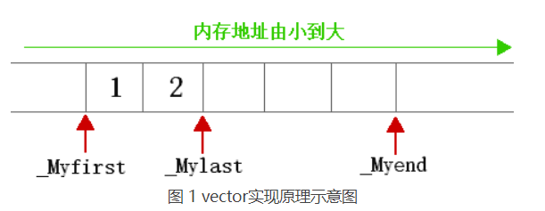
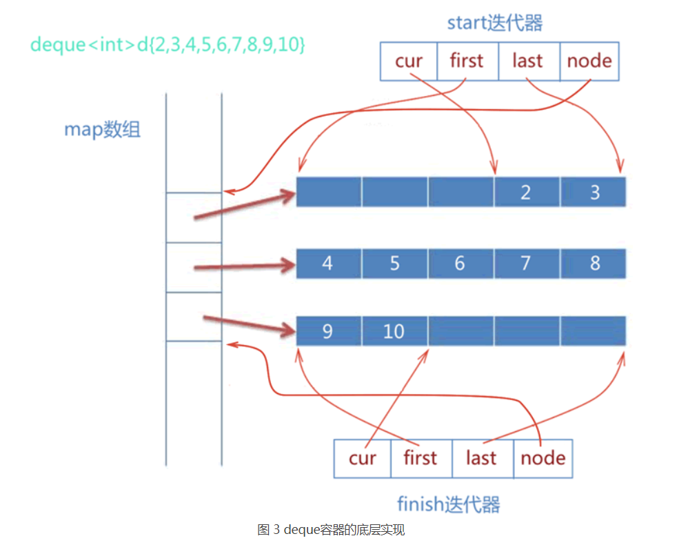
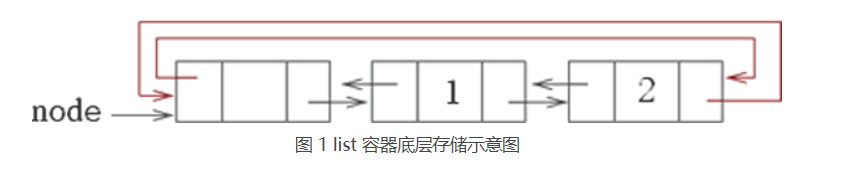
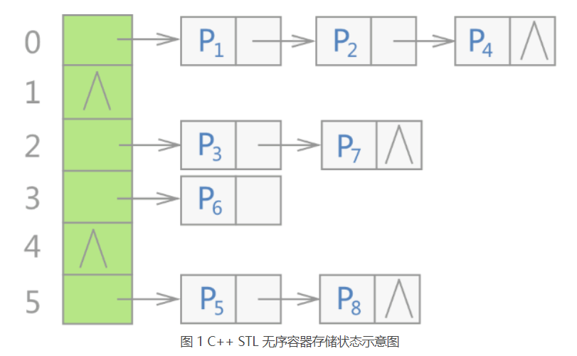
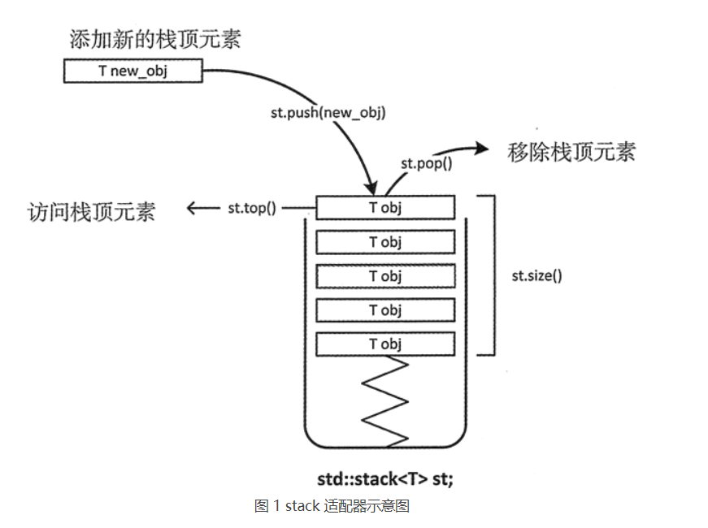
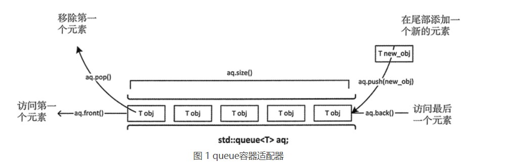
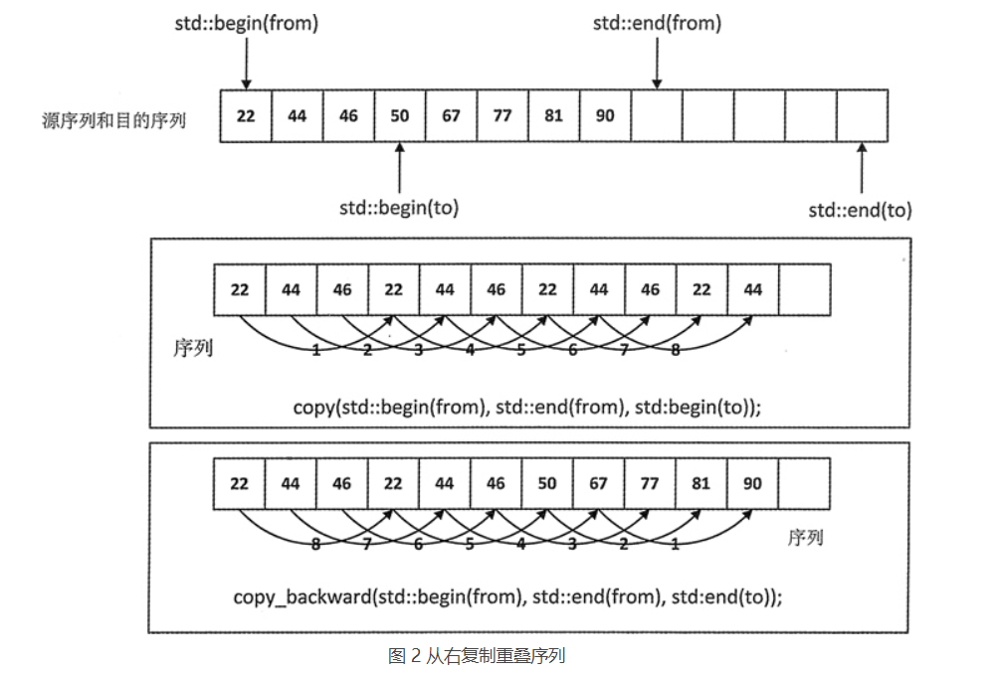

## STL学习笔记

### 1 STL基础（8）

在前人工作的基础上提炼出的常用数据结构和算法

[STL](http://c.biancheng.net/stl/) 是由容器、算法、迭代器、函数对象、适配器、内存分配器这 6 部分构成，其中后面 4 部分是为前 2 部分服务的

| STL的组成  | 含义                                                         |
| ---------- | ------------------------------------------------------------ |
| 容器       | 一些封装[数据结构](http://c.biancheng.net/data_structure/)的模板类，例如 vector 向量容器、list 列表容器等。 |
| 算法       | STL 提供了非常多（大约 100 个）的数据结构算法，它们都被设计成一个个的模板函数，这些算法在 std 命名空间中定义，其中大部分算法都包含在头文件 <algorithm> 中，少部分位于头文件 <numeric> 中。 |
| 迭代器     | 在 [C++](http://c.biancheng.net/cplus/) STL 中，对容器中数据的读和写，是通过迭代器完成的，扮演着容器和算法之间的胶合剂。 |
| 函数对象   | 如果一个类将 () 运算符重载为成员函数，这个类就称为函数对象类，这个类的对象就是函数对象（又称仿函数）。 |
| 适配器     | 可以使一个类的接口（模板的参数）适配成用户指定的形式，从而让原本不能在一起工作的两个类工作在一起。值得一提的是，容器、迭代器和函数都有适配器。 |
| 内存分配器 | 为容器类模板提供自定义的内存申请和释放功能，由于往往只有高级用户才有改变内存分配策略的需求，因此内存分配器对于一般用户来说，并不常用。 |

| <iterator> | <functional> | <vector>  | <deque>  |
| ---------- | ------------ | --------- | -------- |
| <list>     | <queue>      | <stack>   | <set>    |
| <map>      | <algorithm>  | <numeric> | <memory> |
| <utility>  |              |           |          |

### 2 STL序列式容器（31）

不会对存储的元素进行排序，元素排列的顺序取决于存储它们的顺序。

#### 2.1 容器种类

| 容器种类 | 功能                                                         |
| -------- | ------------------------------------------------------------ |
| 序列容器 | 主要包括 vector 向量容器、list 列表容器以及 deque 双端队列容器。之所以被称为序列容器，是因为元素在容器中的位置同元素的值无关，即容器不是排序的。将元素插入容器时，指定在什么位置，元素就会位于什么位置。 |
| 排序容器 | 包括 set 集合容器、multiset多重集合容器、map映射容器以及 multimap 多重映射容器。排序容器中的元素默认是由小到大排序好的，即便是插入元素，元素也会插入到适当位置。所以关联容器在查找时具有非常好的性能。 |
| 哈希容器 | [C++](http://c.biancheng.net/cplus/) 11 新加入 4 种关联式容器，分别是 unordered_set 哈希集合、unordered_multiset 哈希多重集合、unordered_map 哈希映射以及 unordered_multimap 哈希多重映射。和排序容器不同，哈希容器中的元素是未排序的，元素的位置由哈希函数确定。 |

#### 2.2 迭代器

利用泛型技术，将容器和通用算法分离开。

| 迭代器类型 | 特点                        |
| ---------- | --------------------------- |
| 前向       | p++，*p，==，!=，复制，赋值 |
| 双向       | 前向，p--                   |
| 随机方法问 | 双向，p+=i：p[i]            |
| 输入/输出  | 特殊                        |

迭代器类型取决于被迭代容器类型：

| 容器                               | 对应的迭代器类型 |
| ---------------------------------- | ---------------- |
| array                              | 随机访问迭代器   |
| vector                             | 随机访问迭代器   |
| deque                              | 随机访问迭代器   |
| list                               | 双向迭代器       |
| set / multiset                     | 双向迭代器       |
| map / multimap                     | 双向迭代器       |
| forward_list                       | 前向迭代器       |
| unordered_map / unordered_multimap | 前向迭代器       |
| unordered_set / unordered_multiset | 前向迭代器       |
| stack                              | 不支持迭代器     |
| queue                              | 不支持迭代器     |

| 迭代器定义方式             | 具体格式                                   |
| -------------------------- | ------------------------------------------ |
| 正向迭代器（++正向）       | 容器类名::iterator 迭代器名;               |
| 常量正向迭代器（不能修改） | 容器类名::const_iterator 迭代器名;         |
| 反向迭代器                 | 容器类名::reverse_iterator 迭代器名;       |
| 常量反向迭代器             | 容器类名::const_reverse_iterator 迭代器名; |

 array、deque、vector支持以上四种迭代器。

在 C++ 中，数组也是容器。数组的迭代器就是指针，而且是随机访问迭代器。

#### 2.3 序列式容器

| 种类                            | 特点                       |
| ------------------------------- | -------------------------- |
| array<T,N>（数组容器）          | 长度固定，随机访问高效     |
| vector<T>（向量容器）           | 长度可变，尾部插入删除高效 |
| deque<T>（双端队列容器）        | 长度可变，头尾插入删除高效 |
| list<T>（链表容器）             | 插入删除高效               |
| forward_list<T>（正向链表容器） | 更快、更节省内存           |

| 函数成员         | 函数功能                                                     | array<T,N> | vector<T> | deque<T> |
| ---------------- | ------------------------------------------------------------ | ---------- | --------- | -------- |
| begin()          | 返回指向容器中第一个元素的迭代器。                           | 是         | 是        | 是       |
| end()            | 返回指向容器最后一个元素所在位置后一个位置的迭代器，通常和 begin() 结合使用。 | 是         | 是        | 是       |
| rbegin()         | 返回指向最后一个元素的迭代器。                               | 是         | 是        | 是       |
| rend()           | 返回指向第一个元素所在位置前一个位置的迭代器。               | 是         | 是        | 是       |
| cbegin()         | 和 begin() 功能相同，只不过在其基础上，增加了 const 属性，不能用于修改元素。 | 是         | 是        | 是       |
| cend()           | 和 end() 功能相同，只不过在其基础上，增加了 const 属性，不能用于修改元素。 | 是         | 是        | 是       |
| crbegin()        | 和 rbegin() 功能相同，只不过在其基础上，增加了 const 属性，不能用于修改元素。 | 是         | 是        | 是       |
| crend()          | 和 rend() 功能相同，只不过在其基础上，增加了 const 属性，不能用于修改元素。 | 是         | 是        | 是       |
| assign()         | 用新元素替换原有内容。                                       | -          | 是        | 是       |
| operator=()      | 复制同类型容器的元素，或者用初始化列表替换现有内容。         | 是         | 是        | 是       |
| size()           | 返回实际元素个数。                                           | 是         | 是        | 是       |
| max_size()       | 返回元素个数的最大值。这通常是一个很大的值，一般是 232-1，所以我们很少会用到这个函数。 | 是         | 是        | 是       |
| capacity()       | 返回当前容量。                                               | -          | 是        | -        |
| empty()          | 判断容器中是否有元素，若无元素，则返回 true；反之，返回 false。 | 是         | 是        | 是       |
| resize()         | 改变实际元素的个数。                                         | -          | 是        | 是       |
| shrink _to_fit() | 将内存减少到等于当前元素实际所使用的大小。                   | -          | 是        | 是       |
| front()          | 返回第一个元素的引用。                                       | 是         | 是        | 是       |
| back()           | 返回最后一个元素的引用。                                     | 是         | 是        | 是       |
| operator[]()     | 使用索引访问元素。                                           | 是         | 是        | 是       |
| at()             | 使用经过边界检査的索引访问元素。                             | 是         | 是        | 是       |
| push_back()      | 在序列的尾部添加一个元素。                                   | -          | 是        | 是       |
| insert()         | 在指定的位置插入一个或多个元素。                             | -          | 是        | 是       |
| emplace()        | 在指定的位置直接生成一个元素。                               | -          | 是        | 是       |
| emplace_back()   | 在序列尾部生成一个元素。                                     | -          | 是        | 是       |
| pop_back()       | 移出序列尾部的元素。                                         | -          | 是        | 是       |
| erase()          | 移出一个元素或一段元素。                                     | -          | 是        | 是       |
| clear()          | 移出所有的元素，容器大小变为 0。                             | -          | 是        | 是       |
| swap()           | 交换两个容器的所有元素。                                     | 是         | 是        | 是       |
| data()           | 返回指向容器中第一个元素的[指针](http://c.biancheng.net/c/80/)。 | 是         | 是        | -        |

| 函数成员        | 函数功能                                                     | list<T> | forward_list<T> |
| --------------- | ------------------------------------------------------------ | ------- | --------------- |
| begin()         | 返回指向容器中第一个元素的迭代器。                           | 是      | 是              |
| end()           | 返回指向容器最后一个元素所在位置后一个位置的迭代器。         | 是      | 是              |
| rbegin()        | 返回指向最后一个元素的迭代器。                               | 是      | -               |
| rend()          | 返回指向第一个元素所在位置前一个位置的迭代器。               | 是      | -               |
| cbegin()        | 和 begin() 功能相同，只不过在其基础上，增加了 const 属性，不能用于修改元素。 | 是      | 是              |
| before_begin()  | 返回指向第一个元素前一个位置的迭代器。                       | -       | 是              |
| cbefore_begin() | 和 before_begin() 功能相同，只不过在其基础上，增加了 const 属性，即不能用该指针修改元素的值。 | -       | 是              |
| cend()          | 和 end() 功能相同，只不过在其基础上，增加了 const 属性，不能用于修改元素。 | 是      | 是              |
| crbegin()       | 和 rbegin() 功能相同，只不过在其基础上，增加了 const 属性，不能用于修改元素。 | 是      | -               |
| crend()         | 和 rend() 功能相同，只不过在其基础上，增加了 const 属性，不能用于修改元素。 | 是      | -               |
| assign()        | 用新元素替换原有内容。                                       | 是      | 是              |
| operator=()     | 复制同类型容器的元素，或者用初始化列表替换现有内容。         | 是      | 是              |
| size()          | 返回实际元素个数。                                           | 是      | -               |
| max_size()      | 返回元素个数的最大值，这通常是一个很大的值，一般是 232-1，所以我们很少会用到这个函数。 | 是      | 是              |
| resize()        | 改变实际元素的个数。                                         | 是      | 是              |
| empty()         | 判断容器中是否有元素，若无元素，则返回 true；反之，返回 false。 | 是      | 是              |
| front()         | 返回容器中第一个元素的引用。                                 | 是      | 是              |
| back()          | 返回容器中最后一个元素的引用。                               | 是      | -               |
| push_back()     | 在序列的尾部添加一个元素。                                   | 是      | -               |
| push_front()    | 在序列的起始位置添加一个元素。                               | 是      | 是              |
| emplace()       | 在指定位置直接生成一个元素。                                 | 是      | -               |
| emplace_after() | 在指定位置的后面直接生成一个元素。                           | -       | 是              |
| emplace_back()  | 在序列尾部生成一个元素。                                     | 是      | -               |
| cmplacc_front() | 在序列的起始位生成一个元索。                                 | 是      | 是              |
| insert()        | 在指定的位置插入一个或多个元素。                             | 是      | -               |
| insert_after()  | 在指定位置的后面插入一个或多个元素。                         | -       | 是              |
| pop_back()      | 移除序列尾部的元素。                                         | 是      | -               |
| pop_front()     | 移除序列头部的元素。                                         | 是      | 是              |
| reverse()       | 反转容器中某一段的元素。                                     | 是      | 是              |
| erase()         | 移除指定位置的一个元素或一段元素。                           | 是      | -               |
| erase_after()   | 移除指定位置后面的一个元素或一段元素。                       | -       | 是              |
| remove()        | 移除所有和参数匹配的元素。                                   | 是      | 是              |
| remove_if()     | 移除满足一元函数条件的所有元素。                             | 是      | 是              |
| unique()        | 移除所有连续重复的元素。                                     | 是      | 是              |
| clear()         | 移除所有的元素，容器大小变为 0。                             | 是      | 是              |
| swap()          | 交换两个容器的所有元素。                                     | 是      | 是              |
| sort()          | 对元素进行排序。                                             | 是      | 是              |
| merge()         | 合并两个有序容器。                                           | 是      | 是              |
| splice()        | 移动指定位置前面的所有元素到另一个同类型的 list 中。         | 是      | -               |
| splice_after()  | 移动指定位置后面的所有元素到另一个同类型的 list 中。         | -       | 是              |

#### 2.4-2.7 array

- ```c++
  静态数组，线性空间,高效的随机访问
  初始化
  array<double, 10> values;//无初始化
  array<double, 10> values {};//手动初始化
  迭代器
  auto first = values.begin();//array 容器模板类中的 begin() 和 end() 成员函数返回的都是正向迭代器
  auto first = std::begin(values);//使用全局的 begin() 和 end() 函数来从容器中获取迭代器
  访问
  value[3] = 1;
  values.at(3);//获取索引3的元素
  get<3>(values);//array提供get<n>模板函数，获取索引3的元素
  values.data();//首个元素指针
  其他
  values.data();//等同于&values[0]
  value1[0]<value2[0];//判断字典序
  
  C++11添加进来的。
  在存储整个字符串的同时，在其最后放置一个\0作为字符串的结束符。strcpy() 在拷贝字符串的同时，会自动在最后添加\0。
  ```
  

#### 2.8-2.18 vector



- ```c++
  动态数组，线性空间,高效的随机访问
  初始化
  vector<double> values;//空的，没有分配空间
  vector<int> values {2, 3, 5, 7, 11, 13, 17, 19};//初始化元素值
  vector<double> values1(20，1.0);//初始化元素个数，值为1.0，默认0
  vector<char>value2(value1);//用其他vector初始化
  vector<int>values(array, array+2);//用指针初始化
  vector<int>value2(begin(value1),begin(value1)+3);//用迭代器初始化
  values.reserve(20);//分配20个元素空间，不影响存储的元素
  随机迭代器
  访问
  values[0]
  values.at(0)
  values.front()
  values.back()//区别于begin(),end()返回迭代器
  values.data()//首个元素指针
  values.size()//
  for (auto&& value : values)//基于范围的循环
  for (auto first = values.begin(); first < values.end(); ++first)  //迭代器  
  添加和删除
  push_back()//调用移动构造函数（优先）或者拷贝构造函数，然后调用构造函数
  pop_back()
  emplace_back()// 直接调用构造函数
  insert()//可以插入多个元素,
      insert(pos,elem);
  	insert(pos,n,elem);
  	insert(pos,first,last);
  	insert(pos,initlist);
  emplace()//每次只能插入一个元素。
  erase()//size-1
  remove()//不变
  clear()//容量=0
      
  begin() 和 end()全局函数，传入容器和数组的时候分别返回迭代器和指针，swap(x , y) 非成员函数
  空的 vector 容器，begin() 和 end() 成员函数返回的迭代器是相等的
      
  reserve()会导致迭代器失效
  reserve()对应capacity()，利用reserve()可以减少申请空间的次数，高效的增加元素
  resize()改变容器内元素，reserve()改变容器容量
  当vector需要扩容，2倍
  先reserve()扩容，再shrink_to_fit() 提高效率
  
  vector<int>(myvector).swap(myvector);//拷贝构造一个新的，交换
  vector<bool>不是容器，bool用比特位存储，不能用指针，需要代理对象， deque<bool> 或者 bitset 来替代 
  ```

#### 2.19-2.23 deque



- ```c++
  非线性空间(double-ended queue)，易用性和效率的折中
  初始化
  deque<int> d;
  deque<int> d(10);
  deque<int> d(10, 5);
  deque<int> d1(5);deque<int> d1(5);
  deque<int>d(arr.begin()+2, arr.end());
  随机迭代器
  访问
  d[1]
  d.at(1)
  d.front()
  d.back() 
  data(),无，非线性空间，用指针很危险！
  auto first = d.begin(); while (first < d.end())   
  添加和删除
  intsert()//用法比较多
  push_back（front），pop_back（front）emplace_back（front） emplace（insert） erase clear
  ```

#### 2.24-2.31 list(forward_list)



- ```c++
  非线性空间，通过指针维护，任意位置插入/删除元素高效，随机访问低效
  初始化
  list<int> values;
  list<int> values(10);
  values(10, 5);
  value1(10);value2(value1);
  values(arr.begin()+2, arr.end());
  双向迭代器
  list模板类在构建容器时，会刻意在容器链表中添加一个空白节点，并作为 list 链表的首个节点（又称头节点）。
  访问
  front()
  back() 
  assign()
  添加
  push_front(front) emplace_front(back) emplace(insert) splice()
  splice (iterator position, list& x);
  splice (iterator position, list& x, iterator i);
  splice (iterator position, list& x, iterator first, iterator last);
  删除
  pop_front(front)
  erase(位置)
      erase (iterator position);
  	erase (iterator first, iterator last);
      clear remove(值)  
  unique(相邻重复)    
      //二元谓词函数
      bool demo(double first, double second)
      {
          return (int(first) == int(second));
      }
      //demo 为二元谓词函数，是我们自定义的去重规则
      mylist.unique(demo);
  remove_if
  	mylist.remove_if([](int value) {return (value < 10); }); //自定义谓词函数
  forward_list牺牲便利，提高效率
      distance(begin(list), end(list));//计算size
  	advance(list, 2);//移动
  ```

### 3 STL关联式容器（18）

#### 3.1 介绍

| 关联式容器名称 | 特点                                                         |
| :------------- | :----------------------------------------------------------- |
| map            | 使用该容器存储的数据，其各个元素的键必须是唯一的（即不能重复），该容器会根据各元素键的大小，默认进行升序排序（调用 std::less<T>）。 |
| set            | 使用该容器存储的数据，各个元素键和值完全相同，且各个元素的值不能重复（保证了各元素键的唯一性）。该容器会自动根据各个元素的键（其实也就是元素值）的大小进行升序排序（调用 std::less<T>）。 |
| multimap       | 和 map 容器唯一的不同在于，multimap 容器中存储元素的键可以重复。 |
| multiset       | 和 set 容器唯一的不同在于，multiset 容器中存储元素的值可以重复（一旦值重复，则意味着键也是重复的） |

- ```c++
  红黑树实现。快速查找、读取或者删除，插入比序列式容器效率高。
  ```

#### 3.2 pair

- ```c++
  pair <string, double> pair1;//默认构造函数
  pair2("string1","string2"); 
  pair3(pair2);//拷贝构造函数
  pair4(make_pair("string1", "string2"));pair4 = make_pair("string1", "string2");//移动构造函数
  pair5(string("string1"), string("string2"));  //右值引用
  pair1.first = "string1";
  pair1.second = "string2";
  <、<=、>、>=、==、!= //first相等比second
  pair1.swap(pair2);
  ```

#### 3.3-3.10 map

| 成员方法         | 功能                                                         |
| ---------------- | ------------------------------------------------------------ |
| begin()          | 返回指向容器中第一个（注意，是已排好序的第一个）键值对的双向迭代器。如果 map 容器用 const 限定，则该方法返回的是 const 类型的双向迭代器。 |
| end()            | 返回指向容器最后一个元素（注意，是已排好序的最后一个）所在位置后一个位置的双向迭代器，通常和 begin() 结合使用。如果 map 容器用 const 限定，则该方法返回的是 const 类型的双向迭代器。 |
| rbegin()         | 返回指向最后一个（注意，是已排好序的最后一个）元素的反向双向迭代器。如果 map 容器用 const 限定，则该方法返回的是 const 类型的反向双向迭代器。 |
| rend()           | 返回指向第一个（注意，是已排好序的第一个）元素所在位置前一个位置的反向双向迭代器。如果 map 容器用 const 限定，则该方法返回的是 const 类型的反向双向迭代器。 |
| cbegin()         | 和 begin() 功能相同，只不过在其基础上，增加了 const 属性，不能用于修改容器内存储的键值对。 |
| cend()           | 和 end() 功能相同，只不过在其基础上，增加了 const 属性，不能用于修改容器内存储的键值对。 |
| crbegin()        | 和 rbegin() 功能相同，只不过在其基础上，增加了 const 属性，不能用于修改容器内存储的键值对。 |
| crend()          | 和 rend() 功能相同，只不过在其基础上，增加了 const 属性，不能用于修改容器内存储的键值对。 |
| find(key)        | 在 map 容器中查找键为 key 的键值对，如果成功找到，则返回指向该键值对的双向迭代器；反之，则返回和 end() 方法一样的迭代器。另外，如果 map 容器用 const 限定，则该方法返回的是 const 类型的双向迭代器。 |
| lower_bound(key) | 返回一个指向当前 map 容器中第一个大于或等于 key 的键值对的双向迭代器。如果 map 容器用 const 限定，则该方法返回的是 const 类型的双向迭代器。 |
| upper_bound(key) | 返回一个指向当前 map 容器中第一个大于 key 的键值对的迭代器。如果 map 容器用 const 限定，则该方法返回的是 const 类型的双向迭代器。 |
| equal_range(key) | 该方法返回一个 pair 对象（包含 2 个双向迭代器），其中 pair.first 和 lower_bound() 方法的返回值等价，pair.second 和 upper_bound() 方法的返回值等价。也就是说，该方法将返回一个范围，该范围中包含的键为 key 的键值对（map 容器键值对唯一，因此该范围最多包含一个键值对）。 |
| empty()          | 若容器为空，则返回 true；否则 false。                        |
| size()           | 返回当前 map 容器中存有键值对的个数。                        |
| max_size()       | 返回 map 容器所能容纳键值对的最大个数，不同的操作系统，其返回值亦不相同。 |
| operator[]       | map容器重载了 [] 运算符，只要知道 map 容器中某个键值对的键的值，就可以向获取数组中元素那样，通过键直接获取对应的值。 |
| at(key)          | 找到 map 容器中 key 键对应的值，如果找不到，该函数会引发 out_of_range 异常。 |
| insert()         | 向 map 容器中插入键值对。                                    |
| erase()          | 删除 map 容器指定位置、指定键（key）值或者指定区域内的键值对。后续章节还会对该方法做重点讲解。 |
| swap()           | 交换 2 个 map 容器中存储的键值对，这意味着，操作的 2 个键值对的类型必须相同。 |
| clear()          | 清空 map 容器中所有的键值对，即使 map 容器的 size() 为 0。   |
| emplace()        | 在当前 map 容器中的指定位置处构造新键值对。其效果和插入键值对一样，但效率更高。 |
| emplace_hint()   | 在本质上和 emplace() 在 map 容器中构造新键值对的方式是一样的，不同之处在于，使用者必须为该方法提供一个指示键值对生成位置的迭代器，并作为该方法的第一个参数。 |
| count(key)       | 在当前 map 容器中，查找键为 key 的键值对的个数并返回。注意，由于 map 容器中各键值对的键的值是唯一的，因此该函数的返回值最大为 1。 |

| 迭代器成员方法   | 功能                                                         |
| ---------------- | ------------------------------------------------------------ |
| find(key)        | 在 map 容器中查找键为 key 的键值对，如果成功找到，则返回指向该键值对的双向迭代器；反之，则返回和 end() 方法一样的迭代器。另外，如果 map 容器用 const 限定，则该方法返回的是 const 类型的双向迭代器。 |
| lower_bound(key) | 返回一个指向当前 map 容器中第一个大于或等于 key 的键值对的双向迭代器。如果 map 容器用 const 限定，则该方法返回的是 const 类型的双向迭代器。 |
| upper_bound(key) | 返回一个指向当前 map 容器中第一个大于 key 的键值对的迭代器。如果 map 容器用 const 限定，则该方法返回的是 const 类型的双向迭代器。 |
| equal_range(key) | 该方法返回一个 pair 对象（包含 2 个双向迭代器），其中 pair.first 和 lower_bound() 方法的返回值等价，pair.second 和 upper_bound() 方法的返回值等价。也就是说，该方法将返回一个范围，该范围中包含的键为 key 的键值对（map 容器键值对唯一，因此该范围最多包含一个键值对）。 |

- ```c++
  键的值既不能重复也不能被修改。
  template < class Key,                                     // 指定键（key）的类型
             class T,                                       // 指定值（value）的类型
             class Compare = less<Key>,                     // 指定排序规则
             class Alloc = allocator<pair<const Key,T> >    // 指定分配器对象的类型
             > class map;
  map<string, int>myMap;
  map<string, int>myMap{ {"string1",10},{"string2",20} };
  map<string, int>newMap(myMap);
  map<string, int>newMap(++myMap.begin(), myMap.end());
  map<string, int, less<string> >myMap{ {"string1",10},{"string2",20} };
  cValue = myMap["string1"];//当没有[string1]键时，创建并初始化0或" "
  myMap.at("string1");//异常检查
  insert()
      insert (const value_type& val);//直接传递，返回pair.first插入位置迭代器，second为bool
  	insert (P&& val);//右值引用传递
  	insert (const_iterator position, const value_type& val);//直接传递，返回迭代器
  	insert (const_iterator position, P&& val);//右值引用
  	insert (InputIterator first, InputIterator last);
  	insert ({val1, val2, ...});
  添加新键值对时，insert();更新键值对的值时，operator[ ];//mymap.operator[] mymap[]等价
  mymap.emplace("string1",10);
  mymap.emplace_hint(mymap.begin(),"string1",10);
  emplace（）接口省略了移动构造或者拷贝构造函数，效率比insert()高
      
  multimap 未提供 at() 成员方法，也没有重载 [] 运算符。 
  ```

#### 3.11-3.16 set

| 成员方法         | 功能                                                         |
| ---------------- | ------------------------------------------------------------ |
| begin()          | 返回指向容器中第一个（注意，是已排好序的第一个）元素的双向迭代器。如果 set 容器用 const 限定，则该方法返回的是 const 类型的双向迭代器。 |
| end()            | 返回指向容器最后一个元素（注意，是已排好序的最后一个）所在位置后一个位置的双向迭代器，通常和 begin() 结合使用。如果 set 容器用 const 限定，则该方法返回的是 const 类型的双向迭代器。 |
| rbegin()         | 返回指向最后一个（注意，是已排好序的最后一个）元素的反向双向迭代器。如果 set 容器用 const 限定，则该方法返回的是 const 类型的反向双向迭代器。 |
| rend()           | 返回指向第一个（注意，是已排好序的第一个）元素所在位置前一个位置的反向双向迭代器。如果 set 容器用 const 限定，则该方法返回的是 const 类型的反向双向迭代器。 |
| cbegin()         | 和 begin() 功能相同，只不过在其基础上，增加了 const 属性，不能用于修改容器内存储的元素值。 |
| cend()           | 和 end() 功能相同，只不过在其基础上，增加了 const 属性，不能用于修改容器内存储的元素值。 |
| crbegin()        | 和 rbegin() 功能相同，只不过在其基础上，增加了 const 属性，不能用于修改容器内存储的元素值。 |
| crend()          | 和 rend() 功能相同，只不过在其基础上，增加了 const 属性，不能用于修改容器内存储的元素值。 |
| find(val)        | 在 set 容器中查找值为 val 的元素，如果成功找到，则返回指向该元素的双向迭代器；反之，则返回和 end() 方法一样的迭代器。另外，如果 set 容器用 const 限定，则该方法返回的是 const 类型的双向迭代器。 |
| lower_bound(val) | 返回一个指向当前 set 容器中第一个大于或等于 val 的元素的双向迭代器。如果 set 容器用 const 限定，则该方法返回的是 const 类型的双向迭代器。 |
| upper_bound(val) | 返回一个指向当前 set 容器中第一个大于 val 的元素的迭代器。如果 set 容器用 const 限定，则该方法返回的是 const 类型的双向迭代器。 |
| equal_range(val) | 该方法返回一个 pair 对象（包含 2 个双向迭代器），其中 pair.first 和 lower_bound() 方法的返回值等价，pair.second 和 upper_bound() 方法的返回值等价。也就是说，该方法将返回一个范围，该范围中包含的值为 val 的元素（set 容器中各个元素是唯一的，因此该范围最多包含一个元素）。 |
| empty()          | 若容器为空，则返回 true；否则 false。                        |
| size()           | 返回当前 set 容器中存有元素的个数。                          |
| max_size()       | 返回 set 容器所能容纳元素的最大个数，不同的操作系统，其返回值亦不相同。 |
| insert()         | 向 set 容器中插入元素。                                      |
| erase()          | 删除 set 容器中存储的元素。                                  |
| swap()           | 交换 2 个 set 容器中存储的所有元素。这意味着，操作的 2 个 set 容器的类型必须相同。 |
| clear()          | 清空 set 容器中所有的元素，即令 set 容器的 size() 为 0。     |
| emplace()        | 在当前 set 容器中的指定位置直接构造新元素。其效果和 insert() 一样，但效率更高。 |
| emplace_hint()   | 在本质上和 emplace() 在 set 容器中构造新元素的方式是一样的，不同之处在于，使用者必须为该方法提供一个指示新元素生成位置的迭代器，并作为该方法的第一个参数。 |
| count(val)       | 在当前 set 容器中，查找值为 val 的元素的个数，并返回。注意，由于 set 容器中各元素的值是唯一的，因此该函数的返回值最大为 1。 |

| 成员方法         | 功能                                                         |
| ---------------- | ------------------------------------------------------------ |
| find(val)        | 在 set 容器中查找值为 val 的元素，如果成功找到，则返回指向该元素的双向迭代器；反之，则返回和 end() 方法一样的迭代器。另外，如果 set 容器用 const 限定，则该方法返回的是 const 类型的双向迭代器。 |
| lower_bound(val) | 返回一个指向当前 set 容器中第一个大于或等于 val 的元素的双向迭代器。如果 set 容器用 const 限定，则该方法返回的是 const 类型的双向迭代器。 |
| upper_bound(val) | 返回一个指向当前 set 容器中第一个大于 val 的元素的迭代器。如果 set 容器用 const 限定，则该方法返回的是 const 类型的双向迭代器。 |
| equal_range(val) | 该方法返回一个 pair 对象（包含 2 个双向迭代器），其中 pair.first 和 lower_bound() 方法的返回值等价，pair.second 和 upper_bound() 方法的返回值等价。也就是说，该方法将返回一个范围，该范围中包含的值为 val 的元素（set 容器中各个元素是唯一的，因此该范围最多包含一个元素）。 |

- ```c++
  template < class T,                        // 键 key 和值 value 的类型
             class Compare = less<T>,        // 指定 set 容器内部的排序规则
             class Alloc = allocator<T>      // 指定分配器对象的类型
             > class set;
  set<string> myset;
  set<string> myset{"string1","string2"};
  set<string> copyset(myset);
  set<string> copyset(++myset.begin(), myset.end());
  迭代器不能修改键（值）
  insert()
      insert (const value_type& val);
  	insert (value_type&& val);
  	insert (const_iterator position, const value_type& val);
  	insert (const_iterator position, value_type&& val);
  	insert (InputIterator first, InputIterator last);// [first,last) 
   	insert ( {E1, E2,...,En} );
  insert() 方法中指定新元素插入的位置，并不一定就是该元素最终所处的位置。
  myset.emplace("string1");
  myset.emplace_hint(myset.begin(), "string1");
  erase()
  myset.erase(2);
  myset.erase(myset.begin()); 
  myset.erase(myset.begin(), --myset.end());
  
  multiset成员函数和set完全一样
  ```

#### 3.17 自定义容器排序规则

| 排序规则              | 功能（都是重载operator()实现）                               |
| --------------------- | ------------------------------------------------------------ |
| std::less<T>          | 底层采用 < 运算符实现升序排序，各关联式容器默认采用的排序规则。 |
| std::greater<T>       | 底层采用 > 运算符实现降序排序，同样适用于各个关联式容器。    |
| std::less_equal<T>    | 底层采用 <= 运算符实现升序排序，多用于 multimap 和 multiset 容器。 |
| std::greater_equal<T> | 底层采用 >= 运算符实现降序排序，多用于 multimap 和 multiset 容器。 |

- ```c++
  函数对象：
  //定义函数对象类
  class cmp {
  public:
      //重载 () 运算符
      bool operator ()(const string &a,const string &b) {
          //按照字符串的长度，做升序排序(即存储的字符串从短到长)
          return  (a.length() < b.length());
      }
  };
  
  //定义函数对象模板类
  template <typename T>
  class cmp {
  public:
      //重载 () 运算符
      bool operator ()(const T &a, const T &b) {
          //按照值的大小，做升序排序
          return  a < b;
      }
  };
  
  //定义函数对象类
  struct cmp {
      //重载 () 运算符
      bool operator ()(const string &a, const string &b) {
          //按照字符串的长度，做升序排序(即存储的字符串从短到长)
          return  (a.length() < b.length());
      }
  };
  
  int main() {
      //创建 set 容器，并使用自定义的 cmp 排序规则
      std::set<string, cmp>myset{"string1","string2"};
      //输出容器中存储的元素
      for (auto iter = myset.begin(); iter != myset.end(); ++iter) {
              cout << *iter << endl;
      }
      return 0;
  }
  ```

- ```c++
  重载关系运算符
  全局函数
  //重载 < 运算符，参数必须都为 const 类型
  bool operator <(const myString &stra, const myString & strb) {
      //以字符串的长度为标准比较大小
      return stra.getStr().length() < strb.getStr().length();
  }
  成员函数
  bool operator <(const myString & tempStr) const {//函数，参数必须为 const 类型
      //以字符串的长度为标准比较大小
      return this->str.length() < tempStr.str.length();
  }
  友元函数
  //类中友元函数的定义
  friend bool operator <(const myString &a, const myString &b);
  //类外部友元函数的具体实现
  bool operator <(const myString &stra, const myString &strb) {
      //以字符串的长度为标准比较大小
      return stra.str.length() < strb.str.length();
  }
  ```

#### 3.18 修改键值

- ```c++
  键
  map和multimap 键值被const修饰 不能修改！
  set和muilty 键值没有被const修饰 理论上可以 但不要
  
  元素（非键部分）
  set<student>::iterator iter = mymap.begin();
  (*iter).setname("xiaoming");//不能修改，operator*返回const T&，
  const_cast<student&>(*iter).setname("xiaoming");//可以，const_cast去掉指针或者引用的 const 
  ```

  

### 4 STL无序关联式容器（13）

#### 4.1 介绍

- ```c++
  键查找值高效，遍历不如关联式容器。
  底层采用哈希表的存储结构
      将数据存到连续内存中
  	位置冲突时，开链法
  ```

#### 4.2-4.11 unordered_map

| 成员方法           | 功能                                                         |
| ------------------ | ------------------------------------------------------------ |
| begin()            | 返回指向容器中第一个键值对的正向迭代器。                     |
| end()              | 返回指向容器中最后一个键值对之后位置的正向迭代器。           |
| cbegin()           | 和 begin() 功能相同，只不过在其基础上增加了 const 属性，即该方法返回的迭代器不能用于修改容器内存储的键值对。 |
| cend()             | 和 end() 功能相同，只不过在其基础上，增加了 const 属性，即该方法返回的迭代器不能用于修改容器内存储的键值对。 |
| empty()            | 若容器为空，则返回 true；否则 false。                        |
| size()             | 返回当前容器中存有键值对的个数。                             |
| max_size()         | 返回容器所能容纳键值对的最大个数，不同的操作系统，其返回值亦不相同。 |
| operator[key]      | 该模板类中重载了 [] 运算符，其功能是可以向访问数组中元素那样，只要给定某个键值对的键 key，就可以获取该键对应的值。注意，如果当前容器中没有以 key 为键的键值对，则其会使用该键向当前容器中插入一个新键值对。 |
| at(key)            | 返回容器中存储的键 key 对应的值，如果 key 不存在，则会抛出 out_of_range 异常。 |
| find(key)          | 查找以 key 为键的键值对，如果找到，则返回一个指向该键值对的正向迭代器；反之，则返回一个指向容器中最后一个键值对之后位置的迭代器（如果 end() 方法返回的迭代器）。 |
| count(key)         | 在容器中查找以 key 键的键值对的个数。                        |
| equal_range(key)   | 返回一个 pair 对象，其包含 2 个迭代器，用于表明当前容器中键为 key 的键值对所在的范围。 |
| emplace()          | 向容器中添加新键值对，效率比 insert() 方法高。               |
| emplace_hint()     | 向容器中添加新键值对，效率比 insert() 方法高。               |
| insert()           | 向容器中添加新键值对。                                       |
| erase()            | 删除指定键值对。                                             |
| clear()            | 清空容器，即删除容器中存储的所有键值对。                     |
| swap()             | 交换 2 个 unordered_map 容器存储的键值对，前提是必须保证这 2 个容器的类型完全相等。 |
| bucket_count()     | 返回当前容器底层存储键值对时，使用桶（一个线性链表代表一个桶）的数量。 |
| max_bucket_count() | 返回当前系统中，unordered_map 容器底层最多可以使用多少桶。   |
| bucket_size(n)     | 返回第 n 个桶中存储键值对的数量。                            |
| bucket(key)        | 返回以 key 为键的键值对所在桶的编号。                        |
| load_factor()      | 返回 unordered_map 容器中当前的负载因子。负载因子，指的是的当前容器中存储键值对的数量（size()）和使用桶数（bucket_count()）的比值，即 load_factor() = size() / bucket_count()。 |
| max_load_factor()  | 返回或者设置当前 unordered_map 容器的负载因子。              |
| rehash(n)          | 将当前容器底层使用桶的数量设置为 n。                         |
| reserve()          | 将存储桶的数量（也就是 bucket_count() 方法的返回值）设置为至少容纳count个元（不超过最大负载因子）所需的数量，并重新整理容器。 |
| hash_function()    | 返回当前容器使用的哈希函数对象。                             |

- ```c++
  template < class Key,                        //键值对中键的类型
             class T,                          //键值对中值的类型
             class Hash = hash<Key>,           //容器内部存储键值对所用的哈希函数
             class Pred = equal_to<Key>,       //判断各个键值对键相同的规则
             class Alloc = allocator< pair<const Key,T> >  // 指定分配器对象的类型
             > class unordered_map;
  ```

| 参数                 | 含义                                                         |
| -------------------- | ------------------------------------------------------------ |
| <key,T>              | 前 2 个参数分别用于确定键值对中键和值的类型，也就是存储键值对的类型。 |
| Hash = hash<Key>     | 用于指明容器在存储各个键值对时要使用的哈希函数，默认使用 STL 标准库提供的 hash<key> 哈希函数。注意，默认哈希函数只适用于基本数据类型（包括 string 类型），而不适用于自定义的结构体或者类。 |
| Pred = equal_to<Key> | 要知道，unordered_map 容器中存储的各个键值对的键是不能相等的，而判断是否相等的规则，就由此参数指定。默认情况下，使用 STL 标准库中提供的 equal_to<key> 规则，该规则仅支持可直接用 == 运算符做比较的数据类型。 |

```c++
unordered_map<string, string> umap;
unordered_map<string, string> umap{ {"key1","string1"},{"key2","string2"} };//} }中间要有空格，不然报错
unordered_map<string, string> umap2(umap);
unordered_map<string, string> umap2(retUmap());//移动构造
unordered_map<string, string> umap2(++umap.begin(),umap.end());
```




- ```c++
  连续空间用来存储链表头节点，其中每个链表称为桶，编号i从0开始。i=H(key)%n
  负载因子 = 容器存储的总键值对 / 桶数,查询效率影响因子。
  最大负载因子为1.0，超过则增加桶数（翻倍），重新哈希。可能导致迭代器失效。
  空容器默认8个桶    
  ```

  | 成员方法           | 功能                                                         |
  | ------------------ | ------------------------------------------------------------ |
  | bucket_count()     | 返回当前容器底层存储键值对时，使用桶的数量。                 |
  | max_bucket_count() | 返回当前系统中，unordered_map 容器底层最多可以使用多少个桶。 |
  | bucket_size(n)     | 返回第 n 个桶中存储键值对的数量。                            |
  | bucket(key)        | 返回以 key 为键的键值对所在桶的编号。                        |
  | load_factor()      | 返回 unordered_map 容器中当前的负载因子。                    |
  | max_load_factor()  | 返回或者设置当前 unordered_map 容器的最大负载因子。          |
  | rehash(n)          | 尝试重新调整桶的数量为等于或大于 n 的值。如果 n 大于当前容器使用的桶数，则该方法会是容器重新哈希，该容器新的桶数将等于或大于 n。反之，如果 n 的值小于当前容器使用的桶数，则调用此方法可能没有任何作用。 |
  | reserve(n)         | 将容器使用的桶数（bucket_count() 方法的返回值）设置为最适合存储 n 个元素的桶数。 |
  | hash_function()    | 返回当前容器使用的哈希函数对象。                             |

| 迭代器成员方法   | 功能                                                         |
| ---------------- | ------------------------------------------------------------ |
| begin()          | 返回指向容器中第一个键值对的正向迭代器。                     |
| end()            | 返回指向容器中最后一个键值对之后位置的正向迭代器。           |
| cbegin()         | 和 begin() 功能相同，只不过在其基础上增加了 const 属性，即该方法返回的迭代器不能用于修改容器内存储的键值对。 |
| cend()           | 和 end() 功能相同，只不过在其基础上，增加了 const 属性，即该方法返回的迭代器不能用于修改容器内存储的键值对。 |
| find(key)        | 查找以 key 为键的键值对，如果找到，则返回一个指向该键值对的正向迭代器；反之，则返回一个指向容器中最后一个键值对之后位置的迭代器（如果 end() 方法返回的迭代器）。 |
| equal_range(key) | 返回一个 pair 对象，其包含 2 个迭代器，用于表明当前容器中键为 key 的键值对所在的范围。 |

- ```
  初始化
  迭代器
  insert()
  emplace()
  erase()	clear()
  同map
  
  unordered_map 
      键相等的键值对被哈希到同一个桶。
      没有重载[]运算符，也没有提供at()成员方法。
  unordered_set 
  	没有重载[]运算符，也没有提供at()成员方法。
  unordered_multiset
  	没有重载[]运算符，也没有提供at()成员方法。
  ```

#### 4.12 自定义hash和比较规则

- ```c++
  1.hash函数
      函数对象
  class hash_fun {
  public:
      int operator()(const Person &A) const {
          return A.getAge();
      }
  };
  2.比较规则
  	重载"=="运算符
  bool operator==(const Person &A, const Person &B) {
      return (A.getAge() == B.getAge());
  }
  	函数对象
  class mycmp {
  public:
      bool operator()(const Person &A, const Person &B) const {
          return (A.getName() == B.getName()) && (A.getAge() == B.getAge());
      }
  };
  ```

#### 4.13 容器选择

- ```
  插入，删除，搜搜，迭代器种类，数据类型，顺序
  ```

### 5 STL容器适配器（8）

#### 5.1 介绍

封装了序列容器的类模板：stack(deque)，queue(deque)，priority_queue(vector)。

简化公共接口。

| 容器适配器     | 基础容器筛选条件                                             | 默认使用的基础容器 |
| -------------- | ------------------------------------------------------------ | ------------------ |
| stack          | 需包含以下成员函数：empty()，size()，back()，push_back()，pop_back()。可选的基础容器有 vector、deque、list。 | deque              |
| queue          | 需包含以下成员函数：empty()，size()，front()，back()，push_back()，pop_front()。可选的基础容器有 deque、list。 | deque              |
| priority_queue | 需包含以下成员函数：empty()，size()，front()，push_back()，pop_back()。可选的基础容器有vector、deque。 | vector             |

#### 5.2-5.3 stack(计算器)

| 成员函数                     | 功能                                                         |
| ---------------------------- | ------------------------------------------------------------ |
| empty()                      | 当 stack 栈中没有元素时，该成员函数返回 true；反之，返回 false。 |
| size()                       | 返回 stack 栈中存储元素的个数。                              |
| top()                        | 返回一个栈顶元素的引用，类型为 T&。如果栈为空，程序会报错。  |
| push(const T& val)           | 先复制 val，再将 val 副本压入栈顶。这是通过调用底层容器的 push_back() 函数完成的。 |
| push(T&& obj)                | 以移动元素的方式将其压入栈顶。这是通过调用底层容器的有右值引用参数的 push_back() 函数完成的。 |
| pop()                        | 弹出栈顶元素。                                               |
| emplace(arg...)              | arg... 可以是一个参数，也可以是多个参数，但它们都只用于构造一个对象，并在栈顶直接生成该对象，作为新的栈顶元素。 |
| swap(stack<T> & other_stack) | 将两个 stack 适配器中的元素进行互换，需要注意的是，进行互换的 2 个 stack 适配器中存储的元素类型以及底层采用的基础容器类型，都必须相同。 |



- ```c++
  stack<int> my_stack;
  list<int> values {1, 2, 3};
  stack<string, list<int>> my_stack;//list基础容器的stack适配器
  stack<int,list<int>> my_stack (values);//用list初始化stack
  stack<int,list<int>> my_stack1 (my_stack);
  stack<int,list<int>> my_stack1 = my_stack;//和基础容易不同
  没有迭代器
  ```

- ```c++
  stack实现计算器
  #include <iostream>
  #include <cmath>       // pow()
  #include <stack>       // stack<T>
  #include <algorithm>   // remove()
  #include <stdexcept>   // runtime_error
  #include <string>      // string
  using std::string;
  
  // 返回运算符的优先级，值越大，优先级越高
  inline size_t precedence(const char op)
  {
      if (op == '+' || op == '-')
          return 1;
      if (op == '*' || op == '/')
          return 2;
      if (op == '^')
          return 3;
      throw std::runtime_error{ string {"表达中包含无效的运算符"} +op };
  }
  
  // 计算
  double execute(std::stack<char>& ops, std::stack<double>& operands)
  {
      double result{};
      double rhs{ operands.top() }; // 得到右操作数
      operands.pop();                                   
      double lhs{ operands.top() }; // 得到做操作数
      operands.pop();                                    
  
      switch (ops.top()) // 根据两个操作数之间的运算符，执行相应计算
      {
      case '+':
          result = lhs + rhs;
          break;
      case '-':
          result = lhs - rhs;
          break;
      case '*':
          result = lhs * rhs;
          break;
      case '/':
          result = lhs / rhs;
          break;
      case '^':
          result = std::pow(lhs, rhs);
          break;
      default:
          throw std::runtime_error{ string{"invalid operator: "} +ops.top() };
      }
      ops.pop(); //计算完成后，该运算符要弹栈
      operands.push(result);//将新计算出来的结果入栈
      return result;
  }
  
  int main()
  {
      std::stack<double> operands; //存储表达式中的数字
      std::stack<char> operators; //存储表达式中的运算符，栈顶优先级最高，优先级递减
      string exp;  //接受用户输入的表达式文本
      try
      {
          while (true)
          {
              std::cout << "输入表达式(按Enter结束):" << std::endl;
              std::getline(std::cin, exp, '\n');
              if (exp.empty()) break;
  
              //移除用户输入表达式中包含的无用的空格
              exp.erase(std::remove(std::begin(exp), std::end(exp), ' '), std::end(exp));
  
              size_t index{};
  
              //每个表达式必须以数字开头,index表示该数字的位数
              operands.push(std::stod(exp, &index)); // 将表达式中第一个数字进栈
              std::cout << index << std::endl;
              while (true)
              {
                  operators.push(exp[index++]); // 将运算符进栈
  
                  size_t i{};
                  operands.push(std::stod(exp.substr(index), &i));  //将运算符后的数字也进栈,并将数字的位数赋值给 i。
                  index += i;  //更新 index
  
                  if (index == exp.length()) //表达式遍历完                 
                  {
                      while (!operators.empty())  //如果 operators不为空，表示还没有计算完
                          execute(operators, operands);
                      break;
                  }
                  //如果表达式还未遍历完，但子表达式中的运算符优先级比其后面的运算符优先级大，就先计算当前的子表达式的值
                  while (!operators.empty() && precedence(exp[index]) <= precedence(operators.top()))
                      execute(operators, operands);
              }
              std::cout << "result = " << operands.top() << std::endl;
          }
      }
      catch (const std::exception& e)//捕获异常
      {
          std::cerr << e.what() << std::endl;
      }
      std::cout << "计算结束" << std::endl;
      return 0;
  }
  ```

#### 5.4-5.5 queue(模拟超市结算)

| 成员函数                    | 功能                                                         |
| --------------------------- | ------------------------------------------------------------ |
| empty()                     | 如果 queue 中没有元素的话，返回 true。                       |
| size()                      | 返回 queue 中元素的个数。                                    |
| front()                     | 返回 queue 中第一个元素的引用。如果 queue 是常量，就返回一个常引用；如果 queue 为空，返回值是未定义的。 |
| back()                      | 返回 queue 中最后一个元素的引用。如果 queue 是常量，就返回一个常引用；如果 queue 为空，返回值是未定义的。 |
| push(const T& obj)          | 在 queue 的尾部添加一个元素的副本。这是通过调用底层容器的成员函数 push_back() 来完成的。 |
| emplace()                   | 在 queue 的尾部直接添加一个元素。                            |
| push(T&& obj)               | 以移动的方式在 queue 的尾部添加元素。这是通过调用底层容器的具有右值引用参数的成员函数 push_back() 来完成的。 |
| pop()                       | 删除 queue 中的第一个元素。                                  |
| swap(queue<T> &other_queue) | 将两个 queue 容器适配器中的元素进行互换，需要注意的是，进行互换的 2 个 queue 容器适配器中存储的元素类型以及底层采用的基础容器类型，都必须相同。 |



- ```c++
  尾进头出
  deque<int> values{1,2,3};
  queue<int> my_queue;
  queue<int, list<int>> my_queue;
  queue<int> my_queue(values);
  queue<int> my_queue1(my_queue);
  queue<int> my_queue1 = my_queue;
  没有迭代器
  ```

- ```c++
  queue模拟超市结账，没仔细看
  #ifndef CUSTOMER_H
  #define CUSTOMER_H
  class Customer
  {
  protected:
      size_t service_t {}; //顾客结账需要的时间
  public:
      explicit Customer(size_t st = 10) :service_t {st}{}//显式的，一个参数，对应implicit
      //模拟随着时间的变化，顾客结账所需时间也会减短
      Customer& time_decrement()
      {
          if (service_t > 0)
              --service_t;
          return *this;
      }
      bool done() const { return service_t == 0; }
  };
  #endif
  
  #ifndef CHECKOUT_H
  #define CHECKOUT_H
  #include <queue> // For queue container
  #include "Customer.h"
  class Checkout
  {
  private:
      std::queue<Customer> customers; //该队列等到结账的顾客数量
  public:
      void add(const Customer& customer) { customers.push(customer); }
      size_t qlength() const { return customers.size(); }
     
      void time_increment()
      {
          if (!customers.empty())
          { 
              //有顾客正在等待结账，如果顾客结账了，就出队列
              if (customers.front().time_decrement().done())
                  customers.pop(); 
          }
      }
      bool operator<(const Checkout& other) const { return qlength() < other.qlength(); }
      bool operator>(const Checkout& other) const { return qlength() > other.qlength(); }
  };
  #endif
  
  #include <iostream> // For standard streams
  #include <iomanip>  // For stream manipulators
  #include <vector>   // For vector container
  #include <string>   // For string class
  #include <numeric>  // For accumulate()
  #include <algorithm> // For min_element & max_element
  #include <random> // For random number generation
  #include "Customer.h"
  #include "Checkout.h"
  using std::string;
  using distribution = std::uniform_int_distribution<>;//离散均匀分布类
  // 以横向柱形图的方式输出每个服务时间出现的次数
  void histogram(const std::vector<int>& v, int min)
  {
      string bar (60, '*');                       
      for (size_t i {}; i < v.size(); ++i)
      {
          std::cout << std::setw(3) << i+min << " "    //结账等待时间为 index + min
          << std::setw(4) << v[i] << " "             //输出出现的次数
          << bar.substr(0, v[i])                     
          << (v[i] > static_cast<int>(bar.size()) ? "...": "")
          << std::endl;
      }
  }
  int main()
  {
      std::random_device random_n;//随机数生成器
      //设置最大和最小的结账时间，以分钟为单位
      int service_t_min {2}, service_t_max {15};
      distribution service_t_d {service_t_min, service_t_max};
      //设置在超市开业时顾客的人数
      int min_customers {15}, max_customers {20};
      distribution n_1st_customers_d {min_customers, max_customers};
      // 设置顾客到达的最大和最小的时间间隔
      int min_arr_interval {1}, max_arr_interval {5};
      distribution arrival_interval_d {min_arr_interval, max_arr_interval};
      size_t n_checkouts {};
      std::cout << "输入超市中结账柜台的数量：";
      std::cin >> n_checkouts;
      if (!n_checkouts)
      {
          std::cout << "结账柜台的数量必须大于 0，这里将默认设置为 1" << std::endl;
          n_checkouts = 1;
      }
      std::vector<Checkout> checkouts {n_checkouts};
      std::vector<int> service_times(service_t_max-service_t_min+1);
      //等待超市营业的顾客人数
      int count {n_1st_customers_d(random_n)};
      std::cout << "等待超市营业的顾客人数：" << count << std::endl;
      int added {};
      int service_t {};
      while (added++ < count)
      {
          service_t = service_t_d(random_n);
          std::min_element(std::begin(checkouts), std::end(checkouts))->add(Customer(service_t));
          ++service_times[service_t - service_t_min];
      }
      size_t time {};
      const size_t total_time {600};                 // 设置超市持续营业的时间
      size_t longest_q {};                           // 等待结账最长队列的长度
      // 新顾客到达的时间
      int new_cust_interval {arrival_interval_d(random_n)};
      //模拟超市运转的过程
      while (time < total_time)                      
      {
          ++time; //时间增长
          // 新顾客到达
          if (--new_cust_interval == 0)
          {
              service_t = service_t_d(random_n);         // 设置顾客结账所需要的时间
              std::min_element(std::begin(checkouts), std::end(checkouts))->add(Customer(service_t));
              ++service_times[service_t - service_t_min];  // 记录结账需要等待的时间
              //记录最长队列的长度
              for (auto & checkout : checkouts)
                  longest_q = std::max(longest_q, checkout.qlength());
              new_cust_interval = arrival_interval_d(random_n);
          }
          // 更新每个队列中第一个顾客的结账时间
          for (auto & checkout : checkouts)
              checkout.time_increment();
      }
      std::cout << "最大的队列长度为：" << longest_q << std::endl;
      std::cout << "\n各个结账时间出现的次数：:\n";
      histogram(service_times, service_t_min);
      std::cout << "\n总的顾客数："
              << std::accumulate(std::begin(service_times), std::end(service_times), 0)
              << std::endl;
      system("pause");
      return 0;
  }
  ```

#### 5.6-5.8 priority_queue

| 成员函数                       | 功能                                                         |
| ------------------------------ | ------------------------------------------------------------ |
| empty()                        | 如果 priority_queue 为空的话，返回 true；反之，返回 false。  |
| size()                         | 返回 priority_queue 中存储元素的个数。                       |
| top()                          | 返回 priority_queue 中第一个元素的引用形式。                 |
| push(const T& obj)             | 根据既定的排序规则，将元素 obj 的副本存储到 priority_queue 中适当的位置。 |
| push(T&& obj)                  | 根据既定的排序规则，将元素 obj 移动存储到 priority_queue 中适当的位置。 |
| emplace(Args&&... args)        | Args&&... args 表示构造一个存储类型的元素所需要的数据（对于类对象来说，可能需要多个数据构造出一个对象）。此函数的功能是根据既定的排序规则，在容器适配器适当的位置直接生成该新元素。 |
| pop()                          | 移除 priority_queue 容器适配器中第一个元素。                 |
| swap(priority_queue<T>& other) | 将两个 priority_queue 容器适配器中的元素进行互换，需要注意的是，进行互换的 2 个 priority_queue 容器适配器中存储的元素类型以及底层采用的基础容器类型，都必须相同。 |

- ```c++
  FILO
  priority_queue<int> values;
  int values[]{4,1,3,2};
  priority_queue<int>my_priority_queue(values,values+4);//用数组初始化
  array<int,4>values{ 4,1,3,2 };
  priority_queue<int>my_priority_queue(values.begin(),values.end());//用array
  priority_queue<int, deque<int>, greater<int> >my_priority_queue(values, values+4);
  无迭代器
  自定义排序：函数对象，或重载"<"运算符适应less<T> 
  
  原理：堆结构，可以用下表接口实现，也可以直接用vector实现，主要swim()和sink(),详见《算法学习笔记11.5》
  大顶堆：父节点都不小于子节点
  小顶堆：父节点都不大于子节点
  ```

  | 函数                           | 功能（STL对堆存储结构的支持）                                |
  | ------------------------------ | ------------------------------------------------------------ |
  | make_heap(first,last,comp)     | 选择位于 [first,last) 区域内的数据，并根据 comp 排序规则建立堆，其中 fist 和 last 可以是指针或者迭代器，默认是建立大顶堆。 |
  | push_heap(first,last,comp)     | 当向数组或容器中添加数据之后，此数据可能会破坏堆结构，该函数的功能是重建堆。 |
  | pop_heap(first,last,comp)      | 将位于序列头部的元素（优先级最高）移动序列尾部，并使[first,last-1] 区域内的元素满足堆存储结构。 |
  | sort_heap(first,last,comp)     | 对 [first,last) 区域内的元素进行堆排序，将其变成一个有序序列。 |
  | is_heap_until(first,last,comp) | 发现[first,last)区域内的最大堆。                             |
  | is_heap(first,last,comp)       | 检查 [first,last) 区域内的元素，是否为堆结构。               |

### 6 迭代器适配器（11）

反向，插入，流，流缓冲区，移动迭代器适配器。基础迭代器封装得到。

#### 6.1 介绍

| 名称                                                         | 功能                                                         |
| ------------------------------------------------------------ | ------------------------------------------------------------ |
| 反向迭代器（reverse_iterator）                               | 又称“逆向迭代器”，其内部重新定义了递增运算符（++）和递减运算符（--），专门用来实现对容器的逆序遍历。 |
| 安插型迭代器（inserter或者insert_iterator）                  | 通常用于在容器的任何位置添加新的元素，需要注意的是，此类迭代器不能被运用到元素个数固定的容器（比如 array）上。 |
| 流迭代器（istream_iterator / ostream_iterator） 流缓冲区迭代器（istreambuf_iterator / ostreambuf_iterator） | 输入流迭代器用于从文件或者键盘读取数据；相反，输出流迭代器用于将数据输出到文件或者屏幕上。 输入流缓冲区迭代器用于从输入缓冲区中逐个读取数据；输出流缓冲区迭代器用于将数据逐个写入输出流缓冲区。 |
| 移动迭代器（move_iterator）                                  | 此类型迭代器是 C++ 11 标准中新添加的，可以将某个范围的类对象移动到目标范围，而不需要通过拷贝去移动。 |

#### 6.2 反向迭代器适配器

| 重载运算符  | 功能                                                         |
| ----------- | ------------------------------------------------------------ |
| operator*   | 以引用的形式返回当前迭代器指向的元素。                       |
| operator+   | 返回一个反向迭代器，其指向距离当前指向的元素之后 n 个位置的元素。此操作要求基础迭代器为随机访问迭代器。 |
| operator++  | 重载前置 ++ 和后置 ++ 运算符。                               |
| operator+=  | 当前反向迭代器前进 n 个位置，此操作要求基础迭代器为随机访问迭代器。 |
| operator-   | 返回一个反向迭代器，其指向距离当前指向的元素之前 n 个位置的元素。此操作要求基础迭代器为随机访问迭代器。 |
| operator--  | 重载前置 -- 和后置 -- 运算符。                               |
| operator-=  | 当前反向迭代器后退 n 个位置，此操作要求基础迭代器为随机访问迭代器。 |
| operator->  | 返回一个指针，其指向当前迭代器指向的元素。                   |
| operator[n] | 访问和当前反向迭代器相距 n 个位置处的元素。                  |

```c++
可以选用双向迭代器或者随机访问迭代器作为其基础迭代器。
通过对 ++（递增）和 --（递减）运算符进行重载。
reverse_iterator<vector<int>::iterator> my_reiter;//空
vector<int> myvector{1,2,3,4,5};
reverse_iterator<vector<int>::iterator> my_reiter(myvector.end());//my_reiter指向vector最后一个元素
reverse_iterator<vector<int>::iterator> my_reiter(myvector.rbegin());//my_reiter指向vector最后一个元素之后
reverse_iterator<vector<int>::iterator> my_reiter = myvector.rbegin();
end.base();//获取基础迭代器
```

#### 6.3 插入迭代器适配器

| 迭代器适配器          | 功能                                                         |
| --------------------- | ------------------------------------------------------------ |
| back_insert_iterator  | 在指定容器的尾部插入新元素，但前提必须是提供有 push_back() 成员方法的容器（包括 vector、deque 和 list）。 |
| front_insert_iterator | 在指定容器的头部插入新元素，但前提必须是提供有 push_front() 成员方法的容器（包括 list、deque 和 forward_list）。 |
| insert_iterator       | 在容器的指定位置之前插入新元素，前提是该容器必须提供有 insert() 成员方法。（所有容器） |

- ```c++
  back_insert_iterator
  vector<int> foo;
  back_insert_iterator< vector<int> > back_it(foo);
  back_it = 5;//重载"="运算符，将5插入尾部
  back_insert_iterator< vector<int> > back_it = back_inserter(foo);
  
  front_insert_iterator同上
      front_inserter()
      
  insert_iterator同上
      inserter()
  ```

#### 6.4 流迭代器

- ```
  istream_iterator
  重载“++”运算符实现，调用operator >>读取数据
  istream_iterator<double> eos;//空，结束标志
  istream_iterator<double> iit(cin);
  istream_iterator<double> iit2(iit1);
  
  ostream_iterator
  通过重载赋值“=”运算符实现的
  ostream_iterator<int> out_it(cout);
  ostream_iterator<int> out_it(std::cout，",");//元素之间指定分隔符","
  ostream_iterator<int> out_it1(out_it);
  copy(myvector.begin(), myvector.end(), out_it);
  ```

#### 6.5 流缓冲区迭代器

- ```
  流缓冲区迭代器，流迭代器区别：前者以字符形式读写，不涉及类型转换，效率更高。
  
  istreambuf_iterator
  istreambuf_iterator<char> eos;//空，结束标志
  istreambuf_iterator<char> in{ cin };
  istreambuf_iterator<char> in {cin.rdbuf()};//rdbuf()获取流缓冲区地址
  
  ostreambuf_iterator
  通过重载赋值"="运算符实现
  ostreambuf_iterator<char> out_it (cout);
  ostreambuf_iterator<char> out_it (cout.rdbuf());
  copy(mystring.begin(), mystring.end(), out_it);
  ```

#### 6.7 移动迭代器

- ```
  vector<string> myvec{ "one","two","three" };
  vector<string>::iterator Iter;//基础迭代器
  move_iterator<Iter>mIter;
  move_iterator<Iter>mIter(myvec.begin());
  move_iterator<Iter>mIter2(mIter);
  move_iterator<Iter>mIter2 = mIter;
  move_iterator<Iter>mIter = make_move_iterator(myvec.begin());
  begin.base();
  ```

#### 6.8-6.11 迭代器辅助函数

| 迭代器辅助函数        | 功能                                                         |
| --------------------- | ------------------------------------------------------------ |
| advance(it, n)        | it 表示某个迭代器，n 为整数。该函数的功能是将 it 迭代器前进或后退 n 个位置。 |
| distance(first, last) | first 和 last 都是迭代器，该函数的功能是计算 first 和 last 之间的距离。 |
| begin(cont)           | cont 表示某个容器，该函数可以返回一个指向 cont 容器中第一个元素的迭代器。 |
| end(cont)             | cont 表示某个容器，该函数可以返回一个指向 cont 容器中最后一个元素之后位置的迭代器。 |
| prev(it)              | it 为指定的迭代器，该函数默认可以返回一个指向上一个位置处的迭代器。注意，it 至少为双向迭代器。 |
| next(it)              | it 为指定的迭代器，该函数默认可以返回一个指向下一个位置处的迭代器。注意，it 最少为前向迭代器。 |

- ```
  advance()
  vector<int> myvector{1,2,3,4};
  advance(myvector.begin();, 2);//没有异常处理
  
  distance()
  distance(myvector.begin(), myvector.end());
  
  const_iterator -> iterator
  编译器自行尝试类型转换的过程称为隐式转换（或者自动类型转换）。
  iterator -> const_iterator 
  reverse_iterator -> const_reverse_iterator 
  反向不行，const_cast强制类型转换并不适用于迭代器。const_iterator不是const修饰的。
  用advance()和distance():
  vector<int>::const_iterator citer = value.end();
  vector<int>::iterator iter = value.begin();
  advance(iter, distance<vector<int>::const_iterator>(iter, citer)); 
  
  begin()和end()
  包含 begin() 和 end() 函数模板的头文件包括：<iterator>, <array>, <deque>, <forward_list>, <list>, <map>, <regex>（正则表达式的头文件）, <set>, <string>, <unordered_map>, <unordered_set> 以及 <vector>。
  
  prev()和next()，无异常处理
  list<int> mylist{ 1,2,3,4,5 };
  auto newit = prev(mylist.begin(), 2);//获取左侧第二个元素的迭代器
  auto newit = next(mylist.begin(), 2);//获取右侧第二个元素迭代器
  ```

### 7 C++常用算法（45）

#### 7.1 sort()

| 函数名                                                     | 用法                                                         |
| ---------------------------------------------------------- | ------------------------------------------------------------ |
| sort (first, last)                                         | 对容器或普通数组中 [first, last) 范围内的元素进行排序，默认进行升序排序。 |
| stable_sort (first, last)                                  | 和 sort() 函数功能相似，不同之处在于，对于 [first, last) 范围内值相同的元素，该函数不会改变它们的相对位置。 |
| partial_sort (first, middle, last)                         | 从 [first,last) 范围内，筛选出 muddle-first 个最小的元素并排序存放在 [first，middle) 区间中。 |
| partial_sort_copy (first, last, result_first, result_last) | 从 [first, last) 范围内筛选出 result_last-result_first 个元素排序并存储到 [result_first, result_last) 指定的范围中。 |
| is_sorted (first, last)                                    | 检测 [first, last) 范围内是否已经排好序，默认检测是否按升序排序。 |
| is_sorted_until (first, last)                              | 和 is_sorted() 函数功能类似，唯一的区别在于，如果 [first, last) 范围的元素没有排好序，则该函数会返回一个指向首个不遵循排序规则的元素的迭代器。 |
| void nth_element (first, nth, last)                        | 找到 [first, last) 范围内按照排序规则（默认按照升序排序）应该位于第 nth 个位置处的元素，并将其放置到此位置。同时使该位置左侧的所有元素都比其存放的元素小，该位置右侧的所有元素都比其存放的元素大。 |

```
快排实现
条件：
1随机访问迭代器
2支持"<"运算符
3移动构造函数和移动赋值函数
sort(myvector.begin(), myvector.begin() + 4, greater<int>());//默认less<int>()
平均时间复杂度：
N*log2N
```

#### 7.2 stable_sort()

```c++
保证相等元素的相对位置。
归并排序
时间复杂度：
空间足够:O(N*log2(N))
不足：O(N*log2(N)2)
```

#### 7.3 partial_sort()

```
partial_sort()
交换元素存储位置实现
条件见sort()
partial_sort(myvector.begin(), myvector.begin() + 4, myvector.end(), mycomp2());//排好序的在[fst,mid]
平均时间复杂度：N*log(M)，N=[fst,lst] M=[mid,lst]

partial_sort_copy()
partial_sort_copy(mylist.begin(), mylist.end(), myints, myints + 5);
支持 list 或者 forward_list
平均时间复杂度：N*log(min(N,M))
```

#### 7.4 nth_element()

```
找到第 n 大的元素 K 并将其移动到第 n 的位置处。
nth_element(myvector.begin(), myvector.begin() + 3, myvector.end(),mycomp1);
```

#### 7.5 is_sorted()

```
is_sorted()

is_sorted_until()//返回当前序列中第一个破坏有序状态的元素。
```

#### 7.6 排序选择

```
nth_element() > partial_sort() > sort() > stable_sort()       <--从左到右，性能由高到低
```

#### 7.7 函数对象优先

```
函数对象
mycomp2::operator() 是一个内联函数，编译器在对 sort() 函数进行实例化时会将该函数直接展开，这也就意味着，展开后的 sort() 函数内部不包含任何函数调用。
函数指针
也是内敛函数，但是sort() 函数内部每次调用 comp 时，编译器都会通过指针产生一个间接的函数调用。
```

#### 7.8 merge()和inplace_merge()

```
merge(first, first + 5, second, second + 6, myvector.begin());//first和second合并到myvector，返回指向新有序序列后

int first[] = { 5,10,15,20,25,7,17,27,37,47,57 };
inplace_merge(first, first + 5,first +11);//将[fst,mid]和[mid,lst]合并到[fst,lst]中
```

#### 7.9 find()

```
==运算符实现
find(myvector.begin(), myvector.end(), 30);
```

#### 7.10 STL优先

```
class Address {
public:
    Address(string url) :url(url) {};
    void display() {
        cout << "url:" << this->url << endl;
    }
private:
    string url;
};
for_each(adds.begin(), adds.end(), mem_fun_ref(&Address::display));//比for循环效率高

仿函数是一种具有函数特质的对象,由于内部重载了括号操作符(),所以调用者可以像使用函数一样使用仿函数。
mem_fun()是一个适配器(adapter)，该函数能将类的成员函数包装成仿函数使用，于是成员函数可以搭配各种泛型算法完成所谓的多态调用。
```

#### 7.11 容器成员函数优先

```
容器成员函数会结合当前容器特点进行个性化操作。
```

#### 7.12 find_if()和find_if_not()

```
iterator it = find_if(myvector.begin(), myvector.end(), mycomp2());//第一个符合查找规则的元素

iterator it = find_if_not(myvector.begin(), myvector.end(), mycomp);//查找第一个不符合谓词函数规则的元素。
```

#### 7.13 find_end()

```
iterator it = find_end(myvector.begin(), myvector.end(), myarr2, myarr2 + 3, mycomp2());//查找最后满足规则的序列
" == "运算符实现
对应search()
```

#### 7.14 find_first_of()

```
iterator iter = find_first_of(myvector.begin(), myvector.end(), inter, inter + 3, mycomp2());
//被查找序列中第一个满足规则的元素
```

#### 7.15 adjacent_find()

```
iterator it = adjacent_find(myvector.begin(), myvector.end(), mycomp2());//查找连续两个符合规则的元素
```

#### 7.16 search()

```
对应find_end()
search(myvector.begin(), myvector.end(), myarr2, myarr2 + 3, mycomp2());//查找第一个满足规则的序列
```

#### 7.17 search_n()

```
iterator iter = search_n(myvector.begin(), myvector.end(), 3, 2, mycomp2());//查找连续3个与2符合规则的位置
```

#### 7.18 partition()和stable_partition()

```
partition(myvector.begin(), myvector.end(), mycomp2());//利用规则分组，不保证相对位置

stable_partition(myvector.begin(), myvector.end(), mycomp);//保证相对位置
```

#### 7.19 partition_copy()

```
pair<int*, int*> result= partition_copy(myvector.begin(), myvector.end(), b, c, mycomp);//分组在b,c中
保证相对位置
```

#### 7.20 partition_point()

```
iterator iter = partition_point(myvector.begin(), myvector.end(),mycomp);//根据规则找分组
```

#### 7.21 lower_bound()

```
查找不小于目标值的第一个元素。
iterator iter = lower_bound(myvector.begin(), myvector.end(),3,mycomp2());
```

#### 7.22 upper_bound()

```
查找大于目标值的第一个元素。
iterator iter = upper_bound(myvector.begin(), myvector.end(), 3, mycomp2());
```

#### 7.23 equel_range()

```
指定范围内查找等于目标值的所有元素。
equal_range(myvector.begin(), myvector.end(), 3,mycomp2());
```

#### 7.24 binary_search()

```
查找指定区域内是否包含某个目标元素。
binary_search(myvector.begin(), myvector.end(), 3, mycomp2());
```

#### 7.25 all_of、any_of及none_of

```
cout << "There are "<< 
(std::none_of(begin(ages), end(ages),[min_age](int age) { return age < min_age; }) ? "no": "some") 
<< " people under " << min_age << std::endl;

cout << "There are "<< count(begin(ages),end(ages),the_age)<< " people aged "<< the_age << std::endl;
cout << "There are "<< count_if(begin(ages), end(ages),[max_age](int age) { return age > max_age; }) << " people aged over " << max_age << std::endl;
```

#### 7.26 equal()

```
equal(begin(r1), end(r1), begin(r2), end(r2),[](const string& s1, const string& s2) { return s1[0] == s2[0]; }) << std::endl; //谓词函数
```

#### 7.27 mismatch()

```
讲的不好，没看。
```

#### 7.28 lexicographical_compare()

```
讲的不好，没看。
```

#### 7.29 next_permutation()

```
升序生成排列
next_permutation(myvector.begin(),myvector.end());//将myvector重排列，myvector为最大排列时返回false
next_permutation(words.begin(),words.end(),[](const string& s1, const strings s2) {return s1.back() < s2.back(); })//

降序生成排列
for (auto iter = begin(words); iter != end(words)-1 ;++iter)
    iter_swap(iter, min_element(iter, end(words)));
```

#### 7.30 prev_permutation()

```
降序生成排列
```

#### 7.31 is_permutation()

```
检查一个序列是不是另一个序列的排列
is_permutation (begin (d1), end(d1), begin {d2), end(d2));//d2是否是d1的排列
is_permutation (begin (d1), end(d1), begin {d2));//d2后n个元素是否是d1的排列
```

#### 7.32 copy_n()

```
copy_n(names.begin()+1, 3, inserter(more_names, more_names.begin()));
copy_n(begin(more_names), more_names.size()-1,ostream_iterator<string> {cout, " "});
```

#### 7.33 copy_if()

```
copy_if(begin(names), end(names), inserter(more_names, begin(more_names)), [max_length](const string& s) { return s.length() <= max_length;});
copy_if(begin(names), end(names), ostream iterator< string> {cout," "}, [max_length](const string& s) { return s.length() > max_length; });//过滤输出
copy_if(istream_iterator<string>{cin}, istream iterator<string>{}, inserter(names, begin (names)),[max_length](const string& s) { return s.length() <= max_length; });//过滤输入
```

#### 7.34 copy_backward()



```
copy_backward(begin(song), begin(song)+6, end(song));
```

#### 7.35 reverse_copy()

```
reverse_copy(begin(only_letters), end(only_letters), back_inserter(reversed));

等效
string reversed {only_letters};
reverse(begin(reversed), end(reversed));
```

#### 7.36 unique()

```
去重
unique(begin(words), end(words));
unique(begin(text), end(text),[](char ch1, char ch2) { return ch1 = ' '&& ch1 = ch2; });
```

#### 7.37 rotate()

```
rotate(begin(words), begin(words)+3, end(words));//begin(words)+3元素成为首
```

#### 7.38 rotate_copy()

```
rotate_copy(begin(words),begin(words)+3, end(words), end_iter,back_inserter (words_copy));
```

#### 7.39 move()

```
move(begin(src), end(src), back_inserter(dest));
```

#### 7.40 swap_ranges()

```
swap_ranges(begin(words1), end(words1), begin(words2));
```

#### 7.41 remove、remove_copy、remove_if和remove_copy_if

```
remove(begin(samples), end(samples), 0.0);
remove_copy(begin(samples), end(samples), back_inserter(edited_samples), 0.0);
remove_if(begin(candidates), end(candidates),[&blacklist](const Name& name) { return blacklist.count(name); });
remove_copy_if(begin(candidates) , end(candidates), back_inserter(validated), [&blacklist] (const Name& name) { return blacklist.count(name); });
```

#### 7.42 fill()和fill_n()

```
fill (begin (data), end (data), "none");
```

#### 7.43 generate()和generate_n()

```

```

#### 7.44 transform()

```

```

#### 7.45 replace(),replace_if()和replace_copy()

```

```

### 函数对象

- ```c++
  如果一个类将()运算符重载为成员函数，这个类就称为函数对象类。
  #include <iostream>
  #include <vector>
  #include <numeric> //accumulate 在此头文件定义
  using namespace std;
  template <class T>
  void PrintInterval(T first, T last)
  { //输出区间[first,last)中的元素
      for (; first != last; ++first)
          cout << *first << " ";
      cout << endl;
  }
  int SumSquares(int total, int value)
  {
      return total + value * value;
  }
  template<class T>
  class SumPowers
  {
  private:
      int power;
  public:
      SumPowers(int p) :power(p) { }
      const T operator() (const T & total, const T & value)
      { //计算 value的power次方，加到total上
          T v = value;
          for (int i = 0; i < power - 1; ++i)
              v = v * value;
          return total + v;
      }
  };
  int main()
  {
      const int SIZE = 10;
      int a1[] = { 1,2,3,4,5,6,7,8,9,10 };
      //模板函数
      vector<int> v(a1, a1 + SIZE);
      cout << "1) "; PrintInterval(v.begin(), v.end());
      //函数指针
      int result = accumulate(v.begin(), v.end(), 0, SumSquares);
      cout << "2) 平方和：" << result << endl;
      //模板类，函数对象
      //accumulate(vector<int>::iterator first, vector<int>::iterator last, int init, SumPowers<int> op)
      result = accumulate(v.begin(), v.end(), 0, SumPowers<int>(3));
      cout << "3) 立方和：" << result << endl;
      return 0;
  }
  ```

  | 函数对象类模板    | 成员函数 T operator ( const T & x, const T & y) 的功能   |
  | ----------------- | -------------------------------------------------------- |
  | plus <T>          | return x + y;                                            |
  | minus < >         | return x - y;                                            |
  | multiplies <T>    | return x * y;                                            |
  | divides <T>       | return x / y;                                            |
  | modulus <T>       | return x % y;                                            |
  |                   | 成员函数 bool operator( const T & x, const T & y) 的功能 |
  | equal_to <T>      | return x == y;                                           |
  | not_equal_to <T>  | return x! = y;                                           |
  | greater <T>       | return x > y;                                            |
  | less <T>          | return x < y;                                            |
  | greater_equal <T> | return x > = y;                                          |
  | less_equal <T>    | return x <= y;                                           |
  | logical_and <T>   | return x && y;                                           |
  | logical_or <T>    | return x \|\| y;                                         |
  |                   | 成员函数 T operator( const T & x) 的功能                 |
  | negate <T>        | return - x;                                              |
  |                   | 成员函数 bool operator( const T & x) 的功能              |
  | logical_not <T>   | return ! x;                                              |

### Lambda 表达式

- ```c++
  [外部变量访问方式说明符] (参数表) -> 返回值类型
  {
     语句块
  }
  [外部变量访问方式说明符]:
  	可以是=或&，表示{}中用到的、定义在{}外面的变量在{}中是否允许被改变。
      =表示不允许，&表示允许。当然，在{}中也可以不使用定义在外面的变量。
  “-> 返回值类型”可以省略。
  举例：        
  [=] (int x, int y) -> bool {return x%10 < y%10; }
  sort(a, a+4, [=](int x, int y) -> bool { return x%10 < y%10; } );
  for_each(a, a+4, [=](int x) { cout << x << " ";} );
  
  #include <iostream>
  #include <algorithm>
  using namespace std;
  int main()
  {
      int a[4] = { 1, 2, 3, 4 };
      int total = 0;
      for_each(a, a + 4, [&](int & x) { total += x; x *= 2; });
      cout << total << endl;  //输出 10
      for_each(a, a + 4, [=](int x) { cout << x << " "; });
      return 0;
  }
  
  [=, &x, &y]表示外部变量 x、y 的值可以被修改，其余外部变量不能被修改；
  [&, x, y]表示除 x、y 以外的外部变量，值都可以被修改。    
  #include <iostream>
  using namespace std;
  int main()
  {   
      int x = 100,y=200,z=300;
      auto ff  = [=,&y,&z](int n) {
          cout <<x << endl;
          y++; z++;
          return n*n;
      };
      cout << ff(15) << endl;
      cout << y << "," << z << endl;
  }
  ```

### 修改默认排序方式（sort，set）

- ```c++
  仿函数
  sort:
  class MyCompare
  {
  public:
  	bool operator()(Person &p1, Person &p2)
  	{
      	if(p1.m_Age == p2.m_Age)
      	{
          	return p1.m_Height > p2.m_Height;
      	}
      	return p1.m_Age < p2.m_Age;
  	}
  };
  
  }
  sort(MyCompare());
  
  set：
  内置数据类型:
  #include <iostream>
  #include <set>
  using namespace std;
  //仿函数
  class MyCompare
  {
  public:
      bool operator()(int v1, int v2)
      {
          return v1 > v2;
      }
  };
  void test01()
  {
      set<int,MyCompare> s1;
      s1.insert(10);
      s1.insert(40);
      s1.insert(20);
      s1.insert(60);
      for(set<int,MyCompare>::iterator it = s1.begin(); it != s1.end(); it++)
      {
          cout << *it << " ";
      }
      cout << endl;
  }
  自定义数据类型:
  #include <iostream>
  #include <set>
  using namespace std;
  class Person
  {
  public:
      Person(string name,int age)
      {
          this->m_Name = name;
          this->m_Age = age;
      }
      int m_Age;
      string m_Name;
  };
  //仿函数
  class MyCompare
  {
  public:
      bool operator()(const Person &p1, const Person &p2)
      {
          return p1.m_Age > p2.m_Age;
      }
  };
  void test01()
  {
      set<Person,MyCompare> s1;
      Person p1("刘备", 24);
      Person p2("关羽", 28);
      Person p3("张飞", 25);
      Person p4("赵云", 21);
      s1.insert(p1);
      s1.insert(p2);
      s1.insert(p3);
      s1.insert(p4);
      for(set<Person,MyCompare>::iterator it = s1.begin(); it != s1.end(); it++)
      {
          cout << (*it).m_Name << ":"<<(*it).m_Age<<endl;
      }
  }
  ```

### **sort类函数**

| sort              | 对给定区间所有元素进行排序               |
| ----------------- | ---------------------------------------- |
| stable_sort       | 对给定区间所有元素进行稳定排序           |
| partial_sort      | 对给定区间所有元素部分排序               |
| partial_sort_copy | 对给定区间复制并排序                     |
| nth_element       | 找出给定区间的某个位置对应的元素         |
| is_sorted         | 判断一个区间是否已经排好序               |
| partition         | 使得符合某个条件的元素放在前面           |
| stable_partition  | 相对稳定的使得符合某个条件的元素放在前面 |

### 右值引用

- ```c++
  能出现在赋值号左边的表达式称为“左值”，不能出现在赋值号左边的表达式称为“右值”。
      一般来说，左值是可以取地址的，右值则不可以。
      无名的临时变量不能出现在赋值号左边，因而是右值。
      类型 && 引用名 = 右值表达式;
  class A{};
  A & rl = A();  //错误，无名临时变量 A() 是右值，因此不能初始化左值引用 r1
  A && r2 = A();  //正确，因 r2 是右值引用
  右值引用只会再调用的时候被使用，因此可以通过修改地址的方式对右值进行使用。跳过从从左值引用到内部变量的拷贝过程。
  move 能接受一个左值作为参数，返回该左值的右值引用。
  用来定义MoveSwap()提升效率
  ```

### class和struct区别

```c++
class成员默认private。struct默认 public。
class 默认private继承。struct 默认public 。
class可以使用模板，struct不能。
```

### 哈希表（散列表）

冲突只能尽可能地少，无法完全避免。

6种常用的哈希函数的构造方法：直接定址法、数字分析法、平方取中法、折叠法、除留余数法和随机数法。（计算哈希地址）

- 直接定址法：H(key)=key或H(key)=a*key+b
- 数字分析法:关键字由多位字符者数字组成，选 2 位或者多位作为关键字对应的哈希地址。
- 平方取中法：对关键字做平方操作，取中间得几位作为哈希地址。
- 折叠法：将关键字分割成位数相同的几部分（最后一部分的位数可以不同），取这几部分的叠加和（舍去进位）作为哈希地址。
- 除留余数法：哈希表的最大长度 m，取一个不大于 m 的数 p，对该关键字 key 做取余运算，H(key)= key%p。
- 随机数法：H(key)=random(key)，此方法适用于关键字长度不等的情况。注：key相同，H(key)相同。

选取时考虑因素：

- 关键字的长度。如果长度不等，就选用随机数法。如果关键字位数较多，就选用折叠法或者数字分析法；反之如果位数较短，可以考虑平方取中法；
- 哈希表的大小。如果大小已知，可以选用除留余数法；
- 关键字的分布情况；
- 查找表的查找频率；
- 计算哈希函数所需的时间（包括硬件指令的因素）

处理冲突方法：

- 开放定址法：H(key)=(H(key)+ d)%m（其中 m 为哈希表的表长，d 为一个增量）
- 再哈希法：另一个哈希函数计算
- 链地址法：将冲突的关键字的数据存储在同一个线性链表中。
- 建立一个公共溢出区：基本表+溢出表。


“直接定址”与“解决冲突”是哈希表的两大特点。

hash_map，首先分配一大片内存，形成许多桶。是利用hash函数，对key进行映射到不同区域（桶）进行保存。其插入过程是：

1. 得到key
2. 通过hash函数得到hash值
3. 得到桶号(一般都为hash值对桶数求模)
4. 存放key和value在桶内。

其取值过程是:

1. 得到key
2. 通过hash函数得到hash值
3. 得到桶号(一般都为hash值对桶数求模)
4. 比较桶的内部元素是否与key相等，若都不相等，则没有找到。
5. 取出相等的记录的value。

hash_map中直接地址用hash函数生成，解决冲突，用比较函数解决。这里可以看出，如果每个桶内部只有一个元素，那么查找的时候只有一次比较。当许多桶内没有值时，许多查询就会更快了(指查不到的时候).

由此可见，要实现哈希表, 和用户相关的是：hash函数和比较函数。这两个参数刚好是我们在使用hash_map时需要指定的参数。

### [谓词函数](http://c.biancheng.net/view/1513.html)

