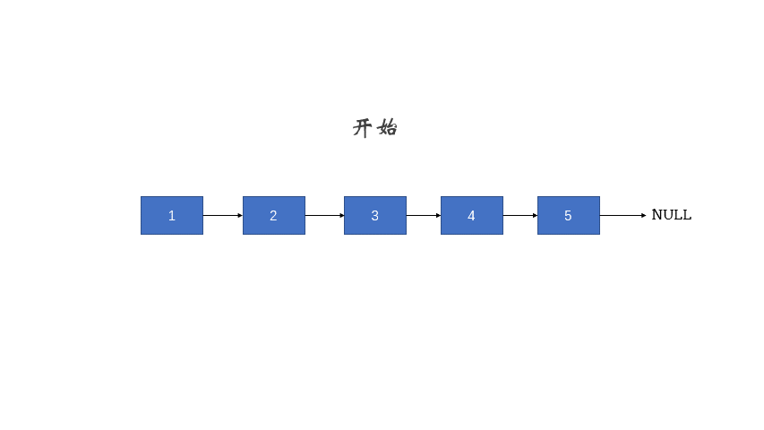

## 算法学习笔记（目标是把题背下来）

### 1 题目分类


### 2 最易懂的贪心算法（3+6）

#### 2.1 算法解释

局部最优到全局最优。

#### 2.2 分配问题

##### leetcode 455（根据胃口分饼干）

- ```c++
  int findContentChildren(vector<int>& children, vector<int>& cookies) {
      sort(children.begin(), children.end());//将children和cookies排序
      sort(cookies.begin(), cookies.end());
      int child = 0, cookie = 0;//遍历
      while (child < children.size() && cookie < cookies.size()) {
          if (children[child] <= cookies[cookie]) ++child;//将最接近且大于children的饼干cookies分配
          ++cookie;
      }
      return child;
  }
  ```

##### leetcode 135（根据评分分糖果）

- ```c++
  孩子顺序不能改
  int candy(vector<int>& ratings) {
      int size = ratings.size();
      if (size < 2) {
          return size;
      }
      vector<int> num(size, 1);//初始化为1
      for (int i = 1; i < size; ++i) {//从左向右
          if (ratings[i] > ratings[i-1]) {
              num[i] = num[i-1] + 1;//取num[i]左侧+1
          }
      }
      for (int i = size - 1; i > 0; --i) {//从右向左
          if (ratings[i] < ratings[i-1]) {
              num[i-1] = max(num[i-1], num[i] + 1);//取num[i-1]两侧最大值
          }
      }
      return accumulate(num.begin(), num.end(), 0); // 求和
  }
  ```

#### 2.3 区间问题

##### leetcode 435（最少公共区间）

- ```c++
  int eraseOverlapIntervals(vector<vector<int>>& intervals) {
      if (intervals.empty()) {//判空
          return 0;
      }
      int n = intervals.size();
      sort(intervals.begin(), intervals.end(), [](vector<int>& a, vector<int>& b)//按区间尾部增序排序
           {
               return a[1] < b[1];
           });
      int removed = 0, prev = intervals[0][1];
      for (int i = 1; i < n; ++i) {
          if (intervals[i][0] < prev) {//相交，移除
              ++removed;
          } else {//不相交，更新prev
              prev = intervals[i][1];
          }
      }
      return removed;
  }
  ```

#### 2.4 练习

基础

##### leetcode 605（种花问题）

- ```c++
  不好理解：
  class Solution {
  public:
      bool canPlaceFlowers(vector<int>& flowerbed, int n) {
          int prev = -1;//种花区间左侧1索引
          int m = flowerbed.size();
          int count = 0;
          for(int i=0;i<m;i++)
          {
              if(flowerbed[i]==1)
              {
                  if(prev<0)//种花区间为0...01,i-prev-1个0，(i-prev-1)/2更好理解
                  {
                      count += (i/2);
                  }
                  else//种花区间为10...01，i-prev-1个0
                  {
                      count +=(i-prev-2)/2;
                  }
                  prev = i;
              }
          }
          if(prev<0)//种花区间为000,i(m)-prev个0
          {
              count += (m+1)/2;
          }
          else//种花区间为100,i(m)-prev个0
          {
              count += (m-prev-1)/2;
          }
          return count>=n;
      }
  };
  优化版本：
  class Solution {
  public:
      bool canPlaceFlowers(vector<int>& flowerbed, int n) {
          int l = -1,r = 0;//种花区间两侧1索引,中间0的个数为r-l-1
          int m = flowerbed.size();
          int count = 0;
          for(int i=0;i<m;i++)
          {
              r = i;//更新
              if(flowerbed[i]==1)
              {
                  if(l<0)//种花区间为0...01
                  {
                      count += (r-l-1)/2;
                  }
                  else//种花区间为10...01
                  {
                      count +=(i-l-2)/2;
                  }
                  l = i;//更新
              }
          }
          r++;//更新
          if(l<0)//种花区间为0...0
          {
              count += (r-l)/2;
          }
          else//种花区间为10...0
          {
              count += (r-l-1)/2;
          }
          return count>=n;
      }
  };
  ```

##### leetcode 452（最少箭引爆气球）

- ```c++
  class Solution {
  public:
      int findMinArrowShots(vector<vector<int>>& points) {
          sort(points.begin(),points.end(),[](vector<int>& a,vector<int>& b){
              return a[0]<b[0];
          });//按横坐标排序
          vector<int>& prev = points[0];
          int count = 1;
          for(int i=1;i<points.size();i++)
          {
              if(points[i][0]>prev[1])//没有重叠，将当前气球作为公共区域
              {
                  ++count;
                  prev = points[i];
              }
              else//有重叠，更新公共区域
              {
                  prev[0] = points[i][0];
                  prev[1] = min(prev[1],points[i][1]);
              }
          }
          return count;
      }
  };
  ```

##### leetcode 763（划分字母区间）

- ```c++
  从片段结束的第一个字符开始割，但是收尾都是a的情况怎么办
  class Solution {
  public:
      vector<int> partitionLabels(string s) {
          int last[26];
          int lengh = s.size();
          for(int i = 0;i < lengh;i++)//记录下每个字母最后出现的位置
          {
              last[s[i]-'a'] = i;
          }  
          int start=0;//当前字符片段初始位置
          int end=0;//当前字符最后出现位置
          vector<int> part;
          for(int i=0;i<lengh;i++)
          {
              end = max(end,last[s[i]-'a']);
              if(end == i)
              {
                  part.push_back(end-start+1);//将长度放入part
                  start = end + 1;//更新start
              }
          }
          return part;
      }
  };
  ```

##### leetcode 122（多次交易股票）

- ```c++
  class Solution {
  public:
      int maxProfit(vector<int>& prices) {   
          int ans = 0;
          int n = prices.size();
          for (int i = 1; i < n; ++i) {
              ans += max(0, prices[i] - prices[i - 1]);//涨了就卖
          }
          return ans;
      }
  };
  ```

进阶

##### leetcode 406（根据身高重建队列）

- ```c++
  class Solution {
  public:
      vector<vector<int>> reconstructQueue(vector<vector<int>>& people) {
          sort(people.begin(), people.end(), [](const vector<int>& u, const vector<int>& v) {
              return u[0] > v[0] || (u[0] == v[0] && u[1] < xx[1]);
          });//按身高降序排列
          vector<vector<int>> ans;
          for (const vector<int>& person: people) {
              ans.insert(ans.begin() + person[1], person);//直接按person[1]插入就行，更高在前，更矮在后
          }
          return ans;
      }
  };
  ```

##### leetcode 665（非递减数列）

- ```c++
  class Solution {
  public:
      bool checkPossibility(vector<int> &nums) {
          int n = nums.size();
          for (int i = 0; i < n - 1; ++i) {
              int x = nums[i], y = nums[i + 1];
              if (x > y) {//出现递减
                  nums[i] = y;//改左侧为较小值
                  if (is_sorted(nums.begin(), nums.end())) {
                      return true;
                  }
                  nums[i] = x; //复原，改右侧为较小值
                  nums[i + 1] = x;
                  return is_sorted(nums.begin(), nums.end());
              }
          }
          return true;
      }
  };
  ```

### 3 玩转双指针（4+4）

#### 3.1 算法解释

```c++
指针与常量
看const修饰的是什么    
int x;
int * p1 = &x; // 指针可以被修改，值也可以被修改
const int * p2 = &x; // 指针可以被修改，值不可以被修改（const int）
int * const p3 = &x; // 指针不可以被修改（* const），值可以被修改
const int * const p4 = &x; // 指针不可以被修改，值也不可以被修改

函数指针
int* addition(int a, int b) {//指针函数
    int* sum = new int(a + b);
    return sum;
}
int subtraction(int a, int b) {//普通函数
    return a - b;
}
int operation(int x, int y, int (*func)(int, int)) {//参数为函数指针的函数
    return (*func)(x,y);
}
int (*minus)(int, int) = subtraction;// minus是函数指针
int* m = addition(1, 2);// 指针函数
int n = operation(3, *m, minus);// 参数为函数指针的函数调用函数指针
```

#### 3.2 Two Sum

##### leetcode 167（两数和）

- ```c++
  vector<int> twoSum(vector<int>& numbers, int target) {
      int l = 0, r = numbers.size() - 1, sum;
      while (l < r) {
          sum = numbers[l] + numbers[r];
          if (sum == target) break;//找到target，跳出
          if (sum < target) ++l;//在左侧，l++
          else --r;//右侧，--r
      }
      return vector<int>{l + 1, r + 1};
  }
  ```

#### 3.3 归并两个有序数组

##### leetcode 88（归并两有序数组）

- ```c++
  void merge(vector<int>& nums1, int m, vector<int>& nums2, int n) {
      int pos = m-- + n-- - 1;//++a速度更快
      while (m >= 0 && n >= 0) {//nums1被延长至m+n，多出的n位被0填补，题目要求把第二个数组归并到第一个数组上
          nums1[pos--] = nums1[m] > nums2[n]? nums1[m--]: nums2[n--];//取较大值放num1尾部
      }
      while (n >= 0) {//num1先处理完，继续处理num2
          nums1[pos--] = nums2[n--];
      }
  }
  ```

#### 3.4 快慢指针

##### leetcode 142（环形链表头）

- ```c++
  floyd判圈法
  ListNode *detectCycle(ListNode *head) {
      ListNode *slow = head, *fast = head;
      // 判断是否存在环路
      do {
          if (!fast || !fast->next) return nullptr;//fast有尽头，没有环路
          fast = fast->next->next;//fast两步
          slow = slow->next;//slow一步
      } while (fast != slow);//第一次相遇
      // 如果存在，查找环路节点
      fast = head;//fast回到链表头
      while (fast != slow){
          slow = slow->next;
          fast = fast->next;
      }//第二次相遇
      return fast;
  }
  ```

#### 3.5 滑动窗口

##### leetcode 76（最小覆盖子串）

- ```c++
  string minWindow(string S, string T) {
      vector<int> chars(128, 0);
      vector<bool> flag(128, false);
      // 先统计T中的字符情况
      for (int i = 0; i < T.size(); ++i) {//统计T中字符
          flag[T[i]] = true;//T中含有的字符
          ++chars[T[i]];//窗口中缺少的字符
      }
      // 移动滑动窗口，不断更改统计数据
      int cnt = 0, l = 0, min_l = 0, min_size = S.size() + 1;
      for (int r = 0; r < S.size(); ++r) {
          if (flag[S[r]]) {
              if (--chars[S[r]] >= 0) {
                  ++cnt;
              }
              // 若目前滑动窗口已包含T中全部字符，
              // 则尝试将l右移，在不影响结果的情况下获得最短子字符串
              while (cnt == T.size()) {
                  if (r - l + 1 < min_size) {//更新最小窗size和左侧索引
                      min_l = l;
                      min_size = r - l + 1;
                  }
                  if (flag[S[l]] && ++chars[S[l]] > 0) {//检查窗口左侧字符是不是T所必须的
                      --cnt;
                  }
                  ++l;
              }
          }
      }
      return min_size > S.size()? "": S.substr(min_l, min_size);
  }
  ```

#### 3.6 练习

基础

##### leetcode 633（平方和）

- ```c++
  class Solution {
  public:
      bool judgeSquareSum(int c) {
          int64_t l=0;
          int64_t r=ceil(sqrt(c));//大于或者等于的最小整数
          while(l<=r)
          {
              if(l*l+r*r>c)
              {
                  r--;
              }
              else if(l*l+r*r<c)
              {
                  l++;
              }
              else
              {
                  return true;
              }
          }
          return false;
      }
  };
  ```

##### leetcode 680（删除验证回文字符串）

- ```c++
  class Solution {
  public:
      bool isPalindrome(string s,int i,int j)
      {
          while(i<j)
          {
              if(s[i] == s[j])
  			{
  				i++;
  				j--;
  			}
              else
              {   
                  return false;
              }
          }
          return true;
      }
  	bool validPalindrome(string s) {
  		int l = 0;
  		int r = s.size() - 1;
          int lInd=0,rInd=0;
  		while (l<r)
  		{
  			if (s[l] == s[r])
  			{
  				l++;
  				r--;
  			}
  			else//不对称，看删除l或者r的子串是否满足
              {
                  return isPalindrome(s,l+1,r)||isPalindrome(s,l,r-1);
              }
  		}
          return true;
  	}
  };
  ```

##### leetcode 524（删除字符匹配字典最长字符串）

- ```c++
  class Solution {
  public:
      string findLongestWord(string s, vector<string>& dictionary) {
          string ans;
          for(string d:dictionary){
              int j=0;
              for(int i=0;i<s.size()&&j<d.size();i++){
                  if(d[j]==s[i]){                         //若d[j]==s[i],令i++,j++
                      j++;
                  }
              }
              if(j==d.size()){                            //当d全部遍历完，才可以判断是否将d存入ans;
                  if(d.size()>ans.size()){                //当d.size()>ans.size(),ans=d;
                      ans=d;
                  }
                  else if(d.size()==ans.size()){          //当d.size()==ans.size(),ans=d<ans?d:ans;
                      ans=d<ans?d:ans;//这里利用string对<运算符的重载，直接对字典序进行比较
                  }
              }
          }
          return ans;
      }
  };
  先排序
  class Solution {
  public:
      bool isSubsequence(string s, string t) {
          int n = s.size(), m = t.size(); 
          if(m > n) return false; // 如果 t 长度大于 s，一定不是子序列
          int j=0;
          for(int i=0;i<s.size()&&j<t.size();i++){
              if(t[j]==s[i]){                         //若d[j]==s[i],令i++,j++
                  j++;
              }
          }
          if(j==t.size()){ 
          	return true;
          }
          return false;
      }
  
      string findLongestWord(string s, vector<string>& dictionary) {     
          sort(dictionary.begin(), dictionary.end(), [&](string &a, string &b) {//更长的、字典序更小的排序
              if(a.size() == b.size()) return a < b;
              return a.size() > b.size();
          });
          for(string &t : dictionary) {//查看如否有子串
              if(isSubsequence(s, t)) return t;
          }
          return "";// 如果没找到
      }
  };
  ```

进阶

##### leetcode 340（找k个不同字符子串）

- ```c++
  class Solution {
  public:
      int lengthOfLongestSubstringKDistinct(string s, int k) {
          int n = s.size(), res = 0;
          unordered_map<char,int> hashmap;//用map存储窗口内含有的字符，键个数表示种类，键值表示字符数量，很方便
          for(int i=0,j=0;j<n;j++){//i,j为窗口两侧索引
              hashmap[s[j]]++;//统计字符个数
              while(i<n&&hashmap.size()>k){//窗口内字符满足条件
                  hashmap[s[i]]--;//窗口左侧向右移
                  if(hashmap.count(s[i])&&hashmap[s[i]]==0) hashmap.erase(s[i]);//map值满足条件，处理键值
                  i++;
              }
              res = max(res,j-i+1);更新最长字符
          }
          return res;
      }
  };
  ```

### 4 居合斩！二分查找（3+3）

#### 4.1算法解释

二分查找也可以看作双指针的一种特殊情况。

#### 4.2求开方

##### leetcode 69（求开方）

- ```c++
  int mySqrt(int a) {
      if (a == 0) return a;
      int l = 1, r = a, mid, sqrt;
      while (l <= r) {
          mid = l + (r - l) / 2;//更新中间值
          sqrt = a / mid;//计算a除以mid的倍数
          if (sqrt == mid) {//中间值等于sqrt
              return mid;
          } else if (mid > sqrt) {//中间值大于sqrt，查找右侧，更新r
              r = mid - 1;
          } else {//小于，查找左侧，更新l
              l = mid + 1;
          }
      }
      return r;
  }
  牛顿迭代法（更快）
  int mySqrt(int a) {
      long x = a;
      while (x * x > a) {//取函数极值?
          x = (x + a / x) / 2;//公式表达某函数两个自变量的关系
      }
      return x;
  }
  ```

#### 4.3查找区间

##### leetcode 34（升序找目标值始终）

- ```c++
  // 主函数
  vector<int> searchRange(vector<int>& nums, int target) {
      if (nums.empty()) return vector<int>{-1, -1};
      int lower = lower_bound(nums, target);
      int upper = upper_bound(nums, target) - 1; // 这里需要减1位，upper_bound没有取等
      if (lower == nums.size() || nums[lower] != target) {//有可能找的是大于target的值
          return vector<int>{-1, -1};
      }
      return vector<int>{lower, upper};
  }
  // 辅函数
  int lower_bound(vector<int> &nums, int target) {
      int l = 0, r = nums.size(), mid;
      while (l < r) {
          mid = l + (r - l) / 2;//更新中间值索引
          if (nums[mid] >= target) {//中间值在右侧，更新右侧索引
              r = mid;
          } else {//在左侧，更新左侧索引
              l = mid + 1;
          }
      }
      return l;
  }
  // 辅函数
  int upper_bound(vector<int> &nums, int target) {
      int l = 0, r = nums.size(), mid;
      while (l < r) {
          mid = l + (r - l) / 2;
          if (nums[mid] > target) {//同上，没有取等
              r = mid;
          } else {
              l = mid + 1;
          }
      }
      return l;
  }
  ```

#### 4.4旋转数组查找数字

##### leetcode 81（旋转排序数组找目标值）

- ```c++
  bool search(vector<int>& nums, int target) {
      int l = 0, r = nums.size() - 1;
      while (l <= r) {
          int mid = l + (r - l) / 2;//更新mid
          if (nums[mid] == target) {//找到了
              return true;
          }
          if (nums[l] == nums[mid]) {//中间右很多相同的值
              // 无法判断哪个区间是增序的
              ++l;
          } else if (nums[mid] <= nums[r]) {
              // 右区间是增序的，搜索右区间时，target大于nums[r]就不再向下搜索
              if (target > nums[mid] && target <= nums[r]) {//中间值在target左侧，搜索右区间，更新l
                  l = mid + 1;
              } else {//中间值在target右侧，搜索左区间，更新r
                  r = mid - 1;
              }
          } else {
              // 左区间是增序的
              if (target >= nums[l] && target < nums[mid]) {
                  r = mid - 1;
              } else {
                  l = mid + 1;
              }
          }
      }
      return false;
  }
  ```

#### 4.5练习

基础：

##### leetcode 154（旋转排序数组最小值）

- ```c++
  class Solution {
  public:
      int findMin(vector<int>& nums) {
          int l=0,r=nums.size()-1,mid,minNum=-1;
          while(l<r)//最小值在断点处，在非递增区间
          {
              mid=l+(r-l)/2;
              if(nums[l]==nums[mid])
              {
                  l++;
              }
              else if(nums[r]>=nums[mid])//右边递增，找左边
              {
                  minNum = nums[mid];
                  r = mid - 1;
              }
              else//左边递增，找右边
              {
                  minNum = nums[l];
                  l = mid + 1;
              }
          }
          return minNum;
      }
  };
  ```

##### leetcode 540（有序数组唯一）

- ```c++
  class Solution {
  public:
      int singleNonDuplicate(vector<int>& nums) {
          int l=0,r=nums.size()-1,mid=0;
          while(l<r)//唯一的数在奇数侧
          {
              mid=l+(r-l)/2;
              if(nums[mid]==nums[mid-1])
              {
                  if((mid-l)%2)//奇数，在右侧
                  {
                      l=mid+1;
                  }
                  else//在右侧
                  {
                      r=mid-2;   
                  }
              }
              else if(nums[mid]==nums[mid+1])
              {
                  if((mid-l)%2)//奇数，在左侧
                  {
                      r=mid-1;
                  }
                  else//在右侧
                  {
                      l=mid+2;
                  }
              }
              else//就是nums[mid]
              {
                  return nums[mid];
              }
          }
          return nums[r];
      }
  };
  ```

进阶

##### leetcode 4（两正序数组中位数）!!!

- ```c++
  class Solution {
  public:
      int getKthElement(const vector<int>& nums1, const vector<int>& nums2, int k) {
          /* 主要思路：要找到第 k (k>1) 小的元素，那么就取 pivot1 = nums1[k/2-1] 和 pivot2 = nums2[k/2-1] 进行比较
           * 这里的 "/" 表示整除
           * nums1 中小于等于 pivot1 的元素有 nums1[0 .. k/2-2] 共计 k/2-1 个
           * nums2 中小于等于 pivot2 的元素有 nums2[0 .. k/2-2] 共计 k/2-1 个
           * 取 pivot = min(pivot1, pivot2)，两个数组中小于等于 pivot 的元素共计不会超过 (k/2-1) + (k/2-1) <= k-2 个
           * 这样 pivot 本身最大也只能是第 k-1 小的元素
           * 如果 pivot = pivot1，那么 nums1[0 .. k/2-1] 都不可能是第 k 小的元素。把这些元素全部 "删除"，剩下的作为新的 nums1 数组
           * 如果 pivot = pivot2，那么 nums2[0 .. k/2-1] 都不可能是第 k 小的元素。把这些元素全部 "删除"，剩下的作为新的 nums2 数组
           * 由于我们 "删除" 了一些元素（这些元素都比第 k 小的元素要小），因此需要修改 k 的值，减去删除的数的个数
           */
  
          int m = nums1.size();
          int n = nums2.size();
          int index1 = 0, index2 = 0;
  
          while (true) {
              // 边界情况
              if (index1 == m) {
                  return nums2[index2 + k - 1];
              }
              if (index2 == n) {
                  return nums1[index1 + k - 1];
              }
              if (k == 1) {
                  return min(nums1[index1], nums2[index2]);
              }
  
              // 正常情况
              int newIndex1 = min(index1 + k / 2 - 1, m - 1);
              int newIndex2 = min(index2 + k / 2 - 1, n - 1);
              int pivot1 = nums1[newIndex1];
              int pivot2 = nums2[newIndex2];
              if (pivot1 <= pivot2) {
                  k -= newIndex1 - index1 + 1;
                  index1 = newIndex1 + 1;
              }
              else {
                  k -= newIndex2 - index2 + 1;
                  index2 = newIndex2 + 1;
              }
          }
      }
  
      double findMedianSortedArrays(vector<int>& nums1, vector<int>& nums2) {
          int totalLength = nums1.size() + nums2.size();
          if (totalLength % 2 == 1) {
              return getKthElement(nums1, nums2, (totalLength + 1) / 2);
          }
          else {
              return (getKthElement(nums1, nums2, totalLength / 2) + getKthElement(nums1, nums2, totalLength / 2 + 1)) / 2.0;
          }
      }
  };
  class Solution {
  public:
      double findMedianSortedArrays(vector<int>& nums1, vector<int>& nums2) {
          if (nums1.size() > nums2.size()) {
              return findMedianSortedArrays(nums2, nums1);
          }
          
          int m = nums1.size();
          int n = nums2.size();
          int left = 0, right = m;
          // median1：前一部分的最大值
          // median2：后一部分的最小值
          int median1 = 0, median2 = 0;
  
          while (left <= right) {
              // 前一部分包含 nums1[0 .. i-1] 和 nums2[0 .. j-1]
              // 后一部分包含 nums1[i .. m-1] 和 nums2[j .. n-1]
              int i = (left + right) / 2;
              int j = (m + n + 1) / 2 - i;
  
              // nums_im1, nums_i, nums_jm1, nums_j 分别表示 nums1[i-1], nums1[i], nums2[j-1], nums2[j]
              int nums_im1 = (i == 0 ? INT_MIN : nums1[i - 1]);
              int nums_i = (i == m ? INT_MAX : nums1[i]);
              int nums_jm1 = (j == 0 ? INT_MIN : nums2[j - 1]);
              int nums_j = (j == n ? INT_MAX : nums2[j]);
  
              if (nums_im1 <= nums_j) {
                  median1 = max(nums_im1, nums_jm1);
                  median2 = min(nums_i, nums_j);
                  left = i + 1;
              } else {
                  right = i - 1;
              }
          }
  
          return (m + n) % 2 == 0 ? (median1 + median2) / 2.0 : median1;
      }
  };
  ```

```
自己写的，没a
class Solution {
public:
    double findMedianSortedArrays(vector<int>& nums1, vector<int>& nums2) {
        if(nums1.size()==0&&nums2.size()==0)
        {
            return 0;
        }
        else if(nums2.size()==0) 
        {
            return nums1.size()%2?nums1[nums1.size()/2]:(nums1[nums1.size()/2]+nums1[nums1.size()/2+1])/2.0;
        }
        else if(nums1.size()==0) 
        {
            return nums2.size()%2?nums2[nums2.size()/2]:(nums2[nums2.size()/2]+nums2[nums2.size()/2+1])/2.0;
        }

		int m = nums1.size(),n = nums2.size();
        int mid = (m+n)/2;
        int n1=nums1[0],n2=nums2[0];

        if(m<n)
        {
            swap(nums1,nums2);
        }
        if(nums1[mid-n]>nums2[n-1])
        {
            return (m+n)%2?nums1[mid-nums2.size()]:(nums1[mid-nums2.size()]+nums1[mid-nums2.size()-1])/2.0;
        }

        for(int i=0,j=0;i+j+2<=mid;)
        {
            if(nums1[i]>nums2[j])
            {
                n2 = nums2[j];
                j++;
            }
            else
            {
                n1 = nums1[i];
                i++;
            }   
            cout<<"n1:"<<n1<<"-n2:"<<n2<<endl;
        }
        return (m+n)%2?max(n1,n2):(n1+n2)/2.0;
    }
};
```

### 5 千奇百怪的排序算法（2+2）

#### 5.1 常用排序算法

##### 快速排序


- ```c++
  void quick_sort(vector<int> &nums, int l, int r) {
      if (l + 1 >= r) {
          return;
      }
      int first = l, last = r - 1, key = nums[first];//左闭右开
      while (first < last){//以nums[first]为pivot处理num，左小右大
          while(first < last && nums[last] >= key) {//从后向前找比key小的值
              --last;
          }
          nums[first] = nums[last];//找到，改变last位置
          while (first < last && nums[first] <= key) {//从前向后找比key大的值
              ++first;
          }
          nums[last] = nums[first];//找到，改变first位置
      }
      nums[first] = key;//将上一次的first值改为key
      quick_sort(nums, l, first);
      quick_sort(nums, first + 1, r);
  }
  ```


##### 归并排序


- ```c++
  void merge_sort(vector<int> &nums, int l, int r, vector<int> &temp) {
      if (l + 1 >= r) {
          return;
      }
      // divide
      int m = l + (r - l) / 2;
      merge_sort(nums, l, m, temp);
      merge_sort(nums, m, r, temp);
      // conquer
      int p = l, q = m, i = l;//将nums分为[l,m]和[m,r]两段已经排好序的序列
      while (p < m || q < r) {
          if (q >= r || (p < m && nums[p] <= nums[q])) {//取较小值给temp
              temp[i++] = nums[p++];
          } else {
              temp[i++] = nums[q++];
          }
      }
      for (i = l; i < r; ++i) {
          nums[i] = temp[i];
      }
  }
  ```


##### 插入排序

​		

- ```c++
  有点dp的思想，哈哈
  void insertion_sort(vector<int> &nums, int n) {
      for (int i = 0; i < n; ++i) {//遍历所有元素
          for (int j = i; j > 0 && nums[j] < nums[j-1]; --j) {//第一次进for时，num[j-1]以前都是排序好的
              swap(nums[j], nums[j-1]);//当前元素不是num[i]之前最大的，不断向前插
          }
      }
  }
  ```

##### 冒泡排序

  

- ```c++
  void bubble_sort(vector<int> &nums, int n) {
      bool swapped;
      for (int i = 1; i < n; ++i) {//遍历每个元素
          swapped = false;
          for (int j = 1; j < n - i + 1; ++j) {//从1到j找最大值，第一次进for时，num[j]以后都是排序好的
              if (nums[j] < nums[j-1]) {//当前元素小于前一个，交换
                  swap(nums[j], nums[j-1]);
                  swapped = true;
              }
          }
          if (!swapped) {//排好序，跳出
              break;
          }
      }
  }
  ```

##### 选择排序


- ```c++
  void selection_sort(vector<int> &nums, int n) {
      int mid;
      for (int i = 0; i < n - 1; ++i) {
          mid = i;//mid将nums分为[0,mid]和[mid+1,n-1]两部分，[0,mid]是排好序的
          for (int j = i + 1; j < n; ++j) {//在后半部分找最小的与mid交换
              if (nums[j] < nums[mid]) {
                  mid = j;
              }
          }
          swap(nums[mid], nums[i]);
      }
  }
  
  ```

#### 5.2 快速选择

##### leetcode 215（第k大元素）

- ```c++
  // 主函数
  int findKthLargest(vector<int>& nums, int k) {
      int l = 0, r = nums.size() - 1, target = nums.size() - k;
      while (l < r) {
          int mid = quickSelection(nums, l, r);//返回排序之后pivot索引
          if (mid == target) {//找到，返回
              return nums[mid];
          }
          if (mid < target) {//索引在target左侧，更新l
              l = mid + 1;
          } else {//右侧，更新R
              r = mid - 1;
          }
      }
      return nums[l];
  }
  // 辅函数 - 快速选择
  int quickSelection(vector<int>& nums, int l, int r) {
      int i = l + 1, j = r;
      while (true) {
          while (i < r && nums[i] <= nums[l]) {
              ++i;
          }
          while (l < j && nums[j] >= nums[l]) {
              --j;
          }
          if (i >= j) {
              break;
          }
          swap(nums[i], nums[j]);
      }
      swap(nums[l], nums[j]);
      return j;
  }
  ```

#### 5.3 桶排序

##### leetcode 347（前k高频元素）

- ```c++
  vector<int> topKFrequent(vector<int>& nums, int k) {
      unordered_map<int, int> counts;//key是num，val是频次
      int max_count = 0;
      for (const int & num : nums) {
          max_count = max(max_count, ++counts[num]);//计算num频率放入counts，同时记录max_count
      }
      vector<vector<int>> buckets(max_count + 1);//max_count + 1个向量，向量索引表示频次，相当于按频次排序
      for (const auto & p : counts) {
          buckets[p.second].push_back(p.first);
      }
      vector<int> ans;
      for (int i = max_count; i >= 0 && ans.size() < k; --i) {//从后向前输出bucket[i]
          for (const int & num : buckets[i]) {//ans.push_back(buckets[i][0])可以用这个替换
              ans.push_back(num);
              if (ans.size() == k) {
                  break;
              }
          }
      }
      return ans;
  }
  ```

#### 5.4练习

基础

##### leetcode 451（字符频率排序）

- ```c++
  noexcept 指定符：指定函数是否抛出异常。
  noexcept 运算符：noexcept运算符进行编译时检查，若表达式声明为不抛出任何异常则返回true。
  emplace_back() 和 push_back() 的区别，就在于底层实现的机制不同。push_back() 向容器尾部添加元素时，首先会创建这个元素，然后再将这个元素拷贝或者移动到容器中（如果是拷贝的话，事后会自行销毁先前创建的这个元素）；而 emplace_back() 在实现时，则是直接在容器尾部创建这个元素，省去了拷贝或移动元素的过程。
  v.push_back({1,2,3}); // OK
  v.emplace_back({1,2,3}); // error 
  ```

- ```c++
  map自定义排序规则
  std::less<T>   	底层采用 < 运算符实现升序排序，各关联式容器默认采用的排序规则。
  std::greater<T>	底层采用 > 运算符实现降序排序，同样适用于各个关联式容器。
  //定义函数对象模板类，比较器
  template <typename T>
  class cmp {
  public:
      //重载 () 运算符
      bool operator ()(const T &a, const T &b) {
          //按照值的大小，做升序排序
          return  a < b;
      }
  };
  ```

- ```c++
  class Solution {
  public:
      string frequencySort(string s) {
          unordered_map<char, int> mp;//这里直接用有序关联式容器map可以么,尝试了一下，很复杂。。。
          int length = s.length();
          for (auto &ch : s) {//将s放入unordered_map中
              mp[ch]++;
          }
          vector<pair<char, int>> vec;
          for (auto &it : mp) {//将map放入vec中
              vec.emplace_back(it);
          }
          sort(vec.begin(), vec.end(), [](const pair<char, int> &a, const pair<char, int> &b) {
              return a.second > b.second;
          });//排序
          string ret;
          for (auto &[ch, num] : vec) {//遍历vec，将字符放入ret
              for (int i = 0; i < num; i++) {
                  ret.push_back(ch);
              }
          }
          return ret;
      }
  };
  ```

进阶

##### leetcode 75（三颜色排序）

- ```c++
  class Solution {
  public:
      void sortColors(vector<int>& nums) {
          int n = nums.size();
          int p0 = 0, p2 = n - 1;//下一个放置0和1的指针
          for (int i = 0; i <= p2; ++i) {
              while (i <= p2 && nums[i] == 2) {//交换并更新p2
                  swap(nums[i], nums[p2]);
                  --p2;
              }
              if (nums[i] == 0) {
                  swap(nums[i], nums[p0]);//交换并更新p0
                  ++p0;
              }
          }
      }
  };
  ```

### 6 一切皆可搜索------------------（9+6）

#### 6.1 dfs

```c++
栈先入后出，等同于递归。
状态记录
主函数和辅助函数
递归容易实现，栈更直观理解
```

##### leetcode 695（01矩阵最大面积）

- ```c++
  栈写法：
  vector<int> direction{-1, 0, 1, 0, -1};
  int maxAreaOfIsland(vector<vector<int>>& grid) {
      int m = grid.size(), n = m? grid[0].size(): 0, local_area, area = 0, x, y;
      for (int i = 0; i < m; ++i) {//遍历矩阵元素
          for (int j = 0; j < n; ++j) {
              if (grid[i][j]) {
                  local_area = 1;
                  grid[i][j] = 0;
                  stack<pair<int, int>> island;
                  island.push({i, j});
                  while (!island.empty()) {//找到该元素所在最大岛屿面积
                      auto [r, c] = island.top();
                      island.pop();//将检查过元素的弹出
                      for (int k = 0; k < 4; ++k) {//检查相邻的元素
                          x = r + direction[k], y = c + direction[k+1];
                          if (x >= 0 && x < m &&
                              y >= 0 && y < n && grid[x][y] == 1) {
                              grid[x][y] = 0;//防止下一次遍历重复计算
                              ++local_area;//当前元素最在岛屿面积+1
                              island.push({x, y});//压入栈内，dfs
                          }
                      }
                  }
                  area = max(area, local_area);
              }
          }
      }
      return area;
  }
  ```

- ```c++
  递归写法：
  先搜索后判断：
  vector<int> direction{-1, 0, 1, 0, -1};
  // 主函数
  int maxAreaOfIsland(vector<vector<int>>& grid) {
      if (grid.empty() || grid[0].empty()) return 0;
      int max_area = 0;
      for (int i = 0; i < grid.size(); ++i) {
          for (int j = 0; j < grid[0].size(); ++j) {
              if (grid[i][j] == 1) {
                  max_area = max(max_area, dfs(grid, i, j));//寻找当前元素所在岛屿面积最大值
              }
          }
      }
      return max_area;
  }
  // 辅函数
  int dfs(vector<vector<int>>& grid, int r, int c) {
      if (grid[r][c] == 0) return 0;
      grid[r][c] = 0;//防止下一次递归重复计算
      int x, y, area = 1;//当前元素面积1
      for (int i = 0; i < 4; ++i) {
          x = r + direction[i], y = c + direction[i+1];
          if (x >= 0 && x < grid.size() && y >= 0 && y < grid[0].size()) {
              area += dfs(grid, x, y);//递归相邻元素
          }
      }
      return area;
  }
  先判断后搜索：
  // 主函数
  int maxAreaOfIsland(vector<vector<int>>& grid) {
      if (grid.empty() || grid[0].empty()) return 0;
      int max_area = 0;
      for (int i = 0; i < grid.size(); ++i) {
          for (int j = 0; j < grid[0].size(); ++j) {
              max_area = max(max_area, dfs(grid, i, j));
          }
      }
      return max_area;
  }
  // 辅函数
  int dfs(vector<vector<int>>& grid, int r, int c) {
      if (r < 0 || r >= grid.size() ||
          c < 0 || c >= grid[0].size() || grid[r][c] == 0) {
          return 0;
      }
      grid[r][c] = 0;
      return 1 + dfs(grid, r + 1, c) + dfs(grid, r - 1, c) +
          dfs(grid, r, c + 1) + dfs(grid, r, c - 1);
  }
  ```

  

##### leetcode 547（朋友圈）

- ```c++
  // 主函数
  int findCircleNum(vector<vector<int>>& friends) {
      int n = friends.size(), count = 0;
      vector<bool> visited(n, false);
      for (int i = 0; i < n; ++i) {//遍历每个人
          if (!visited[i]) {
              dfs(friends, i, visited);
              ++count;
          }
      }
      return count;
  }
  // 辅函数
  void dfs(vector<vector<int>>& friends, int i, vector<bool>& visited) {
      visited[i] = true;//防止下次递归重复计算
      for (int k = 0; k < friends.size(); ++k) {//遍历与每个人的关系
          if (friends[i][k] == 1 && !visited[k]) {//递归朋友关系的人
              dfs(friends, k, visited);
          }
      }
  }
  
  ```

##### leetcode 417（入海坐标）

- ```c++
  vector<int> direction{-1, 0, 1, 0, -1};
  // 主函数
  vector<vector<int>> pacificAtlantic(vector<vector<int>>& matrix) {
      if (matrix.empty() || matrix[0].empty()) {
          return {};
      }
      vector<vector<int>> ans;
      int m = matrix.size(), n = matrix[0].size();
      vector<vector<bool>> can_reach_p(m, vector<bool>(n, false));
      vector<vector<bool>> can_reach_a(m, vector<bool>(n, false));
      for (int i = 0; i < m; ++i) {//左右两条边
          dfs(matrix, can_reach_p, i, 0);
          dfs(matrix, can_reach_a, i, n - 1);
      }
      for (int i = 0; i < n; ++i) {//上下两条边
          dfs(matrix, can_reach_p, 0, i);
          dfs(matrix, can_reach_a, m - 1, i);
      }
      for (int i = 0; i < m; i++) {
          for (int j = 0; j < n; ++j) {
              if (can_reach_p[i][j] && can_reach_a[i][j]) {//两矩阵求交
                  ans.push_back(vector<int>{i, j});
              }
          }
      }
      return ans;
  }
  // 辅函数
  void dfs(const vector<vector<int>>& matrix, vector<vector<bool>>& can_reach,
           int r, int c) {
      if (can_reach[r][c]) {//之前判断过
          return;
      }
      can_reach[r][c] = true;
      int x, y;
      for (int i = 0; i < 4; ++i) {
          x = r + direction[i], y = c + direction[i+1];
          if (x >= 0 && x < matrix.size()
              && y >= 0 && y < matrix[0].size() &&
              matrix[r][c] <= matrix[x][y]) {//递归可以流经的元素
              dfs(matrix, can_reach, x, y);
          }
      }
  }
  ```

#### 6.2 回溯法

两个小诀窍：一是按引用传状态，二是所有的状态修改在递归完成后回改。

回溯法修改一般有两种情况，一种是修改最后一位输出，比如排列组合；一种是修改访问标 记，比如矩阵里搜字符串。

##### leetcode 46（排列）

- ```c++
  // 主函数
  vector<vector<int>> permute(vector<int>& nums) {
      vector<vector<int>> ans;
      backtracking(nums, 0, ans);//回溯nums第一个元素，后面元素为子节点
      return ans;
  }
  // 辅函数
  void backtracking(vector<int> &nums, int level, vector<vector<int>> &ans) {
      if (level == nums.size() - 1) {//递归到最底层，收集当前递归下的排列
          ans.push_back(nums);
          return;
      }
      for (int i = level; i < nums.size(); i++) {//递归nums所有位置
          swap(nums[i], nums[level]); // 修改当前节点状态
          backtracking(nums, level+1, ans); // 递归子节点
          swap(nums[i], nums[level]); // 回改当前节点状态！！！（回溯特征）
      }
  }
  ```

##### leetcode 77（组合）

- ```c++
  排列回溯的是交换的位置，而组合回溯的是否把当前的数字加入结果中。
  排列：在nums基础上swap，交换一次得到一位 组合：在comb上添加，添加一个数字得到一位
  // 主函数
  vector<vector<int>> combine(int n, int k) {
      vector<vector<int>> ans;
      vector<int> comb(k, 0);
      int count = 0;//组合位数
      backtracking(ans, comb, count, 1, n, k);//回溯comb第一个元素，后面元素为子节点
      return ans;
  }
  // 辅函数
  void backtracking(vector<vector<int>>& ans, vector<int>& comb, int& count, int
                    pos, int n, int k) {
      if (count == k) {//递归到最底层，收集当前递归下的组合
          ans.push_back(comb);
          return;
      }
      for (int i = pos; i <= n; ++i) {
          comb[count++] = i; // 修改当前节点状态，将i放入当前组合
          backtracking(ans, comb, count, i + 1, n, k); // 递归子节点，不能重复放置数字，所以从i+1开始递归
          --count; // 回改当前节点状态，寻找下一个组合
      }
  }
  ```


##### leetcode 79（矩阵找字符串）

- ```c++
  使用回溯法，我们可以只对一个二维的访问矩阵进行修改，而不用把每次的搜索状态作为一个新对象传入递归函数中。
  // 主函数
  bool exist(vector<vector<char>>& board, string word) {
      if (board.empty()) return false;
      int m = board.size(), n = board[0].size();
      vector<vector<bool>> visited(m, vector<bool>(n, false));
      bool find = false;
      for (int i = 0; i < m; ++i) {//遍历board
          for (int j = 0; j < n; ++j) {
              backtracking(i, j, board, word, find, visited, 0);//回溯word第一个元素，后面元素为子节点
          }
      }
      return find;
  }
  // 辅函数
  void backtracking(int i, int j, vector<vector<char>>& board, string& word, bool
                    & find, vector<vector<bool>>& visited, int pos) {
      if (i < 0 || i >= board.size() || j < 0 || j >= board[0].size()) {//边界
          return;
      }
      if (visited[i][j] || find || board[i][j] != word[pos]) {//当前字符不相同，find可能在其他递归中被置1
          return;
      }
      if (pos == word.size() - 1) {//word最后一位相同
          find = true;
          return;
      }
      visited[i][j] = true; // 修改当前节点状态
      // word其他位相同，递归子节点
      backtracking(i + 1, j, board, word, find, visited, pos + 1);
      backtracking(i - 1, j, board, word, find, visited, pos + 1);
      backtracking(i, j + 1, board, word, find, visited, pos + 1);
      backtracking(i, j - 1, board, word, find, visited, pos + 1);
      visited[i][j] = false; // 回改当前节点状态
  }
  ```

##### leetcode  51（N皇后）

- ```c++
  // 主函数
  vector<vector<string>> solveNQueens(int n) {
      vector<vector<string>> ans;
      if (n == 0) {
          return ans;
      }
      vector<string> board(n, string(n, ’.’));
      vector<bool> column(n, false), ldiag(2*n-1, false), rdiag(2*n-1, false);
      backtracking(ans, board, column, ldiag, rdiag, 0, n);//回溯列，后面的列为子节点
      return ans;
  }
  // 辅函数
  void backtracking(vector<vector<string>> &ans, vector<string> &board, vector<
                    bool> &column, vector<bool> &ldiag, vector<bool> &rdiag, int row, int n) {
      if (row == n) {//递归到最底层，收集当前递归下的board
          ans.push_back(board);
          return;
      }
      for (int i = 0; i < n; ++i) {//遍历当前列每一个元素
          if (column[i] || ldiag[n-row+i-1] || rdiag[row+i]) {//当前元素所在行、列、斜中有Q
              continue;
          }
          // 当前元素所在行、列、斜中没有Q，修改当前节点状态
          board[row][i] = ’Q’;
          column[i] = ldiag[n-row+i-1] = rdiag[row+i] = true;//右斜编号=行+列，左斜编号=行+n-列-1
          // 递归子节点
          backtracking(ans, board, column, ldiag, rdiag, row+1, n);
          // 回改当前节点状态
          board[row][i] = ’.’;
          column[i] = ldiag[n-row+i-1] = rdiag[row+i] = false;
      }
  }
  ```

#### 6.3 bfs

- ```c++
  使用队列，先入先出
  最短路径
  dfs，bfs都是处理可达性问题
  工程中用递归少，栈和队列比较多
  ```

##### leetcode 934（岛屿距离）

points.push({x, y}); grid[x][y] = 2;用if包一下比较好理解

先用两个for递归矩阵所有元素，找到第一个岛，记录位置pair并改写值为2

找到之后通过flipped跳出

第二个while通过points.size()维护pair中的点，当points.size()为0时跳出，跳出时将岛屿向外延申一圈，pair中只有岛向外围延申一圈的点

第一个while通过points.empty()记录向外延申的次数，即shortestBridge。

- ```c++
  vector<int> direction{-1, 0, 1, 0, -1};
  // 主函数
  int shortestBridge(vector<vector<int>>& grid) {
      int m = grid.size(), n = grid[0].size();
      queue<pair<int, int>> points;
      // dfs寻找第一个岛屿，并把1全部赋值为2
      bool flipped = false;
      for (int i = 0; i < m; ++i) {
          if (flipped) break;//找到岛屿，跳出
          for (int j = 0; j < n; ++j) {
              if (grid[i][j] == 1) {//找到第一个岛屿
                  dfs(points, grid, m, n, i, j);//搜索第一个岛屿
                  flipped = true;
                  break;
              }
          }
      }
      // bfs寻找第二个岛屿，并把过程中经过的0赋值为2
      int x, y;
      int level = 0;
      while (!points.empty()){//从第一个岛屿周围的0开始bfs
          ++level;
          int n_points = points.size();
          while (n_points--) {//对应一层bfs，只能points--，不能empty()，因为后面还有points放入队列
              auto [r, c] = points.front();
              points.pop();
              for (int k = 0; k < 4; ++k) {
                  x = r + direction[k], y = c + direction[k+1];
                  if (x >= 0 && y >= 0 && x < m && y < n) {
                      if (grid[x][y] == 2) {//防止重复搜索
                          continue;
                      }
                      if (grid[x][y] == 1) {//找到第二个岛屿，层数即最短路径
                          return level;
                      }
                      points.push({x, y});//将第二层0放入队列，并置为2
                      grid[x][y] = 2;
                  }
              }
          }
      }
      return 0;
  }
  // 辅函数
  void dfs(queue<pair<int, int>>& points, vector<vector<int>>& grid, int m, int n
           , int i, int j) {
      if (i < 0 || j < 0 || i == m || j == n || grid[i][j] == 2) {//边界或者访问过
          return;
      }
      if (grid[i][j] == 0) {//记录岛屿周围的0
          points.push({i, j});
          return;
      }
      grid[i][j] = 2;
      dfs(points, grid, m, n, i - 1, j);
      dfs(points, grid, m, n, i + 1, j);
      dfs(points, grid, m, n, i, j - 1);
      dfs(points, grid, m, n, i, j + 1);
  }
  
  ```

##### **leetcode 126（字典包含起终字符串）**

- ```c++
  // 主函数
  vector<vector<string>> findLadders(string beginWord, string endWord, vector<
                                     string>& wordList) {
      vector<vector<string>> ans;
      unordered_set<string> dict;
      for (const auto &w: wordList){//wordList插入dict
          dict.insert(w);
      }
      if (!dict.count(endWord)) {//dict中没有endword，直接返回
          return ans;
      }
      dict.erase(beginWord);
      dict.erase(endWord);//erase掉dict中的beginWord和endWord
      unordered_set<string> q1{beginWord}, q2{endWord};//从正反两个方向搜索建立set，q1当前bfs方向，q2为另一个方向
      unordered_map<string, vector<string>> next;//beginWord和endWord之间的路径
      bool reversed = false, found = false;
      while (!q1.empty()) {
          unordered_set<string> q;//存放当前节点的下一层word
          for (const auto &w: q1) {
              string s = w;
              for (size_t i = 0; i < s.size(); i++) {//遍历word的字符
                  char ch = s[i];
                  for (int j = 0; j < 26; j++) {//更改当前字符
                      s[i] = j + ’a’;
                      if (q2.count(s)) {//在endword的set中找到
                          reversed? next[s].push_back(w): next[w].push_back(s);
                          found = true;
                      }
                      if (dict.count(s)) {//在dict中找到
                          reversed? next[s].push_back(w): next[w].push_back(s);
                          q.insert(s);
                      }
                  }
                  s[i] = ch;//还原当前word
              }
          }
          if (found) {//找到，跳出
              break;
          }
          for (const auto &w: q) {//erase掉路径中的word
              dict.erase(w);
          }
          if (q.size() <= q2.size()) {//当前节点延展数量，更新q1
              q1 = q;
          } else {
              reversed = !reversed;//当前节点延展数量大，需要从另一个方向bfs，更新q1，q2
              q1 = q2;
              q2 = q;
          }
      }
      if (found) {//回溯找可能路径
          vector<string> path = {beginWord};
          backtracking(beginWord, endWord, next, path, ans);//回溯next[beginWord],每一层路径为子节点
      }
      return ans;
  }
  // 辅函数
  void backtracking(const string &src, const string &dst, unordered_map<string,
                    vector<string>> &next, vector<string> &path, vector<vector<string>> &ans) {
      if (src == dst) {//递归至最底层，收集当前递归产生的path
          ans.push_back(path);
          return;
      }
      for (const auto &s: next[src]) {
          path.push_back(s);
          backtracking(s, dst, next, path, ans);
          path.pop_back();
      }
  }
  ```

#### 6.4 练习

基础

##### leetcode 130（找被围绕的区域）

- ```c++
  bfs:
  class Solution {
  public:
      const int dx[4] = {1, -1, 0, 0};
      const int dy[4] = {0, 0, 1, -1};
  
      void solve(vector<vector<char>>& board) {
          int n = board.size();
          if (n == 0) {
              return;
          }
          int m = board[0].size();
          queue<pair<int, int>> que;
          for (int i = 0; i < n; i++) {//边缘的0改A
              if (board[i][0] == 'O') {
                  que.emplace(i, 0);
                  board[i][0] = 'A';
              }
              if (board[i][m - 1] == 'O') {
                  que.emplace(i, m - 1);
                  board[i][m - 1] = 'A';
              }
          }
          for (int i = 1; i < m - 1; i++) {//边缘的0改A
              if (board[0][i] == 'O') {
                  que.emplace(0, i);
                  board[0][i] = 'A';
              }
              if (board[n - 1][i] == 'O') {
                  que.emplace(n - 1, i);
                  board[n - 1][i] = 'A';
              }
          }
          while (!que.empty()) {//bfs边缘的A，0改A
              int x = que.front().first, y = que.front().second;
              que.pop();
              for (int i = 0; i < 4; i++) {
                  int mx = x + dx[i], my = y + dy[i];
                  if (mx < 0 || my < 0 || mx >= n || my >= m || board[mx][my] != 'O') {
                      continue;
                  }
                  que.emplace(mx, my);
                  board[mx][my] = 'A';
              }
          }
          for (int i = 0; i < n; i++) {//剩余的0改X
              for (int j = 0; j < m; j++) {
                  if (board[i][j] == 'A') {
                      board[i][j] = 'O';
                  } else if (board[i][j] == 'O') {
                      board[i][j] = 'X';
                  }
              }
          }
      }
  };
  dfs:
  class Solution {
  public:
      int n, m;
  
      void dfs(vector<vector<char>>& board, int x, int y) {
          if (x < 0 || x >= n || y < 0 || y >= m || board[x][y] != 'O') {//边缘直接返回，不递归
              return;
          }
          board[x][y] = 'A';
          dfs(board, x + 1, y);
          dfs(board, x - 1, y);
          dfs(board, x, y + 1);
          dfs(board, x, y - 1);
      }
  
      void solve(vector<vector<char>>& board) {
          n = board.size();
          if (n == 0) {
              return;
          }
          m = board[0].size();
          for (int i = 0; i < n; i++) {//递归左右两列
              dfs(board, i, 0);
              dfs(board, i, m - 1);
          }
          for (int i = 1; i < m - 1; i++) {//递归上下两列
              dfs(board, 0, i);
              dfs(board, n - 1, i);
          }
          for (int i = 0; i < n; i++) {
              for (int j = 0; j < m; j++) {
                  if (board[i][j] == 'A') {//A改回O
                      board[i][j] = 'O';
                  } else if (board[i][j] == 'O') {//其余的O改X
                      board[i][j] = 'X';
                  }
              }
          }
      }
  };
  ```

##### leetcode 257（二叉树所有路径）

- ```c++
  bfs：
  class Solution {
  public:
      vector<string> binaryTreePaths(TreeNode* root) {
          vector<string> paths;
          if (root == nullptr) {
              return paths;
          }
          queue<TreeNode*> node_queue;//存放遍历过的节点
          queue<string> path_queue;//存放找到的路径
  
          node_queue.push(root);
          path_queue.push(to_string(root->val));
  
          while (!node_queue.empty()) {
              TreeNode* node = node_queue.front(); 
              string path = path_queue.front();
              node_queue.pop();
              path_queue.pop();
  
              if (node->left == nullptr && node->right == nullptr) {//找到一条路径
                  paths.push_back(path);
              } else {//没找到继续向下找
                  if (node->left != nullptr) {
                      node_queue.push(node->left);
                      path_queue.push(path + "->" + to_string(node->left->val));
                  }
  
                  if (node->right != nullptr) {
                      node_queue.push(node->right);
                      path_queue.push(path + "->" + to_string(node->right->val));
                  }
              }
          }
          return paths;
      }
  };
  dfs：
  class Solution {
  public:
      void construct_paths(TreeNode* root, string path, vector<string>& paths) {
          if (root != nullptr) {//
              path += to_string(root->val);
              if (root->left == nullptr && root->right == nullptr) {  // 当前节点是叶子节点
                  paths.push_back(path);                              // 把路径加入到答案中
              } else {
                  path += "->";  // 当前节点不是叶子节点，继续递归遍历
                  construct_paths(root->left, path, paths);
                  construct_paths(root->right, path, paths);
              }
          }
      }
  
      vector<string> binaryTreePaths(TreeNode* root) {
          vector<string> paths;
          construct_paths(root, "", paths);
          return paths;
      }
  };
  ```

进阶

##### leetcode 47（重复数字排列）

- ```c++
  回溯
  class Solution {
      vector<int> vis;//状态记录，很重要
  
  public:
      void backtrack(vector<int>& nums, vector<vector<int>>& ans, int idx, vector<int>& perm) {
          if (idx == nums.size()) {//递归到最后一位，收集结果
              ans.emplace_back(perm);
              return;
          }
          for (int i = 0; i < (int)nums.size(); ++i) {
              if (vis[i] || (i > 0 && nums[i] == nums[i - 1] && !vis[i - 1])) {//访问过或前一数字相同且访问过
                  continue;
              }
              perm.emplace_back(nums[i]);//修改
              vis[i] = 1;
              backtrack(nums, ans, idx + 1, perm);//递归
              vis[i] = 0;//回改
              perm.pop_back();
          }
      }
  
      vector<vector<int>> permuteUnique(vector<int>& nums) {
          vector<vector<int>> ans;
          vector<int> perm;
          vis.resize(nums.size());
          sort(nums.begin(), nums.end());//排序，方便判断重复数字
          backtrack(nums, ans, 0, perm);
          return ans;
      }
  };
  ```

##### leetcode 40（组合和）

- ```c++
  class Solution {
  private:
      vector<pair<int, int>> freq;
      vector<vector<int>> ans;
      vector<int> sequence;
  
  public:
      void dfs(int pos, int rest) {
          if (rest == 0) {//找到target
              ans.push_back(sequence);
              return;
          }
          if (pos == freq.size() || rest < freq[pos].first) {//加上最后一位>target
              return;
          }
          int most = min(rest / freq[pos].first, freq[pos].second);//组成target能用到最多的num
          for (int i = 1; i <= most; ++i) {
              if(i)//加入0个当前数字，不需要修改和回改
              {
                  sequence.push_back(freq[pos].first);//修改
              }
              dfs(pos + 1, rest - i * freq[pos].first);//递归
          }
          for (int i = 1; i <= most; ++i) {
              if(i)
              {
                  sequence.pop_back();//回改
              }            
          }
      }
  
      vector<vector<int>> combinationSum2(vector<int>& candidates, int target) {
          sort(candidates.begin(), candidates.end());//排序
          for (int num: candidates) {//统计freq
              if (freq.empty() || num != freq.back().first) {
                  freq.emplace_back(num, 1);
              } else {
                  ++freq.back().second;
              }
          }
          dfs(0, target);
          return ans;
      }
  };
  有重复的回溯
  class Solution {
  public:
  
      vector<vector<int>> res;
      vector<int> temp;
  
      void backtrack(vector<int>& candidates, int target, int index)
      {
          if(target == 0)
          {
              res.push_back(temp);
              return;
          }
          for(int i = index; i < candidates.size() && target-candidates[i] >= 0; i++)
          {
              if(i > index && candidates[i] == candidates[i-1])
                  continue;
              temp.push_back(candidates[i]);
              backtrack(candidates, target-candidates[i], i+1);
              temp.pop_back();
          }
  
      }
  
      vector<vector<int>> combinationSum2(vector<int>& candidates, int target) {
          sort(candidates.begin(), candidates.end());
          backtrack(candidates, target, 0);
          return res;
      }
  };
  ```

##### leetcode 37（解数独）

- ```c++
  class Solution {
  private:
      bool line[9][9];
      bool column[9][9];
      bool block[3][3][9];//这个变量不好想
      bool valid;
      vector<pair<int, int>> spaces;
  
  public:
      void dfs(vector<vector<char>>& board, int pos) {
          if (pos == spaces.size()) {//返回结果
              valid = true;
              return;
          }
  
          auto [i, j] = spaces[pos];//寻找pos位置的数字
          for (int digit = 0; digit < 9 && !valid; ++digit) {
              if (!line[i][digit] && !column[j][digit] && !block[i / 3][j / 3][digit]) {
                  line[i][digit] = column[j][digit] = block[i / 3][j / 3][digit] = true;//修改
                  board[i][j] = digit + '0' + 1;//从0开始
                  dfs(board, pos + 1);//递归下一个空格
                  line[i][digit] = column[j][digit] = block[i / 3][j / 3][digit] = false;//回改
              }
          }
      }
  
      void solveSudoku(vector<vector<char>>& board) {
          memset(line, false, sizeof(line));
          memset(column, false, sizeof(column));
          memset(block, false, sizeof(block));
          valid = false;//初始化
  
          for (int i = 0; i < 9; ++i) {
              for (int j = 0; j < 9; ++j) {
                  if (board[i][j] == '.') {
                      spaces.emplace_back(i, j);//将空格放入space
                  }
                  else {
                      int digit = board[i][j] - '0' - 1;
                      line[i][digit] = column[j][digit] = block[i / 3][j / 3][digit] = true;//标记每行列数字
                  }
              }
          }
  
          dfs(board, 0);//递归board
      }
  };
  ```

##### leetcode 310（最小高度树）!!!

- ```c++
  入度：包含当前节点的路径
  class Solution {
      public:
      vector<int> findMinHeightTrees(int n, vector<vector<int>>& edges) {
          if (n == 1)
              return { 0 };
          else if (n == 2)
              return{ 0,1 };
  
          vector<int> indegree(n,0);//入度数组，并初始化
          vector<int> v;
          vector<vector<int>> graph(n,v);//图形表示，并初始化
          for (int i = 0; i < edges.size(); i++)//构造图与入度数组：无向图，两个点都要处理
          {
              graph[edges[i][0]].push_back(edges[i][1]);
              graph[edges[i][1]].push_back(edges[i][0]);
              indegree[edges[i][0]]++;
              indegree[edges[i][1]]++;
          }
          queue<int> myqueue;//装载入度为1的queue
          for (int i = 0; i < n; i++)
          {
              if (indegree[i] == 1)
                  myqueue.push(i);
          }
          int cnt = myqueue.size();//！！令cnt等于myqueue.size()，一次性将入度为1的点全部删去。
          while (n>2)
          {
              n -= cnt;//一次性将入度为一的点全部删去！！不能一个一个删！
              while (cnt--)
              {
                  int temp = myqueue.front();
                  myqueue.pop();
                  indegree[temp] = 0;
                  //更新temp的邻接点：若temp临接点的入度为1，则将其放入queue中。
                  for (int i = 0; i < graph[temp].size(); i++)
                  {
                      if (indegree[graph[temp][i]] != 0)
                      {
                          indegree[graph[temp][i]]--;
                          if (indegree[graph[temp][i]] == 1)//放在这里做！只判断邻接点。
                              myqueue.push(graph[temp][i]);
                      }
  
                  }
              }
              cnt = myqueue.size();
          }
          vector<int> result;
          while (!myqueue.empty())
          {
              result.push_back(myqueue.front());
              myqueue.pop();
          }
          return result;
      }
  };
  ```

### 7 深入浅出动态规划-----------（20+8）

#### 7.1 算法解释

- ```c++
  状态转移方程？！（当前状态取决于之前状态）
  空间压缩
  自下而上（局部到整体），局部最优决定全局最优。
  能够被分解成子问题的一类问题。
  ```

#### 7.2 基本动态规划：一维

##### leetcode 70（楼梯）

- ```c++
  int climbStairs(int n) {
      if (n <= 2) return n;
      vector<int> dp(n + 1, 1);//边界条件：dp(1)=dp(0)=1
      for (int i = 2; i <= n; ++i) {//从第0级台阶开始
          dp[i] = dp[i-1] + dp[i-2];//i可以从i-1和i-2两个位置到达
      }
      return dp[n];
  }
  空间压缩
  int climbStairs(int n) {
      if (n <= 2) return n;
      int pre2 = 1, pre1 = 2, cur;//pre2 = 1，从第一级台阶开始，可以改为pre1=1；i<=n;
      for (int i = 2; i < n; ++i) {
          cur = pre1 + pre2;
          pre2 = pre1;
          pre1 = cur;
      }
      return cur;
  }
  ```

##### leetcode 198（抢劫）

- ```c++
  int rob(vector<int>& nums) {
      if (nums.empty()) return 0;
      int n = nums.size();
      vector<int> dp(n + 1, 0);//长度初始化为n+1
      dp[1] = nums[0];
      for (int i = 2; i <= n; ++i) {
          dp[i] = max(dp[i-1], nums[i-1] + dp[i-2]);
      }
      return dp[n];
  }
  空间压缩：
  int rob(vector<int>& nums) {
      if (nums.empty()) return 0;
      int n = nums.size();
      if (n == 1) return nums[0];
      int pre2 = 0, pre1 = 0, cur;
      for (int i = 0; i < n; ++i) {
          cur = max(pre2 + nums[i], pre1);
          pre2 = pre1;
          pre1 = cur;
      }
      return cur;
  }
  ```

##### leetcode  413（等差数组）

- ```c++
  int numberOfArithmeticSlices(vector<int>& nums) {
      int n = nums.size();
      if (n < 3) return 0;
      vector<int> dp(n, 0);//i结尾的，满足if()条件的子数组数量
      for (int i = 2; i < n; ++i) {
          if (nums[i] - nums[i-1] == nums[i-1] - nums[i-2]) {
              dp[i] = dp[i-1] + 1;
          }
      }
      return accumulate(dp.begin(), dp.end(), 0);//求和
  }
  ```
  

#### 7.3 基本动态规划：二维

##### leetcode 64（最小路径）

- ```c++
  int minPathSum(vector<vector<int>>& grid) {
      int m = grid.size(), n = grid[0].size();
      vector<vector<int>> dp(m, vector<int>(n, 0));
      for (int i = 0; i < m; ++i) {
          for (int j = 0; j < n; ++j) {
              if (i == 0 && j == 0) {//边界
                  dp[i][j] = grid[i][j];
              } else if (i == 0) {//边界
                  dp[i][j] = dp[i][j-1] + grid[i][j];
              } else if (j == 0) {//边界
                  dp[i][j] = dp[i-1][j] + grid[i][j];
              } else {
                  dp[i][j] = min(dp[i-1][j], dp[i][j-1]) + grid[i][j];
              }
          }
      }
      return dp[m-1][n-1];
  }
  空间压缩
  int minPathSum(vector<vector<int>>& grid) {
      int m = grid.size(), n = grid[0].size();
      vector<int> dp(n, 0);
      for (int i = 0; i < m; ++i) {
          for (int j = 0; j < n; ++j) {
              if (i == 0 && j == 0) {
                  dp[j] = grid[i][j];
              } else if (i == 0) {
                  dp[j] = dp[j-1] + grid[i][j];
              } else if (j == 0) {
                  dp[j] = dp[j] + grid[i][j];
              } else {
                  dp[j] = min(dp[j], dp[j-1]) + grid[i][j];
              }
          }
      }
      return dp[n-1];
  }
  ```
  

##### **leetcode 542**（01矩阵最短路径）

- ```c++
  vector<vector<int>> updateMatrix(vector<vector<int>>& matrix) {
      if (matrix.empty()) return {};
      int n = matrix.size(), m = matrix[0].size();
      vector<vector<int>> dp(n, vector<int>(m, INT_MAX - 1));
      for (int i = 0; i < n; ++i) {//左上到右下
          for (int j = 0; j < m; ++j) {
              if (matrix[i][j] == 0) {
                  dp[i][j] = 0;
              } else {
                  if (j > 0) {//d[i][o]不更新，是INT_MAX
                      dp[i][j] = min(dp[i][j], dp[i][j-1] + 1);
                  }
                  if (i > 0) {//dp[0][j]是INT_MAX
                      dp[i][j] = min(dp[i][j], dp[i-1][j] + 1);
                  }
              }
          }
      }
      for (int i = n - 1; i >= 0; --i) {//右下到左上,第二次更新dp
          for (int j = m - 1; j >= 0; --j) {
              if (matrix[i][j] != 0) {
                  if (j < m - 1) {//d[j][0]不更新，是INT_MAX
                      dp[i][j] = min(dp[i][j], dp[i][j+1] + 1);
                  }
                  if (i < n - 1) {//d[0][i]不更新，是INT_MAX
                      dp[i][j] = min(dp[i][j], dp[i+1][j] + 1);
                  }
              }
          }
      }
      return dp;
  }
  ```

##### leetcode 221（01矩阵最小面积）

- ```c++
  int maximalSquare(vector<vector<char>>& matrix) {
      if (matrix.empty() || matrix[0].empty()) {
          return 0;
      }
      int m = matrix.size(), n = matrix[0].size(), max_side = 0;
      vector<vector<int>> dp(m + 1, vector<int>(n + 1, 0));
      for (int i = 1; i <= m; ++i) {
          for (int j = 1; j <= n; ++j) {
              if (matrix[i-1][j-1] == ’1’) {//对角线上为1
                  dp[i][j] = min(dp[i-1][j-1], min(dp[i][j-1], dp[i-1][j])) + 1;//位置最大边长
              }
              max_side = max(max_side, dp[i][j]);//更新全局最大边长
          }
      }
      return max_side * max_side;
  }
  ```

#### 7.4 分割类型题

- ```c++
  分割类型题，动态规划的状态转移方程通常并不依赖相邻的位置
  ```

##### leetcode 279（完全平方数）

- ```c++
  int numSquares(int n) {
      vector<int> dp(n + 1, INT_MAX);
      dp[0] = 0;
      for (int i = 1; i <= n; ++i) {
          for (int j = 1; j * j <= i; ++j) {
              dp[i] = min(dp[i], dp[i-j*j] + 1);//i分解为i-j*j和j*j
          }
      }
      return dp[n];
  }
  ```

##### leetcode 91（字符串解码）

- ```c++
  int numDecodings(string s) {
      int n = s.length();
      if (n == 0) return 0;
      int prev = s[0] - ’0’;
      if (!prev) return 0;
      if (n == 1) return 1;
      vector<int> dp(n + 1, 1);
      for (int i = 2; i <= n; ++i) {
          int cur = s[i-1] - ’0’;
          if ((prev == 0 || prev > 2) && cur == 0) {//00，30，40，50...这种情况无法解码
              return 0;
          }
          if ((prev < 2 && prev > 0) || prev == 2 && cur < 7) {//[]
              if (cur) {//[11,19][21,26]，用最后一位或者最后两位解码都
                  dp[i] = dp[i-2] + dp[i-1];
              } else {//10,20，只能用最后两位解码
                  dp[i] = dp[i-2];
              }
          } else {//[01,09],31，32，33，只能用当前位解码
              dp[i] = dp[i-1];
          }
          prev = cur;//更新prev
      }
      return dp[n];
  }
  ```

##### leetcode 139（拆字符串到字典）

- ```c++
  bool wordBreak(string s, vector<string>& wordDict) {
      int n = s.length();
      vector<bool> dp(n + 1, false);//s[i]位置向前可以切出子串
      dp[0] = true;//初始化为true
      for (int i = 1; i <= n; ++i) {
          for (const string & word: wordDict) {
              int len = word.length();
              if (i >= len && s.substr(i - len, len) == word) {//从后向前
                  dp[i] = dp[i] || dp[i - len];
              }
          }
      }
      return dp[n];
  }
  ```

#### 7.5 子序列问题

##### leetcode 300（最长递增子序列）

- ```c++
  lower_bound( begin,end,num)：从数组的begin位置到end-1位置二分查找第一个大于或等于num的数字。
  upper_bound( begin,end,num)：从数组的begin位置到end-1位置二分查找第一个大于num的数字。
  ```

- ```c++
  //按照 LeetCode 的习惯，子序列（subsequence）不必连续，子数组（subarray）或子字符串 （substring）必须连续。
  遍历
  int lengthOfLIS(vector<int>& nums) {
      int max_length = 0, n = nums.size();
      if (n <= 1) return n;
      vector<int> dp(n, 1);//dp[i]以s[i]结尾最长子序列长度
      for (int i = 0; i < n; ++i) {
          for (int j = 0; j < i; ++j) {
              if (nums[i] > nums[j]) {//与前面数字形成递增，更新dp[i],和leetcode279相似
                  dp[i] = max(dp[i], dp[j] + 1);
              }
          }
          max_length = max(max_length, dp[i]);
      }
      return max_length;
  }
  二分查找优化
  int lengthOfLIS(vector<int>& nums) {
      int n = nums.size();
      if (n <= 1) return n;
      vector<int> dp;//递增子序列
      dp.push_back(nums[0]);
      for (int i = 1; i < n; ++i) {
          if (dp.back() < nums[i]) {//大于dp最大值，放入尾部
              dp.push_back(nums[i]);
          } else {//在dp范围内，找到最接近num[i]的值替换为num[i]，将序列向左压缩
              auto itr = lower_bound(dp.begin(), dp.end(), nums[i]);
              *itr = nums[i];
          }
      }
      return dp.size();
  }
  ```
  

##### leetcode 1143（最大公共子串）

- ```c++
  int longestCommonSubsequence(string text1, string text2) {
      int m = text1.length(), n = text2.length();
      vector<vector<int>> dp(m + 1, vector<int>(n + 1, 0));//i，j为止两字符串公共子序列长度
      for (int i = 1; i <= m; ++i) {
          for (int j = 1; j <= n; ++j) {
              if (text1[i-1] == text2[j-1]) {//i，j位置是公共字符
                  dp[i][j] = dp[i-1][j-1] + 1;
              } else {//不是
                  dp[i][j] = max(dp[i-1][j], dp[i][j-1]);
              }
          }
      }
      return dp[m][n];
  }
  ```

#### 7.6 背包问题

<details>
    <summary>一个被折叠的代码段</summary>
代码段<br/>
代码段<br/>
代码段<br/>
</details>


- ```c++
  0-1背包问题：
  int knapsack(vector<int> weights, vector<int> values, int N, int W) {
      vector<vector<int>> dp(N + 1, vector<int>(W + 1, 0));//表示前 i 件物品体积不超过 j 的情况下能达到的最大价值。
      for (int i = 1; i <= N; ++i) {//遍历物品
          int w = weights[i-1], v = values[i-1];
          for (int j = 1; j <= W; ++j) {//遍历容量
              if (j >= w) {//当背包容量增大到可以装下weights[i]时，取装和不装两种情况最大值
                  dp[i][j] = max(dp[i-1][j], dp[i-1][j-w] + v);
              } else {//装不下时
                  dp[i][j] = dp[i-1][j];
              }
          }
      }
      return dp[N][W];
  }
  空间压缩：
  int knapsack(vector<int> weights, vector<int> values, int N, int W) {
      vector<int> dp(W + 1, 0);
      for (int i = 1; i <= N; ++i) {
          int w = weights[i-1], v = values[i-1];
          for (int j = W; j >= w; --j) {//因为dp[i-1][j-w]，需要逆向遍历
              dp[j] = max(dp[j], dp[j-w] + v);
          }
      }
      return dp[W];
  }
  ```


- ```c++
  /*
  完全背包问题：
  dp[i][j] = max(dp[i-1][j], dp[i][j-w] + v);
  dp[i][j-w]已经考虑过装多个物品的情况了。
  */
  int knapsack(vector<int> weights, vector<int> values, int N, int W) {
      vector<vector<int>> dp(N + 1, vector<int>(W + 1, 0));
      for (int i = 1; i <= N; ++i) {
          int w = weights[i-1], v = values[i-1];
          for (int j = 1; j <= W; ++j) {
              if (j >= w) {//装得下，装的情况有区别
                  dp[i][j] = max(dp[i-1][j], dp[i][j-w] + v);
              } else {//装不下
                  dp[i][j] = dp[i-1][j];
              }
          }
      }
      return dp[N][W];
  }
  空间压缩
  int knapsack(vector<int> weights, vector<int> values, int N, int W) {
      vector<int> dp(W + 1, 0);
      for (int i = 1; i <= N; ++i) {
          int w = weights[i-1], v = values[i-1];
          for (int j = w; j <= W; ++j) {
              dp[j] = max(dp[j], dp[j-w] + v);
          }
      }
      return dp[W];
  }
  ```


##### leetcode 416（和相等）

- ```c++
  bool canPartition(vector<int> &nums) {
      int sum = accumulate(nums.begin(), nums.end(), 0);
      if (sum % 2) return false;//和为奇数
      int target = sum / 2, n = nums.size();
      vector<vector<bool>> dp(n + 1, vector<bool>(target + 1, false));//到i物品为止，重量j的物品能否放入背包。
      dp[0][0] = true;//j=num[0]时，true
      for (int i = 1; i <= n; ++i) {
          for (int j = 0; j <= target; ++j) {
              if (j < nums[i-1]) {
                  dp[i][j] = dp[i-1][j];
              } else {
                  dp[i][j] = dp[i-1][j] || dp[i-1][j-nums[i-1]];
              }
          }
      }
      return dp[n][target];
  }
  空间压缩
  bool canPartition(vector<int> &nums) {
      int sum = accumulate(nums.begin(), nums.end(), 0);
      if (sum % 2) return false;
      int target = sum / 2, n = nums.size();
      vector<bool> dp(target + 1, false);
      dp[0] = true;
      for (int i = 1; i <= n; ++i) {
          for (int j = target; j >= nums[i-1]; --j) {
              dp[j] = dp[j] || dp[j-nums[i-1]];
          }
      }
      return dp[target];
  }
  ```

##### leetcode 474（01构成最多字符串）

- ```c++
  // 感觉当作普通的dp问题好理解一点
  // 主函数
  int findMaxForm(vector<string>& strs, int m, int n) {
      vector<vector<int>> dp(m + 1, vector<int>(n + 1, 0));//dp[i][j]当有i个0和j个1时，最多可以分出多少个字符串；
      for (const string & str: strs) {
          auto [count0, count1] = count(str);//计算0和1
          for (int i = m; i >= count0; --i) {//装0的背包
              for (int j = n; j >= count1; --j) {//装1的背包
                  dp[i][j] = max(dp[i][j], 1 + dp[i-count0][j-count1]);
              }
          }
      }
      return dp[m][n];
  }
  // 辅函数
  pair<int, int> count(const string & s){
      int count0 = s.length(), count1 = 0;
      for (const char & c: s) {
          if (c == ’1’) {
              ++count1;
              --count0;
          }
      }
      return make_pair(count0, count1);
  }
  ```

##### leetcode 322（硬币组成面额）

- ```c++
  //完全背包
  int coinChange(vector<int>& coins, int amount) {
      if (coins.empty()) return -1;
      vector<int> dp(amount + 1, amount + 2);//初始化为mount+2
      dp[0] = 0;
      for (int i = 1; i <= amount; ++i) {
          for (const int & coin : coins) {//先遍历coins可以么?
              if (i >= coin) {
                  dp[i] = min(dp[i], dp[i-coin] + 1);
              }
          }
      }
      return dp[amount] == amount + 2? -1: dp[amount];
  }
  ```

#### 7.7 字符串编辑

##### leetcode 72（编辑成相同字符串）

- ```c++
  int minDistance(string word1, string word2) {
      int m = word1.length(), n = word2.length();
      vector<vector<int>> dp(m + 1, vector<int>(n + 1, 0));
      for (int i = 0; i <= m; ++i) {
          for (int j = 0; j <= n; ++j) {
              if (i == 0) {//边界
                  dp[i][j] = j;
              } else if (j == 0) {//边界
                  dp[i][j] = i;
              } else {
                  dp[i][j] = min(
                      dp[i-1][j-1] + ((word1[i-1] == word2[j-1])? 0: 1),
                      min(dp[i-1][j] + 1, dp[i][j-1] + 1));//相同，修改，删除i插入j，删除j插入i
              }
          }
      }
      return dp[m][n];
  }
  ```

##### leetcode 650（延展到N）

- ```c++
  int minSteps(int n) {
      vector<int> dp(n + 1);
      int h = sqrt(n);
      for (int i = 2; i <= n; ++i) {
          dp[i] = i;//质数的时候，只能多次复制一个A
          for (int j = 2; j <= h; ++j) {//找n的任意因数，替换为for (int j = h; j >= 2; --j)也可以
              if (i % j == 0) {
                  dp[i] = dp[j] + dp[i/j];//非质数的时候，用因数复制
                  break;
              }
          }
      }
      return dp[n];
  }
  
  ```

##### **leetcode 10（正则合法）!!!**

- | 特殊字符 | 正则表达式规则                                            |
  | -------- | --------------------------------------------------------- |
  | *        | 匹配前面的子表达式零次或多次。要匹配 * 字符，请使用 \*。  |
  | +        | 匹配前面的子表达式一次或多次。要匹配 + 字符，请使用 \+。  |
  | .        | 匹配除换行符 \n 之外的任何单字符。要匹配 . ，请使用 \. 。 |
  | .*       | 查找字符串中的任意位置。                                  |
  
- ```c++
  对正则表达式不熟悉
  状态转移方程讨论情况复杂，没看懂！
  abc**和abc*是什么意思？
  bool isMatch(string s, string p) {
      int m = s.size(), n = p.size();
      vector<vector<bool>> dp(m + 1, vector<bool>(n + 1, false));
      dp[0][0] = true;
      for (int i = 1; i < n + 1; ++i) {//边界
          if (p[i-1] == ’*’) {
              dp[0][i] = dp[0][i-2];
          }
      }
      for (int i = 1; i < m + 1; ++i) {
          for (int j = 1; j < n + 1; ++j) {
              if (p[j-1] == ’.’) {
                  dp[i][j] = dp[i-1][j-1];
              } else if (p[j-1] != ’*’) {
                  dp[i][j] = dp[i-1][j-1] && p[j-1] == s[i-1];
              } else if (p[j-2] != s[i-1] && p[j-2] != ’.’) {
                  dp[i][j] = dp[i][j-2];
              } else {
                  dp[i][j] = dp[i][j-1] || dp[i-1][j] || dp[i][j-2];
              }
          }
      }
      return dp[m][n];
  }
  ```
  

#### 7.8 股票交易

##### leetcode 121（1次买卖）

- ```c++
  //1次买卖
  int maxProfit(vector<int>& prices) {
      int sell = 0, buy = INT_MIN;
      for (int i = 0; i < prices.size(); ++i) {
          buy = max(buy, -prices[i]);//取昨天和今天可以买入的最大收益，买入为负收益，返回buy为负值
          sell = max(sell, buy + prices[i]);//取昨天和今天可以卖出的最大收益
      }
      return sell;
  }
  ```

##### leetcode 188（k次买卖）

- ```c++
  //k次买卖
  // 主函数
  int maxProfit(int k, vector<int>& prices) {
      int days = prices.size();
      if (days < 2) {
          return 0;
      }
      if (k >= days) {//买卖次数k大于交易天数时
          return maxProfitUnlimited(prices);
      }
      vector<int> buy(k + 1, INT_MIN), sell(k + 1, 0);
      for (int i = 0; i < days; ++i) {
          for (int j = 1; j <= k; ++j) {
              buy[j] = max(buy[j], sell[j-1] - prices[i]);//第j次买入时的最大收益，用j-1次sell计算
              sell[j] = max(sell[j], buy[j] + prices[i]);//第j次卖出时的最大收益，用j次buy计算
          }
      }
      return sell[k];
  }
  // 辅函数
  int maxProfitUnlimited(vector<int> prices) {
      int maxProfit = 0;
      for (int i = 1; i < prices.size(); ++i) {
          if (prices[i] > prices[i-1]) {//当天涨
              maxProfit += prices[i] - prices[i-1];
          }
      }
      return maxProfit;
  }
  //自己想的：用dp[i][j]表示买卖i次到价格prices[j]的最大收益，不知道行不行
  ```

##### leetcode 309（无限次+冷冻期）


- ```c++
  //无限次买卖+冷冻期
  int maxProfit(vector<int>& prices) {
      int n = prices.size();
      if (n == 0) {
          return 0;
      }
      vector<int> buy(n), sell(n), s1(n), s2(n);
      s1[0] = buy[0] = -prices[0];//买入和持有都是负资产
      sell[0] = s2[0] = 0;//卖出和冷冻都是0
      for (int i = 1; i < n; i++) {
          buy[i] = s2[i-1] - prices[i];//一定是从s2过来的，加上负资产-prices[i]
          s1[i] = max(buy[i-1], s1[i-1]);//取buy和s1[i]两个状态最大值
          sell[i] = max(buy[i-1], s1[i-1]) + prices[i];//可以从buy和s1状态转入，加上正资产prices[i]
          s2[i] = max(s2[i-1], sell[i-1]);//取S2和sell状态最大值
      }
      return max(sell[n-1], s2[n-1]);
  }
  ```

#### 7.9 练习

基础：

##### leetcode 213（抢劫环）

- ```c++
  class Solution {
  public:
      int robRange(vector<int>& nums, int start, int end) {//范围内能抢到的最大
          int first = nums[start], second = max(nums[start], nums[start + 1]);//初始化
          for (int i = start + 2; i <= end; i++) {//遍历
              int temp = second;
              second = max(first + nums[i], second);//更新当前最大
              first = temp;//更新前一步最大
          }
          return second;
      }
  
      int rob(vector<int>& nums) {
          int length = nums.size();
          if (length == 1) {
              return nums[0];
          } else if (length == 2) {
              return max(nums[0], nums[1]);
          }
          return max(robRange(nums, 0, length - 2), robRange(nums, 1, length - 1));//忽略收尾，解决环路问题
      }
  };
  ```

##### leetcode 53（最大子序和）

- ```c++
  动态规划
  class Solution {
  public:
      int maxSubArray(vector<int>& nums) {
          int pre = 0, maxAns = nums[0];
          for (const auto &x: nums) {
              pre = max(pre + x, x);//当前元素为止的最大值
              maxAns = max(maxAns, pre);//更新最大值
          }
          return maxAns;
      }
  };
  分治，没看
  class Solution {
  public:
      struct Status {
          int lSum, rSum, mSum, iSum;
      };
  
      Status pushUp(Status l, Status r) {
          int iSum = l.iSum + r.iSum;
          int lSum = max(l.lSum, l.iSum + r.lSum);
          int rSum = max(r.rSum, r.iSum + l.rSum);
          int mSum = max(max(l.mSum, r.mSum), l.rSum + r.lSum);
          return (Status) {lSum, rSum, mSum, iSum};
      };
  
      Status get(vector<int> &a, int l, int r) {
          if (l == r) {
              return (Status) {a[l], a[l], a[l], a[l]};
          }
          int m = (l + r) >> 1;
          Status lSub = get(a, l, m);
          Status rSub = get(a, m + 1, r);
          return pushUp(lSub, rSub);
      }
  
      int maxSubArray(vector<int>& nums) {
          return get(nums, 0, nums.size() - 1).mSum;
      }
  };
  ```

##### leetcode 343（整数拆分）

- ```c++
  class Solution {
  public:
      int integerBreak(int n) {
          vector <int> dp(n + 1);
          for (int i = 2; i <= n; i++) {
              int curMax = 0;
              for (int j = 1; j < i; j++) {//拆分出一个最大值j
                  curMax = max(curMax, max(j * (i - j), j * dp[i - j]));//剩余部分[i-j]不拆，拆
              }
              dp[i] = curMax;
          }
          return dp[n];
      }
  };
  ```

##### leetcode 583（两个字符的删除操作）

- ```c++
  最长公共子序列
  class Solution {
  public:
      int minDistance(string word1, string word2) {
          int m = word1.size();
          int n = word2.size();
          vector<vector<int>> dp(m + 1, vector<int>(n + 1));
  
          for (int i = 1; i <= m; i++) {
              char c1 = word1[i - 1];
              for (int j = 1; j <= n; j++) {
                  char c2 = word2[j - 1];
                  if (c1 == c2) {
                      dp[i][j] = dp[i - 1][j - 1] + 1;
                  } else {
                      dp[i][j] = max(dp[i - 1][j], dp[i][j - 1]);
                  }
              }
          }
  
          int lcs = dp[m][n];
          return m - lcs + n - lcs;
      }
  };
  动态规划
  class Solution {
  public:
      int minDistance(string word1, string word2) {
          int m = word1.size();
          int n = word2.size();
          vector<vector<int>> dp(m + 1, vector<int>(n + 1));//i，j位置操作数
  
          for (int i = 1; i <= m; ++i) {//矩阵左侧初始化
              dp[i][0] = i;
          }
          for (int j = 1; j <= n; ++j) {//上侧
              dp[0][j] = j;
          }
          for (int i = 1; i <= m; i++) {
              char c1 = word1[i - 1];
              for (int j = 1; j <= n; j++) {
                  char c2 = word2[j - 1];
                  if (c1 == c2) {
                      dp[i][j] = dp[i - 1][j - 1];//新增字符相同，操作不变
                  } else {
                      dp[i][j] = min(dp[i - 1][j], dp[i][j - 1]) + 1;//不同，操作加1
                  }
              }
          }
  
          return dp[m][n];
      }
  };
  ```

进阶：

动态规划


贪心


##### leetcode 646（最多数对链）

- ```c++
  动态规划，效果不好，也不好理解，看思路，思路也不好，重复过程太多
  class Solution {
  public:
      int findLongestChain(vector<vector<int>>& pairs) {
          int n=pairs.size();
          sort(pairs.begin(),pairs.end());//降序排序
          vector<int>dp(n,1);//前n个pairs有多少
          for(int i=1;i<n;i++){
              for(int j=0;j<i;j++){//每新增一个pair需要更新前面所有dp
                  if(pairs[j][1]<pairs[i][0]){//没有重叠
                      dp[i]=max(dp[i],dp[j]+1);
                  }
              }
          }
          
          for(int i=1;i<n;i++){
                  if(pairs[i-1][0]>pairs[i][1]){//没有重叠
                      dp[i]++;
                  }
              }
          }
          return dp[n-1];
      }
  };
  贪心（效果更好）
  class Solution {
  public:
      int findLongestChain(vector<vector<int>>& pairs) {
          int n=pairs.size();
          auto cmp=[&](vector<int>&a,vector<int>&b){
              return a[1]<b[1];
          };//lamda表达式
          sort(pairs.begin(),pairs.end(),cmp);//非降序排序
          int ans=1,pre=pairs[0][1];
          for(int i=1;i<n;i++){
              printf("pairs[i][0] = %d\n",pairs[i][0]);
              if(pairs[i][0]<=pre)continue;//和前面有重叠
              ans++;
              pre=pairs[i][1];
          }
          return ans;
      }
  };
  ```

##### leetcode 376（最长摆动序列）

动态规划


贪心


- ```c++
  动态规划
  class Solution {
  public:
      int wiggleMaxLength(vector<int>& nums) {
          int n = nums.size();
          if (n < 2) {
              return n;
          }
          vector<int> up(n), down(n);//到i元素，以上升（下降）结尾的最长摆动序列长度
          up[0] = down[0] = 1;
          for (int i = 1; i < n; i++) {
              if (nums[i] > nums[i - 1]) {
                  up[i] = max(up[i - 1], down[i - 1] + 1);//前一段是上升，下降
                  down[i] = down[i - 1];
              } else if (nums[i] < nums[i - 1]) {
                  up[i] = up[i - 1];
                  down[i] = max(up[i - 1] + 1, down[i - 1]);
              } else {
                  up[i] = up[i - 1];
                  down[i] = down[i - 1];
              }
          }
          return max(up[n - 1], down[n - 1]);
      }
  };
  空间压缩
  class Solution {
  public:
      int wiggleMaxLength(vector<int>& nums) {
          int n = nums.size();
          if (n < 2) {
              return n;
          }
          int up = 1, down = 1;
          for (int i = 1; i < n; i++) {
              if (nums[i] > nums[i - 1]) {
                  up = max(up, down + 1);
              } else if (nums[i] < nums[i - 1]) {
                  down = max(up + 1, down);
              }
          }
          return max(up, down);
      }
  };
  贪心
  class Solution {
  public:
      int wiggleMaxLength(vector<int>& nums) {
          int n = nums.size();
          if (n < 2) {
              return n;
          }
          int prevdiff = nums[1] - nums[0];//前差
          int ret = prevdiff != 0 ? 2 : 1;
          for (int i = 2; i < n; i++) {
              int diff = nums[i] - nums[i - 1];//差
              if ((diff > 0 && prevdiff <= 0) || (diff < 0 && prevdiff >= 0)) {//根据diff和prediff判断
                  ret++;
                  prevdiff = diff;
              }
          }
          return ret;
      }
  };
  ```

##### leetcode 494（数组目标和）

动态规划


回溯


- ```c++
  回溯
  class Solution {
  public:
      int count = 0;
  
      int findTargetSumWays(vector<int>& nums, int target) {
          backtrack(nums, target, 0, 0);
          return count;
      }
  
      void backtrack(vector<int>& nums, int target, int index, int sum) {
          if (index == nums.size()) {//递归到最后，收集结果
              if (sum == target) {
                  count++;
              }
          } else {
              backtrack(nums, target, index + 1, sum + nums[index]);
              backtrack(nums, target, index + 1, sum - nums[index]);
          }
      }
  };
  动态规划(效果更好)
  class Solution {
  public:
      int findTargetSumWays(vector<int>& nums, int target) {
          int sum = 0;
          for (int& num : nums) {
              sum += num;
          }//最大和
          int diff = sum - target;
          if (diff < 0 || diff % 2 != 0) {//边界，加+和-的num和相等
              return 0;
          }
          int n = nums.size(), neg = diff / 2;
          vector<vector<int>> dp(n + 1, vector<int>(neg + 1));//求和等于neg的表达式数量
          dp[0][0] = 1;
          for (int i = 1; i <= n; i++) {
              int num = nums[i - 1];
              for (int j = 0; j <= neg; j++) {
                  dp[i][j] = dp[i - 1][j];//不增加num[i-1]，和为neg的表达式数量
                  if (j >= num) {
                      dp[i][j] += dp[i - 1][j - num];//增加
                  }
              }
          }
          return dp[n][neg];
      }
  };
  空间压缩
  class Solution {
  public:
      int findTargetSumWays(vector<int>& nums, int target) {
          int sum = 0;
          for (int& num : nums) {
              sum += num;
          }
          int diff = sum - target;
          if (diff < 0 || diff % 2 != 0) {
              return 0;
          }
          int neg = diff / 2;
          vector<int> dp(neg + 1);
          dp[0] = 1;
          for (int& num : nums) {
              for (int j = neg; j >= num; j--) {
                  dp[j] += dp[j - num];
              }
          }
          return dp[neg];
      }
  };
  ```

##### leetcode 714（股票无限次+手续费）

动态规划


贪心


- ```c++
  动态规划
  class Solution {
  public:
      int maxProfit(vector<int>& prices, int fee) {
          int n = prices.size();
          vector<vector<int>> dp(n, vector<int>(2));//第i天，收集没有股票，持有股票的最大利润
          dp[0][0] = 0, dp[0][1] = -prices[0];
          for (int i = 1; i < n; ++i) {
              dp[i][0] = max(dp[i - 1][0], dp[i - 1][1] + prices[i] - fee);//当天没有卖出/卖出
              dp[i][1] = max(dp[i - 1][1], dp[i - 1][0] - prices[i]);//当天没买/买
          }
          return dp[n - 1][0];
      }
  };
  贪心(类似leetcode 122)
  class Solution {
  public:
      int maxProfit(vector<int>& prices, int fee) {
          int n = prices.size();
          int buy = prices[0] + fee;
          int profit = 0;
          for (int i = 1; i < n; ++i) {
              if (prices[i] + fee < buy) {//买入
                  buy = prices[i] + fee;
              }
              else if (prices[i] > buy) {//卖出
                  profit += prices[i] - buy;
                  buy = prices[i];
              }
          }
          return profit;
      }
  };	   
  ```

### 8 化繁为简的分治法（1+2）

#### 8.1 算法解释

```
自上而下（整体到局部），把原问题分为子问题，再将子问题处理合并。
归并排序。
递归或者栈来实现。
主定理，看不懂。
```

#### 8.2 表达式问题

##### leetcode 241（表达式添加括号）

- ```c++
  //istringstream输入输出控制类。可以将数字和字符筛选出来。
  #include< sstream >
  --------------case 1---------------
  stringstream ss("1,2,3,4,5,6,");
  int num;
  char ch;
  while (ss >> num >> ch)  //输出：1 2 3 4 5 6
      cout << num << " ";  
  --------------case 2---------------
  stringstream ss("1 2 3 4 5 6");
  int num;
  char ch;
  while (ss >> num)  //输出：1 2 3 4 5 6
      cout << num << " ";  
  --------------case 3---------------
  stringstream ss("-2/3+4/7-8/9");
  int num1, num2;
  char ch;
  while (ss >> num1 >> ch >> num2)  //输出：-2 3 4 7 -8 9
      cout << num1 << " " << num2 << " ";  
  ```
  
  ```c++
  递归：
  vector<int> diffWaysToCompute(string input) {
      vector<int> ways;
      for (int i = 0; i < input.length(); i++) {//遍历每个字符
          char c = input[i];
          if (c == ’+’ || c == ’-’ || c == ’*’) {
              vector<int> left = diffWaysToCompute(input.substr(0, i));//递归左侧序列
              vector<int> right = diffWaysToCompute(input.substr(i + 1));//右侧
              for (const int & l: left) {//计算最终序列
                  for (const int & r: right) {
                      switch (c) {
                          case ’+’: ways.push_back(l + r); break;
                          case ’-’: ways.push_back(l - r); break;
                          case ’*’: ways.push_back(l * r); break;
                      }
                  }
              }
          }
      }
      if (ways.empty()) ways.push_back(stoi(input));
      return ways;
  }
  动态规划：
  vector<int> diffWaysToCompute(string input) {
      vector<int> data;
      vector<char> ops;
      int num = 0;
      char op = ’ ’;
      istringstream ss(input + "+");
      while (ss >> num && ss >> op) {//将data和op从input中分离
          data.push_back(num);
          ops.push_back(op);
      }
      int n = data.size();
      vector<vector<vector<int>>> dp(n, vector<vector<int>>(n, vector<int>()));//[j,i]之间的结果
      for (int i = 0; i < n; ++i) {//遍历数字
          for (int j = i; j >= 0; --j) {
              if (i == j) {
                  dp[j][i].push_back(data[i]);//位置相同，将data放进去
              } else {
                  for (int k = j; k < i; k += 1) {//遍历[i,j]之间的数字,拆出[j,k],[k+1,i]两段
                      for (auto left : dp[j][k]) {
                          for (auto right : dp[k+1][i]) {
                              int val = 0;
                              switch (ops[k]) {
                                  case ’+’: val = left + right; break;
                                  case ’-’: val = left - right; break;
                                  case ’*’: val = left * right; break;
                              }
                              dp[j][i].push_back(val);
                          }
                      }
                  }
              }
          }
      }
      return dp[0][n-1];
  }
  ```
  

#### 8.3 练习

基础：

##### leetcode 932（漂亮数组）

- ```c++
  漂亮数组有以下的性质:
  （1）A是一个漂亮数组，如果对A中所有元素添加一个常数，那么Ａ还是一个漂亮数组。（+）
  （2）A是一个漂亮数组，如果对A中所有元素乘以一个常数，那么A还是一个漂亮数组。（*）
  （3）A是一个漂亮数组，如果删除一些A中一些元素，那么A还是一个漂亮数组。（-）
  （4) A是一个奇数构成的漂亮数组，B是一个偶数构成的漂亮数组，那么A+B也是一个漂亮数组。（奇偶）
  比如:{1,5,3,7}+{2,6,4,8}={1,5,3,7,2,6,4,8}也是一个漂亮数组。
  
  所以我们假设一个{1-m}的数组是漂亮数组，可以通过下面的方式构造漂亮数组{1-2m}:
  （1）对{1-m}中所有的数乘以2-1，构成一个奇数漂亮数组A。如{1,3,2,4},可以得到{1,5,3,7}
  （2）对{1-m}中所有的数乘以2,构成一个偶数漂亮数组B,如{1,3,2,4}, 可以得到{2,6,4,8}
  （3）A+B构成了{1-2m}的漂亮数组。{1,5,3,7}+{2,6,4,8}={1,5,3,7,2,6,4,8}
  （4) 从中删除不要的数字即可。
  ```

- ```c++
  // c++实现
  class Solution {
  public:
      vector<int> beautifulArray(int N) {
          // 比较小的数字直接返回。
          if (N == 1) return {1};
          if (N == 2) return {1, 2};
          if (N == 3) return {1, 3, 2};
          if (N == 4) return {1, 3, 2, 4};
          // 从{1,3,2,4}，4个数字开始构建漂亮数组，当然从{1}开始构建也可以
          vector<int> temp = {1, 3, 2, 4};//{1，5，3，7}{2 6 4 8}
          while (temp.size() < N) {
              for (auto& i : temp) {//构造一个新的只有奇数的漂亮数组
                  i = i * 2 - 1;
              }
              int s = temp.size();
              for (int i = 0; i < s; i++) {//与对应偶数延展成新的漂亮数组
                  temp.push_back(temp[i] + 1);
              }
          }
          // 删除不需要的数字
          temp.erase(remove_if(temp.begin(), temp.end(), [=](int i) { return i > N; }), temp.end());
          return temp;
      }
  };
  ```

进阶：

##### leetcode 312（分割回文串2）

- ```c++
  class Solution {
  public:
      int minCut(string s) {
          int n = s.size();
          vector<vector<int>> g(n, vector<int>(n, true));//表示s[i,j]是否为回文
  
          for (int i = n - 1; i >= 0; --i) {//从尾部开始遍历
              for (int j = i + 1; j < n; ++j) {//向尾部找
                  g[i][j] = (s[i] == s[j]) && g[i + 1][j - 1];//相同，子串是回文
              }
          }
          vector<int> f(n, INT_MAX);//至s[i]最少切割次数
          for (int i = 0; i < n; ++i) {
              if (g[0][i]) {//是回文，不用切割
                  f[i] = 0;
              }
              else {//不是回文
                  for (int j = 0; j < i; ++j) {//切割成[0,j][j+1,i]
                      if (g[j + 1][i]) {
                          f[i] = min(f[i], f[j] + 1);
                      }
                  }
              }
          }
  
          return f[n - 1];
      }
  };
  ```

### 9 巧解数学题（8+7）

#### 9.1 公倍数与公因数

- ```c++
  int gcd(int a, int b) {
      return b == 0 ? a : gcd(b, a% b);//较大数除以较小数的余数，直到整除。
  }
  int lcm(int a, int b) {
      return a * b / gcd(a, b);//两数之积除以最大公因数。
  }
  //扩展欧几里得算法，RSA加密算法
  int xGCD(int a, int b, int &x, int &y) {
      if (!b) {
          x = 1, y = 0;
          return a;
      }
      int x1, y1, gcd = xGCD(b, a % b, x1, y1);
      x = y1, y = x1 - (a / b) * y1;//a%b = a - (a/b)*b(用四则运算表示求余),推到之后得到该公式
      return gcd;
  }
  ```

#### 9.2 质数

##### leetcode 204（质数个数）

- ```c++
  枚举法：
  class Solution {
  public:
      bool isPrime(int x) {
          for (int i = 2; i * i <= x; ++i) {
              if (x % i == 0) {
                  return false;
              }
          }
          return true;
      }
  
      int countPrimes(int n) {
          int ans = 0;
          for (int i = 2; i < n; ++i) {
              ans += isPrime(i);
          }
          return ans;
      }
  };
  埃氏筛:
  int countPrimes(int n) {
      if (n <= 2) return 0;
      vector<bool> prime(n, true);
      int count = n - 2; // 去掉不是质数的1
      for (int i = 2; i <= n; ++i) {
          if (prime[i]) {
              for (int j = 2 * i; j < n; j += i) {//2i，3i...都为和数，实际上，2i在i=2时标记过
                  if (prime[j]) {
                      prime[j] = false;
                      --count;
                  }
              }
          }
      }
      return count;
  }
  优化
  int countPrimes(int n) {
      int count = 0;
      //初始默认所有数为质数
      vector<bool> signs(n, true);
      for (int i = 2; i < n; i++) {
          if (signs[i]) {
              count++;
              for (int j = i + i; j < n; j += i) {
                  //排除不是质数的数
                  signs[j] = false;
              }
          }
      }
      return count;
  }
  再优化
  为什么步长必须是2i
  int countPrimes(int n) {
      if (n <= 2) return 0;
      vector<bool> prime(n, true);
      int i = 3, sqrtn = sqrt(n), count = n / 2; // 偶数一定不是质数
      while (i <= sqrtn) { // 最小质因子一定小于等于开方数
          for (int j = i * i; j < n; j += 2 * i) { // 避免偶数和重复遍历
              if (prime[j]) {
                  --count;
                  prime[j] = false;
              }
          }
          do {
              i += 2;
          } while (i <= sqrtn && !prime[i]); // 跳过偶数和质数
      }
      return count;
  }
  线性筛：
      不属于面试范围范畴，没看。
  ```

#### 9.3 数字梳理

##### leetcode 504（7进制表示）

- ```c++
  string convertToBase7(int num) {
      if (num == 0) return "0";
      bool is_negative = num < 0;//判负
      if (is_negative) num = -num;
      string ans;
      while (num) {
          int a = num / 7, b = num % 7;//求除 求模
          ans = to_string(b) + ans;
          num = a;
      }
      return is_negative? "-" + ans: ans;
  }
  ```

##### leetcode 172（阶乘0个数）

- ```c++
  int trailingZeroes(int n) {
      return n == 0? 0: n / 5 + trailingZeroes(n / 5);//只对5的感兴趣，将每个5的倍数除以5之后相当于一个新的连续数组
  }
  ```

##### leetcode 415（数字字符串相加）

- ```c++
  string addStrings(string num1, string num2) {
      string output("");
      reverse(num1.begin(), num1.end());
      reverse(num2.begin(), num2.end());//反转
      int onelen = num1.length(), twolen = num2.length();
      if (onelen <= twolen){//取较小值
          swap(num1, num2);
          swap(onelen, twolen);
      }
      int addbit = 0;
      for (int i = 0; i < twolen; ++i){//将较小值加到较大值
          int cur_sum = (num1[i]-’0’) + (num2[i]-’0’) + addbit;
          output += to_string((cur_sum) % 10);//算位值
          addbit = cur_sum < 10? 0: 1;//算进位值
      }
      for (int i = twolen; i < onelen; ++i){
          int cur_sum = (num1[i]-’0’) + addbit;
          output += to_string((cur_sum) % 10);//算位值
          addbit = cur_sum < 10? 0: 1;//算进位值
      }
      if (addbit) {//算进位值
          output += "1";
      }
      reverse(output.begin(), output.end());//反转
      return output;
  }
  ```

##### leetcode 326（是否3的次方）

- ```c++
  bool isPowerOfThree(int n) {
      return fmod(log10(n) / log10(3), 1) == 0;//log10(n) / log10(3) = log3(n)
  }
  bool isPowerOfThree(int n) {
      return n > 0 && 1162261467 % n == 0;//在 int 范围内 3 的最大次方是 3的19次方 = 1162261467
  }
  ```

#### 9.4 随机与取样

##### leetcode 384（打乱数组）

- ```
  C++右值引用（std::move）
  一个值要么是右值，要么是左值，左值是指表达式结束后依然存在的持久化对象，右值是指表达式结束时就不再存在的临时对象。所有的具名变量或者对象都是左值，而右值不具名。
  总之尽量给类添加移动构造和移动赋值函数，而减少拷贝构造和拷贝赋值的消耗。
  ```

- ```c++
  //Fisher-Yates 洗牌算法:
  class Solution {
      vector<int> origin;
      public:
      Solution(vector<int> nums): origin(std::move(nums)) {}
      vector<int> reset() {
          return origin;
      }
      vector<int> shuffle() {
          if (origin.empty()) return {};
          vector<int> shuffled(origin);
          int n = origin.size();
          // 可以使用反向或者正向洗牌，效果相同。
          // 反向洗牌：
          for (int i = n - 1; i >= 0; --i) {
              swap(shuffled[i], shuffled[rand() % (i + 1)]);
          }
          // 正向洗牌：
          // for (int i = 0; i < n; ++i) {
          // int pos = rand() % (n - i);
          // swap(shuffled[i], shuffled[i+pos]);
          // }
          return shuffled;
      }
  };
  ```

##### leetcode 528（按权重随机采样）

- ```c++
  lower_bound：二分查找第一个大于或等于num的数字
  模拟加权采样
  class Solution {
      vector<int> sums;
      public:
      Solution(vector<int> weights): sums(std::move(weights)) {
          partial_sum(sums.begin(), sums.end(), sums.begin());//初始化前缀和
      }
      int pickIndex() {
          int pos = (rand() % sums.back()) + 1;//[1,sums.back()]之间随机
          return lower_bound(sums.begin(), sums.end(), pos) - sums.begin();
      }
  };
  ```

##### leetcode 382（随机取链表节点）

- ```c++
  水库采样：
  遍历一次链表，在遍历到第 m 个节点时，有 1/m 的概率选择这个节点覆盖掉之前的节点选择。
  证明：
  对于长度为 n 的链表的第 m 个节点，最后被采样的充要条件是它被选择，且之后的节点都没有被选择。（每个节点采样概率为1/N）
  (rand()%i) ==0表示 1/i的概率第i个数字被选中。（对应1/m的概率覆盖掉之前的节点选择）
  class Solution {
      ListNode* head;
      public:
      Solution(ListNode* n): head(n) {}
      int getRandom() {
          int ans = head->val;
          ListNode* node = head->next;
          int i = 2;
          while (node) {
              if ((rand() % i) == 0) {//1/m 的概率
                  ans = node->val;
              }
              ++i;
              node = node->next;
          }
          return ans;
      }
  };
  ```

#### 9.5 练习

基础：

##### leetcode 168（Excel表列名称）

- ```c++
  class Solution {
  public:
      string convertToTitle(int columnNumber) {
          string ans;
          while (columnNumber > 0) {
              int a0 = (columnNumber - 1) % 26 + 1;//表示对A的偏移，1->A,通常0->A,
              ans += a0 - 1 + 'A';
              columnNumber = (columnNumber - a0) / 26;//进位数
          }
          reverse(ans.begin(), ans.end());
          return ans;
      }
  };
  ```

##### leetcode 67（二进制数求和）

- ```c++
  模拟
  class Solution {
  public:
      string addBinary(string a, string b) {
          string ans;
          reverse(a.begin(), a.end());
          reverse(b.begin(), b.end());
  
          int n = max(a.size(), b.size()), carry = 0;
          for (size_t i = 0; i < n; ++i) {
              carry += i < a.size() ? (a.at(i) == '1') : 0;
              carry += i < b.size() ? (b.at(i) == '1') : 0;
              ans.push_back((carry % 2) ? '1' : '0');
              carry /= 2;
          }
  
          if (carry) {
              ans.push_back('1');
          }
          reverse(ans.begin(), ans.end());
  
          return ans;
      }
  };
  ```

##### leetcode 238（计算数组除自身乘积）

- ```c++
  class Solution {
  public:
      vector<int> productExceptSelf(vector<int>& nums) {
          int length = nums.size();
  
          // L 和 R 分别表示左右两侧的乘积列表
          vector<int> L(length, 0), R(length, 0);
  
          vector<int> answer(length);
  
          // L[i] 为索引 i 左侧所有元素的乘积
          // 对于索引为 '0' 的元素，因为左侧没有元素，所以 L[0] = 1
          L[0] = 1;
          for (int i = 1; i < length; i++) {
              L[i] = nums[i - 1] * L[i - 1];
          }
  
          // R[i] 为索引 i 右侧所有元素的乘积
          // 对于索引为 'length-1' 的元素，因为右侧没有元素，所以 R[length-1] = 1
          R[length - 1] = 1;
          for (int i = length - 2; i >= 0; i--) {
              R[i] = nums[i + 1] * R[i + 1];
          }
  
          // 对于索引 i，除 nums[i] 之外其余各元素的乘积就是左侧所有元素的乘积乘以右侧所有元素的乘积
          for (int i = 0; i < length; i++) {
              answer[i] = L[i] * R[i];
          }
  
          return answer;
      }
  };
  计算R同时计算answer
  class Solution {
  public:
      vector<int> productExceptSelf(vector<int>& nums) {
          int length = nums.size();
          vector<int> answer(length);
  
          // answer[i] 表示索引 i 左侧所有元素的乘积
          // 因为索引为 '0' 的元素左侧没有元素， 所以 answer[0] = 1
          answer[0] = 1;
          for (int i = 1; i < length; i++) {
              answer[i] = nums[i - 1] * answer[i - 1];
          }
  
          // R 为右侧所有元素的乘积
          // 刚开始右边没有元素，所以 R = 1
          int R = 1;
          for (int i = length - 1; i >= 0; i--) {
              // 对于索引 i，左边的乘积为 answer[i]，右边的乘积为 R
              answer[i] = answer[i] * R;
              // R 需要包含右边所有的乘积，所以计算下一个结果时需要将当前值乘到 R 上
              R *= nums[i];
          }
          return answer;
      }
  };
  ```

进阶：

##### leetcode 462（找中位数）

- ```c++
  ∣a∣+∣b∣+∣c∣+⋯+∣z∣≥∣a+b+c+⋯+z∣
  假设将{A1,A2...An}移动到{x,...x}，带入不等式推导极值
  class Solution {
  public:
      int minMoves2(vector<int> &nums) {
          int mid = static_cast<int>(nums.size()) / 2, ans = 0;//强制转换
          nth_element(begin(nums), next(begin(nums), mid), end(nums));//计算中位数
          for_each(begin(nums), end(nums), [&](int num) { ans += abs(num - nums[mid]); });//计算步数
          return ans;
      }
  };
  ```

##### leetcode 169（找多数元素）

- ```c++
  暴力计算频率
  class Solution {
  public:
      int majorityElement(vector<int>& nums) {
          unordered_map<int, int> counts;
          int majority = 0, cnt = 0;
          for (int num: nums) {
              ++counts[num];
              if (counts[num] > cnt) {
                  majority = num;
                  cnt = counts[num];
              }
          }
          return majority;
      }
  };
  排序找中位数
  class Solution {
  public:
      int majorityElement(vector<int>& nums) {
          sort(nums.begin(), nums.end());
          return nums[nums.size() / 2];
      }
  };
  随机化
  class Solution {
  public:
      int majorityElement(vector<int>& nums) {
          while (true) {
              int candidate = nums[rand() % nums.size()];//随机+验证
              int count = 0;
              for (int num : nums)
                  if (num == candidate)
                      ++count;
              if (count > nums.size() / 2)
                  return candidate;
          }
          return -1;
      }
  };
  分治
  nums分成两部分，至少一部分众数和nums相同
  class Solution {
      int count_in_range(vector<int>& nums, int target, int lo, int hi) {
          int count = 0;
          for (int i = lo; i <= hi; ++i)
              if (nums[i] == target)
                  ++count;
          return count;
      }
      int majority_element_rec(vector<int>& nums, int lo, int hi) {
          if (lo == hi)
              return nums[lo];
          int mid = (lo + hi) / 2;
          int left_majority = majority_element_rec(nums, lo, mid);//左侧众数
          int right_majority = majority_element_rec(nums, mid + 1, hi);//右侧众数
          if (count_in_range(nums, left_majority, lo, hi) > (hi - lo + 1) / 2)//合并之后的众数
              return left_majority;
          if (count_in_range(nums, right_majority, lo, hi) > (hi - lo + 1) / 2)
              return right_majority;
          return -1;
      }
  public:
      int majorityElement(vector<int>& nums) {
          return majority_element_rec(nums, 0, nums.size() - 1);
      }
  };
  Boyer-Moore 投票算法
  class Solution {
  public:
      int majorityElement(vector<int>& nums) {
          int candidate = -1;
          int count = 0;
          for (int num : nums) {
              if (num == candidate)//相同数字，+1
                  ++count;
              else if (--count < 0) {//不相同，-1，当找到一个数字个数多于candidate时，右侧众数一定大于n/2，重新找
                  candidate = num;
                  count = 1;
              }
          }
          return candidate;
      }
  };
  ```

##### leetcode 470（rand7实现rand10）

- ```c++
  拒绝采样
  微扰理论
  class Solution {
  public:
      int rand10() {
          int five = 0;
          int r = rand7();
          while (r == 7) {//拒绝7，奇偶概率相同，rand2()
              r = rand7(); 
          } 
          five = r % 2;//求余
  
          r = rand7();
          while (r >= 6) {//拒绝6，7，rand5()
              r = rand7();
          }
  
          return r + five * 5;//rand5()+(rand2()%2)*5
      }
  };
  ```

##### leetcode 202（快乐数）

- ```c++
  快慢指针
  bitSquareSum(9999999999999)=1053,应该是一个循环，有没有可能像Π一样，无线不循环，哈哈
  class Solution {
  public:
      int bitSquareSum(int n) {
          int sum = 0;
          while(n > 0)
          {
              int bit = n % 10;
              sum += bit * bit;
              n = n / 10;
          }
          return sum;
      }
      
      bool isHappy(int n) {
          int slow = n, fast = n;
          do{
              slow = bitSquareSum(slow);
              fast = bitSquareSum(fast);
              fast = bitSquareSum(fast);
          }while(slow != fast);
          
          return slow == 1;//为什么快乐数一定会再1相遇，bitSquareSum(1)=1
      }
  };
  ```

### 10 神奇的位运算（6+4）

#### 10.1 常用技巧

- ​	“∧”按位异或、“&”按位与、“|”按位或、“∼”取反、“<<” 算术左移和“>>”算术右移。


- n & (n - 1) 可以去除 n 的`位级表示`中最低的那一位
- n & (-n) 可以得到 n 的`位级表示`中最低 的那一位
- n & 1可以得到n的最低一位

#### 10.2 位运算基础问题

##### leetcode 461（汉明距离）

- ```c++
  int hammingDistance(int x, int y) {
      int diff = x ^ y, ans = 0;//按位异或
      while (diff) {
          ans += diff & 1;//按位与1，求1的个数
          diff >>= 1;
      }
      return ans;
  }
  ```

##### leetcode 190（颠倒二进制位）

- ```c++
  uint32_t reverseBits(uint32_t n) {
      uint32_t ans = 0;
      for (int i = 0; i < 32; ++i) {
          ans <<= 1;//左移一位
          ans += n & 1;//取n对低位
          n >>= 1;//右移一位
      }
      return ans;
  }
  ```

##### leetcode 136（只出现一次的数字）

- ```c++
  int singleNumber(vector<int>& nums) {
      int ans = 0;
      for (const int & num: nums) {
          ans ^= num;//每一位异或结果不受顺序影响
      }
      return ans;
  }
  ```

#### 10.3 二进制特性

##### leetcode 342（判断4的幂）

- ```c++
  bool isPowerOfFour(int n) {
      return n > 0 && !(n & (n - 1)) && (n & 1431655765);
  }
  ```

##### leetcode 318（无重复最大单词长度乘积）

- ```c++
  int maxProduct(vector<string>& words) {
      unordered_map<int, int> hash;//key是掩码，val是字符串最大长度
      int ans = 0;
      for (const string & word : words) {
          int mask = 0, size = word.size();
          for (const char & c : word) {
              mask |= 1 << (c - ’a’);//制作掩码
          }
          hash[mask] = max(hash[mask], size);//可能有abc，aabbcc这种情况
          for (const auto& [h_mask, h_len]: hash) {
              if (!(mask & h_mask)) {//没有重复字母
                  ans = max(ans, size * h_len);
              }
          }
      }
      return ans;
  }
  ```

##### leetcode 338（比特位计数1）

- ```c++
  vector<int> countBits(int num) {
      vector<int> dp(num+1, 0);
      for (int i = 1; i <= num; ++i)
          dp[i] = i & 1? dp[i-1] + 1: dp[i>>1];//看最后一位是否为0
      // 等价于dp[i] = dp[i&(i-1)] + 1;
      return dp;
  }
  ```

#### 10.4 练习

基础：

##### leetcode 268（没出现的数）

- ```c++
  异或满足交换律和结合律，与顺序无关
  class Solution {
  public:
  	int missingNumber(vector<int>& nums) {
  		int n = nums.size();
  		int check = 0;
  		for (int val : nums) {
  			check ^= val;
  		}
  		for (int i = 0; i <= n; ++i) {//(nums[0]^……nums[i-1])^(0^……n)
  			check ^= i;
  		}
  		return check;
  	}
  };
  ```

##### leetcode 693（判断交替位二进制数）

- ```c++
  bool hasAlternatingBits(int n) {
      n = (n ^ (n >> 1));//全1
      return (n & ((long)n + 1)) == 0;
  }
  ```

##### leetcode 476（数字的补数）

| 变量                                   | 二进制   |
| -------------------------------------- | -------- |
| num                                    | 00001101 |
| mask                                   | 11110000 |
| ~mask（符号位不变，其余各位取反）      | 10001111 |
| ~mask补码（~mask+1）                   | 10010000 |
| ~mask ^ num（补码）                    | 10011101 |
| ~mask ^ num（最高位不变 其他按位取反） | 00000010 |

- ```c++
  class Solution {
  public:
      int findComplement(int num) {
          unsigned mask = ~0;
          while (num & mask) {
              mask <<= 1;
          }
          return ~mask ^ num;
      }
  };
  ```

进阶：

##### leetcode 260（只出现一次的数字3）

- ```c++
  class Solution {
  public:
      vector<int> singleNumber(vector<int>& nums) {
          int ret = 0;
          for (int n : nums)//计算a^b
              ret ^= n;
          int div = 1;
          while ((div & ret) == 0)//寻找a^b中的1位，也就是a和b不相同位div
              div <<= 1;
          int a = 0, b = 0;
          for (int n : nums)//相同数字会被分在同一组，a和b因为不同位div被分到不同组
              if (div & n)
                  a ^= n;
              else
                  b ^= n;
          return vector<int>{a, b};
      }
  };
  ```

### 11 妙用数据结构-----------（18+10）

#### 11.1 C++STL


#### 11.2 数组

##### leecode 448（寻找没有出现的数）

- ```c++
  vector<int> findDisappearedNumbers(vector<int>& nums) {
      vector<int> ans;
      for (const int & num: nums) {//遍历数组
          int pos = abs(num) - 1;//记录位置
          if (nums[pos] > 0) {
              nums[pos] = -nums[pos];//出现过的标记为负
          }
      }
      for (int i = 0; i < nums.size(); ++i) {
          if (nums[i] > 0) {
              ans.push_back(i + 1);//数组为正的位置添加进来
          }
      }
      return ans;
  }
  ```

##### leecode 48（90°旋转矩阵）


- ```c++
  [1 2 3]>>[4 8 12]>>[16 15 14]>>[13 9 5]>>[1 2 3]
  ```
  
- ```c++
  void rotate(vector<vector<int>>& matrix) {
      int temp = 0, n = matrix.size()-1;
      for (int i = 0; i <= n / 2; ++i) {
          for (int j = i; j < n - i; ++j) {
              temp = matrix[j][n-i];
              matrix[j][n-i] = matrix[i][j];
              matrix[i][j] = matrix[n-j][i];
              matrix[n-j][i] = matrix[n-i][n-j];
              matrix[n-i][n-j] = temp;
          }
      }
  }
  ```

##### leecode 240（搜索递增矩阵）

- ```c++
  bool searchMatrix(vector<vector<int>>& matrix, int target) {
      int m = matrix.size();
      if (m == 0) {
          return false;
      }
      int n = matrix[0].size();
      int i = 0, j = n - 1;//从右上角开始搜索
      while (i < m && j >= 0) {
          if (matrix[i][j] == target) {
              return true;
          } else if (matrix[i][j] > target) {//比目标值大向左
              --j;
          } else {//比之小向右
              ++i;
          }
      }
      return false;
  }
  
  ```

##### leecode 769（外观数列）

- ```c++
  int maxChunksToSorted(vector<int>& arr) {
      int chunks = 0, cur_max = 0;
      for (int i = 0; i < arr.size(); ++i) {
          cur_max = max(cur_max, arr[i]);//记录当前的最大值
          if (cur_max == i) {//当前最大值等于数组位置时，我们可以多一次分割。
              ++chunks;
          }
      }
      return chunks;
  }
  //我的解：遍历数组，当前元素大于前面待分割数组最小值就可以分割。
  ```

#### 11.3 栈和队列

##### leecode 232（栈实现队列）

- ```c++
  class MyQueue {
      stack<int> in, out;
      public:
      MyQueue() {}
      void push(int x) {
          in.push(x);
      }
      int pop() {
          in2out();
          int x = out.top();
          out.pop();
          return x;
      }
      int peek() {
          in2out();
          return out.top();
      }
      void in2out() {//in倒序放入out
          if (out.empty()) {
              while (!in.empty()) {
                  int x = in.top();
                  in.pop();
                  out.push(x);
              }
          }
      }
      bool empty() {
          return in.empty() && out.empty();
      }
  };
  ```

##### leecode 155（最小栈）

- ```c++
  class MinStack {
      stack<int> s, min_s;
      public:
      MinStack() {}
      void push(int x) {
          s.push(x);
          if (min_s.empty() || min_s.top() >= x) {//维护min_s
              min_s.push(x);
          }
      }
      void pop() {
          if (!min_s.empty() && min_s.top() == s.top()) {//维护min_s
              min_s.pop();
          }
          s.pop();
      }
      int top() {
          return s.top();
      }
      int getMin() {
          return min_s.top();
      }
  };
  ```

##### leecode 20（括号合法）

- ```c++
  bool isValid(string s) {
      stack<char> parsed;
      for (int i = 0; i < s.length(); ++i) {
          if (s[i] == ’{’ || s[i] == ’[’ || s[i] == ’(’) {//当前为左括号压入parsed
              parsed.push(s[i]);
          } else {
              if (parsed.empty()) {//当前为右括号，parsed中没有与之对应的左括号
                  return false;
              }
              char c = parsed.top();
              if ((s[i] == ’}’ && c == ’{’) ||//对比当前与parsed栈顶元素是否匹配
                  (s[i] == ’]’ && c == ’[’) ||
                  (s[i] == ’)’ && c == ’(’)) {
                      parsed.pop();
                  } else {
                      return false;
                  }
  		}//end of else
  	}//end of for
  	return parsed.empty();
  }
  ```

#### 11.4 单调栈

##### leecode 739（每日温度）

- ```c++
  vector<int> dailyTemperatures(vector<int>& temperatures) {
      int n = temperatures.size();
      vector<int> ans(n);
      stack<int> indices;//单调栈，温度递增索引
      for (int i = 0; i < n; ++i) {
          while (!indices.empty()) {
              int pre_index = indices.top();
              if (temperatures[i] <= temperatures[pre_index]) {//当前温度<=单调栈顶温度，不能计算结果，不弹出
                  break;
              }
              indices.pop();
              ans[pre_index] = i - pre_index;
          }
          indices.push(i);//压入索引
      }
      return ans;
  }
  ```

#### 11.5 优先队列

- ```c++
  //升序队列，小顶堆
  priority_queue <int,vector<int>,greater<int> > q;
  //降序队列，大顶堆（默认）
  priority_queue <int,vector<int>,less<int> >q;
  //仿函数
  
  first in, largest out
  用vector实现heap，用heap实现priority-queue。
  ```


- ```c++
  //每个节点的值总是大于等于子节点的值。
  //heap的实现：
  vector<int> heap;
  // 获得最大值
  void top() {
      return heap[0];
  }
  // 插入任意值：把新的数字放在最后一位，然后上浮
  void push(int k) {
      heap.push_back(k);
      swim(heap.size() - 1);
  }
  // 删除最大值：把最后一个数字挪到开头，然后下沉
  void pop() {
      heap[0] = heap.back();
      heap.pop_back();
      sink(0);
  }
  // 上浮
  void swim(int pos) {
      while (pos > 1 && heap[pos/2] < heap[pos])) {//与父节点i/2比较
          swap(heap[pos/2], heap[pos]);
          pos /= 2;
      }
  }
  // 下沉
  void sink(int pos) {
      while (2 * pos <= N) {
          int i = 2 * pos;
          if (i < N && heap[i] < heap[i+1]) ++i;//和子节点2i，2i+1中较大值比较
          if (heap[pos] >= heap[i]) break;
          swap(heap[pos], heap[i]);
          pos = i;
      }
  }
  ```


##### leetcode 23（合并k个增序链表）

- ```c++
  函数对象
  struct Comp {
      bool operator() (ListNode* l1, ListNode* l2) {
          return l1->val > l2->val;
      }
  };
  ListNode* mergeKLists(vector<ListNode*>& lists) {
      if (lists.empty()) return nullptr;
      priority_queue<ListNode*, vector<ListNode*>, Comp> q;
      for (ListNode* list: lists) {//链表放入优先队列
          if (list) {
              q.push(list);
          }
      }
      ListNode* dummy = new ListNode(0), *cur = dummy;
      while (!q.empty()) {
          cur->next = q.top();//取出第一个元素最小的链表，将最小元素放入cur
          q.pop();
          cur = cur->next;
          if (cur->next) {//放回
              q.push(cur->next);
          }
      }
      return dummy->next;
  }
  自定义结构体
  class Solution {
  public:
      struct Status {
          int val;
          ListNode *ptr;
          bool operator < (const Status &rhs) const {
              return val > rhs.val;
          }
      };
  
      priority_queue <Status> q;
  
      ListNode* mergeKLists(vector<ListNode*>& lists) {
          for (auto node: lists) {
              if (node) q.push({node->val, node});
          }
          ListNode head, *tail = &head;
          while (!q.empty()) {
              auto f = q.top(); q.pop();
              tail->next = f.ptr; 
              tail = tail->next;
              if (f.ptr->next) q.push({f.ptr->next->val, f.ptr->next});
          }
          return head.next;
      }
  };
  ```

##### **leecode 218（天际线问题）!!!**

- ```c++
  //没看懂
  vector<vector<int>> getSkyline(vector<vector<int>>& buildings) {
      vector<vector<int>> ans;
      priority_queue<pair<int, int>> max_heap; // <高度, 右端>
      int i = 0, len = buildings.size();
      int cur_x, cur_h;
      while (i < len || !max_heap.empty()) {
          if (max_heap.empty() || i < len && buildings[i][0] <= max_heap.top().
              second) {
              cur_x = buildings[i][0];
              while (i < len && cur_x == buildings[i][0]) {
                  max_heap.emplace(buildings[i][2], buildings[i][1]);
                  ++i;
              }
          } else {
              cur_x = max_heap.top().second;
              while (!max_heap.empty() && cur_x >= max_heap.top().second) {
                  max_heap.pop();
              }
          }
          cur_h = (max_heap.empty()) ? 0 : max_heap.top().first;
          if (ans.empty() || cur_h != ans.back()[1]) {
              ans.push_back({cur_x, cur_h});
          }
      }
      return ans;
  }
  //我想的：直接将建筑物数组放入优先队列，从左向右pop每个建筑物，和当前top进行比较，有交集，记录top左侧坐标和高度。
  ```

#### 11.6 双端队列

##### leecode 239（滑窗最大值）

- ```c++
  vector<int> maxSlidingWindow(vector<int>& nums, int k) {
      deque<int> dq;
      vector<int> ans;
      
      for (int i = 0; i < nums.size(); ++i) {//1.遍历nums的同时，维护一个deque
          if (!dq.empty() && dq.front() == i - k) {//1.1将左侧最小值，剔除。 
              dq.pop_front();
          }
          while (!dq.empty() && nums[dq.back()] < nums[i]) {//1.2将右侧较小值剔除，将右侧较大值压入
              dq.pop_back();
          }
          dq.push_back(i);
          if (i >= k - 1) {//1.3将队列右侧最大值压入ans
              ans.push_back(nums[dq.front()]);
          }
      }
      return ans;
  }
  ```

#### 11.7 哈希表

- ```c++
  c++中序列式容器的一个共性函数，vv.resize(int n,element)表示调整容器vv的大小为n，扩容后的每个元素的值为element，默认为0
  reserve是容器预留空间，增加capicity，为了避免重新分配内存带来的问题，vector提供了reserve函数。
  ```

- ```c++
  类模板:
  C++通过类模板来实现泛型支持。
  对象的定义，必须声明模板类型，因为要分配内容。
  
  注意：
  如果父类自定义了构造函数，记得子类要使用构造函数列表来初始化
  继承的时候，如果子类不是模板类，则必须指明当前的父类的类型，因为要分配内存空间
  继承的时候，如果子类是模板类，要么指定父类的类型，要么用子类的泛型来指定父类
  ```

- ```c++
  list::cend()是C++ STL中的内置函数，它返回一个常数随机访问迭代器，该迭代器指向列表的末尾。
  ```

- ```
  find()函数本质上是一个模板函数，用于在指定范围内查找和目标元素值相等的第一个元素。
  ```

- ```c++
  //HashTable<int>
  template <typename T>
  class HashTable {
      private:
      vector<list<T>> hash_table;//本质时对hash_table中的slot的操作
      // 哈希函数
      int myhash(const T & obj) const {
          return hash(obj, hash_table.size());//一种obj到hash_table的映射
      }
      public:
      // size最好是质数
      HashTable(int size=31) {
          hash_table.reserve(size);
          hash_table.resize(size);
      }
      ~HashTable() {}
      // 查找哈希表是否存在该值
      bool contains(const T & obj) {
          int hash_value = myhash(obj);
          const list<T> & slot = hash_table[hash_value];//找到hash值的槽，对用一个list
          std::list<T>::const_iterator it = slot.cbegin();//指向表头的迭代器
          for (; it != slot.cend() && *it != obj; ++it);
          return it != slot.cend();
      }
      // 插入值
      bool insert(const T & obj) {
          if (contains(obj)) {
              return false;
          }
          int hash_value = myhash(obj);
          std::list<T> & slot = hash_table[hash_value];
          slot.push_front(obj);
          return true;
      }
      // 删除值
      bool remove(const T & obj) {
          list<T> & slot = hash_table[myhash(obj)];
          auto it = find(slot.begin(), slot.end(), obj);
          if (it == slot.end()) {
              return false;
          }
          slot.erase(it);
          return true;
      }
  };
  // 一个简单的对整数实现的哈希函数
  int hash(const int & key, const int &tableSize) {
      return key % tableSize;
  }
  ```

##### leecode 1（两数和）

- ```c++
  vector<int> twoSum(vector<int>& nums, int target) {
      unordered_map<int, int> hash; //键是数字，值是该数字在数组的位置
      vector<int> ans;
      for (int i = 0; i < nums.size(); ++i) {
          int num = nums[i];
          auto pos = hash.find(target - num);//在已放入的值里面找target-num
          if (pos == hash.end()) {//没找到，放入hash
              hash[num] = i;
           } else {//找到，i和hash(target - num)两个位置的数字和为结果
              ans.push_back(pos->second);
              ans.push_back(i);
              break;
          }
      }
      return ans;
  }
  
  ```

##### leecode 128（最长连续序列）

- ```c++
  int longestConsecutive(vector<int>& nums) {
      unordered_set<int> hash;
      for (const int & num: nums) {//存入hash
          hash.insert(num);
      }
      int ans = 0;
      while (!hash.empty()) {//遍历hash
          int cur = *(hash.begin());//以当前元素为起点向前（后）搜索连续元素
          hash.erase(cur);
          int next = cur + 1, prev = cur - 1;
          while (hash.count(next)){//向后
              hash.erase(next++);
          }
          while (hash.count(prev)) {//向前
              hash.erase(prev--);
          }
          ans = max(ans, next - prev - 1);//计算最长连续元素长度
      }
      return ans;
  }
  ```

##### leecode 149（直线上最多点）

- ```c++
  int maxPoints(vector<vector<int>>& points) {
      unordered_map<double, int> hash; // <斜率, 点个数>
      int max_count = 0, same = 1, same_y = 1;
      for (int i = 0; i < points.size(); ++i) {
          same = 1, same_y = 1;
          for (int j = i + 1; j < points.size(); ++j) {//计算与后面每一个点的斜率，以及点个数
              if (points[i][1] == points[j][1]) {//斜率不存在的点
                  ++same_y;
                  if (points[i][0] == points[j][0]) {//重复的点
                      ++same;
                  }
              } else { //以当前点为原点，向后找斜率相同的点
                  double dx = points[i][0] - points[j][0], dy = points[i][1] -
                      points[j][1];
                  ++hash[dx/dy];
              }
          }
          max_count = max(max_count, same_y);	
          for (auto item : hash) {
              max_count = max(max_count, same + item.second);//找各斜率上点最大值，重复的点与任一点都在一条直线上
          }
          hash.clear();
      }
      return max_count;
  }
  ```

#### 11.8 多重集合和映射

##### leecode 332（重建行程）

- ```c++
  //假定所有机票至少存在一种合理的行程。且所有的机票 必须都用一次 且 只能用一次。这句话很重要，pdf上没有！
  vector<string> findItinerary(vector<vector<string>>& tickets) {
      vector<string> ans;
      if (tickets.empty()) {
          return ans;
      }
      unordered_map<string, multiset<string>> hash;//multiset有序的，保证一个键有多个值，同时保证路线字母序最小。
      for (const auto & ticket: tickets) {//将tickets放入hash
          hash[ticket[0]].insert(ticket[1]);
      }
      stack<string> s;
      s.push("JFK");
      while (!s.empty()) {
          string next = s.top();
          if (hash[next].empty()) {//当前为终点站
              ans.push_back(next);
              s.pop();
          } else {//找到
              s.push(*hash[next].begin());
              hash[next].erase(hash[next].begin());
          }
      }
      reverse(ans.begin(), ans.end());
      return ans;
  }
  ```

#### 11.9 前缀和与积分图

##### leecode 303（范围和）

- ```c++
  class NumArray {
      vector<int> psum;//默认类，友元，包类型
      public:
      NumArray(vector<int> nums): psum(nums.size() + 1, 0) {
          partial_sum(nums.begin(), nums.end(), psum.begin() + 1);//partial_sum初始化前缀和size()+1
      }
      int sumRange(int i, int j) {
          return psum[j+1] - psum[i];
      }
  };
  ```

##### leecode 304（区域和）


- ```c++
  class NumMatrix {
      vector<vector<int>> integral;
      public:
      NumMatrix(vector<vector<int>> matrix) {
          int m = matrix.size(), n = m > 0? matrix[0].size(): 0;
          integral = vector<vector<int>>(m + 1, vector<int>(n + 1, 0));
          for (int i = 1; i <= m; ++i) {//初始化积分图size()+1
              for (int j = 1; j <= n; ++j) {
                  integral[i][j] = matrix[i-1][j-1] + integral[i-1][j] +
                      integral[i][j-1] - integral[i-1][j-1];
              }
          }
      }
      int sumRegion(int row1, int col1, int row2, int col2) {
          return integral[row2+1][col2+1] - integral[row2+1][col1] -
              integral[row1][col2+1] + integral[row1][col1];
      }
  };
  ```

##### leecode 560（和为k的子数组）

- ```c++
  int subarraySum(vector<int>& nums, int k) {
      int count = 0, psum = 0;
      unordered_map<int, int> hashmap;//键是前缀和，值是该前缀和出现的次数。
      hashmap[0] = 1; // 初始化很重要，前缀和刚好等于k时，count需要+1
      for (int i: nums) {
          psum += i;//计算前缀和
          count += hashmap[psum-k];//以当前元素为结尾，前缀和psum-k的次数
          ++hashmap[psum];//放入hashmap
      }
      return count;
  }
  //count依赖之前计算的hash值，感觉有点dp的意思。
  ```

#### 11.10 练习

基础：

##### leecode 566（重塑矩阵）

- ```c++
  class Solution {
  public:
      vector<vector<int>> matrixReshape(vector<vector<int>>& nums, int r, int c) {
          int m = nums.size();
          int n = nums[0].size();
          if (m * n != r * c) {
              return nums;
          }
  
          vector<vector<int>> ans(r, vector<int>(c));
          for (int x = 0; x < m * n; ++x) {//遍历
              ans[x / c][x % c] = nums[x / n][x % n];
          }
          return ans;
      }
  };
  ```

##### leecode 225（队列实现栈）

- ```c++
  双队列
  class MyStack {
  public:
      queue<int> queue1;//主队列
      queue<int> queue2;//辅助队列
  
      /** Initialize your data structure here. */
      MyStack() {
  
      }
  
      /** Push element x onto stack. */
      void push(int x) {
          queue2.push(x);
          while (!queue1.empty()) {//原有元素放在新元素后面
              queue2.push(queue1.front());
              queue1.pop();
          }
          swap(queue1, queue2);
      }
      
      /** Removes the element on top of the stack and returns that element. */
      int pop() {
          int r = queue1.front();
          queue1.pop();
          return r;
      }
      
      /** Get the top element. */
      int top() {
          int r = queue1.front();
          return r;
      }
      
      /** Returns whether the stack is empty. */
      bool empty() {
          return queue1.empty();
      }
  };
  单队列
  class MyStack {
  public:
      queue<int> q;
  
      /** Initialize your data structure here. */
      MyStack() {
  
      }
  
      /** Push element x onto stack. */
      void push(int x) {
          int n = q.size();
          q.push(x);
          for (int i = 0; i < n; i++) {//将前端元素放在新元素后面
              q.push(q.front());
              q.pop();
          }
      }
      
      /** Removes the element on top of the stack and returns that element. */
      int pop() {
          int r = q.front();
          q.pop();
          return r;
      }
      
      /** Get the top element. */
      int top() {
          int r = q.front();
          return r;
      }
      
      /** Returns whether the stack is empty. */
      bool empty() {
          return q.empty();
      }
  };
  ```

##### leecode 503（下一个更大元素2）

- ```c++
  class Solution {
  public:
      vector<int> nextGreaterElements(vector<int>& nums) {
          int n = nums.size();
          vector<int> ret(n, -1);
          stack<int> stk;//维护单调递增栈
          for (int i = 0; i < n * 2 - 1; i++) {
              while (!stk.empty() && nums[stk.top()] < nums[i % n]) {//nums[i]为栈顶所有小于nums[i]的下大元素
                  ret[stk.top()] = nums[i % n];
                  stk.pop();
              }
              stk.push(i % n);//当前元素压入栈，遍历后面元素时搜索其下大元素
          }
          return ret;
      }
  };
  ```

##### leecode 217（判断数组包含重复元素）

- ```c++
  排序
  class Solution {
  public:
      bool containsDuplicate(vector<int>& nums) {
          sort(nums.begin(), nums.end());
          int n = nums.size();
          for (int i = 0; i < n - 1; i++) {
              if (nums[i] == nums[i + 1]) {
                  return true;
              }
          }
          return false;
      }
  };
  哈希表
  class Solution {
  public:
      bool containsDuplicate(vector<int>& nums) {
          unordered_set<int> s;
          for (int x: nums) {
              if (s.find(x) != s.end()) {
                  return true;
              }
              s.insert(x);
          }
          return false;
      }
  };
  ```

##### leecode 697（相同度的子数组）

- ```c++
  class Solution {
  public:
      int findShortestSubArray(vector<int>& nums) {
          unordered_map<int, vector<int>> mp;//<数，<频次，fisrt end>>
          int n = nums.size();
          for (int i = 0; i < n; i++) {//nums0->mp
              if (mp.count(nums[i])) {
                  mp[nums[i]][0]++;
                  mp[nums[i]][2] = i;
              } else {
                  mp[nums[i]] = {1, i, i};
              }
          }
          int maxNum = 0, minLen = 0;
          for (auto& [_, vec] : mp) {
              if (maxNum < vec[0]) {//当前元素频次更大
                  maxNum = vec[0];
                  minLen = vec[2] - vec[1] + 1;
              } else if (maxNum == vec[0]) {//相等，看长度
                  if (minLen > vec[2] - vec[1] + 1) {
                      minLen = vec[2] - vec[1] + 1;
                  }
              }
          }
          return minLen;
      }
  };
  ```

##### leecode 594（最长和谐子序列）

- ```c++
  滑窗（尺取法）
  class Solution {
  public:
      int findLHS(vector<int>& nums) {
          sort(nums.begin(), nums.end());  //升序排序
          const int n = nums.size();
          int ans = 0, lhs = 0, rhs = 0;
          while(++rhs < n){
              while(nums[rhs] < nums[lhs] + 1 && rhs < n - 1) ++rhs;  //右侧最大值不满足
              while(nums[lhs] + 1 < nums[rhs] && lhs < rhs) ++lhs;    //左侧最小值不满足
              if(nums[lhs] + 1 == nums[rhs]) ans = max(ans,  rhs - lhs + 1);//看最后是否满足
          }
          return ans;
      }
  };
  哈希表
  class Solution {
  public:
      int findLHS(vector<int>& nums) {
          unordered_map<int, int> num2cnt;
          int n = nums.size();
          for (int i = 0; i < n; ++i)
          {
              ++num2cnt[nums[i]];
          }
  
          // 记录最大和的结果
          int res = 0;
          for (auto iter = num2cnt.begin(); iter != num2cnt.end(); ++iter)
          {
              int curr = iter->first;
              if (num2cnt.find(curr+1) != num2cnt.end())
              {
                  res = max(res, iter->second + num2cnt[curr+1]);
              }
          }
          return res;
      }
  };
  ```

进阶：

##### leecode 287（寻找重复数）

- ```c++
  二分查找
  class Solution {
  public:
      int findDuplicate(vector<int>& nums) {
          int n = nums.size();
          int l = 1, r = n - 1, ans = -1;
          while (l <= r) {
              int mid = (l + r) >> 1;
              int cnt = 0;//小于target时，cnt[i]=i，大于target时，cnt[j]=j+1
              for (int i = 0; i < n; ++i) {//计算小于等于mid的个数
                  cnt += nums[i] <= mid;
              }
              if (cnt <= mid) {//在右侧，更新左侧
                  l = mid + 1;
              } else {
                  r = mid - 1;
                  ans = mid;
              }
          }
          return ans;
      }
  };
  二进制
  class Solution {
  public:
      int findDuplicate(vector<int>& nums) {
          int n = nums.size(), ans = 0;
          // 确定二进制下最高位是多少
          int bit_max = 31;
          while (!((n - 1) >> bit_max)) {
              bit_max -= 1;
          }
          for (int bit = 0; bit <= bit_max; ++bit) {
              int x = 0, y = 0;
              for (int i = 0; i < n; ++i) {
                  if (nums[i] & (1 << bit)) {//计算nums中i位为1的数字个数x
                      x += 1;
                  }
                  if (i >= 1 && (i & (1 << bit))) {//计算[1,n]中i位位1的数字个数y
                      y += 1;
                  }
              }
              if (x > y) {//比较x，y
                  ans |= 1 << bit;
              }
          }
          return ans;
      }
  };
  快慢指针
  建立i->nums[i]的边，target有两条，存在环，找入口。
  class Solution {
  public:
      int findDuplicate(vector<int>& nums) {
          int slow = 0, fast = 0;
          do {
              slow = nums[slow];
              fast = nums[nums[fast]];
          } while (slow != fast);
          slow = 0;
          while (slow != fast) {
              slow = nums[slow];
              fast = nums[fast];
          }
          return slow;
      }
  };
  ```

##### leecode 313（超级丑数）

- ```c++
  难点是pointers和nums的更新策略
  class Solution {
  public:
      int nthSuperUglyNumber(int n, vector<int>& primes) {
          vector<long> dp(n + 1);//第i个超级丑数
          int m = primes.size();
          vector<int> pointers(m, 0);//dp中超级丑数的倍数
          vector<long> nums(m, 1);//primes的丑数倍（不能引入其他因数）
          for (int i = 1; i <= n; i++) {
              long minNum = INT_MAX;
              for (int j = 0; j < m; j++) {//找nums最小值
                  minNum = min(minNum, nums[j]);
              }
              dp[i] = minNum;
              for (int j = 0; j < m; j++) {
                  if (nums[j] == minNum) {//找到最小值，更新nums及其pointer 
                      pointers[j]++;//系数加一
                      nums[j] = dp[pointers[j]] * primes[j];//更新，prime[j]乘以下一个最小质数 
                  }
              }
          }
          return dp[n];
      }
  };
  ```

##### leecode 870（优势洗牌）

- ```c++
  class Solution {
  public:
      vector<int> advantageCount(vector<int>& nums1, vector<int>& nums2) {
          int n = nums1.size();
          //先按照从大到小排序
          sort(nums1.begin(), nums1.end(), greater<int>());
          vector<pair<int, int>> sorted2(n);
          for(int i = 0; i < n; i++){//记录nums2索引
              sorted2[i] = {nums2[i], i};
          }
          sort(sorted2.begin(), sorted2.end(), [](const auto& a, const auto& b){return a.first > b.first;});
  
          vector<int> res(n);
          //双指针记录 A 中来对战的马匹
          int left = 0, right = n - 1;
          //遍历 B 中所有的马匹
          for(int i = 0; i < n; i++){//nums1和sorted2对比，记录res
              //当前B的马匹
              auto [cur, idx] = sorted2[i];
              //A 打不过 B，找最弱的来
              if(nums1[left] <= cur) {
                  res[idx] = nums1[right];
                  right--;
              } else {
                  //打的过，就直接比
                  res[idx] = nums1[left];
                  left++;
              } 
          }
          return res;
      }
  };
  ```

##### leecode 307（区域和检索）!!!

- ```c++
  class SegTree
  {
  public:
      vector<int> nums;
      vector<int> treesum;
      int n;
  
      SegTree(vector<int>  nums)
      {
          this->nums = nums;
          this->n = nums.size();
          treesum.resize(4 * n, 0);
          if (n > 0)
              _build(0, 0, n - 1);
      }
  
      void update(int ID, int newValue)
      {
          _update(0, 0, n - 1, ID, newValue);
      }
  
      int query(int ql, int qr)
      {
          return _query(0, 0, n - 1, ql, qr); 
      }
  
      void _build(int root, int l, int r)
      {
          if (l == r)
          {
              treesum[root] = nums[r];
              return ;
          }
          int left = 2 * root + 1;
          int right = 2 * root + 2;
          int mid = (l + r) >> 1;
          _build(left, l, mid);
          _build(right, mid + 1, r);
          treesum[root] = treesum[left] + treesum[right];//根节点为子节点之和
      }
  
      void _update(int root, int l, int r, int ID, int newValue)
      {
          if (l == ID && r == ID)
          {
              treesum[root] = newValue;
              return;
          }
          int left = 2 * root + 1;
          int right = 2 * root + 2;
          int mid = (l + r) >> 1;
          if (ID <= mid)//更新含有id节点的分支即可
              _update(left, l, mid, ID, newValue);
          else
              _update(right, mid + 1, r, ID, newValue);
          treesum[root] = treesum[left] + treesum[right];
      }
  
      int _query(int root, int l, int r, int ql, int qr)
      {
          if (l == ql && r == qr)
              return treesum[root];
          int left = 2 * root + 1;
          int right = 2 * root + 2;
          int mid = (l + r) >> 1;
          if (qr <= mid)//查找含有节点的分支
              return _query(left, l, mid, ql, qr);
          else if (mid + 1 <= ql)
              return _query(right, mid + 1, r, ql, qr);
          return _query(left, l, mid, ql, mid) + _query(right, mid + 1, r, mid + 1, qr);
      }
  
  };
  
  
  class NumArray 
  {
  public:
      SegTree * ST;
  
      NumArray(vector<int>& nums) 
      {   
          ST = new SegTree(nums);
      }
      
      void update(int index, int val)
      {
          ST->update(index, val);
      }
      
      int sumRange(int left, int right) 
      {
          return ST->query(left, right);
      }
  };
  
  另外一种写法
  class NumArray {
  public:
      int n;
      vector<int> tree;
      vector<int> nums;
  public:
      // 树状数组
      int lowbit(int x)
      {
          return x & (-x);
      }
      // 初始化 给每个节点加入树状数组中
      NumArray(vector<int>& nums) {
          this->n = nums.size();
          this->nums = nums;
          tree = vector<int>(n + 1, 0);
          for(int i = 1; i <= n; i++)
              add(i, nums[i - 1]);
      }
  
      void add(int index, int val)
      {
          while(index <= n)
          {
              tree[index] += val;
              index += lowbit(index);
          }
      }
      // 记住 这里更新的是差值
      void update(int index, int val) {
          int delta = val - nums[index];
          nums[index] = val; 
          add(index + 1, delta);
      }
  
      int query(int index)
      {
          int sum = 0;
          while(index > 0)
          {
              sum += tree[index];
              index -= lowbit(index);
          }
          return sum;
      }
      // 这里区间和是闭区间
      int sumRange(int left, int right) {
          return query(right + 1) - query(left);
      }
  };
  ```

### 12 令人头大的字符串（6+4）

#### 12.1 字符串比较

##### leetcode 242(字母异位词)

- ```c++
  bool isAnagram(string s, string t) {
      if (s.length() != t.length()) {
          return false;
      }
      vector<int> counts(26, 0);
      for (int i = 0; i < s.length(); ++i) {//统计字母频次
          ++counts[s[i]-’a’];
          --counts[t[i]-’a’];
      }
      for (int i = 0; i < 26; ++i) {//查找是否有频次不同的元素
          if (counts[i]) {
              return false;
          }
      }
      return true;
  }
  ```

##### leetcode 205(同构字符串)

- ```c++
  //两个字符串同构的含义就是字符串 s 可以唯一的映射到 t ，同时 t 也可以唯一的映射到 s 。
  //记录两个字符串每个位置的字符上次出现的位置，如果两个字符串中相同位置的字符与它们第一次出现的位置一样，那么这两个字符串同构。
  //也可以理解为：将s和t分别映射到s_first_index和t_first_index，遍历字符串，查看当前两个元素的映射关系与上一次的映射关系是否一致。
  bool isIsomorphic(string s, string t) {
      vector<int> s_first_index(256, 0), t_first_index(256, 0);
      for (int i = 0; i < s.length(); ++i) {
          if (s_first_index[s[i]] != t_first_index[t[i]]) {//
              return false;
          }
          s_first_index[s[i]] = t_first_index[t[i]] = i + 1;//更新当前位置两元素上一次出现的位置
      }
      return true;
  }
  //比较好理解的方法：建立一个map<char,vector<>>，存储每个字符出现的位置，遍历字符串，判断相同位置的map是否相同。
  ```

##### leetcode 647(回文子串数)

- ```c++
  int countSubstrings(string s) {
      int count = 0;
      for (int i = 0; i < s.length(); ++i) {//以每个字符串为中轴，寻找子回文串
          count += extendSubstrings(s, i, i); // 回文为奇数长度
          count += extendSubstrings(s, i, i + 1); // 回文为偶数长度
      }
      return count;
  }
  int extendSubstrings(string s, int l, int r) {
      int count = 0;
      while (l >= 0 && r < s.length() && s[l] == s[r]) {
          --l;
          ++r;
          ++count;
      }
      return count;
  }
  
  ```

##### leetcode 696（二进制子串）

- ```c++
  计算具有相同数量 0 和 1 的非空（连续）子字符串的数量，并且这些子字符串中的所有 0 和所有 1 都是连续的。
  有点动态规划的意思
  int countBinarySubstrings(string s) {
      int pre = 0, cur = 1, count = 0;
      for (int i = 1; i < s.length(); ++i) {//遍历字符串，维护当前连续相同字符数量cur，前面不同连续字符数量pre
          if (s[i] == s[i-1]) {//当前字符与前一个字符相同，cur++
              ++cur;
          } else {
              pre = cur;//不同，cur更新为1，pre更新为cur；
              cur = 1;
          }
          if (pre >= cur) {//一定可以截出一个子字符串pre==cur
              ++count;
          }
      }
      return count;
  }
  
  ```

#### 12.2 字符串理解

##### leetcode 227(基本计算器2)

- ```c++
  //3+5 / 2，三下五除二可还行哈哈
  // 主函数
  int calculate(string s) {
      int i = 0;
      return parseExpr(s, i);
  }
  // 辅函数 - 递归parse从位置i开始的剩余字符串
  int parseExpr(const string& s, int& i) {
      char op = ’+’;
      long left = 0, right = 0;//left为左边算式的值，right为当前遍历到的数字
      while (i < s.length()) {
          if (s[i] != ’ ’) {
              long n = parseNum(s, i);//i已经指向下一个运算符了
              switch (op) {
                  case ’+’ : left += right; right = n; break;
                  case ’-’ : left += right; right = -n; break;
                  case ’*’ : right *= n; break;
                  case ’/’ : right /= n; break;
              }
              if (i < s.length()) {
                  op = s[i];
              }
          }
          ++i;
      }
      return left + right;
  }
  // 辅函数 - parse从位置i开始的一个数字
  long parseNum(const string& s, int& i) {
      long n = 0;
      while (i < s.length() && isdigit(s[i])) {
          n = 10 * n + (s[i++] - ’0’);
      }
      return n;
  }
  
  ```

#### 12.3 字符串匹配

##### leetcode 28(实现strStr())

- ```c++
  //KMP算法，主串，模式串，最长公共前后缀
  //next计算就是找以当前元素为结尾，最长公共前缀的尾部+1
  //next向量表示：当模式串某元素不匹配时，下一步需要进行匹配的元素位置k（也就是公共前缀尾部），从而代替回溯的步骤。
  // 主函数
  int strStr(string haystack, string needle) {
      int k = -1, n = haystack.length(), p = needle.length();
      if (p == 0) return 0;
      vector<int> next(p, -1); // -1表示不存在相同的最大前缀和后缀
      calNext(needle, next); // 计算next数组
      for (int i = 0; i < n; ++i) {
          while (k > -1 && needle[k+1] != haystack[i]) {
              k = next[k]; // 有部分匹配，往前回溯
          }
          if (needle[k+1] == haystack[i]) {//匹配，看模式串下一位
              ++k;
          }
          if (k == p-1) {
              return i - p + 1; // 说明k移动到needle的最末端，返回相应的位置
          }
      }
      return -1;
  }
  // 辅函数 - 计算next数组
  void calNext(const string &needle, vector<int> &next) {
      for (int j = 1, p = -1; j < needle.length(); ++j) {
          while (p > -1 && needle[p+1] != needle[j]) {//将上一个状态的公共前后缀延长一位
              p = next[p]; // 如果下一位不同,往前回溯,如果不同则缩短上一个状态的公共前后缀,也就是找当前前缀的公共前后缀
          }
          if (needle[p+1] == needle[j]) {
              ++p; // 如果下一位相同，更新相同的最大前缀和最大后缀长
          }
          next[j] = p;
      }
  }
  ```

#### 12.4 练习

基础：

##### leetcode 409(最长回文串)

- ```c++
  class Solution {
  public:
      int longestPalindrome(string s) {
          unordered_map<char, int> count;
          int ans = 0;
          for (char c : s)//统计字符频率
              ++count[c];
          for (auto p : count) {
              int v = p.second;
              ans += v / 2 * 2;//偶数
              if (v % 2 == 1 and ans % 2 == 0)//and逻辑与，第一次出现奇数+1
                  ++ans;
          }
          return ans;
      }
  };
  ```

##### leetcode 3(无重复字符最长子串)

- ```c++
  class Solution {
  public:
      int lengthOfLongestSubstring(string s) {
          if(s.size() == 0) return 0;
          unordered_set<char> lookup;
          int maxStr = 0;
          int left = 0;
          for(int i = 0; i < s.size(); i++){
              while (lookup.find(s[i]) != lookup.end()){//找到相同的，更新窗左侧
                  lookup.erase(s[left]);
                  left ++;
              }
              maxStr = max(maxStr,i-left+1);//计算长度
              lookup.insert(s[i]);//插入新字符
      }
          return maxStr;
          
      }
  };
  ```

进阶：

##### leetcode 772(基本计算器3)

- ```c++
  class Solution {
      public int calculate(String s) {
          s = s.replaceAll(" ", "");
          if (s.length() == 0) return 0;
          Stack<Integer> stack = new Stack<>();//存放由"+"和"-"切割成的子表达式结果，最后求和
          char sign = '+';
          int res = 0, pre = 0, i = 0;//pre表示前一个子表达式结果
          while (i < s.length()) {
              char ch = s.charAt(i);
              //consecutive digits as a number, save in `pre`
              if (Character.isDigit(ch)) {//数字，与前面数字累加
                  pre = pre*10+(ch-'0');
              }
              //recursively calculate results in parentheses
              if (ch == '(') {//"(",找对应")"
                  int j = findClosing(s.substring(i));
                  pre = calculate(s.substring(i+1, i+j));//递归括号内结果pre
                  i += j;//定位到")"之后的字符
              }
              //for new signs, calculate with existing number/sign, then update number/sign
              if (i == s.length()-1 || !Character.isDigit(ch)) {//运算符，与pre计算结果，压入stack
                  switch (sign) {
                      case '+':
                          stack.push(pre); break;//直接压入
                      case '-':
                          stack.push(-pre); break;
                      case '*':
                          stack.push(stack.pop()*pre); break;//与栈顶运算压入
                      case '/':
                          stack.push(stack.pop()/pre); break;
                  }
                  pre = 0;
                  sign = ch;
              } 
              i++;
          }
          while (!stack.isEmpty()) res += stack.pop();//stack内结果求和
          return res;
      }
      
      //Eliminate all "()" pairs, calculate the result in between and save in `pre`
      private int findClosing(String s) {
          int level = 0, i = 0;
          for (i = 0; i < s.length(); i++) {
              if (s.charAt(i) == '(') level++;
              else if (s.charAt(i) == ')') {
                  level--;
                  if (level == 0) break;
              } else continue;
          }
          return i;
      }
  }
  ```

##### leetcode 5(最长回文子串)

- ```c++
  滑窗+动态规划
  class Solution {
  public:
      string longestPalindrome(string s) {
          int n = s.size();
          if (n < 2) {
              return s;
          }
          int maxLen = 1;
          int begin = 0;
          vector<vector<int>> dp(n, vector<int>(n));// dp[i][j] 表示 s[i..j] 是否是回文串
          for (int i = 0; i < n; i++) {//初始化
              dp[i][i] = true;
          }
          for (int L = 2; L <= n; L++) {//窗口长度
              for (int i = 0; i < n; i++) {
                  int j = L + i - 1;//窗口右侧
                  if (j >= n) {//边界
                      break;
                  }
  
                  if (s[i] != s[j]) {//不是回文
                      dp[i][j] = false;
                  } else {
                      if (j - i < 3) {
                          dp[i][j] = true;
                      } else {
                          dp[i][j] = dp[i + 1][j - 1];//取决于子串是否是回文
                      }
                  }
                  if (dp[i][j] && j - i + 1 > maxLen) {//是回文，计算长度
                      maxLen = j - i + 1;
                      begin = i;
                  }
              }
          }
          return s.substr(begin, maxLen);
      }
  };
  中心扩展算法
  class Solution {
  public:
      pair<int, int> expandAroundCenter(const string& s, int left, int right) {//以l和r为中心最长回文边界
          while (left >= 0 && right < s.size() && s[left] == s[right]) {
              --left;
              ++right;
          }
          return {left + 1, right - 1};
      }
  
      string longestPalindrome(string s) {
          int start = 0, end = 0;
          for (int i = 0; i < s.size(); ++i) {
              auto [left1, right1] = expandAroundCenter(s, i, i);//奇数
              auto [left2, right2] = expandAroundCenter(s, i, i + 1);//偶数
              if (right1 - left1 > end - start) {//取较长者
                  start = left1;
                  end = right1;
              }
              if (right2 - left2 > end - start) {
                  start = left2;
                  end = right2;
              }
          }
          return s.substr(start, end - start + 1);
      }
  };
  Manacher 算法
  class Solution {
  public:
      int expand(const string& s, int left, int right) {//以l和r为中心臂长
          while (left >= 0 && right < s.size() && s[left] == s[right]) {
              --left;
              ++right;
          }
          return (right - left - 2) / 2;
      }
  
      string longestPalindrome(string s) {
          int start = 0, end = -1;
          string t = "#";
          for (char c: s) {//插入任意字符，编程奇数个
              t += c;
              t += '#';
          }
          t += '#';
          s = t;
  
          vector<int> arm_len;//位置i的臂长
          int right = -1, j = -1;//right最长回文右侧，j中心
          for (int i = 0; i < s.size(); ++i) {//遍历字符，当作新的右边界
              int cur_arm_len;
              if (right >= i) {
                  int i_sym = j * 2 - i;//i以j为中心对称位置I
                  int min_arm_len = min(arm_len[i_sym], right - i);//利用i和I的臂长可以找到一个回文区间
                  cur_arm_len = expand(s, i - min_arm_len, i + min_arm_len);//再找到的回文区间的基础上继续
              } else {
                  cur_arm_len = expand(s, i, i);
              }
              arm_len.push_back(cur_arm_len);
              if (i + cur_arm_len > right) {//更新right和j
                  j = i;
                  right = i + cur_arm_len;
              }
              if (cur_arm_len * 2 + 1 > end - start) {//更新最长回文起止点
                  start = i - cur_arm_len;
                  end = i + cur_arm_len;
              }
          }
  
          string ans;
          for (int i = start; i <= end; ++i) {//计算实际长度
              if (s[i] != '#') {
                  ans += s[i];
              }
          }
          return ans;
      }
  };
  ```

### 13 指针三剑客之一：链表（5+4）

#### 13.1 数据结构介绍

- ```c++
  struct ListNode {
      int val;
      ListNode *next;
      ListNode(int x) : val(x), next(nullptr) {}//初始化
  };
  解决删除节点是可能导致的内存问题：
  1.：一是尽量处理当前节点的下一个节点而非当前节点本身
  2.二是建立一个虚拟节点 (dummy node)，使其指向当前链表的头节点，这样即使原链表所有节点全被删除，也会有一个 dummy 存在，返回 dummy->next 即可。
  ```
  

#### 13.2 链表的基本操作

##### leetcode 206(反转链表)


```
简单双指针
class Solution {
public:
    ListNode* reverseList(ListNode* head) {
        ListNode* cur = NULL, *pre = head;
        while (pre != NULL) {
            ListNode* t = pre->next;
            pre->next = cur;
            cur = pre;
            pre = t;
        }
        return cur;
    }
};
```


```
递归
class Solution {
public:
    ListNode* reverseList(ListNode* head) {
        if (head == NULL || head->next == NULL) {
            return head;
        }
        ListNode* ret = reverseList(head->next);
        head->next->next = head;
        head->next = NULL;
        return ret;
    }
};
```




```
复杂双指针
class Solution {
public:
    ListNode* reverseList(ListNode* head) {
        if (head == NULL) { return NULL; }
        ListNode* cur = head;
        while (head->next != NULL) {
            ListNode* t = head->next->next;
            head->next->next = cur;
            cur = head->next;
            head->next = t;
        }
        return cur;
    }
};
```

- ```c++
  //链表一般设计两个操作ListNode* head
  head->next = ptr;//将节点指向一个元素
  ptr = head->next；//将下一个节点放到ptr链表上去
  head = ptr;//
  ptr =  head;//修改该节点放到ptr链表上去
  
  //递归
  ListNode* reverseList(ListNode* head, ListNode* prev=nullptr) {
      if (!head) {
          return prev;
      }
      //始终对head进行操作。
      ListNode* next = head->next;//记录下一个节点位置
      head->next = prev;//当前节点拆下，接到prev
      return reverseList(next, head);
  }
  //非递归
  ListNode* reverseList(ListNode* head) {
      ListNode *prev = nullptr, *next;
      while (head) {
          //当前节点为head
          next = head->next;//记录下一个节点位置
          head->next = prev;//将前节点指到到prev
          prev = head;//修改当前节点指针
          head = next;//处理下一个节点
      }
      return prev;
  }
  ```

##### leetcode 21(合并两个有序链表)

- ```c++
  //递归
  ListNode* mergeTwoLists(ListNode* l1, ListNode* l2) {
      if (!l2) {
          return l1;
      }
      if (!l1) {
          return l2;
      }
      if (l1->val > l2->val) {
          l2->next = mergeTwoLists(l1, l2->next);//将l1和l2->next两个链表合并之后，放到l2列表上去
          return l2;
      }
      l1->next = mergeTwoLists(l1->next, l2);
      return l1;
  }
  //非递归
  ListNode* mergeTwoLists(ListNode *l1, ListNode *l2) {
      ListNode *dummy = new ListNode(0), *node = dummy;
      while (l1 && l2) {
          if (l1->val <= l2->val) {
              node->next = l1;//将l1头节点放在node上
              l1 = l1->next;//遍历l1下一个节点
          } else {
              node->next = l2;
              l2 = l2->next;
          }
          node = node->next;
      }
      node->next = l1? l1: l2;
      return dummy->next;
  }
  ```

##### **leetcode 24(交换链表相邻节点)!!!**

- ```c++
  //看不懂，尽力了
  ListNode* swapPairs(ListNode* head) {
      ListNode *p = head, *s;
      if (p && p->next) {
          s = p->next;//获取第一个节点到s
          p->next = s->next;//将第二个节点放在第一个节点位置,将p->next指向第二个节点
          s->next = p;//将
          head = s;//head指向下一个节点
          while (p->next && p->next->next) {
              s = p->next->next;//获取后面第二个节点
              p->next->next = s->next;//第一个节点指向
              s->next = p->next;
              p->next = s;
              p = s->next;
          }
      }
      return head;
  }
  ```
  
- ```c++
  //leetcode官方解
  //有了dummyHead好理解多了
  class Solution {
  public:
      ListNode* swapPairs(ListNode* head) {
          ListNode* dummyHead = new ListNode(0);
          dummyHead->next = head;//dummyHead放在head前面
          ListNode* temp = dummyHead;
          while (temp->next != nullptr && temp->next->next != nullptr) {
              ListNode* node1 = temp->next;//获取第一个节点
              ListNode* node2 = temp->next->next;//获取第二个节点
              temp->next = node2;//将node2移动到前面
              node1->next = node2->next;//将node1移动到后面
              node2->next = node1;//将node1 node2相连接
              temp = node1;//temp移动到后一个节点
          }
          return dummyHead->next;
      }
  };
  //递归
  class Solution {
  public:
      ListNode* swapPairs(ListNode* head) {
          if (head == nullptr || head->next == nullptr) {
              return head;
          }
          ListNode* newHead = head->next;//获取第二个节点放在表头
          head->next = swapPairs(newHead->next);//将第二个节点以后的链表进行递归，并将结果放在第一个节点后面
          newHead->next = head;//将二一节点相连
          return newHead;
      }
  };
  ```

#### 13.3 其他链表技巧

##### leetcode 160(链表交点)

- ```c++
  ListNode *getIntersectionNode(ListNode *headA, ListNode *headB) {
      ListNode *l1 = headA, *l2 = headB;
      while (l1 != l2) {
          l1 = l1? l1->next: headB;
          l2 = l2? l2->next: headA;
      }
      return l1;//有交点返回公共焦点，没焦点返回nullptr
  }
  ```

##### leetcode 234(判断回文链表)

- ```c++
  // 主函数
  bool isPalindrome(ListNode* head) {
      if (!head || !head->next) {
          return true;
      }
      ListNode *slow = head, *fast = head;
      while (fast->next && fast->next->next) {
          slow = slow->next;
          fast = fast->next->next;//速度为两倍，跳出的时候slow正好走一半
      }
      slow->next = reverseList(slow->next);//将反转后的链表放到slow节点后面
      slow = slow->next;//将slow指向反转后链表头部
      while (slow) {
          if (head->val != slow->val) {
              return false;
          }
          head = head->next;
          slow = slow->next;
      }
      return true;
  }
  // 辅函数
  ListNode* reverseList(ListNode* head) {
      ListNode *prev = nullptr, *next;
      while (head) {
          next = head->next;//记录下一个节点位置
          head->next = prev;//将第一个节点指向prev
          prev = head;//将第一个节点添加到prev
          head = next;//处理下一个节点
      }
      return prev;
  }
  ```

#### 13.4 练习

基础：

##### leetcode 83(删除重复元素)

- ```c++
  class Solution {
  public:
      ListNode* deleteDuplicates(ListNode* head) {
          if (!head) {
              return head;
          }
  
          ListNode* cur = head;
          while (cur->next) {
              if (cur->val == cur->next->val) {//值相等，删除
                  cur->next = cur->next->next;
              }
              else {
                  cur = cur->next;
              }
          }
  
          return head;
      }
  };
  ```

##### leetcode 328(奇偶链表)


- ```c++
  class Solution {
  public:
      ListNode* oddEvenList(ListNode* head) {
          if (head == nullptr) {
              return head;
          }
          ListNode* evenHead = head->next;//偶数节点头
          ListNode* odd = head;//奇数
          ListNode* even = evenHead;
          while (even != nullptr && even->next != nullptr) {//拆成上图两链表
              odd->next = even->next;//连接下一个奇数节点
              odd = odd->next;//指向下一个节点
              even->next = odd->next;//连接下一个偶数节点
              even = even->next;//指向下一个节点
          }
          odd->next = evenHead;//奇尾偶头相连
          return head;
      }
  };
  ```

##### leetcode 19(删除倒数第N个节点)

- ```c++
  计算长度，栈两种方法差不多
  双指针
  class Solution {
  public:
      ListNode* removeNthFromEnd(ListNode* head, int n) {
          ListNode* dummy = new ListNode(0, head);
          ListNode* first = head;
          ListNode* second = dummy;
          for (int i = 0; i < n; ++i) {
              first = first->next;
          }
          while (first) {
              first = first->next;
              second = second->next;
          }
          second->next = second->next->next;
          ListNode* ans = dummy->next;
          delete dummy;
          return ans;
      }
  };
  ```

进阶：

##### leetcode 148(排序链表)

- ```c++
  自顶向下归并排序
  class Solution {
  public:
      ListNode* sortList(ListNode* head) {
          return sortList(head, nullptr);
      }
  
      ListNode* sortList(ListNode* head, ListNode* tail) {
          if (head == nullptr) {
              return head;
          }
          if (head->next == tail) {
              head->next = nullptr;
              return head;
          }
          ListNode* slow = head, *fast = head;
          while (fast != tail) {//找mid节点
              slow = slow->next;
              fast = fast->next;
              if (fast != tail) {//fast步长为2
                  fast = fast->next;
              }
          }
          ListNode* mid = slow;
          return merge(sortList(head, mid), sortList(mid, tail));//合并两个有序链表
      }
  
      ListNode* merge(ListNode* head1, ListNode* head2) {
          ListNode* dummyHead = new ListNode(0);
          ListNode* temp = dummyHead, *temp1 = head1, *temp2 = head2;
          while (temp1 != nullptr && temp2 != nullptr) {
              if (temp1->val <= temp2->val) {
                  temp->next = temp1;
                  temp1 = temp1->next;
              } else {
                  temp->next = temp2;
                  temp2 = temp2->next;
              }
              temp = temp->next;
          }
          if (temp1 != nullptr) {
              temp->next = temp1;
          } else if (temp2 != nullptr) {
              temp->next = temp2;
          }
          return dummyHead->next;
      }
  };
  自底向上归并排序，不好理解，没看
  class Solution {
  public:
      ListNode* sortList(ListNode* head) {
          if (head == nullptr) {
              return head;
          }
          int length = 0;
          ListNode* node = head;
          while (node != nullptr) {//计算长度
              length++;
              node = node->next;
          }
          ListNode* dummyHead = new ListNode(0, head);//空节点，初始值0
          for (int subLength = 1; subLength < length; subLength <<= 1) {
              ListNode* prev = dummyHead, *curr = dummyHead->next;
              while (curr != nullptr) {
                  ListNode* head1 = curr;
                  for (int i = 1; i < subLength && curr->next != nullptr; i++) {
                      curr = curr->next;
                  }
                  ListNode* head2 = curr->next;
                  curr->next = nullptr;
                  curr = head2;
                  for (int i = 1; i < subLength && curr != nullptr && curr->next != nullptr; i++) {
                      curr = curr->next;
                  }
                  ListNode* next = nullptr;
                  if (curr != nullptr) {
                      next = curr->next;
                      curr->next = nullptr;
                  }
                  ListNode* merged = merge(head1, head2);
                  prev->next = merged;
                  while (prev->next != nullptr) {
                      prev = prev->next;
                  }
                  curr = next;
              }
          }
          return dummyHead->next;
      }
  
      ListNode* merge(ListNode* head1, ListNode* head2) {
          ListNode* dummyHead = new ListNode(0);
          ListNode* temp = dummyHead, *temp1 = head1, *temp2 = head2;
          while (temp1 != nullptr && temp2 != nullptr) {
              if (temp1->val <= temp2->val) {
                  temp->next = temp1;
                  temp1 = temp1->next;
              } else {
                  temp->next = temp2;
                  temp2 = temp2->next;
              }
              temp = temp->next;
          }
          if (temp1 != nullptr) {
              temp->next = temp1;
          } else if (temp2 != nullptr) {
              temp->next = temp2;
          }
          return dummyHead->next;
      }
  };
  ```

### 14 指针三剑客之二：树--------（12+17）

#### 14.1 数据结构介绍

#### 14.2 树的递归

- ```c++
  struct TreeNode {
      int val;
      TreeNode *left;
      TreeNode *right;
      TreeNode(int x) : val(x), left(NULL), right(NULL) {}
  };
  树递归的写法与深度优先搜索的递归写法相同，因此本书不会区分二者。
  ```
  

##### leetcode 104(二叉树最大深度)

- ```c++
  int maxDepth(TreeNode* root) {
      return root? 1 + max(maxDepth(root->left), maxDepth(root->right)): 0;//优雅
  }
  ```

##### leetcode 110(平衡二叉树)

- ```c++
  // 主函数
  bool isBalanced(TreeNode* root) {
      return helper(root) != -1;
  }
  // 辅函数
  int helper(TreeNode* root) {
      if (!root) {//递归直到root没有子节点
          return 0;
      }
      int left = helper(root->left), right = helper(root->right);//递归左右子树
      if (left == -1 || right == -1 || abs(left - right) > 1) {//当前子树非平衡，终止递归
          return -1;
      }
      return 1 + max(left, right);//当前子树平衡，返回上一层
  }
  ```

##### leetcode 543(二叉树直径)

- ```c++
  // 主函数
  int diameterOfBinaryTree(TreeNode* root) {
      int diameter = 0;
      helper(root, diameter);
      return diameter;
  }
  // 辅函数
  int helper(TreeNode* node, int& diameter) {
      if (!node) {//递归直到root没有子节点
          return 0;
      }
      int l = helper(node->left, diameter), r = helper(node->right, diameter);//递归左右子树，计算diameter
      diameter = max(l + r, diameter);//计算diameter
      return max(l, r) + 1;//返回子树最大深度
  }
  ```

##### **leetcode 437(路径总和3)**

- ```c++
  // 主函数（可以理解为深优（pathSum）+匹配（pathSumStartWithRoot））
  int pathSum(TreeNode* root, int sum) {//子节点传入也是sum,算sum时root节点不考虑
      return root? pathSumStartWithRoot(root, sum) +
          pathSum(root->left, sum) + pathSum(root->right, sum): 0;
  }
  // 辅函数
  int pathSumStartWithRoot(TreeNode* root, int sum) {//子节点sum-root->val
      if (!root) {
          return 0;
      }
      int count = root->val == sum? 1: 0;
      count += pathSumStartWithRoot(root->left, sum - root->val);
      count += pathSumStartWithRoot(root->right, sum - root->val);
      return count;
  }
  ```

##### leetcode 101(对称二叉树)

- ```c++
  // 主函数
  bool isSymmetric(TreeNode *root) {
      return root? isSymmetric(root->left, root->right): true;//当前节点为空时，该节点为对称树，不空时递归子树是否对称
  }
  // 辅函数
  bool isSymmetric(TreeNode* left, TreeNode* right) {
      if (!left && !right) {//左右子树都空时，两颗子树相互对称（边界）
          return true;
      }
      if (!left || !right) {//有一个为空时，不对称（边界）
          return false;
      }
      if (left->val != right->val) {//两个子树节点值不相等，不对称
          return false;
      }
      return isSymmetric(left->left, right->right) && isSymmetric(left->right,
                                                                  right->left);//都不空且值相等时，递归四棵子树是否对称
  }
  ```

##### leetcode 1110(删点成林)

- ```c++
  // 主函数
  vector<TreeNode*> delNodes(TreeNode* root, vector<int>& to_delete) {
      vector<TreeNode*> forest;
      unordered_set<int> dict(to_delete.begin(), to_delete.end());
      root = helper(root, dict, forest);//寻找子树需要被删除的节点，并将其他节点对应子树压入forest
      if (root) {//将根节点对应子树压入forest
          forest.push_back(root);
      }
      return forest;
  }
  // 辅函数
  TreeNode* helper(TreeNode* root, unordered_set<int> & dict, vector<TreeNode*> &
                   forest) {
      if (!root) {//边界，返回空节点
          return root;
      }
      root->left = helper(root->left, dict, forest);//遍历每一棵节点对应子树
      root->right = helper(root->right, dict, forest);
      if (dict.count(root->val)) {//自下至上，找到需要删除的节点，将左右节点对应的子树压入forest
          if (root->left) {
              forest.push_back(root->left);
          }
          if (root->right) {
              forest.push_back(root->right);
          }
          root = NULL;
      }
      return root;
  }
  ```

#### 14.3 层次遍历

##### leetcode 637(二叉树层平均值)

- ```c++
  vector<double> averageOfLevels(TreeNode* root) {
      vector<double> ans;
      if (!root) {
          return ans;
      }
      queue<TreeNode*> q;
      q.push(root);
      while (!q.empty()) {
          int count = q.size();//父节点个数
          double sum = 0;
          for (int i = 0; i < count; ++i) {//统计子节点和，并将子节点作为下一次的父节点压入队列
              TreeNode* node = q.front();
              q.pop();
              sum += node->val;
              if (node->left) {
                  q.push(node->left);
              }
              if (node->right) {
                  q.push(node->right);
              }
          }
          ans.push_back(sum / count);
      }
      return ans;
  }
  ```


#### 14.4 前中后序遍历


- ```c++
  //用递归的思想的理解
  //前序遍历先遍历父结点，再遍历左结点，最后遍历右节点，我们得到的遍历顺序是 [1 2 4 5 3 6]。（父左右）
  void preorder(TreeNode* root) {
  visit(root);
  preorder(root->left);
  preorder(root->right);
  }
  //中序遍历先遍历左节点，再遍历父结点，最后遍历右节点，我们得到的遍历顺序是 [4 2 5 1 3 6]。（左父右）
  void inorder(TreeNode* root) {
  inorder(root->left);
  visit(root);
  inorder(root->right);
  }
  //后序遍历先遍历左节点，再遍历右结点，最后遍历父节点，我们得到的遍历顺序是 [4 5 2 6 3 1]。（左右父）
  void postorder(TreeNode* root) {
  postorder(root->left);
  postorder(root->right);
  visit(root);
  }
  ```

##### leetcode 105(前序中序构造二叉树)

- ```c++
  // 主函数
  TreeNode* buildTree(vector<int>& preorder, vector<int>& inorder) {
      if (preorder.empty()) {
          return nullptr;
      }
      unordered_map<int, int> hash;
      for (int i = 0; i < preorder.size(); ++i) {//将inorder放入hash，方便寻找索引
          hash[inorder[i]] = i;
      }
      return buildTreeHelper(hash, preorder, 0, preorder.size() - 1, 0);//preorder寻找父节点位置，inorder寻找左右节点位置
  }
  // 辅函数
  TreeNode* buildTreeHelper(unordered_map<int, int> & hash, vector<int>& preorder
                            , int s0, int e0, int s1) {//s0，e0为inorder中的起止索引，s1为preorder根节点索引
      if (s0 > e0) {
          return nullptr;
      }
      int mid = preorder[s1], index = hash[mid], leftLen = index - s0 - 1;//mid根节点，leftLen为左子树长度
      TreeNode* node = new TreeNode(mid);
      node->left = buildTreeHelper(hash, preorder, s0, index - 1, s1 + 1);//s1+1为左子树根节点索引
      node->right = buildTreeHelper(hash, preorder, index + 1, e0, s1 + 2 +
                                    leftLen);//s1 + 2 + leftLen右子树根节点索引
      return node;
  }
  ```

##### leetcode 144(前序遍历)

- ```c++
  //递归的本质是栈调用
  vector<int> preorderTraversal(TreeNode* root) {
      vector<int> ret;
      if (!root) {
          return ret;
      }
      stack<TreeNode*> s;
      s.push(root);
      while (!s.empty()) {
          TreeNode* node = s.top();
          s.pop();
          ret.push_back(node->val);//栈顶为前序遍历的节点
          if (node->right) {//先右后左，保证左子树先遍历
              s.push(node->right); 
          }
          if (node->left) {
              s.push(node->left);
          }
      }
      return ret;
  }
  ```

#### 14.5 二叉查找树


- ```c++
  template <class T>
      class BST {
          struct Node {
              T data;
              Node* left;
              Node* right;
          };
          Node* root;
          Node* makeEmpty(Node* t) {
              if (t == NULL) return NULL;
              makeEmpty(t->left);
              makeEmpty(t->right);
              delete t;
              return NULL;
          }
          Node* insert(Node* t, T x) {
              if (t == NULL) {//最底层一定有一个节点可以插入，最左侧为最小值，最右侧为最大值中间递增，所以一般为不完全树
                  t = new Node;
                  t->data = x;
                  t->left = t->right = NULL;
              } else if (x < t->data) {
                  t->left = insert(t->left, x);
              } else if (x > t->data) {
                  t->right = insert(t->right, x);
              }
              return t;
          }
          Node* find(Node* t, T x) {
              if (t == NULL) return NULL;
              if (x < t->data) return find(t->left, x);
              if (x > t->data) return find(t->right, x);
              return t;
          }
          Node* findMin(Node* t) {
              if (t == NULL || t->left == NULL) return t;//if (t->left == NULL) return t;
              return findMin(t->left);
          }
          Node* findMax(Node* t) {
              if (t == NULL || t->right == NULL) return t;
              return findMax(t->right);
          }
          Node* remove(Node* t, T x) {//牛逼的递归
              Node* temp;
              if (t == NULL) return NULL;
              else if (x < t->data) t->left = remove(t->left, x);//比根节点小，寻找左子树
              else if (x > t->data) t->right = remove(t->right, x);//比根节点大，寻找右子树
              else if (t->left && t->right) {//找到且两个子节点都不空，将该节点替换为右子树最小值
                  temp = findMin(t->right);
                  t->data = temp->data;//通过修改值的方法，修改节点
                  t->right = remove(t->right, t->data);//将重复的值删除
              } else {//找到且有一个子节点为空，直接将子节点上移
                  temp = t;
                  if (t->left == NULL) t = t->right;//通过修改指针的方法，删除节点
                  else if (t->right == NULL) t = t->left;
                  delete temp;
              }
              return t;
          }
          public:
          BST(): root(NULL) {}
          ~BST() {
              root = makeEmpty(root);
          }
          void insert(T x) {
              insert(root, x);
          }
          void remove(T x) {
              remove(root, x);
          }
      };
  ```

##### leetcode 99(恢复二叉搜索树)

- ```c++
  // 主函数
  void recoverTree(TreeNode* root) {
      TreeNode *mistake1 = nullptr, *mistake2 = nullptr, *prev = nullptr;
      inorder(root, mistake1, mistake2, prev);
      if (mistake1 && mistake2) {//将互换位置的节点恢复
          int temp = mistake1->val;
          mistake1->val = mistake2->val;
          mistake2->val = temp;
      }
  }
  // 辅函数
  void inorder(TreeNode* root, TreeNode*& mistake1, TreeNode*& mistake2, TreeNode
               *& prev) {
      if (!root) {
          return;
      }
      if (root->left) {
          inorder(root->left, mistake1, mistake2, prev);
      }
      if (prev && root->val < prev->val) {//找到与根节点顺序异常的节点
          if (!mistake1) {//一次异常，两节点相邻节点
              mistake1 = prev;
              mistake2 = root;
          } else {//两次异常，两节点不相邻
              mistake2 = root;
          }
          cout << mistake1->val;
          cout << mistake2->val;
      }
      prev = root;//记录根节点
      if (root->right) {
          inorder(root->right, mistake1, mistake2, prev);
      }
  }
  ```

##### leetcode 669(修剪二叉搜索树)

- ```c++
  TreeNode* trimBST(TreeNode* root, int L, int R) {
      if (!root) {
          return root;
      }
      if (root->val > R) {//当前节点在区间右侧，右侧子节点都在区间右侧（抛弃当前节点和右子树），递归左侧子节点就可以了。
          return trimBST(root->left, L, R);
      }
      if (root->val < L) {//当前节点在区间左侧，左侧子节点都在区间左侧（抛弃当前节点和左子子树），递归右侧子节点就可以了
          return trimBST(root->right, L, R);
      }
      root->left = trimBST(root->left, L, R);//当前节点在区间内，左右子节点都需要递归
      root->right = trimBST(root->right, L, R);
      return root;
  }
  ```

#### 14.6 字典树

##### leetcode 208(实现trie前缀树)

- ```c++
  class TrieNode {
      public:
      TrieNode* childNode[26];
      bool isVal;
      TrieNode(): isVal(false) {
          for (int i = 0; i < 26; ++i) {
              childNode[i] = nullptr;
          }
      }
  };
  class Trie {
      TrieNode* root;
      public:
      Trie(): root(new TrieNode()) {}
      // 向字典树插入一个词
      void insert(string word) {
          TrieNode* temp = root;
          for (int i = 0; i < word.size(); ++i) {//word每一位对应trie一层
              if (!temp->childNode[word[i]-’a’]) {//当前节点的子节点没有与word对应的childNode，则new一个
                  temp->childNode[word[i]-’a’] = new TrieNode();
              }
              temp = temp->childNode[word[i]-’a’];//将childNode当作当前节点，与word下一位进行比较
          }
          temp->isVal = true;
      }
      // 判断字典树里是否有一个词
      bool search(string word) {
          TrieNode* temp = root;
          for (int i = 0; i < word.size(); ++i) {
              if (!temp) {//判断上一位对应的childNode是否空，如果空则跳出
                  break;
              }
              temp = temp->childNode[word[i]-’a’];
          }
          return temp? temp->isVal: false;
      }
      // 判断字典树是否有一个以词开始的前缀
      bool startsWith(string prefix) {
          TrieNode* temp = root;
          for (int i = 0; i < prefix.size(); ++i) {
              if (!temp) {
                  break;
              }
              temp = temp->childNode[prefix[i]-’a’];
          }
          return temp;// return temp? temp->isVal: false;没区别?
      }
  };
  ```

#### 14.7 练习

基础：

##### leetcode 226（反转二叉树）

- ```c++
  class Solution {
  public:
      TreeNode* invertTree(TreeNode* root) {
          if (root == nullptr) {
              return nullptr;
          }
          TreeNode* left = invertTree(root->left);//递归子树
          TreeNode* right = invertTree(root->right);
          root->left = right;//反转根节点
          root->right = left;
          return root;
      }
  };
  ```

##### leetcode 617（合并二叉树）

- ```c++
  深优
  class Solution {
  public:
      TreeNode* mergeTrees(TreeNode* t1, TreeNode* t2) {
          if (t1 == nullptr) {
              return t2;
          }
          if (t2 == nullptr) {
              return t1;
          }
          auto merged = new TreeNode(t1->val + t2->val);//合并到新的二叉树
          merged->left = mergeTrees(t1->left, t2->left);
          merged->right = mergeTrees(t1->right, t2->right);
          return merged;
      }
  };
  广优
  class Solution {
  public:
      TreeNode* mergeTrees(TreeNode* t1, TreeNode* t2) {
          if (t1 == nullptr) {
              return t2;
          }
          if (t2 == nullptr) {
              return t1;
          }
          auto merged = new TreeNode(t1->val + t2->val);
          auto q = queue<TreeNode*>();
          auto queue1 = queue<TreeNode*>();
          auto queue2 = queue<TreeNode*>();
          q.push(merged);
          queue1.push(t1);
          queue2.push(t2);
          while (!queue1.empty() && !queue2.empty()) {
              auto node = q.front(), node1 = queue1.front(), node2 = queue2.front();
              q.pop();
              queue1.pop();
              queue2.pop();
              auto left1 = node1->left, left2 = node2->left, right1 = node1->right, right2 = node2->right;
              if (left1 != nullptr || left2 != nullptr) {//合并左节点
                  if (left1 != nullptr && left2 != nullptr) {
                      auto left = new TreeNode(left1->val + left2->val);
                      node->left = left;
                      q.push(left);//下一层遍历
                      queue1.push(left1);
                      queue2.push(left2);
                  } else if (left1 != nullptr) {//有一侧为空的，直接将另一侧不空的子树添加到新树上
                      node->left = left1;
                  } else if (left2 != nullptr) {
                      node->left = left2;
                  }
              }
              if (right1 != nullptr || right2 != nullptr) {//合并右节点
                  if (right1 != nullptr && right2 != nullptr) {
                      auto right = new TreeNode(right1->val + right2->val);
                      node->right = right;
                      q.push(right);
                      queue1.push(right1);
                      queue2.push(right2);
                  } else if (right1 != nullptr) {
                      node->right = right1;
                  } else {
                      node->right = right2;
                  }
              }
          }
          return merged;
      }
  };
  ```

##### leetcode 572(另一棵树的子树)

- ```c++
  深优(dfs)+暴力匹配(check)，leetcode 437
  class Solution {
  public:
      bool check(TreeNode *o, TreeNode *t) {
          if (!o && !t) {
              return true;
          }
          if ((o && !t) || (!o && t) || (o->val != t->val)) {
              return false;
          }
          return check(o->left, t->left) && check(o->right, t->right);//递归两棵树的左右节点看是否相同
      }
  
      bool dfs(TreeNode *o, TreeNode *t) {
          if (!o) {
              return false;
          }
          return check(o, t) || dfs(o->left, t) || dfs(o->right, t);//匹配当前根节点，搜索子节点
      }
  
      bool isSubtree(TreeNode *s, TreeNode *t) {
          return dfs(s, t);//深度搜索所有节点
      }
  };
  ```

  

- ```c++
  深优序列上做串匹配
  再叶子节点添加辅助节点lNull, rNull后，只要判断tOrder是sOrder子序列
  class Solution {
  public:
      vector <int> sOrder, tOrder;
      int maxElement, lNull, rNull;
  
      void getMaxElement(TreeNode *o) {//获得树种最大节点值
          if (!o) {
              return;
          }
          maxElement = max(maxElement, o->val);
          getMaxElement(o->left);
          getMaxElement(o->right);
      }
  
      void getDfsOrder(TreeNode *o, vector <int> &tar) {
          if (!o) {
              return;
          }
          tar.push_back(o->val);
          if (o->left) {
              getDfsOrder(o->left, tar);
          } else {
              tar.push_back(lNull);
          }
          if (o->right) {
              getDfsOrder(o->right, tar);
          } else {
              tar.push_back(rNull);
          }
      }
  
      bool kmp() {
          int sLen = sOrder.size(), tLen = tOrder.size();
          vector <int> fail(tOrder.size(), -1);
          for (int i = 1, j = -1; i < tLen; ++i) {
              while (j != -1 && tOrder[i] != tOrder[j + 1]) {
                  j = fail[j];
              }
              if (tOrder[i] == tOrder[j + 1]) {
                  ++j;
              }
              fail[i] = j;
          }
          for (int i = 0, j = -1; i < sLen; ++i) {
              while (j != -1 && sOrder[i] != tOrder[j + 1]) {
                  j = fail[j];
              }
              if (sOrder[i] == tOrder[j + 1]) {
                  ++j;
              }
              if (j == tLen - 1) {
                  return true;
              }
          }
          return false;
      }
  
      bool isSubtree(TreeNode* s, TreeNode* t) {
          maxElement = INT_MIN;
          getMaxElement(s);
          getMaxElement(t);//获得两树中最大节点值
          lNull = maxElement + 1;
          rNull = maxElement + 2;
  
          getDfsOrder(s, sOrder);
          getDfsOrder(t, tOrder);//添加辅助节点，并获取深优序列
  
          return kmp();//kmp算法，详见leetcode 28
      }
  };
  ```

- ```c++
  树哈希,没看!!!
  class Solution {
  public:
      static constexpr int MAX_N = 1000 + 5;
      static constexpr int MOD = int(1E9) + 7;
  
      bool vis[MAX_N];
      int p[MAX_N], tot;
      void getPrime() {
          vis[0] = vis[1] = 1; tot = 0;
          for (int i = 2; i < MAX_N; ++i) {
              if (!vis[i]) p[++tot] = i;
              for (int j = 1; j <= tot && i * p[j] < MAX_N; ++j) {
                  vis[i * p[j]] = 1;
                  if (i % p[j] == 0) break;
              }
          }
      }
  
      struct Status {
          int f, s; // f 为哈希值 | s 为子树大小
          Status(int f_ = 0, int s_ = 0) 
              : f(f_), s(s_) {}
      };
  
      unordered_map <TreeNode *, Status> hS, hT;
  
      void dfs(TreeNode *o, unordered_map <TreeNode *, Status> &h) {
          h[o] = Status(o->val, 1);
          if (!o->left && !o->right) return;
          if (o->left) {
              dfs(o->left, h);
              h[o].s += h[o->left].s;
              h[o].f = (h[o].f + (31LL * h[o->left].f * p[h[o->left].s]) % MOD) % MOD;
          }
          if (o->right) {
              dfs(o->right, h);
              h[o].s += h[o->right].s;
              h[o].f = (h[o].f + (179LL * h[o->right].f * p[h[o->right].s]) % MOD) % MOD;
          }
      }
  
      bool isSubtree(TreeNode* s, TreeNode* t) {
          getPrime();
          dfs(s, hS);
          dfs(t, hT);
  
          int tHash = hT[t].f;
          for (const auto &[k, v]: hS) {
              if (v.f == tHash) {
                  return true;
              }
          } 
  
          return false;
      }
  };
  ```

##### leetcode 404(左子叶之和)

- ```c++
  dfs
  class Solution {
  public:
      bool isLeafNode(TreeNode* node) {
          return !node->left && !node->right;
      }
  
      int dfs(TreeNode* node) {
          int ans = 0;
          if (node->left) {//是左子叶，加和，不是dfs
              ans += isLeafNode(node->left) ? node->left->val : dfs(node->left);
          }
          if (node->right && !isLeafNode(node->right)) {//dfs右子叶
              ans += dfs(node->right);
          }
          return ans;
      }
  
      int sumOfLeftLeaves(TreeNode* root) {
          return root ? dfs(root) : 0;
      }
  };
  bfs
  class Solution {
  public:
      bool isLeafNode(TreeNode* node) {
          return !node->left && !node->right;
      }
  
      int sumOfLeftLeaves(TreeNode* root) {
          if (!root) {
              return 0;
          }
  
          queue<TreeNode*> q;
          q.push(root);
          int ans = 0;
          while (!q.empty()) {//同层节点
              TreeNode* node = q.front();
              q.pop();
              if (node->left) {
                  if (isLeafNode(node->left)) {//是，加和
                      ans += node->left->val;
                  }
                  else {//不是，遍历下一层
                      q.push(node->left);
                  }
              }
              if (node->right) {
                  if (!isLeafNode(node->right)) {//不是子叶，遍历下一层
                      q.push(node->right);
                  }
              }
          }
          return ans;
      }
  };
  ```

##### leetcode 513(找树左下角值)

- ```c++
  最后一行（叶子节点），最左边（最大深度）
  回溯
  class Solution {
  public:
      int maxLen = INT_MIN;//最大深度
      int maxleftValue;
      void traversal(TreeNode* root, int leftLen) {
          if (root->left == NULL && root->right == NULL) {//叶子节点
              if (leftLen > maxLen) {//最大深度
                  maxLen = leftLen;
                  maxleftValue = root->val;
              }
              return;
          }
          if (root->left) {
              leftLen++;
              traversal(root->left, leftLen);
              leftLen--; // 回溯
          }
          if (root->right) {
              leftLen++;
              traversal(root->right, leftLen);
              leftLen--; // 回溯
          }
          return;
      }
      int findBottomLeftValue(TreeNode* root) {
          traversal(root, 0);
          return maxleftValue;
      }
  };
  层序遍历
  class Solution {
  public:
      int findBottomLeftValue(TreeNode* root) {
          queue<TreeNode*> que;
          if (root != NULL) que.push(root);
          int result = 0;
          while (!que.empty()) {
              int size = que.size();
              for (int i = 0; i < size; i++) {
                  TreeNode* node = que.front();
                  que.pop();
                  if (i == 0) result = node->val; // 记录最后一行第一个元素
                  if (node->left) que.push(node->left);
                  if (node->right) que.push(node->right);
              }
          }
          return result;
      }
  };
  ```

##### leetcode 538(搜索树转累加树)

- ```c++
  反向中序遍历
  class Solution {
  public:
      int sum = 0;
  
      TreeNode* convertBST(TreeNode* root) {
          if (root != nullptr) {
              convertBST(root->right);//递归右子树，根节点就是和
              sum += root->val;//累加和
              root->val = sum;//根节点
              convertBST(root->left);
          }
          return root;
      }
  };
  Morris 遍历
  反序中序遍历
  看不懂!!!    
  class Solution {
  public:
      TreeNode* getSuccessor(TreeNode* node) {//中序遍历的前驱节点
          TreeNode* succ = node->right;
          while (succ->left != nullptr && succ->left != node) {
              succ = succ->left;
          }
          return succ;
      }
  
      TreeNode* convertBST(TreeNode* root) {
          int sum = 0;
          TreeNode* node = root;
  
          while (node != nullptr) {
              if (node->right == nullptr) {//右子节点空，处理，遍历左子节点
                  sum += node->val;
                  node->val = sum;
                  node = node->left;
              } else {//不空
                  TreeNode* succ = getSuccessor(node);//找右子树的最左节点
                  if (succ->left == nullptr) {//左指针空
                      succ->left = node;//左指针指向当前节点
                      node = node->right;//遍历右节点
                  } else {//不空
                      succ->left = nullptr;//左指针空，恢复原状
                      sum += node->val;
                      node->val = sum;//处理
                      node = node->left;//遍历左节点
                  }
              }
          }
  
          return root;
      }
  };
  ```

##### leetcode 235(搜索树公共祖先)

- ```c++
  两次遍历
  class Solution {
  public:
      vector<TreeNode*> getPath(TreeNode* root, TreeNode* target) {
          vector<TreeNode*> path;
          TreeNode* node = root;
          while (node != target) {
              path.push_back(node);
              if (target->val < node->val) {
                  node = node->left;
              }
              else {
                  node = node->right;
              }
          }
          path.push_back(node);
          return path;
      }
  
      TreeNode* lowestCommonAncestor(TreeNode* root, TreeNode* p, TreeNode* q) {
          vector<TreeNode*> path_p = getPath(root, p);
          vector<TreeNode*> path_q = getPath(root, q);//获取路径
          TreeNode* ancestor;
          for (int i = 0; i < path_p.size() && i < path_q.size(); ++i) {//遍历路径
              if (path_p[i] == path_q[i]) {//排除公共路径，就是公共祖先
                  ancestor = path_p[i];
              }
              else {
                  break;
              }
          }
          return ancestor;
      }
  };
  一次遍历
  class Solution {
  public:
      TreeNode* lowestCommonAncestor(TreeNode* root, TreeNode* p, TreeNode* q) {
          TreeNode* ancestor = root;
          while (true) {
              if (p->val < ancestor->val && q->val < ancestor->val) {//祖先在两节点右侧，遍历左子
                  ancestor = ancestor->left;
              }
              else if (p->val > ancestor->val && q->val > ancestor->val) {//左侧，遍历右子
                  ancestor = ancestor->right;
              }
              else {//找到
                  break;
              }
          }
          return ancestor;
      }
  };    
  ```

##### leetcode 530(搜索树最小绝对差)

- ```c++
  class Solution {
  public:
      void dfs(TreeNode* root, int& pre, int& ans) {
          if (root == nullptr) {//边界
              return;
          }
          dfs(root->left, pre, ans);//递归左
          if (pre == -1) {//前一个节点为根节点
              pre = root->val;
          } else {
              ans = min(ans, root->val - pre);//求差，跟新pre
              pre = root->val;
          }
          dfs(root->right, pre, ans);//递归右
      }
      int getMinimumDifference(TreeNode* root) {
          int ans = INT_MAX, pre = -1;
          dfs(root, pre, ans);
          return ans;
      }
  };
  ```

进阶：

##### leetcode 889(前序和后序构造二叉树

- ```cpp
  这个更直观，leetcode 105用map优化
  class Solution {
  public:
      TreeNode* constructFromPrePost(vector<int>& pre, vector<int>& post) {
          return helper(pre, post, 0, pre.size() - 1, 0, post.size() - 1);
      }
  
      TreeNode* helper(vector<int>& pre, vector<int>& post, int prestart, int preend, int poststart, int postend) {
          if (prestart > preend) {
              return NULL;
          }
          TreeNode* root = new TreeNode(pre[prestart]);//根节点
          if (prestart == preend) { //只有一个，直接返回
              return root;
          }
          int i = poststart; 
          while (i < postend && post[i] != pre[prestart + 1]) { //确定分界点，左子树的根节点
              i++; 
          }
          int len = i - poststart + 1; //左子树长度
          root->left = helper(pre, post, prestart + 1, prestart + len, poststart, i);
          root->right = helper(pre, post, prestart + 1 + len, preend, i + 1, postend - 1);
          return root;
      }
  };
  ```

##### leetcode 106(中序后序构造二叉树)

- ```c++
  递归+map优化
  class Solution {
      int post_idx;
      unordered_map<int, int> idx_map;
  public:
      TreeNode* helper(int in_left, int in_right, vector<int>& inorder, vector<int>& postorder){
          // 如果这里没有节点构造二叉树了，就结束
          if (in_left > in_right) {
              return nullptr;
          }
  
          // 选择 post_idx 位置的元素作为当前子树根节点
          int root_val = postorder[post_idx];
          TreeNode* root = new TreeNode(root_val);
  
          // 根据 root 所在位置分成左右两棵子树
          int index = idx_map[root_val];
  
          // 下标减一
          post_idx--;
          // 构造右子树
          root->right = helper(index + 1, in_right, inorder, postorder);
          // 构造左子树
          root->left = helper(in_left, index - 1, inorder, postorder);
          return root;
      }
      TreeNode* buildTree(vector<int>& inorder, vector<int>& postorder) {
          // 从后序遍历的最后一个元素开始
          post_idx = (int)postorder.size() - 1;
  
          // 建立（元素，下标）键值对的哈希表
          int idx = 0;
          for (auto& val : inorder) {
              idx_map[val] = idx++;
          }
          return helper(0, (int)inorder.size() - 1, inorder, postorder);
      }
  };
  ```

##### leetcode 94(中序遍历)

- ```c++
  递归
  class Solution {
  public:
      void inorder(TreeNode* root, vector<int>& res) {
          if (!root) {
              return;
          }
          inorder(root->left, res);
          res.push_back(root->val);
          inorder(root->right, res);
      }
      vector<int> inorderTraversal(TreeNode* root) {
          vector<int> res;
          inorder(root, res);
          return res;
      }
  };
  迭代
  class Solution {
  public:
      vector<int> inorderTraversal(TreeNode* root) {
          vector<int> res;
          stack<TreeNode*> stk;
          while (root != nullptr || !stk.empty()) {
              while (root != nullptr) {//左叶子节点
                  stk.push(root);
                  root = root->left;
              }
              root = stk.top();//根节点
              stk.pop();
              res.push_back(root->val);
              root = root->right;//右节点
          }
          return res;
      }
  };
  Morris 中序遍历，leetcode 538 看不懂!!!
  class Solution {
  public:
      vector<int> inorderTraversal(TreeNode* root) {
          vector<int> res;
          TreeNode *predecessor = nullptr;
  
          while (root != nullptr) {
              if (root->left != nullptr) {
                  // predecessor 节点就是当前 root 节点向左走一步，然后一直向右走至无法走为止
                  predecessor = root->left;
                  while (predecessor->right != nullptr && predecessor->right != root) {
                      predecessor = predecessor->right;
                  }
                  
                  // 让 predecessor 的右指针指向 root，继续遍历左子树
                  if (predecessor->right == nullptr) {
                      predecessor->right = root;
                      root = root->left;
                  }
                  // 说明左子树已经访问完了，我们需要断开链接
                  else {
                      res.push_back(root->val);
                      predecessor->right = nullptr;
                      root = root->right;
                  }
              }
              // 如果没有左孩子，则直接访问右孩子
              else {
                  res.push_back(root->val);
                  root = root->right;
              }
          }
          return res;
      }
  };    
  ```

##### leetcode 145(后序遍历)

- ```c++
  递归
  class Solution {
  public:
      void postorder(TreeNode *root, vector<int> &res) {
          if (root == nullptr) {
              return;
          }
          postorder(root->left, res);
          postorder(root->right, res);
          res.push_back(root->val);
      }
  
      vector<int> postorderTraversal(TreeNode *root) {
          vector<int> res;
          postorder(root, res);
          return res;
      }
  };
  迭代
  class Solution {
  public:
      vector<int> postorderTraversal(TreeNode *root) {
          vector<int> res;
          if (root == nullptr) {
              return res;
          }
  
          stack<TreeNode *> stk;
          TreeNode *prev = nullptr;//上一个子树根节点
                  root = root->left;
              }
              root = stk.top();
              stk.pop();
              if (root->right == nullptr || root->right == prev) {//根节点
                  res.emplace_back(root->val);
                  prev = root;
                  root = nullptr;
              } else {//右
                  stk.emplace(root);
                  root = root->right;
              }
          }
          return res;
      }
  };
  ```

##### leetcode 236(二叉树最近公共祖先)

- ```c++
  递归：
  class Solution {
  public:
      TreeNode* ans;
      bool dfs(TreeNode* root, TreeNode* p, TreeNode* q) {
          if (root == nullptr) return false;
          bool lson = dfs(root->left, p, q);
          bool rson = dfs(root->right, p, q);
          if ((lson && rson) || ((root->val == p->val || root->val == q->val) && (lson || rson))) {
              ans = root;//祖先为第三节点，祖先为p或者q
          } 
          return lson || rson || (root->val == p->val || root->val == q->val);//当前子树是否包含p,q
      }
      TreeNode* lowestCommonAncestor(TreeNode* root, TreeNode* p, TreeNode* q) {
          dfs(root, p, q);
          return ans;
      }
  };   
  存储父节点
  class Solution {
  public:
      unordered_map<int, TreeNode*> fa;
      unordered_map<int, bool> vis;
      void dfs(TreeNode* root){
          if (root->left != nullptr) {
              fa[root->left->val] = root;
              dfs(root->left);
          }
          if (root->right != nullptr) {
              fa[root->right->val] = root;
              dfs(root->right);
          }
      }
      TreeNode* lowestCommonAncestor(TreeNode* root, TreeNode* p, TreeNode* q) {
          fa[root->val] = nullptr;
          dfs(root);//记录节点的父亲
          while (p != nullptr) {//遍历p的父亲，同时记录状态
              vis[p->val] = true;
              p = fa[p->val];
          }
          while (q != nullptr) {//遍历q的父亲
              if (vis[q->val]) return q;
              q = fa[q->val];
          }
          return nullptr;
      }
  };    
  ```

##### leetcode 109(有序链表转二叉搜索树)

- ```c++
  将链表当作中序恢复二叉树
  分治    
  class Solution {
  public:
      ListNode* getMedian(ListNode* left, ListNode* right) {
          ListNode* fast = left;
          ListNode* slow = left;
          while (fast != right && fast->next != right) {
              fast = fast->next;
              fast = fast->next;
              slow = slow->next;
          }
          return slow;
      }
  
      TreeNode* buildTree(ListNode* left, ListNode* right) {
          if (left == right) {
              return nullptr;
          }
          ListNode* mid = getMedian(left, right);//得到根节点
          TreeNode* root = new TreeNode(mid->val);
          root->left = buildTree(left, mid);//恢复左子树
          root->right = buildTree(mid->next, right);//右子树
          return root;
      }
  
      TreeNode* sortedListToBST(ListNode* head) {
          return buildTree(head, nullptr);
      }
  };
  分治+中序优化
  class Solution {
  public:
      int getLength(ListNode* head) {
          int ret = 0;
          for (; head != nullptr; ++ret, head = head->next);
          return ret;
      }
  
      TreeNode* buildTree(ListNode*& head, int left, int right) {
          if (left > right) {
              return nullptr;
          }
          int mid = (left + right + 1) / 2;
          TreeNode* root = new TreeNode();//根节点
          root->left = buildTree(head, left, mid - 1);//左
          root->val = head->val;
          head = head->next;
          root->right = buildTree(head, mid + 1, right);//右
          return root;
      }
  
      TreeNode* sortedListToBST(ListNode* head) {
          int length = getLength(head);//得到链表长度
          return buildTree(head, 0, length - 1);
      }
  };
  ```

##### leetcode 897(递增顺序搜索树)

- ```c++
  获得序列+重构
  class Solution {
  public:
      void inorder(TreeNode *node, vector<int> &res) {
          if (node == nullptr) {
              return;
          }
          inorder(node->left, res);
          res.push_back(node->val);
          inorder(node->right, res);
      }
  
      TreeNode *increasingBST(TreeNode *root) {
          vector<int> res;
          inorder(root, res);//获得中序序列
  
          TreeNode *dummyNode = new TreeNode(-1);
          TreeNode *currNode = dummyNode;
          for (int value : res) {//构造递增树
              currNode->right = new TreeNode(value);
              currNode = currNode->right;
          }
          return dummyNode->right;
      }
  };
  递归过程中重构
  class Solution {
  private:
      TreeNode *resNode;
  
  public:
      void inorder(TreeNode *node) {
          if (node == nullptr) {
              return;
          }
          inorder(node->left);
  
          // 在中序遍历的过程中修改节点指向
          resNode->right = node;
          node->left = nullptr;
          resNode = node;
  
          inorder(node->right);
      }
  
      TreeNode *increasingBST(TreeNode *root) {
          TreeNode *dummyNode = new TreeNode(-1);
          resNode = dummyNode;
          inorder(root);
          return dummyNode->right;
      }
  };
  ```

##### leetcode 653(bst两数之和4)

- ```c++
  class Solution {
  public:
      bool findTarget(TreeNode* root, int k) {
          // 序列化
          vector<int> nums;
          stack<TreeNode*> sta;
          while(!sta.empty() || root){
              while(root){//左叶子节点
                  sta.push(root);
                  root = root->left;
              }
              root = sta.top();
              sta.pop();
              nums.push_back(root->val);//根节点
              root = root->right;//右
          }
  
          // 查找
          int n = nums.size(), left = 0, right = n-1;
          while(left < right){
              int cur = nums[left] + nums[right];
              if(cur == k){
                  return true;
              }
              else if(cur > k){
                  right--;
              }
              else{
                  left++;
              }
          }
          return false;
      }
  };
  ```

##### leetcode 450(btr删除节点)

- ```c++
  class Solution {
  public:
      TreeNode* deleteNode(TreeNode* root, int key) 
      {
          if (root == nullptr)    return nullptr;
          if (key > root->val)    root->right = deleteNode(root->right, key);     // 去右子树删除
          else if (key < root->val)    root->left = deleteNode(root->left, key);  // 去左子树删除
          else    // 找到
          {
              if (! root->left)   return root->right; // 无左子
              if (! root->right)  return root->left;  // 无右子
              TreeNode* node = root->right;           // 左右子都有 
              while (node->left)          // 找右子树最左节点
                  node = node->left;
              node->left = root->left;    // 左子树接入右子树最左子
              root = root->right;         // 删除节点
          }
          return root;    
      }
  };
  ```

### 15 指针三剑客之三：图（2+3）

#### 15.1 数据结构介绍

- ```c++
  邻接矩阵，邻接链表，m × 2 的矩阵储存所有的边
  ```

#### 15.2 二分图

相邻节点颜色不同

##### leetcode 785(判断二分图)

- ```c++
  bool isBipartite(vector<vector<int>>& graph) {
      int n = graph.size();//顶点数
      if (n == 0) {
          return true;
      }
      vector<int> color(n, 0);//顶点颜色初始化
      queue<int> q;
      for (int i = 0; i < n; ++i) {//遍历每一个顶点
          if (!color[i]) {//第一次访问顶点，设置颜色，将访问过的顶点压入q
              q.push(i);
              color[i] = 1;
          }
          while (!q.empty()) {
              int node = q.front();
              q.pop();
              for (const int & j: graph[node]) {//不断遍历当前顶点相邻的点，进行处理，一个点散开的效果
                  if (color[j] == 0) {
                      q.push(j);
                      color[j] = color[node] == 2 ? 1 : 2;
                  } else if (color[node] == color[j]) {
                      return false;
                  }
              }
          }
      }
      return true;
  }
  ```

#### 15.3 拓扑排序

##### leetcode 210(课程表2)

- ```c++
  vector<int> findOrder(int numCourses, vector<vector<int>>& prerequisites) {
      vector<vector<int>> graph(numCourses, vector<int>());
      vector<int> indegree(numCourses, 0), res;
      for (const auto & prerequisite: prerequisites) {
          graph[prerequisite[1]].push_back(prerequisite[0]);//作图
          ++indegree[prerequisite[0]];//前置节点++
      }
      queue<int> q;
      for (int i = 0; i < indegree.size(); ++i) {//寻找入度为0的节点，图的边界点
          if (!indegree[i]) {
              q.push(i);
          }
      }
      while (!q.empty()) {
          int u = q.front();
          res.push_back(u);
          q.pop();
          for (auto v: graph[u]) {//在处理过程中不断添加新的点，还是由点散开的感觉
              --indegree[v];//更新入度
              if (!indegree[v]) {//入度为0，压入q
                  q.push(v);
              }
          }
      }
      for (int i = 0; i < indegree.size(); ++i) {//遍历节点入度，还有没学的
          if (indegree[i]) {
              return vector<int>();//返回空vector
          }
      }
      return res;
  }
  ```

#### 15.4 练习

基础：

##### leetcode 1059(起止点所有路径)

- ```c++
  终点只有一个，且没有环
  class Solution {
  public:
      bool leadsToDestination(int n, vector<vector<int>>& edges, int source, int destination) {
      	vector<bool> visited(n, false);
      	vector<vector<int>> m(n);
      	for(auto& e : edges)//做图
      		m[e[0]].push_back(e[1]);
      	if(!m[destination].empty())
      		return false;//终点后面还有路径
  		return dfs(m,visited,source,destination);//从src向后递归
      }
      bool dfs(vector<vector<int>>& m, vector<bool>& visited, int cur, int destination) 
      {
      	if(m[cur].size()==0 && cur != destination)
      		return false;//到达一个终点，但不是目标点
      	for(int next : m[cur])//往下走
      	{
      		if(visited[next])//访问过了
      			return false;//有环
      		visited[next] = true;//访问
      		if(!dfs(m, visited, next, destination))
      			return false;
      		visited[next] = false;//回溯
      	}
          return true;
      }
  };    
  ```

进阶：

##### leetcode 1135(最低成本连接所有城市)

- ```c++
  最小生成树问题
  kruskal算法
  class Solution {
  public:
      int find(int x) //不断向上找，直到找到下标和元素相同的点；不理解背后原因的，可以学习下树的数组表示发。
      {
          while(x != p[x]) x = p[x];
          return x;
      }
      int minimumCost(int N, vector<vector<int>>& connections) {
          int ans = 0;
          int point_num = 0;
          //sort重定义比较是重载的<号，为真则不交换，否则交换。
         //基于上述原则，对cmp返回对应的true or false
          auto cmp = [](vector<int> &a,  vector<int> &b){return a[2] < b[2];};
          for(int i = 0; i <= N; i++) {
              p.push_back(i);
          }
          sort(connections.begin(), connections.end(), cmp);//按cost值排序，采用贪心算法
          for (auto conn : connections) {
              int px = find(conn[0]),py = find(conn[1]);//并查集
              if(px != py) { //如果该边所在的两个节点不在同一个集合
                  p[px] = py; //合并集合
                  ans += conn[2];
                  point_num++;
                  //对于无向图的话，至少需要n-1条边可以使得图是联通的；
                  //如果对于有向图的话，至少需要n条边才可以使得图是联通的
                  if(point_num == N - 1){  
                      return ans;
                  } 
              } 
          }
          return -1;
      }
  private:
      vector<int> p; //集合关系表，用一个数组来描述N个节点的集合关系；等同于树的数组表示方法。
  };
  
  prim算法
  class Solution {
  public:
      int minimumCost(int N, vector<vector<int>>& connections) {
          //重载priority_queue的比较函数，priority_queue默认是大顶堆，重载的是<号
          //默认情况下如果左边参数大于右边参数，则说明左边形参的优先级低于右边形参，会将左边的放到后面
          //构建小顶堆时，我们实现一个>号的判断即可，大于返回true，优先级低，被放到后面，则小的会放前面
          struct cmp {
              bool operator () (const vector<int> &a, const vector<int> &b) {
                  return a[2] > b[2];
              }
          };
          int selected = 0, ans = 0;
          //构建点和cost的集合关系，本质是个三维数组，第一维是起点，二维是<终点、开销>
          vector<vector<pair<int,int>>> edgs(N+1,vector<pair<int,int>>());
          //构建小顶堆，将最合适的点放在最前面
          priority_queue<vector<int>,vector<vector<int>>,cmp> pq;
          vector<int> visit(N+1, 0);
          //初始化边集合，无向图两边都要 
          for(auto re : connections){
              edgs[re[0]].push_back(make_pair(re[1],re[2]));
              edgs[re[1]].push_back(make_pair(re[0],re[2]));
          }
          //本次选择1为起点，如果1点没有变，则1永远是孤岛。本次选择1为起点
          if(edgs[1].size() == 0){
              return -1;
          }
  
          selected = 1;
          visit[1] = true;
          //起点1所在的边放入小顶堆
          for(int i = 0;i < edgs[1].size(); ++i){
              pq.push(vector<int>({1,edgs[1][i].first,edgs[1][i].second}));
          }
         //遍历小顶堆
          while(!pq.empty()) {
              auto curr = pq.top();pq.pop();
              if(!visit[curr[1]]){
                  visit[curr[1]] = true;
                  ans += curr[2];
                   //依次取出cost最小的边所在的点加入集合
                  for(auto e : edgs[curr[1]]){//发散，遍历终点连接的所有边
                      pq.push(vector<int>({curr[1],e.first,e.second}));
                  }
                  selected++;
                  if(selected == N){ //如果N个节点都在时，则结束循环
                      return ans;
                  }
              }
          }
          return -1;
      }
  };    
  ```

##### leetcode 882(细分图中的可达节点)!!!

- ```c++
  Dijkstra 算法
  #define pii pair<int, int>
  
  class Solution {
  public:
      int reachableNodes(vector<vector<int>>& edges, int M, int N) {
          vector<vector<pii>> graph(N);
          for (vector<int> edge: edges) {//作图
              int u = edge[0], v = edge[1], w = edge[2];
              graph[u].push_back({v, w});
              graph[v].push_back({u, w});
          }
  
          map<int, int> dist;//每个节点的距离
          dist[0] = 0;
          for (int i = 1; i < N; ++i)
              dist[i] = M+1;
  
          map<pii, int> used;//
          int ans = 0;
  
          priority_queue<pii, vector<pii>, greater<pii>> pq;//大顶堆
          pq.push({0, 0});
  
          while (!pq.empty()) {
              pii top = pq.top();
              pq.pop();
              int d = top.first, node = top.second;
              if (d > dist[node]) continue;
              dist[node] = d;
  
              // Each node is only visited once.  We've reached
              // a node in our original graph.
              ans++;
  
              for (auto pair: graph[node]) {
                  // M - d is how much further we can walk from this node;
                  // weight is how many new nodes there are on this edge.
                  // v is the maximum utilization of this edge.
                  int nei = pair.first;
                  int weight = pair.second;
                  used[{node, nei}] = min(weight, M - d);
  
                  // d2 is the total distance to reach 'nei' (nei***or) node
                  // in the original graph.
                  int d2 = d + weight + 1;
                  if (d2 < min(dist[nei], M+1)) {
                      pq.push({d2, nei});
                      dist[nei] = d2;
                  }
              }
          }
  
          // At the end, each edge (u, v, w) can be used with a maximum
          // of w new nodes: a max of used[u, v] nodes from one side,
          // and used[v, u] nodes from the other.
          for (vector<int> edge: edges) {
              int u = edge[0], v = edge[1], w = edge[2];
              ans += min(w, used[{u, v}] + used[{v, u}]);
          }
          return ans;
      }
  };
  ```

### 16 更加复杂的数据结构（2+4）


- ```c++
  1.集合树：所有节点以代表节点为父节点构成的多叉树
  2.节点的代表节点：可以理解为节点的父节点，从当前节点出发，可以向上找到的第一个节点
  3.集合的代表节点：可以理解为根节点，意味着该集合内所有节点向上走，最终都能到达的节点
  举例：图中是一棵集合树，树中有1-6总计6个节点，整个集合的代表节点是1，4节点的代表节点是3，6节点的代表节点是1，无论沿着哪个节点向上走，最终都会达到集合代表节点的1节点。
      
  通过维护其他容器内元素代表节点id，描述元素之间关系的数据结构。    
  ```

#### 16.1 并查集

##### leetcode 684(冗余连接)


- ```c++
  class UF {
      vector<int> id;//每个节点的代表节点
      public:
      UF(int n): id(n){
          iota(id.begin(), id.end(), 0); // iota函数可以把数组初始化为0到n-1
      }
      int find(int p) {//返回代表节点，同时起到降低集合层数的作用
          while (p != id[p]) {
              p = id[p];
          }
          return p;
      }
      void connect(int p, int q) {//p的代表节点的代表节点标为q的代表节点
          id[find(p)] = find(q);
      }
      bool isConnected(int p, int q) {//代表节点相同
          return find(p) == find(q);
      }
  };
  class Solution {
      public:
      vector<int> findRedundantConnection(vector<vector<int>>& edges) {
          int n = edges.size();
          UF uf(n + 1);
          for (auto e: edges) {
              int u = e[0], v = e[1];//边的两个顶点
              if (uf.isConnected(u, v)) {//判断是否两个节点被重复连通
                  return e;
              }
              uf.connect(u, v);//在uf中连接边的两个顶点
          }
          return vector<int>{-1, -1};
      }
  };
  //优化的uf
  class UF {
      vector<int> id, size;
      public:
      UF(int n): id(n), size(n, 1) {
          iota(id.begin(), id.end(), 0); // iota函数可以把数组初始化为0到n-1
      }
      int find(int p) {//返回代表节点的代表节点，二级代表节点
          while (p != id[p]) {
              id[p] = id[id[p]]; // 路径压缩，使得下次查找更快
              p = id[p];
          }
          return p;
      }
      void connect(int p, int q) {
          int i = find(p), j = find(q);
          if (i != j) {
              // 按秩合并：每次合并都把深度（size）较小的集合合并在深度较大的集合下面
              if (size[i] < size[j]) {
                  id[i] = j;//连接两节点的二级代表节点
                  size[j] += size[i];
              } else {
                  id[j] = i;
                  size[i] += size[j];
              }
          }
      }
      bool isConnected(int p, int q) {
          return find(p) == find(q);
      }
  };
  ```

#### 16.2 复合数据结构

##### leetcode 146(LRU缓存)

- ```c++
  void splice ( iterator position, list<T,Allocator>& x );
  void splice ( iterator position, list<T,Allocator>& x, iterator it );
  void splice ( iterator position, list<T,Allocator>& x, iterator first, iterator last );
  解释：
  position 是要操作的list对象的迭代器
  list&x 被剪的对象
  对于一：会在position后把list&x所有的元素到剪接到要操作的list对象
  对于二：只会把it的值剪接到要操作的list对象中
  对于三：把first 到 last 剪接到要操作的list对象中
  ```

- ```c++
  class LRUCache{
      unordered_map<int, list<pair<int, int>>::iterator> hash;//便于维护cache
      list<pair<int, int>> cache;
      int size;
      public:
      LRUCache(int capacity):size(capacity) {}
      int get(int key) {
          auto it = hash.find(key);
          if (it == hash.end()) {//没找到
              return -1;
          }
          cache.splice(cache.begin(), cache, it->second);//找到，将cache重新slice
          return it->second->second;
      }
      void put(int key, int value) {
          auto it = hash.find(key);
          if (it != hash.end()) {//cache中已存在，将cache重新slice
              it->second->second = value;
              return cache.splice(cache.begin(), cache, it->second);
          }
          cache.insert(cache.begin(), make_pair(key, value));//cache中不存在，放在头部
          hash[key] = cache.begin();
          if (cache.size() > size) {//cache爆了，干掉尾部
              hash.erase(cache.back().first);
              cache.pop_back();
          }
      }
  };
  ```

#### 16.3 练习

基础：

##### leetcode 1135(最低成本连接所有城市)

- ```c++
  最小生成树问题
  kruskal算法
  class Solution {
  public:
      int find(int x) //不断向上找，直到找到下标和元素相同的点；不理解背后原因的，可以学习下树的数组表示发。
      {
          while(x != p[x]) x = p[x];
          return x;
      }
      int minimumCost(int N, vector<vector<int>>& connections) {
          int ans = 0;
          int point_num = 0;
          //sort重定义比较是重载的<号，为真则不交换，否则交换。
         //基于上述原则，对cmp返回对应的true or false
          auto cmp = [](vector<int> &a,  vector<int> &b){return a[2] < b[2];};
          for(int i = 0; i <= N; i++) {
              p.push_back(i);
          }
          sort(connections.begin(), connections.end(), cmp);//按cost值排序，采用贪心算法
          for (auto conn : connections) {
              int px = find(conn[0]),py = find(conn[1]);//并查集
              if(px != py) { //如果该边所在的两个节点不在同一个集合
                  p[px] = py; //合并集合
                  ans += conn[2];
                  point_num++;
                  //对于无向图的话，至少需要n-1条边可以使得图是联通的；
                  //如果对于有向图的话，至少需要n条边才可以使得图是联通的
                  if(point_num == N - 1){  
                      return ans;
                  } 
              } 
          }
          return -1;
      }
  private:
      vector<int> p; //集合关系表，用一个数组来描述N个节点的集合关系；等同于树的数组表示方法。
  };
  
  prim算法
  class Solution {
  public:
      int minimumCost(int N, vector<vector<int>>& connections) {
          //重载priority_queue的比较函数，priority_queue默认是大顶堆，重载的是<号
          //默认情况下如果左边参数大于右边参数，则说明左边形参的优先级低于右边形参，会将左边的放到后面
          //构建小顶堆时，我们实现一个>号的判断即可，大于返回true，优先级低，被放到后面，则小的会放前面
          struct cmp {
              bool operator () (const vector<int> &a, const vector<int> &b) {
                  return a[2] > b[2];
              }
          };
          int selected = 0, ans = 0;
          //构建点和cost的集合关系，本质是个三维数组，第一维是起点，二维是<终点、开销>
          vector<vector<pair<int,int>>> edgs(N+1,vector<pair<int,int>>());
          //构建小顶堆，将最合适的点放在最前面
          priority_queue<vector<int>,vector<vector<int>>,cmp> pq;
          vector<int> visit(N+1, 0);
          //初始化边集合，无向图两边都要 
          for(auto re : connections){
              edgs[re[0]].push_back(make_pair(re[1],re[2]));
              edgs[re[1]].push_back(make_pair(re[0],re[2]));
          }
          //本次选择1为起点，如果1点没有变，则1永远是孤岛。本次选择1为起点
          if(edgs[1].size() == 0){
              return -1;
          }
  
          selected = 1;
          visit[1] = true;
          //起点1所在的边放入小顶堆
          for(int i = 0;i < edgs[1].size(); ++i){
              pq.push(vector<int>({1,edgs[1][i].first,edgs[1][i].second}));
          }
         //遍历小顶堆
          while(!pq.empty()) {
              auto curr = pq.top();pq.pop();
              if(!visit[curr[1]]){
                  visit[curr[1]] = true;
                  ans += curr[2];
                   //依次取出cost最小的边所在的点加入集合
                  for(auto e : edgs[curr[1]]){//发散，遍历终点连接的所有边
                      pq.push(vector<int>({curr[1],e.first,e.second}));
                  }
                  selected++;
                  if(selected == N){ //如果N个节点都在时，则结束循环
                      return ans;
                  }
              }
          }
          return -1;
      }
  };    
  ```

##### leetcode 380(O(1) 插入、删除和获取随机元素)

- ```c++
  class RandomizedSet {
  private:
      unordered_map<int,int> hash;    //哈希表储存元素值和对应下标，为了remove时实现O（1）
      vector<int> dyArray;        //vector可以作为动态数组，实现getRandom和insert的常数时间操作
  
  public:
      /** Initialize your data structure here. */
      RandomizedSet() {
  
      }
      
      /** Inserts a value to the set. Returns true if the set did not already contain the specified element. */
      bool insert(int val) {
          auto it = hash.find(val);
          if(it != hash.end()) return false;  //如果集合中已经存在val，返回false，节省时间
          dyArray.push_back(val);
          hash[val] = dyArray.size() - 1;
          return true;
      }
      
      /** Removes a value from the set. Returns true if the set contained the specified element. */
      bool remove(int val) {
          auto it = hash.find(val);
          if(it == hash.end()) return false;  //删除时，如果集合中不存在val，返回false
  
          int lastPos = dyArray.size() - 1;   //将被删除值和数组最后一位进行交换
          int valPos = hash[val];
          dyArray[valPos] = dyArray[lastPos];
          dyArray.pop_back();                 //vector数组删除val
          hash[dyArray[valPos]] = valPos;     //被交换的值下标发生变化，需要更新
          hash.erase(val);                    //哈希表中删除val的项
          return true;
      }
      
      /** Get a random element from the set. */
      int getRandom() {
          int size = dyArray.size();
          int pos = rand()%size;  //对下标产生随机数
          return dyArray[pos];
      }
  };
  ```

进阶：

##### leetcode 432(全 O(1) 的数据结构)!!!

- ```c++
  class AllOne {
  public:
      struct Node{
          Node(int val):val(val){}
  
          int val;
          unordered_set<string>keys;
      };
      unordered_map<string,list<Node>::iterator>key2iterator;//<val,iterator>
      list<Node>nodes;//升序双向链表
      AllOne() {
      }
      
      void inc(string key) {
          if(key2iterator.find(key)==key2iterator.end()){//没找到
              if(nodes.empty()){//空
                  //简单添加
                  nodes.insert(nodes.begin(),Node(1));//维护nodes    
                  list<Node>::iterator cur=nodes.begin();
                  cur->keys.insert(key);                
                  key2iterator[key]=cur;//维护key2iterator
              }else if(nodes.begin()->val!=1){//找到
                  //简单添加开头
                  nodes.insert(nodes.begin(),Node(1));
                  list<Node>::iterator cur=nodes.begin();
                  cur->keys.insert(key);
                  key2iterator[key]=cur;                
              }
          }else {//找到
              list<Node>::iterator cur=key2iterator[key];
              list<Node>::iterator nex=next(cur,1);
              if(nex==nodes.end()){
                  //简单添加结尾
                  nex=nodes.insert(nex,Node(cur->val+1));
  
                  cur->keys.erase(key);
                  if(cur->keys.empty())nodes.erase(cur);
                  nex->keys.insert(key);
                  key2iterator[key]=nex;
                  
              }else if(nex->val>cur->val+1){
                  //插入
                  nex=nodes.insert(nex,Node(cur->val+1));
  
                  cur->keys.erase(key);
                  if(cur->keys.empty())nodes.erase(cur);
                  nex->keys.insert(key);
                  key2iterator[key]=nex;
              }
              else if(nex->val==cur->val+1){
                  //简单更新
                  cur->keys.erase(key);
                  if(cur->keys.empty())nodes.erase(cur);
                  nex->keys.insert(key);
                  key2iterator[key]=nex;
              }
          }
      }
  
      void dec(string key) {
          if(key2iterator.find(key)==key2iterator.end())return;
          list<Node>::iterator cur=key2iterator[key];
          if(cur->val==1){
              //简单删除
              key2iterator.erase(key);
              cur->keys.erase(key);
              if(cur->keys.empty())nodes.erase(cur);
  
          }else if(cur->val>1){
              list<Node>::iterator pre=next(cur,-1);
              if(cur==nodes.begin()){
                  //插入开头
                  pre=nodes.insert(cur,Node(cur->val-1));
                  pre->keys.insert(key);
                  key2iterator[key]=pre;
  
                  cur->keys.erase(key);
                  if(cur->keys.empty())nodes.erase(cur);
  
              }else if(pre->val<cur->val-1){
                  //插入中间
                  pre=nodes.insert(cur,Node(cur->val-1));
                  pre->keys.insert(key);
                  key2iterator[key]=pre;
  
                  cur->keys.erase(key);
                  if(cur->keys.empty())nodes.erase(cur);
              }else if(pre->val==cur->val-1){
                  //简单更新
  
                  pre->keys.insert(key);
                  key2iterator[key]=pre;
                  cur->keys.erase(key);
                  if(cur->keys.empty())nodes.erase(cur);
              }
          }
      }
  
      string getMaxKey() {
          if(!nodes.empty()){
              return *(nodes.rbegin()->keys.begin());
          }else return "";
      }
  
      string getMinKey() {
          if(!nodes.empty()){
              return *(nodes.begin()->keys.begin());
          }else return "";
      }
  };
  十字链表，没看!!!
  class Node {
  public:
      string key;
      int value;
      Node* prev;
      Node* next;
      Node* up;
      Node* down;
  
      Node() : key(""), value(0), prev(NULL), next(NULL), up(NULL), down(NULL) {}
      Node(string& _key) : key(_key), value(1), prev(NULL), next(NULL), up(NULL), down(NULL) {}
  };
  
  class HList {//水平列表
  public:
      Node pseudoHead;//假的
      Node pseudoTail;
  
      HList() {
          pseudoHead.next = &pseudoTail;
          pseudoTail.prev = &pseudoHead;
          pseudoTail.value = INT_MAX;
      }
  
      void insert(Node* prevNode, Node* node, Node* nextNode) {
          if (node->value == prevNode->value) {
              prevNode->prev->next = node;
              node->prev = prevNode->prev;
              node->next = nextNode;
              nextNode->prev = node;
              node->down = prevNode;
              prevNode->up = node;
              prevNode->prev = prevNode->next = NULL;
          }
          else if (node->value == nextNode->value) {  // 相同的要合并，放到当前节点下面
              prevNode->next = node;
              node->prev = prevNode;
              node->next = nextNode->next;
              nextNode->next->prev = node;
              node->down = nextNode;
              nextNode->up = node;
              nextNode->prev = nextNode->next = NULL;  // 纯纵向节点没有前后
          }
          else {
              prevNode->next = node;
              node->prev = prevNode;
              node->next = nextNode;
              nextNode->prev = node;
          }
      }
  
      void remove(Node* node) {
          Node* prevNode = node->prev;
          Node* nextNode = node->next;
  
          if (node->down == NULL) {  // 这一列只剩这一个节点了，直接删除
              prevNode->next = nextNode;
              nextNode->prev = prevNode;
          }
          else {  // 这一列还有其它节点，删了首节点第二个顶上来
              prevNode->next = node->down;
              node->down->prev = prevNode;
              node->down->next = nextNode;
              nextNode->prev = node->down;
          }
      }
  };
  
  class VList {//垂直列表
  public:
      Node pseudoTop;
      Node pseudoBottom;
      int size;
  
      VList() {
          pseudoTop.down = &pseudoBottom;
          pseudoBottom.up = &pseudoTop;
          size = 0;
      }
  
      void insert(Node* node) {  // 只能插入在头部
          node->up = &pseudoTop;
          node->down = pseudoTop.down;
          pseudoTop.down->up = node;
          pseudoTop.down = node;
          ++size;
      }
  
      void remove(Node* node) {
          node->up->down = node->down;
          node->down->up = node->up;
          if (--size == 0) {
              node->up = node->down = NULL;  // 删光之后要置空，因为删除横向的时候会判断纵向还有没有节点
          }
      }
  };
  
  class AllOne {
  public:
      /** Initialize your data structure here. */
      AllOne() {
  
      }
  
      /** Inserts a new key <Key> with value 1. Or increments an existing key by 1. */
      void inc(string key) {
          if (keyNodes.count(key) == 0) {
              Node* node = new Node(key);
              keyNodes[key] = node;
              insert(&hlist.pseudoHead, node, hlist.pseudoHead.next);  // 新的节点肯定插入在pseudoHead后面
          }
          else {
              Node* node = keyNodes[key];
              Node* prev = valueLists[node->value].pseudoTop.down->prev;
              Node* next = valueLists[node->value].pseudoTop.down->next;
              remove(node);  // 先删除这个节点
              ++node->value;
              if (node->down == NULL) {  // 原来那一列已经没有了
                  insert(prev, node, next);
              }
              else {
                  insert(valueLists[node->value - 1].pseudoTop.down, node, next);
              }
          }
      }
  
      /** Decrements an existing key by 1. If Key's value is 1, remove it from the data structure. */
      void dec(string key) {
          if (keyNodes.count(key) == 0) {
              return;
          }
  
          Node* node = keyNodes[key];
          Node* prev = valueLists[node->value].pseudoTop.down->prev;
          Node* next = valueLists[node->value].pseudoTop.down->next;
          remove(node);  // 先删除这个节点
          if (--node->value == 0) {  // 减为0了就彻底干掉
              keyNodes.erase(key);
              delete node;
          }
          else {  // 计数减1后再重新插入
              if (node->down == NULL) {  // 原来那一列已经没有了
                  insert(prev, node, next);
              }
              else {
                  insert(prev, node, valueLists[node->value + 1].pseudoTop.down);
              }
          }
      }
  
      /** Returns one of the keys with maximal value. */
      string getMaxKey() {
          return hlist.pseudoHead.next == &hlist.pseudoTail ?  "" : hlist.pseudoTail.prev->key;
      }
  
      /** Returns one of the keys with Minimal value. */
      string getMinKey() {
          return hlist.pseudoHead.next == &hlist.pseudoTail ? "" : hlist.pseudoHead.next->key;
      }
  
      void remove(Node* node) {
          VList& vlist = valueLists[node->value];
          vlist.remove(node);  // 先从纵向队列删除
  
          if (vlist.size == 0) {
              valueLists.erase(node->value);
          }
  
          if (node->prev != NULL) {
              hlist.remove(node);  // 再从横向队列删除
          }
      }
  
      void insert(Node* prev, Node* node, Node* next) {
          valueLists[node->value].insert(node);
          hlist.insert(prev, node, next);
      }
  
  private:
      unordered_map<string, Node*> keyNodes;
      unordered_map<int, VList> valueLists;
      HList hlist;
  };
  
  
  ```

##### leetcode 716(最大栈)!!!

- ```c++
  双栈
  class MaxStack {
      int maxelem = INT_MIN;
      stack<int> s;
      stack<int> temp;
      int v, m;
  public:
      /** initialize your data structure here. */
      MaxStack() {
  
      }
      
      void push(int x) {
          maxelem = max(maxelem, x);
          s.push(x);
          s.push(maxelem);
      }
      
      int pop() {
          s.pop();
          v = s.top();
          s.pop();
          maxelem = s.empty() ? INT_MIN : s.top();
          return v;
      }
      
      int top() {
          m = s.top();
          s.pop();
          v = s.top();
          s.push(m);
          return v;
      }
      
      int peekMax() {
          return s.top();
      }
      
      int popMax() {
          int ans = s.top();
          maxelem = s.top();
          bool flag = true;
          while(flag)
          {
              s.pop();
              if(s.top() != maxelem)
                  temp.push(s.top());
              else
                  flag = false;
              s.pop();
          }
          maxelem = s.empty() ? INT_MIN : s.top();
          while(!temp.empty())
          {
              v = temp.top();
              temp.pop();
              s.push(v);
              maxelem = max(maxelem, v);
              s.push(maxelem);
          }
          return ans;
      }
  };
  list+map
  class MaxStack {
      list<int> l;
      map<int, vector<list<int>::iterator>> m;
  public:
      /** initialize your data structure here. */
      MaxStack() {
      }
      
      void push(int x) {
          l.push_front(x);
          m[x].push_back(l.begin());
      }
      
      int pop() {
          int v = l.front();
          m[v].pop_back();
          if(m[v].empty())
              m.erase(v);
          l.pop_front();
          return v;
      }
      
      int top() {
          return l.front();
      }
      
      int peekMax() {
          return m.rbegin()->first;
      }
      
      int popMax() {
          int v = m.rbegin()->first;
          auto it = m[v].back();
          m[v].pop_back();
          if(m[v].empty())
              m.erase(v);
          l.erase(it);
          return v;
      }
  };
  ```

### [线段树](https://blog.csdn.net/zearot/article/details/48299459)

### [（逆）波兰式](https://blog.csdn.net/qq_29051413/article/details/108574581)

中缀表达式（普通表达式），前缀表达式（波兰式），后缀表达式（逆波兰式）。

抽象语法树的表示，栈实现，无需括号。

- ```c++
  逆波兰计算器
  class Solution {
      public int calculate(String s) {
          String expression = s.replaceAll(" ", "");   // 去除空格
          List<String> infix = expressionToList(expression);  // List
          List<String> suffix = infixToSuffix(infix); // 中缀转后缀
          Stack<String> stack = new Stack<>();    // 存储中间结果
          // 逆波兰计算器
          for (int i = 0; i < suffix.size(); i++) {
              String tmp = suffix.get(i);
              if (isOper(tmp)) {
                  String num2 = stack.pop();
                  String num1 = stack.pop();
                  String reuslt = cal(num1, tmp, num2);
                  stack.push(reuslt);
              } else { // 数字直接入栈
                  stack.push(tmp);
              }
          }
          return Integer.parseInt(stack.pop());
      }
  
      /**
       * num1 和 num2 进行 oper 计算
       *
       * @param num1
       * @param oper
       * @param num2
       * @return
       */
      public String cal(String num1, String oper, String num2) {
          Long result = 0l;
          Long a = Long.parseLong(num1);
          Long b = Long.parseLong(num2);
          switch (oper) {
              case "+":
                  result = a + b;
                  break;
              case "-":
                  result = a - b;
                  break;
              case "*":
                  result = a * b;
                  break;
              case "/":
                  result = a / b;
                  break;
          }
          return String.valueOf(result);
      }
  
      /**
       * 中缀转后缀
       *
       * @param infix
       * @return
       */
      public List<String> infixToSuffix(List<String> infix) {
          List<String> suffix = new ArrayList<>();
          Stack<String> stack1 = new Stack<>();   // 只用于保存操作符
          Stack<String> stack2 = new Stack<>();   // 用于保存中间结果
          for (int i = 0; i < infix.size(); i++) {
              String tmp = infix.get(i);
              if (isOper(tmp)) {   // 操作符要根据情况来入栈 1
                  if (stack1.isEmpty() || "(".equals(tmp)) {
                      // 如果 stack1 是空的，或者 tmp 是左括号，直接入栈
                      stack1.push(tmp);
                  } else { // stack1 不是空的，且 tmp 不是左括号
                      if (")".equals(tmp)) {
                          // tmp 是右括号，则把 stack1 遇到左括号之前，全部倒入 stack2
                          while (!"(".equals(stack1.peek())) {
                              stack2.push(stack1.pop());
                          }
                          stack1.pop();   // 丢掉左括号
                      } else {
                          // tmp 是 +-*/ 其中之一
                          while (!stack1.isEmpty() && priority(stack1.peek()) >= priority(tmp)) {
                              // 在 tmp 能够碾压 stack1 的栈顶操作符之前，把 stack1 的栈顶操作符倒入 stack 2 中
                              stack2.push(stack1.pop());
                          }
                          // 离开 while 时，要么 stack1 已经倒空了，要么就是现在 tmp 可以压住 stack.peek() 了
                          stack1.push(tmp);
                      }
                  }
              } else { // 操作数直接入栈 2
                  stack2.push(tmp);
              }
          }
  
          // stack1 剩余操作符全部倒入 stack2
          while (!stack1.isEmpty()) {
              stack2.push(stack1.pop());
          }
  
          // stack2 的逆序才是结果，所以要再倒一次
          while (!stack2.isEmpty()) {
              stack1.push(stack2.pop());
          }
  
          // 现在 stack1 的元素倒出来的顺序就是后缀表达式
          while (!stack1.isEmpty()) {
              suffix.add(stack1.pop());
          }
  
          return suffix;
      }
  
      /**
       * 字符串转为中缀 List
       *
       * @param expression
       * @return
       */
      public List<String> expressionToList(String expression) {
          List<String> list = new ArrayList<>();
          int len = expression.length();
          String keepNum = "";
          for (int i = 0; i < len; i++) {
              char c = expression.charAt(i);
              if (isNum(c)) {
                  if (i != len - 1 && isNum(expression.charAt(i + 1))) {
                      // 如果下一个字符也是数字
                      keepNum += c;
                  } else {
                      // 当前是最后一个字符，或者下一个开始不是数字
                      keepNum += c;
                      list.add(keepNum);
                      keepNum = "";
                  }
              } else {
                  list.add(c + "");
              }
          }
          return list;
      }
  
      /**
       * 判断字符 c 是不是数字
       *
       * @param c
       * @return
       */
      public boolean isNum(char c) {
          return c >= '0' && c <= '9';
      }
  
      /**
       * 判断字符串 str 是不是操作符
       *
       * @param str
       * @return
       */
      public boolean isOper(String str) {
          return "+".equals(str) || "-".equals(str) || "*".equals(str) || "/".equals(str) ||
                  "(".equals(str) || ")".equals(str);
      }
  
      /**
       * 返回操作符的优先级，+- 为 0，* / 为 1
       *
       * @return
       */
      public int priority(String oper) {
          if ("+".equals(oper) || "-".equals(oper)) {
              return 0;
          } else if ("*".equals(oper) || "/".equals(oper)) {
              return 1;
          } else {
              return -1;
          }
      }
  }
  ```

### Dijkstra 算法

### Kruskal算法

### Prim算法

### KMP算法

### Floyd算法

### **Morris 遍历算法**

